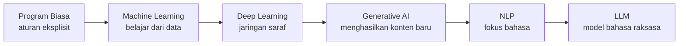
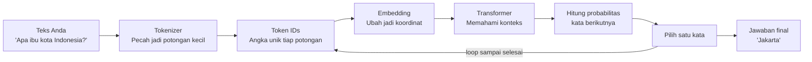
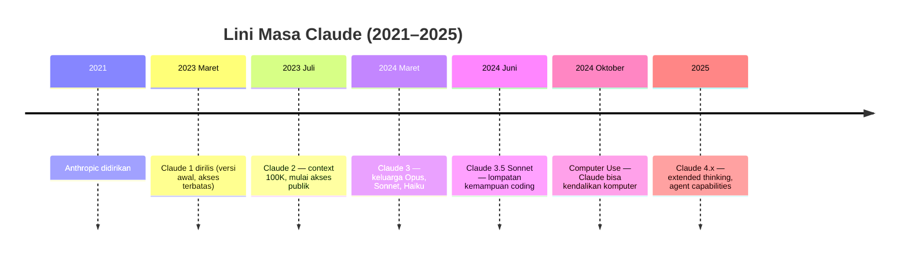

# Module 1 — Mengenal LLM & Claude

**Durasi belajar**: ±90 menit
**Posisi**: Modul pembuka Day 1
**Format**: Baca konsep → coba sendiri → refleksi

---

## Apa yang Akan Anda Bisa Setelah Modul Ini

Setelah selesai membaca dan mempraktikkan modul ini, Anda akan mampu:

1. **Menjelaskan** cara kerja LLM menggunakan analogi yang masuk akal, tanpa perlu memahami rumus matematika.
2. **Memilih** model Claude yang tepat (Opus, Sonnet, atau Haiku) sesuai kebutuhan: mana yang cepat, mana yang ekonomis, mana yang paling cerdas.
3. **Mengenali** empat keterbatasan utama LLM (halusinasi, batas pengetahuan, batas memori, dan bias) serta cara mengatasinya melalui prompt.
4. **Memutuskan** kapan sebaiknya menggunakan model "pemikir" dibanding model "cepat" untuk kebutuhan bisnis Anda.

---

## 0. Pengantar: Dari Program Biasa hingga LLM

Sebelum membahas LLM secara langsung, mari pahami terlebih dahulu **rangkaian konsep** yang membawa kita ke titik ini. LLM tidak muncul tiba-tiba — ia merupakan hasil dari evolusi panjang dunia komputasi.



### 0.1 Program Biasa vs Machine Learning

**Program komputer tradisional** bekerja dengan aturan eksplisit yang ditulis oleh manusia. Misalnya, program kalkulator: jika Anda menekan `2 + 3`, programmer telah menulis perintah eksplisit "jika operator adalah `+`, jumlahkan kedua angka". Komputer hanya mengikuti aturan.

Pendekatan ini bekerja dengan baik untuk masalah yang aturannya jelas dan terbatas. Namun bagaimana cara menulis aturan eksplisit untuk membedakan **foto kucing** dan **foto anjing**? Jutaan baris kode pun belum tentu cukup, karena setiap kucing dan anjing memiliki bentuk, warna, dan pose yang berbeda-beda.

Di sinilah **Machine Learning (ML)** hadir. Alih-alih menulis aturan, Anda memberikan **ribuan contoh** kepada komputer: "ini foto kucing, ini foto anjing", dan komputer belajar sendiri pola yang membedakan keduanya.

| Pendekatan | Cara kerja | Cocok untuk |
|------------|------------|-------------|
| **Program biasa** | Manusia menulis aturan secara eksplisit | Masalah dengan aturan jelas (kalkulator, sistem akuntansi) |
| **Machine Learning** | Komputer belajar pola dari banyak contoh | Masalah dengan pola kompleks (pengenalan gambar, prediksi cuaca) |

### 0.2 Tiga Jenis Utama Machine Learning

ML memiliki tiga pendekatan utama:

1. **Supervised Learning** — belajar dari contoh berlabel. Ibarat anak yang diajarkan dengan kartu bergambar: "ini apel", "ini jeruk". Setelah melihat ribuan contoh, anak dapat mengenali apel dan jeruk sendiri.
2. **Unsupervised Learning** — belajar dari data tanpa label. Komputer diberi banyak data lalu diminta menemukan pola atau kelompok dengan sendirinya. Ibarat membagi siswa ke dalam beberapa kelompok belajar berdasarkan kemiripan tanpa diberitahu kriteria.
3. **Reinforcement Learning** — belajar melalui coba-coba dengan sistem hadiah dan hukuman. Ibarat melatih anjing: jika duduk saat diperintahkan, beri makanan; jika tidak, tidak ada hadiah. Lama-kelamaan anjing belajar mana perilaku yang benar.

### 0.3 Deep Learning — ML dengan Jaringan Saraf

**Deep Learning** adalah cabang ML yang menggunakan **jaringan saraf tiruan** *(artificial neural network)* — struktur matematis yang terinspirasi dari cara kerja otak manusia. "Deep" merujuk pada jumlah lapisan yang banyak (puluhan hingga ratusan lapisan).

Deep Learning menjadi pemicu lompatan besar dalam AI sejak tahun 2012, karena mampu menangani data yang sangat kompleks seperti gambar resolusi tinggi, suara, dan teks panjang.

### 0.4 Generative AI — AI yang Mampu "Mencipta"

Awalnya, AI hanya bisa **mengklasifikasi** ("ini foto kucing") atau **memprediksi** ("besok hujan"). Lalu muncullah **Generative AI** — AI yang mampu **menghasilkan konten baru** yang sebelumnya tidak pernah ada: gambar, musik, video, dan tentu saja, teks.

Contoh nyata:
- **DALL·E, Midjourney**: menghasilkan gambar dari deskripsi teks.
- **GPT, Claude, Gemini**: menghasilkan teks dari instruksi.
- **Suno, ElevenLabs**: menghasilkan musik dan suara.

### 0.5 NLP — Fokus pada Bahasa

**Natural Language Processing (NLP)** adalah cabang AI yang khusus mempelajari **bahasa manusia**. Tugas-tugas NLP mencakup penerjemahan, analisis sentimen, ringkasan dokumen, dan chatbot.

NLP klasik (sebelum 2017) bergantung pada aturan linguistik dan model statistik sederhana. Hasilnya kaku dan terbatas — misalnya, Google Translate tahun 2010 sering menerjemahkan dengan janggal.

### 0.6 LLM — Pertemuan dari Semua Konsep di Atas

**LLM (Large Language Model)** adalah hasil pertemuan dari seluruh konsep di atas:

- **Machine Learning**: belajar dari data, bukan dari aturan.
- **Deep Learning**: menggunakan jaringan saraf dengan jutaan hingga miliaran parameter.
- **Generative AI**: menghasilkan teks baru, bukan sekadar mengklasifikasi.
- **NLP**: fokus pada pemahaman dan produksi bahasa.

Yang membuat LLM "besar" *(large)* adalah skalanya: dilatih dari triliunan kata, dengan miliaran parameter, menggunakan arsitektur khusus bernama **Transformer** (yang akan dibahas di Section 2).

Inilah teknologi yang berada di balik Claude, ChatGPT, Gemini, dan model sejenis. Pembahasan dilanjutkan lebih dalam pada bagian berikutnya.

---

## 1. Apa Itu LLM?

**LLM (Large Language Model)** pada intinya adalah **mesin penebak kata berikutnya — dalam skala raksasa**.

Bayangkan fitur *autocomplete* pada keyboard ponsel Anda. Ketika Anda mengetik "selamat", ponsel menebak kata berikutnya: "pagi", "siang", "malam", atau "datang". LLM bekerja dengan prinsip yang sama, hanya saja **jauh lebih besar dan jauh lebih memahami konteks**. LLM tidak hanya menebak satu kata, melainkan terus-menerus menebak kata demi kata hingga membentuk paragraf, esai, bahkan kode program.

Namun jika LLM hanya "autocomplete raksasa", mengapa ia mampu menulis esai dan menjawab pertanyaan rumit? Hal tersebut dapat dijelaskan melalui **tiga ciri khas** yang membuatnya jauh lebih unggul dibanding autocomplete biasa.

### Ciri Khas #1 — Skala Pengetahuan yang Sangat Luas

- **Autocomplete ponsel**: hanya mempelajari pola dari pesan-pesan yang pernah Anda ketik sebelumnya.
- **LLM**: dilatih dari **triliunan kata** — mencakup seluruh Wikipedia, jutaan buku, miliaran baris kode program, artikel berita, dan forum diskusi.

**Dampaknya**: LLM mengetahui banyak hal, mulai dari resep rendang hingga sintaks Python, karena pernah membaca semuanya. Ibarat seseorang yang telah membaca seluruh isi perpustakaan terbesar di dunia.

### Ciri Khas #2 — Mampu Belajar dari Contoh dalam Prompt *(in-context learning)*

- **Autocomplete ponsel**: tidak dapat Anda ajari hal baru secara langsung. Polanya tetap, tidak berkembang.
- **LLM**: Anda cukup memberikan **2–3 contoh** dalam prompt, dan model langsung memahami pola yang Anda inginkan — tanpa perlu dilatih ulang dari awal.

**Contoh nyata**: misalnya Anda ingin model mengubah judul menjadi gaya formal. Cukup tulis:

```
Ubah judul berikut menjadi gaya formal:
"Cara cepat menjadi kaya" → "Strategi Akumulasi Kekayaan yang Efisien"
"Tips diet ampuh" → "Panduan Penurunan Berat Badan yang Efektif"
"Trik mempercepat belajar" →
```

Model akan langsung memahami polanya dan melanjutkan dengan: `"Teknik Optimalisasi Proses Pembelajaran"`. Padahal Anda tidak pernah mengajarkan istilah "gaya formal" secara eksplisit — model memahaminya hanya dari **dua contoh** di atas.

### Ciri Khas #3 — Mampu Mengikuti Instruksi Bahasa Manusia *(instruction following)*

- **Autocomplete ponsel**: tidak memahami perintah seperti "tolong ringkas pesan ini menjadi 3 poin". Ia hanya menebak kata berikutnya, bukan menjalankan perintah.
- **LLM**: setelah dilatih khusus dengan jutaan contoh pasangan "instruksi → jawaban yang benar", model menjadi paham bahwa kalimat seperti:

```
Ringkas paragraf ini menjadi 3 poin dengan bahasa formal.
```

…adalah sebuah perintah yang harus dijalankan, bukan sekadar kalimat yang perlu dilanjutkan. Inilah yang membuat LLM dapat berfungsi sebagai "asisten" — Anda memberi instruksi, model menjalankannya.

---

**Kesimpulannya**: secara teknis, LLM melakukan hal yang sama dengan autocomplete ponsel — menebak kata berikutnya. Yang membedakan adalah: (1) pengetahuannya yang jauh lebih luas, (2) kemampuan beradaptasi dari contoh dalam prompt, dan (3) kemampuan mengikuti instruksi natural manusia. Tiga hal inilah yang membuat LLM terasa "cerdas".

### Alur Kerja Sederhana



Mari kita telusuri setiap langkah menggunakan contoh nyata. Anggap Anda mengirim pertanyaan: **"Apa ibu kota Indonesia?"**

### Langkah 1 — Tokenizer: Memecah Teks menjadi Potongan Kecil

LLM tidak membaca kalimat utuh. Komponen bernama **Tokenizer** memecah teks Anda menjadi **token** (potongan kecil). Hasilnya kira-kira:

```
"Apa ibu kota Indonesia?"
   ↓
["Apa", " ibu", " kota", " Indonesia", "?"]
```

Setiap potongan inilah yang nantinya diproses oleh model.

### Langkah 2 — Token IDs: Ubah Setiap Potongan menjadi Angka

Komputer hanya memahami angka, bukan huruf. Setiap token kemudian dikonversi menjadi **nomor unik** (semacam nomor KTP-nya kata):

```
"Apa"        → 5821
" ibu"       → 14209
" kota"      → 9305
" Indonesia" → 42118
"?"          → 30
```

Daftar konversi ini disebut **vocabulary** — kamus angka milik model yang berisi puluhan ribu hingga ratusan ribu entri.

### Langkah 3 — Embedding: Ubah Angka menjadi Koordinat

Nomor unik saja belum cukup. Model perlu memahami **arti** dan **hubungan** antar kata. Maka, setiap nomor token diubah menjadi **embedding** — sebuah daftar panjang angka (biasanya 1.000 hingga 12.000 angka) yang merepresentasikan posisi kata tersebut di "peta makna".

Analoginya: bayangkan setiap kata memiliki **koordinat GPS** dalam ruang multidimensi. Kata-kata yang artinya mirip akan duduk berdekatan di peta tersebut:

```
"raja"      → koordinat berdekatan dengan "ratu", "pangeran", "kerajaan"
"kucing"    → koordinat berdekatan dengan "anjing", "hewan", "peliharaan"
"Indonesia" → koordinat berdekatan dengan "Jakarta", "Asia", "negara"
```

### Langkah 4 — Transformer: Memahami Konteks

Inilah "otak" sesungguhnya dari LLM. Lapisan **Transformer** memproses seluruh embedding bersama-sama dan memahami **hubungan antar kata** dalam kalimat Anda.

Pada contoh kita, Transformer "menyadari" bahwa:
- Kata "Apa" merupakan kata tanya.
- Frasa "ibu kota" menunjukkan permintaan informasi spesifik berupa nama kota.
- Kata "Indonesia" adalah subjek yang ditanyakan.

Konteks gabungan ini akan menjadi dasar prediksi kata berikutnya.

(Cara kerja Transformer secara lebih dalam akan dibahas di Section 2.)

### Langkah 5 — Hitung Probabilitas Kata Berikutnya

Bayangkan model sebagai **seorang pakar yang ditanya pertanyaan terbuka**. Alih-alih langsung menjawab satu kata, ia diharuskan **memberi persentase keyakinan untuk SETIAP kata di dalam kamusnya** — puluhan hingga ratusan ribu pilihan kata sekaligus.

Itulah yang terjadi di Langkah 5. Untuk pertanyaan kita `"Apa ibu kota Indonesia?"`, model akan menghasilkan tabel **probabilitas** yang kira-kira terlihat seperti ini:

```
Kata kandidat   | Probabilitas (keyakinan model)
----------------|-------------------------------
"Jakarta"       | 92%
"Bandung"       | 3%
"Surabaya"      | 2%
"Indonesia"     | 1%
"makanan"       | 0,001%
"tabel"         | 0,0001%
... (puluhan ribu kandidat lain dengan probabilitas sangat kecil)
----------------|-------------------------------
Total           | 100%
```

**Tiga hal penting untuk dipahami:**

#### a. Setiap kata di kamus dapat skor

Ya, **semua** kata di kamus model dinilai — bukan hanya 4–5 kandidat populer. Kata "tabel", "ungu", bahkan kata-kata yang sama sekali tidak relevan, tetap mendapat skor (meski sangat kecil, mendekati 0%). Hanya saja, beberapa kata mendominasi dengan probabilitas tinggi karena **konteks kalimat** mengarahkan ke sana.

#### b. Konteks menentukan distribusi probabilitas

Probabilitas tinggi pada kata `"Jakarta"` bukan kebetulan. Model telah membaca jutaan kalimat selama pelatihan yang mengandung frasa "ibu kota Indonesia" lalu diikuti kata "Jakarta". Itulah sebabnya pola ini sangat kuat di "memori" model.

Coba bandingkan dengan pertanyaan lain:

| Pertanyaan | Kandidat probabilitas tertinggi |
|------------|--------------------------------|
| `"Apa ibu kota Indonesia?"` | `"Jakarta"` (sekitar 92%) |
| `"Apa makanan khas Padang?"` | `"Rendang"` (sekitar 65%), `"Sate"` (15%), `"Gulai"` (10%) |
| `"Selamat pagi, apa kabar"` | `"?"` (40%), `"hari"` (20%), `"Anda"` (15%), `"semua"` (10%) |

Perhatikan bahwa semakin spesifik pertanyaannya, semakin terkonsentrasi probabilitas pada satu jawaban. Semakin terbuka pertanyaannya, semakin tersebar probabilitas ke banyak kandidat.

#### c. Probabilitas tinggi bukan jaminan jawaban benar

Inilah akar masalah **halusinasi**. Model selalu menghasilkan kata dengan probabilitas tertinggi, meskipun jawabannya **secara faktual salah**. Misalnya, jika Anda bertanya `"Siapa CEO Multimatics?"` dan informasi itu tidak ada dalam data pelatihan, model akan tetap menghasilkan nama tertentu dengan probabilitas tertinggi — kemungkinan besar berdasarkan **pola umum nama eksekutif perusahaan IT Indonesia**, bukan fakta sebenarnya.

Itulah mengapa **memberi sumber asli** (grounding, yang dibahas di Section 5) menjadi penting: sumber tersebut "mengubah lanskap probabilitas" agar kata-kata yang muncul di sumber mendapat skor lebih tinggi dibanding tebakan acak.

### Langkah 6 — Pilih Satu Kata (Sampling)

Dari daftar probabilitas tersebut, model memilih satu kata. Pemilihan ini diatur oleh parameter **temperature**. Pada contoh kita, kata `"Jakarta"` terpilih.

Parameter ini penting untuk dipahami lebih dalam karena akan sering muncul pada seluruh modul berikutnya.

#### Memahami Parameter Temperature

Bayangkan **temperature** sebagai **tombol pengatur antara "patuh aturan" dan "berani bereksperimen"** ketika model memilih kata.

Temperature **bukan** mengubah konten jawaban secara langsung. Yang diubah adalah **bentuk distribusi probabilitas** sebelum sampling. Berikut dampaknya pada contoh sebelumnya:

```
Distribusi asli untuk "Apa ibu kota Indonesia? ___"
─────────────────────────────────────────────────────
Jakarta     | 92%
Bandung     | 3%
Surabaya    | 2%
lainnya     | 3%
```

**Saat `temperature = 0` (deterministik):**

Perbedaan probabilitas **dipertajam secara ekstrem**. Pemenang langsung dianggap 100%, yang lain 0%. Model **selalu** memilih "Jakarta" — tidak ada peluang lain.

```
Jakarta     | 100% ← pasti terpilih
Bandung     | 0%
Surabaya    | 0%
```

**Saat `temperature = 0.7` (default umum):**

Distribusi tetap, sampling dilakukan secara acak namun tertimbang. "Jakarta" sangat mungkin muncul, tetapi sesekali "Bandung" atau "Surabaya" pun dapat terpilih.

**Saat `temperature = 1.0` (maksimum, kreatif):**

Distribusi **diratakan**. "Jakarta" tidak lagi dominan. Kata-kata di luar 3 besar pun memiliki peluang signifikan untuk muncul — kadang menghasilkan jawaban kreatif, kadang justru tidak relevan.

```
Jakarta     | 70%
Bandung     | 12%
Surabaya    | 8%
lainnya     | 10% (bisa muncul jawaban kurang relevan)
```

> 📌 **Catatan**: pada Anthropic API, nilai temperature dibatasi pada rentang **0 sampai 1**. Tidak ada nilai di atas 1.

#### Panduan Nilai Temperature

| Temperature | Karakter output | Kapan dipakai |
|-------------|----------------|---------------|
| **0.0** | Deterministik penuh. Sama input = sama output. | Klasifikasi, ekstraksi data, kalkulasi, jawaban faktual — semua kasus yang **butuh konsistensi**. |
| **0.2 – 0.4** | Hampir konsisten, sedikit variasi. | Code generation, summarization, Q&A berbasis dokumen. |
| **0.5 – 0.7** | Seimbang antara konsisten dan variatif. | Chatbot umum, percakapan, penulisan artikel. |
| **0.8 – 1.0** | Kreatif, bervariasi tinggi. | Brainstorming ide, generasi puisi, eksplorasi kreatif. |

#### Contoh Perbandingan Output

Prompt yang sama: `"Tulis 1 kalimat pembuka untuk artikel tentang kopi."`

**`temperature = 0`** (dijalankan 5x, hasilnya sama persis):
```
Kopi adalah salah satu minuman paling populer di dunia.
Kopi adalah salah satu minuman paling populer di dunia.
Kopi adalah salah satu minuman paling populer di dunia.
... (selalu sama)
```

**`temperature = 0.7`** (dijalankan 5x, hasilnya bervariasi namun masih wajar):
```
Kopi adalah salah satu minuman paling populer di dunia.
Aroma kopi pagi mampu membangkitkan semangat seharian penuh.
Di balik secangkir kopi, tersimpan cerita panjang perjalanan biji dari kebun ke meja Anda.
...
```

**`temperature = 1.0`** (dijalankan 5x, hasilnya sangat bervariasi dan kreatif):
```
Kopi bukan sekadar minuman — ia adalah ritual yang menemani jutaan pagi di seluruh dunia.
Bayangkan sebuah dunia tanpa kopi: pagi-pagi terasa lebih sepi dan kantor lebih lesu.
Kopi: cairan hitam pekat yang menyatukan kerinduan, percakapan, dan inspirasi.
...
```

#### Hal yang Sering Disalahpahami

1. **`Temperature = 0` ≠ model jadi pintar.** Keterbatasan model tetap sama; tetap bisa berhalusinasi. Perbedaannya: halusinasi yang sama akan diulang secara konsisten.

2. **Temperature tinggi ≠ model menjadi kreatif/cerdas.** Yang terjadi adalah model menjadi lebih berani mengambil pilihan yang tidak biasa. Adakalanya hasilnya terdengar kreatif, namun adakalanya tidak relevan.

3. **Untuk JSON / klasifikasi / ekstraksi data → selalu gunakan `temperature = 0`.** Anda membutuhkan output yang persis sama setiap kali, terutama saat hasilnya diproses oleh sistem otomatis.

4. **Untuk membandingkan kualitas prompt** — gunakan `temperature = 0` agar perbandingan adil; variabel pengganggu (keacakan sampling) dihilangkan.

### Langkah 7 — Loop sampai Selesai

Kata yang baru terpilih (`"Jakarta"`) ditambahkan ke konteks, kemudian seluruh proses **diulang** untuk memprediksi kata berikutnya. Begitu seterusnya, hingga model menghasilkan token khusus penanda akhir kalimat *(stop token)* atau mencapai batas panjang output yang Anda tentukan.

Itulah sebabnya jawaban panjang dari Claude muncul secara bertahap "kata demi kata" — secara teknis memang demikianlah cara kerjanya.

---

Tiga hal penting yang perlu Anda ingat:

- **LLM tidak benar-benar "memahami"** seperti manusia. Yang dilakukan adalah menghitung probabilitas: "kata apa yang paling mungkin muncul setelah ini?"
- **LLM tidak memiliki memori antar percakapan** *(stateless)*. Setiap kali Anda mengirim pesan, seluruh konteks harus disertakan kembali. Ibarat berbicara dengan seseorang yang kehilangan ingatan setiap satu menit — Anda harus selalu mengingatkan apa topik pembicaraan sebelumnya.
- **LLM tidak selalu memberikan jawaban yang sama** *(non-deterministik)*. Pertanyaan yang sama, jika diajukan dua kali, dapat menghasilkan jawaban berbeda. Hal ini merupakan fitur, bukan kesalahan — kecuali Anda secara sengaja mengaturnya agar deterministik.

---

## 2. Transformer — "Mesin" di Balik LLM

**Transformer** adalah arsitektur (semacam cetak biru) yang menjadi dasar bagi seluruh LLM modern. Diperkenalkan pada tahun 2017 melalui paper berjudul *"Attention Is All You Need"*.

Anda tidak perlu memahami matematikanya secara mendalam. Cukup pahami **analogi rapat tim** berikut:

> Bayangkan setiap kata dalam kalimat Anda adalah seorang peserta rapat. Untuk memahami konteks, setiap peserta **mendengarkan seluruh peserta lain** secara bersamaan, kemudian memberi bobot: "siapa yang paling relevan untuk saya saat ini?". Mekanisme inilah yang disebut **Self-Attention** — komponen jantung dari Transformer.

Itulah alasan mengapa Claude mampu memahami konteks panjang. Ketika Anda memberikan dokumen 50 halaman lalu bertanya tentang isi halaman 47, model dapat "melihat kembali" seluruh halaman secara serempak dan memfokuskan perhatian pada bagian yang relevan.

Komponen-komponen lainnya (sebagai pengenalan istilah):

| Istilah | Fungsi singkat |
|---------|---------------|
| **Token Embedding** | Mengubah kata menjadi koordinat angka agar dapat diproses komputer |
| **Positional Encoding** | Menandai posisi: "kata ini di awal", "kata itu di tengah" |
| **Self-Attention** | Mekanisme rapat seperti dijelaskan di atas |
| **Feed-Forward** | Lapisan pemrosesan tambahan |
| **Output Head** | Lapisan pengambil keputusan: kata apa berikutnya? |

---

## 3. Token & Context Window — Konsep yang Wajib Dipahami

### Apa Itu Token?

LLM tidak membaca kalimat per kalimat atau kata per kata. Ia membaca **token** — potongan-potongan teks yang dapat berupa kata utuh, suku kata, atau bahkan satu huruf.

| Teks yang Anda tulis | Perkiraan jumlah token |
|----------------------|------------------------|
| `Hello` | 1 token |
| `Halo` | 1 token |
| `Multimatics` | 3–4 token (dipecah menjadi `Multi` + `matics`) |
| `claude-sonnet-4-5` | 5–6 token |
| 1 kalimat Bahasa Indonesia (10 kata) | 15–25 token |

**Rumus praktis yang berguna**:
- 1 token ≈ 4 huruf bahasa Inggris ≈ 3/4 kata
- Bahasa Indonesia umumnya **menggunakan 20–30% lebih banyak token** dibanding bahasa Inggris.

**Mengapa hal ini penting?** Karena ketika menggunakan API, Anda **dibayar berdasarkan jumlah token**. Kalimat yang panjang berarti jumlah token yang banyak, yang berujung pada biaya yang lebih tinggi.

### Apa Itu Context Window?

**Context window** adalah "kapasitas memori jangka pendek" model, yaitu total token (input + output) yang dapat diproses dalam **satu kali pengiriman pesan**.

| Model | Context Window | Catatan |
|-------|---------------|---------|
| Claude Haiku | 200.000 token | Cepat & ekonomis |
| Claude Sonnet | 200.000 (hingga 1 juta untuk tier khusus) | Pilihan serbaguna |
| Claude Opus | 200.000 (hingga 1 juta untuk tier khusus) | Reasoning terbaik |

**Analogi**: bayangkan context window sebagai **meja kerja** model. 200.000 token berarti meja yang sangat luas, mampu menampung buku-buku tebal sekaligus. Namun jika Anda meletakkan terlalu banyak buku, meja akan penuh dan model harus mulai mengabaikan yang lebih lama.

**Implikasi praktisnya**:
- Dokumen yang sangat panjang (misalnya PDF 500 halaman) yang melebihi context window perlu **dipecah** *(chunking)* atau diringkas terlebih dahulu.
- Semakin banyak token input, semakin tinggi biaya dan semakin lambat respons. Prinsipnya: **menghemat konteks berarti menghemat biaya**.

---

## 4. Claude — Kapabilitas dan Keterbatasan

### Mengenal Claude Lebih Dekat

Sebelum membahas kemampuan dan keterbatasannya, mari pahami terlebih dahulu **apa itu Claude, siapa yang menciptakannya, dan bagaimana sejarah perkembangannya**.

#### Apa Itu Claude?

**Claude** adalah keluarga LLM (Large Language Model) yang dikembangkan oleh **Anthropic** — sebuah perusahaan riset dan keamanan AI yang berbasis di San Francisco, Amerika Serikat. Nama "Claude" diambil sebagai penghormatan terhadap **Claude Shannon**, matematikawan dan insinyur Amerika yang dianggap sebagai "bapak teori informasi" — fondasi yang mendasari seluruh teknologi komputasi dan komunikasi digital modern.

Karakter pembeda Claude dari LLM lain (seperti ChatGPT dan Gemini):
- **Fokus pada keamanan dan etika AI** *(safety-first)* — Claude dilatih dengan pendekatan khusus bernama **Constitutional AI**, yang akan dijelaskan di bawah.
- **Context window yang sangat panjang** — hingga 200.000 token (sekitar 500 halaman buku) pada model standar, dan hingga 1 juta token pada tier khusus.
- **Kuat di reasoning dan coding** — kerap menjadi pilihan favorit di kalangan developer profesional.
- **Output natural dan bernuansa** — gaya bahasa Claude cenderung lebih reflektif dan jujur mengakui keterbatasannya, dibanding kompetitor.

#### Siapa yang Menciptakan?

Claude diciptakan oleh **Anthropic**, yang didirikan pada **tahun 2021** oleh sekelompok mantan peneliti senior OpenAI. Pendiri utamanya adalah:

- **Dario Amodei** *(CEO)* — sebelumnya Vice President of Research di OpenAI.
- **Daniela Amodei** *(President)* — adik kandung Dario, sebelumnya Vice President of Operations di OpenAI.
- Bersama tim inti yang turut serta meninggalkan OpenAI, termasuk Tom Brown (penulis utama paper GPT-3), Jared Kaplan, Sam McCandlish, dan beberapa lainnya.

Alasan utama mereka memisahkan diri: keyakinan bahwa **pengembangan AI berskala besar harus mengutamakan aspek keamanan dan dampak sosial jangka panjang**, bukan sekadar performa.

Beberapa fakta penting tentang Anthropic:
- **Status**: perusahaan riset AI swasta (bukan lembaga akademik).
- **Pendanaan**: telah mengumpulkan miliaran dolar dari investor besar seperti Google, Amazon, Salesforce, dan lainnya.
- **Misi resmi**: "AI safety research company" — fokus pada bagaimana membangun AI yang andal, dapat ditafsirkan, dan dapat dikendalikan.

#### Sejarah Singkat Claude



**Tonggak-tonggak penting:**

1. **2021** — Anthropic didirikan. Penelitian fokus pada **alignment AI** dan **interpretability**.
2. **2022** — Anthropic memperkenalkan konsep **Constitutional AI** dalam paper risetnya. Pendekatan ini menjadi dasar pelatihan seluruh model Claude di masa depan.
3. **Maret 2023** — **Claude 1** dirilis sebagai produk komersial, awalnya hanya melalui Slack dan API terbatas.
4. **Juli 2023** — **Claude 2** diluncurkan dengan context window **100.000 token** — saat itu jauh lebih besar dari kompetitor. Akses publik mulai dibuka melalui claude.ai.
5. **Maret 2024** — **Claude 3** memperkenalkan keluarga tiga varian: **Opus** (paling cerdas), **Sonnet** (seimbang), **Haiku** (cepat & murah). Konsep ini bertahan hingga sekarang.
6. **Juni 2024** — **Claude 3.5 Sonnet** menjadi favorit komunitas developer karena performa coding yang sangat kuat — kerap disebut sebagai "GitHub Copilot killer".
7. **Oktober 2024** — Fitur **Computer Use** diperkenalkan — Claude mampu mengendalikan komputer (klik, ketik, scroll) untuk mengotomasi tugas-tugas visual.
8. **2025** — Claude 4.x dengan **extended thinking** (mode berpikir mendalam) dan kemampuan **agent** yang lebih matang.

#### Apa Itu Constitutional AI?

**Constitutional AI (CAI)** adalah pendekatan pelatihan khusus yang dikembangkan Anthropic. Idenya sederhana: alih-alih hanya menggunakan ribuan anotator manusia untuk menilai output model (seperti pendekatan RLHF klasik), CAI memberi model **"konstitusi"** — sekumpulan prinsip etis tertulis — yang dipakai model untuk **mengevaluasi dan memperbaiki jawabannya sendiri**.

Prinsip-prinsip dalam konstitusi diambil dari berbagai sumber, termasuk Deklarasi Universal Hak Asasi Manusia PBB, prinsip-prinsip etika dari perusahaan teknologi besar, dan riset filosofi.

Hasilnya, Claude cenderung:
- Lebih jujur ketika tidak yakin.
- Lebih hati-hati dalam menanggapi permintaan berbahaya.
- Lebih reflektif dan memberikan penjelasan etis ketika dibutuhkan.

Detail lengkap tersedia di paper [*Constitutional AI: Harmlessness from AI Feedback*](https://www.anthropic.com/research/constitutional-ai-harmlessness-from-ai-feedback) (Anthropic, 2022).

---

### Keluarga Model Claude

Claude memiliki tiga varian utama. Ibarat menu di restoran: tersedia paket hemat, paket reguler, dan paket premium.

| Model | Cocok untuk | Kecepatan | Biaya |
|-------|------------|-----------|-------|
| **Haiku** | Pekerjaan ringan dan bervolume tinggi: klasifikasi email, penandaan artikel, ekstraksi data sederhana | Sangat cepat | Ekonomis ($) |
| **Sonnet** | Chatbot customer service, coding, RAG, agent umum | Cepat | Menengah ($$) |
| **Opus** | Tugas berat: analisis riset, perencanaan multi-langkah, pemecahan masalah kompleks | Lebih lambat | Premium ($$$) |

**Panduan pemilihan**:
- Tugas berulang, sederhana, dan bervolume tinggi → **Haiku**
- Mayoritas kebutuhan enterprise → **Sonnet** (titik optimal)
- Membutuhkan kemampuan reasoning terbaik → **Opus**

### Kemampuan Inti Claude

- Menulis teks panjang: artikel, laporan, email, kode program.
- Memahami berbagai bahasa, termasuk Bahasa Indonesia dengan baik.
- Berpikir bertahap (terutama Opus).
- Memahami gambar *(vision)* — untuk varian multimodal.
- Menggunakan alat bantu eksternal *(tool use)* — akan dibahas pada Day 3.

### Keterbatasan yang Wajib Dipahami

Bagian ini sangat penting untuk Anda pahami sebelum menggunakan Claude untuk pekerjaan produksi:

| Keterbatasan | Wujud nyata | Cara mengatasi melalui prompt |
|--------------|-------------|-------------------------------|
| **Halusinasi** | Mengarang fakta, membuat sitasi palsu yang tampak kredibel | Sertakan sumber asli; instruksikan model untuk mengaku "tidak tahu" jika informasi tidak tersedia |
| **Knowledge cutoff** | Tidak mengetahui peristiwa setelah tanggal pelatihan | Sertakan informasi terbaru melalui prompt atau alat pencarian |
| **Context window terbatas** | Konteks yang terlalu panjang akan dipotong | Ringkas atau pecah dokumen menjadi bagian-bagian kecil |
| **Bias** | Mencerminkan bias dari data internet | Audit output, sertakan instruksi netralitas secara eksplisit |
| **Tidak konsisten** | Jawaban berbeda pada percobaan yang berbeda | Atur `temperature=0`, lakukan evaluasi pada banyak sampel |
| **Lemah pada perhitungan rumit** | Salah aritmatika padahal tampak yakin | Minta model berpikir bertahap, atau delegasikan ke kalkulator |

---

## 5. Reasoning & Halusinasi — Dua Konsep Kunci

### Apa Sebenarnya "Reasoning" pada LLM?

Ketika orang menyebut "Claude mampu reasoning", maksudnya **bukan** model benar-benar berpikir layaknya seorang matematikawan profesional. Yang sebenarnya terjadi: Claude **menghasilkan rangkaian kata yang menyerupai langkah-langkah berpikir manusia**.

Analoginya seperti seorang murid pintar yang menuliskan langkah "diketahui... ditanya... jawab..." pada kertas — bukan karena memahami hakikat matematika, melainkan karena mengenali pola jawaban yang umumnya benar dari ribuan contoh yang pernah dipelajari.

Claude Opus, terutama dengan mode *extended thinking*, dilatih khusus agar rantai berpikir ini **lebih panjang, lebih konsisten, dan dapat diaudit**.

### Mengapa LLM Sering "Mengarang" (Halusinasi)?

Karena tugas dasar LLM adalah **"melanjutkan kalimat dengan probabilitas tertinggi"** — bahkan ketika seharusnya model menyatakan "saya tidak tahu". Halusinasi sering muncul karena beberapa faktor:

- Prompt Anda **ambigu** atau kurang detail.
- Anda meminta fakta **spesifik** yang tidak ada dalam data pelatihan.
- Anda memaksa format tertentu (misal: "buatkan tabel dengan 10 baris") sehingga model terpaksa mengisi sel kosong dengan tebakan.

**Empat strategi anti-halusinasi pada level prompt**:

1. **Grounding (menyertakan sumber)**: lampirkan teks asli, lalu instruksikan model untuk "menjawab hanya berdasarkan teks di atas".
2. **Izin untuk mengaku tidak tahu**: "jika informasi tidak tersedia di sumber, tulis `INFO_TIDAK_TERSEDIA`".
3. **Memaksa kutipan**: "kutip kalimat yang persis dari sumber sebelum menyimpulkan".
4. **Berpikir bertahap** *(chain-of-thought)*: minta model menjelaskan logikanya sebelum memberi jawaban akhir.

---

## Praktik Mandiri (15 menit)

Selain membaca teori, **buka claude.ai** dan jalankan empat eksperimen berikut. Tujuannya adalah agar Anda merasakan sendiri perbedaan antara prompt biasa dan prompt yang ditulis dengan benar.

### Eksperimen A — Bertanya Tanpa Sumber

Buka **claude.ai**, pilih model Sonnet, lalu kirim:

```
Siapa CEO Multimatics saat ini dan kapan beliau menjabat?
```

Amati jawabannya. Apakah model mengarang? Atau secara jujur menyatakan tidak tahu? Catat respons yang Anda dapatkan.

### Eksperimen B — Bertanya dengan Sumber

Kunjungi website Multimatics, salin satu paragraf "About Us", lalu kirim:

```
Berdasarkan teks di atas saja, siapa CEO Multimatics dan kapan menjabat?
Jika tidak disebut dalam teks, jawab "TIDAK DISEBUTKAN".
```

Bandingkan dengan hasil Eksperimen A. Apa perbedaannya?

### Eksperimen C — Menghitung Token

Buka https://platform.openai.com/tokenizer, ketik nama Anda dan beberapa kata Bahasa Indonesia. Lihat jumlah token yang terhitung — ini akan menjadi dasar perhitungan biaya saat Anda menggunakan API.

### Eksperimen D — Memetakan Model ke Use Case

Buka https://www.anthropic.com/pricing untuk melihat harga input/output token tiap model Claude (Haiku, Sonnet, Opus). Lalu untuk tiga skenario berikut, **tentukan model mana yang paling tepat** dan tulis alasannya satu kalimat:

1. Kategorisasi otomatis 100.000 notifikasi transaksi per hari.
2. Chat assistant yang membaca kontrak SLA 30 halaman dan menarik klausul.
3. Analisis post-mortem insiden sistem pembayaran (1× per minggu, butuh penalaran mendalam).

**Refleksi**: mengapa jawaban Anda berbeda antar skenario? Apa implikasinya terhadap pilihan model di pekerjaan nyata? (Latihan lebih mendalam ada di [`latihan.md`](./latihan.md) — Latihan 3.)

---

## Contoh Konkret: Prompt Kurang Baik → Baik → Lebih Baik

Tiga contoh berikut menunjukkan **evolusi cara menulis prompt**, dari yang seadanya hingga yang siap produksi.

### Contoh 1 — Pertanyaan Faktual

```text
[KURANG BAIK]
Jelaskan tentang regulasi perlindungan data di Indonesia.
```
Masalah: tidak ada batasan waktu, sumber, maupun format. Risiko halusinasi tinggi.

```text
[BAIK]
Jelaskan UU Perlindungan Data Pribadi (UU PDP) Indonesia No. 27 Tahun 2022.
Fokus pada: definisi data pribadi, hak subjek data, dan sanksi.
Jika ada poin yang tidak yakin, tandai dengan [UNCERTAIN].
```
Lebih baik: batasan sudah jelas, model diizinkan mengakui keraguan.

```text
[LEBIH BAIK]
<sumber>
{tempel teks UU PDP pasal 1, 4-16, 57-67 di sini}
</sumber>

Berdasarkan <sumber> di atas saja, jelaskan dalam 5 bullet:
1. Definisi data pribadi (Pasal berapa?)
2. 3 hak utama subjek data
3. Sanksi administratif vs pidana

Format: bullet markdown, sertakan referensi pasal di akhir tiap poin.
Jika informasi tidak ada di <sumber>, tulis "TIDAK ADA DI SUMBER".
```
Mengapa lebih baik: sumber jelas, model diizinkan mengaku tidak tahu, format terstruktur, dan wajib mencantumkan pasal.

### Contoh 2 — Membuat Ringkasan

```text
[KURANG BAIK]
Ringkas dokumen ini.
```

```text
[BAIK]
Ringkas dokumen ini menjadi 3 paragraf untuk audiens eksekutif.
```

```text
[LEBIH BAIK]
Anda adalah analis bisnis senior. Ringkas dokumen <doc> di bawah untuk
CFO yang tidak memiliki waktu membaca detail teknis.

Format output:
- Paragraf 1: Konteks dan masalah (maks 60 kata)
- Paragraf 2: Temuan utama (3 bullet, angka penting di-bold)
- Paragraf 3: Rekomendasi dan risiko (maks 80 kata)

Hindari jargon teknis. Jika ada angka, sertakan satuan.
```

### Contoh 3 — Klasifikasi Tiket Support

```text
[KURANG BAIK]
Tiket ini tentang apa: "Aplikasi crash setiap saya buka menu profil"
```

```text
[BAIK]
Klasifikasikan tiket berikut ke salah satu kategori: Bug, Feature Request, Question.
Tiket: "Aplikasi crash setiap saya buka menu profil"
```

```text
[LEBIH BAIK]
Anda adalah triager tim support tier-1. Klasifikasikan tiket ke salah satu:
- BUG (error fungsional / crash)
- FEATURE_REQUEST (permintaan fitur baru)
- QUESTION (cara penggunaan)
- COMPLAINT (keluhan kepuasan, bukan teknis)

Output dalam JSON:
{"category": "...", "severity": "low|medium|high|critical", "rationale": "<=20 kata"}

Tiket: "Aplikasi crash setiap saya buka menu profil"
```

---

## Latihan & Refleksi

Modul 1 ini bersifat **konseptual** — belum disertai lab coding. Sebelum melanjutkan ke Module 2, pastikan Anda mampu menjawab lima pertanyaan refleksi berikut. Jawaban dapat dituliskan di buku catatan atau didiskusikan dengan rekan:

1. Jika Claude pada dasarnya adalah "mesin penebak kata berbasis probabilitas", **apa konsekuensinya** terhadap cara Anda menulis instruksi?
2. **Kapan** Anda akan memilih Haiku (lebih ekonomis dan cepat) dibanding Sonnet untuk pekerjaan Anda?
3. Sebutkan **satu pekerjaan harian** Anda yang berisiko jika LLM-nya berhalusinasi. Bagaimana cara mengantisipasinya?
4. **Mengapa** context window yang besar tidak otomatis menghasilkan jawaban yang lebih baik?
5. Apa perbedaan **"reasoning" pada LLM dan reasoning pada manusia** menurut pemahaman Anda saat ini?

Untuk latihan hands-on terstruktur (eksperimen di claude.ai — seluruhnya dapat dijalankan gratis), silakan merujuk ke [`latihan.md`](./latihan.md).

---

## Bacaan Lanjutan

- Anthropic — *Introduction to Claude*: https://docs.anthropic.com/en/docs/intro-to-claude
- Anthropic — *Models overview*: https://docs.anthropic.com/en/docs/about-claude/models
- Anthropic — *Glossary*: https://docs.anthropic.com/en/docs/resources/glossary
- *Attention Is All You Need* (Vaswani et al., 2017) — paper asli Transformer: https://arxiv.org/abs/1706.03762
  - Pengantar visual (direkomendasikan untuk pemula): https://jalammar.github.io/illustrated-transformer/
  - Versi beranotasi dengan kode PyTorch: http://nlp.seas.harvard.edu/2018/04/03/attention.html
- Anthropic — *Constitutional AI*: https://www.anthropic.com/research/constitutional-ai-harmlessness-from-ai-feedback
- Anthropic — *Reducing hallucinations*: https://docs.anthropic.com/en/docs/test-and-evaluate/strengthen-guardrails/reduce-hallucinations
