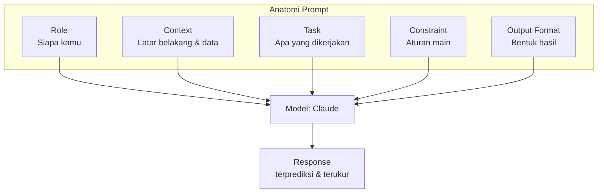

# Module 2 — Prompt Engineering Basics

**Durasi**: 90 menit
**Posisi**: Modul kedua Day 1, fondasi untuk seluruh program.
**Format**: Baca konsep → telaah contoh → kerjakan Lab 01.

---

## Learning Outcomes

Setelah modul ini, Anda mampu:

1. **Menguraikan** anatomi prompt yang efektif menjadi 5 komponen: Role, Context, Task, Constraint, Output Format.
2. **Menulis ulang** prompt buruk menjadi prompt yang reliable dengan instruksi eksplisit, tanpa ambiguitas.
3. **Menerapkan** role prompting dan context engineering untuk meningkatkan relevansi output.
4. **Membangun** prompt template yang reusable lintas use case di organisasi.
5. **Mengevaluasi** prompt dengan checklist kualitas (clarity, specificity, testability).

---

## 1. Mengapa Anatomi Penting

Prompt yang buruk umumnya kabur pada salah satu (atau beberapa) dari 5 dimensi:

- Siapa model harus berperan? (Role)
- Apa latar belakang dan batasan domain? (Context)
- Apa yang secara spesifik harus dilakukan? (Task)
- Aturan main: apa yang dilarang dan diwajibkan? (Constraint)
- Output dalam bentuk apa? (Output Format)

Mental model: bayangkan Anda mendelegasikan pekerjaan kepada **karyawan baru yang sangat cerdas dan sangat cepat, namun tanpa konteks mengenai organisasi Anda**. Jika briefing-nya kabur, hasilnya akan kabur pula.



---

## 2. Komponen 1 — Role Prompting

Role prompting adalah teknik menetapkan **persona atau posisi profesional** model. Teknik ini bukan sekadar kosmetik — ia mengaktifkan distribusi vocabulary dan style yang relevan.

### Pattern

```text
Anda adalah {peran spesifik} dengan {expertise / pengalaman}.
{Optional: konteks organisasi atau audiens}.
```

### Contoh

```text
Anda adalah analis cybersecurity senior dengan 10 tahun pengalaman
di sektor perbankan. Anda menulis untuk Chief Risk Officer yang
tidak punya latar belakang teknis.
```

### Pitfall Role Prompting

- **Persona terlalu generik** ("Anda adalah AI assistant") → tidak memberikan sinyal apa pun.
- **Persona berlebihan atau fantasi** ("Anda adalah dewa programming") → dapat memicu output yang over-confident.
- **Persona yang tidak konsisten dengan task** (misalnya "Anda adalah penyair" lalu diminta menulis laporan finansial).

---

## 3. Komponen 2 — Context Engineering

Context adalah seluruh informasi yang dibutuhkan model untuk menjawab dengan benar namun tidak terdapat dalam parametric memory-nya. Termasuk di dalamnya:

- Dokumen referensi (kebijakan, kontrak, transkrip).
- Data terstruktur (tabel, JSON).
- State sebelumnya (riwayat chat, hasil tool call).
- Definisi istilah / glosarium internal.

### Best practices

1. **Letakkan context di awal prompt** untuk dokumen panjang; sebagian besar arsitektur attention mendapat manfaat dari posisi awal.
2. **Bungkus dengan tag XML** seperti `<document>`, `<context>`, `<example>` — Claude dilatih untuk memperhatikan struktur ini.
3. **Pisahkan instruksi dari data** dengan tag yang jelas; hindari mencampurnya.
4. **Hindari noise**: jangan menempelkan dokumen 50 halaman jika hanya 2 paragraf yang relevan.
5. **State permission**: jelaskan apakah model boleh menggunakan knowledge umum atau hanya menggunakan context.

### Contoh struktur

```text
<context>
{dokumen referensi atau data}
</context>

<task>
{apa yang harus dilakukan}
</task>

<rules>
- Jawab hanya berdasarkan <context>.
- Jika tidak ada di context, jawab "TIDAK ADA DI SUMBER".
</rules>
```

### Contoh Prompt — Context Engineering dalam Praktik

Berikut empat skenario nyata yang dapat langsung Anda coba di claude.ai (free tier sudah memadai).

#### Contoh 1 — Tanya Jawab Berbasis Dokumen Kebijakan

```text
<context>
Kebijakan Cuti Karyawan PT Sejahtera Mandiri (2025):
- Setiap karyawan tetap berhak atas 12 hari cuti tahunan.
- Pengajuan cuti minimal H-7 untuk cuti reguler, H-30 untuk cuti panjang (>3 hari).
- Cuti tidak terpakai dapat diakumulasi maksimal 6 hari ke tahun berikutnya.
- Karyawan dengan masa kerja >5 tahun mendapat tambahan 2 hari cuti per tahun.
- Cuti melahirkan: 3 bulan, dengan minimal 1,5 bulan setelah melahirkan.
</context>

<task>
Saya karyawan tetap dengan masa kerja 6 tahun. Saya ingin mengambil cuti 5 hari
mulai 15 Juli untuk liburan keluarga. Berapa total cuti tahunan saya, dan
kapan paling lambat saya harus mengajukan?
</task>

<rules>
- Jawab hanya berdasarkan informasi di <context>.
- Jika ada informasi yang tidak tersedia, sebutkan secara eksplisit.
- Sertakan perhitungan jika relevan.
</rules>
```

**Mengapa contoh ini bagus:**
- Context jelas dipisah dari pertanyaan.
- Aturan eksplisit: tidak boleh mengarang di luar dokumen.
- Pertanyaan menyentuh **beberapa pasal** sekaligus (masa kerja >5 tahun + lead time pengajuan).

---

#### Contoh 2 — Ringkasan Transkrip Rapat

```text
<context>
Transkrip Rapat Mingguan Tim Produk — Senin, 3 Juni 2025

Andi (PM): "Sprint minggu ini ada 3 prioritas: integrasi payment gateway,
            fix bug login OTP, dan kick-off feature wishlist."
Budi (Tech Lead): "Untuk payment gateway saya butuh 1 dev tambahan, sekarang
                   masih solo. Bug OTP sudah ada hipotesis di sisi rate-limit
                   SMS provider."
Citra (Designer): "Wishlist mockup selesai Rabu. Saya butuh masukan dari
                   Andi soal flow guest user."
Andi: "Oke, prioritas urutan: bug OTP critical, payment lanjut paralel,
       wishlist kick-off paling akhir minggu. Saya akan minta tambahan dev
       ke Pak Eko."
Citra: "Catat ya, Wishlist akan masuk roadmap Q3 kalau tidak selesai sprint ini."
</context>

<task>
Ringkas rapat di atas dalam format:
1. Keputusan utama (bullet)
2. Action items per orang (nama: tugas, deadline jika ada)
3. Isu yang belum terselesaikan
</task>
```

**Mengapa contoh ini bagus:**
- Context berupa data **tidak terstruktur** (transkrip natural).
- Task memaksa model **mengekstrak struktur** dari narasi mentah.
- Tidak ada `<rules>` karena tugasnya kreatif (ringkas), bukan ekstraksi ketat.

---

#### Contoh 3 — Analisis Data Penjualan (Data Terstruktur)

```text
<context>
Data Penjualan Q2 2025 (dalam juta Rupiah):

| Bulan | Jakarta | Surabaya | Bandung | Medan |
|-------|---------|----------|---------|-------|
| April | 450     | 320      | 280     | 180   |
| Mei   | 480     | 350      | 290     | 210   |
| Juni  | 520     | 330      | 310     | 240   |

Target Q2 per kota:
- Jakarta: 1.400 juta
- Surabaya: 1.000 juta
- Bandung: 900 juta
- Medan: 600 juta
</context>

<task>
1. Hitung total penjualan Q2 per kota.
2. Identifikasi kota mana yang melebihi/di bawah target, sertakan selisih dan persentase pencapaian.
3. Berikan 2 insight singkat dari data.
</task>

<rules>
- Lakukan perhitungan secara eksplisit (tunjukkan langkah).
- Format output dalam tabel untuk poin 1 & 2.
- Insight maksimal 2 kalimat per poin.
</rules>
```

**Mengapa contoh ini bagus:**
- Context berupa **tabel terstruktur** — Claude dapat membaca markdown table dengan baik.
- Task meminta gabungan **kalkulasi + analisis** — memaksa model berpikir bertahap.
- Output format spesifik (tabel + insight singkat).

---

#### Contoh 4 — Tanya Jawab dengan Konteks Riwayat Chat

```text
<context>
Riwayat percakapan pelanggan dengan tim Customer Service:

[2025-06-05 09:14] Pelanggan: "Pesanan ID #ORD-7821 belum saya terima padahal sudah 5 hari."
[2025-06-05 09:20] CS Ratna: "Mohon maaf Bapak, akan saya cek ke tim logistik dulu ya."
[2025-06-05 14:30] CS Ratna: "Pak, tim logistik konfirmasi paket terkirim ke alamat Jl. Mawar No. 12 — bukan No. 21 sesuai pesanan. Kami sedang upayakan penjemputan ulang."
[2025-06-06 08:00] Pelanggan: "Saya butuh barang ini hari ini, ada lomba anak besok pagi. Bagaimana solusinya?"
</context>

<task>
Anda adalah supervisor CS. Tuliskan balasan kepada pelanggan yang:
1. Mengakui kesalahan internal secara empatik.
2. Menawarkan minimal 2 opsi solusi konkret.
3. Memberikan kompensasi yang masuk akal.
4. Jelas, profesional, tidak berlebihan.
</task>

<rules>
- Gunakan sapaan "Bapak/Ibu" — netral karena gender tidak disebut.
- Tonenya empatik tapi tetap solutions-oriented.
- Maksimal 150 kata.
</rules>
```

**Mengapa contoh ini bagus:**
- Context = **state percakapan sebelumnya** — model harus paham konteks emosional & timeline.
- Task mengandung **konstrain perilaku** (empatik, profesional).
- `<rules>` memberi panduan praktis (sapaan, tone, panjang).

---

### Pola yang Dapat Diterapkan

Dari empat contoh di atas, perhatikan pola berulang yang sama:

1. **`<context>` di awal** — apa yang harus model ketahui sebelum bertindak.
2. **`<task>` jelas dan spesifik** — apa yang harus dihasilkan.
3. **`<rules>` (opsional) bila diperlukan pagar** — batasan format, perilaku, atau cara menjawab.

Ketiga elemen ini dapat Anda terapkan untuk **hampir seluruh use case** — mulai dari Q&A dokumen, ekstraksi data, ringkasan, hingga pembuatan balasan email.

---

## 4. Komponen 3 — Task (Instruction Design)

Instruksi yang baik:

| Atribut          | Buruk                              | Baik                                         |
|------------------|------------------------------------|----------------------------------------------|
| Verb action      | "Bahas tentang X"                  | "Ringkas X menjadi 3 bullet"                 |
| Granularitas     | "Analisis dokumen"                 | "Identifikasi 5 risiko top di dokumen"       |
| Audience         | (tidak disebut)                    | "untuk CFO non-teknis"                       |
| Sukses kriteria  | (tidak disebut)                    | "Maks 200 kata, tanpa jargon"                |

### Decomposition

Jika task kompleks, decompose menjadi langkah:

```text
Lakukan secara berurutan:
1. Baca <kontrak> dan identifikasi klausul pembatalan.
2. Bandingkan dengan kebijakan internal di <policy>.
3. Tandai mismatch dan beri rekomendasi revisi.
4. Output dalam format tabel dengan kolom: klausul, mismatch, rekomendasi.
```

### Contoh Prompt — Task yang Baik dalam Praktik

Berikut tiga skenario yang menunjukkan bagaimana instruksi yang spesifik mengarahkan model menuju hasil yang berkualitas.

#### Contoh 1 — Verb Action yang Jelas

```text
<context>
Artikel berita: "Bank Indonesia menaikkan suku bunga acuan sebesar 25 basis poin
menjadi 6,25%. Keputusan ini merespons inflasi inti yang meningkat ke 2,9% YoY
dan pelemahan rupiah ke level 16.200 per dolar. Gubernur BI menyatakan
kebijakan ini bersifat preemptive untuk menjaga stabilitas nilai tukar."
</context>

<task>
Lakukan tiga hal berikut secara berurutan:
1. Identifikasi 3 fakta numerik utama dari artikel.
2. Tuliskan dalam 1 kalimat: alasan utama BI menaikkan suku bunga.
3. Prediksi 1 dampak jangka pendek bagi UMKM (maksimal 30 kata).
</task>
```

**Mengapa contoh ini bagus:**
- Verb action konkret: **identifikasi**, **tuliskan**, **prediksi** — bukan "bahas" atau "jelaskan" yang ambigu.
- Granularitas jelas: 3 fakta, 1 kalimat, 30 kata.
- Setiap langkah memiliki **output spesifik** yang dapat diverifikasi.

---

#### Contoh 2 — Decomposition untuk Task Kompleks

```text
<context>
{tempel teks kontrak vendor IT — 5 halaman}
</context>

<policy>
Kebijakan Internal Pengadaan IT:
- Termin pembayaran maksimal 60 hari setelah serah terima.
- Garansi minimal 12 bulan untuk semua hardware.
- Klausul force majeure wajib mencakup gangguan listrik dan internet.
- Penalti keterlambatan: 0,1% per hari, maksimal 5% dari nilai kontrak.
</policy>

<task>
Lakukan secara berurutan:
1. Baca <context> dan identifikasi klausul yang relevan dengan: pembayaran, garansi, force majeure, penalti.
2. Bandingkan tiap klausul dengan ketentuan di <policy>.
3. Tandai mismatch dan jelaskan singkat (maksimal 30 kata per mismatch).
4. Berikan rekomendasi revisi yang sesuai kebijakan.
</task>

<output_format>
Tabel markdown dengan kolom:
| Topik | Klausul Kontrak | Ketentuan Policy | Mismatch | Rekomendasi |
</output_format>
```

**Mengapa contoh ini bagus:**
- Task dipecah menjadi **4 langkah yang berurutan** sehingga model tidak melompat ke kesimpulan.
- Setiap langkah memiliki **scope sempit dan spesifik**.
- Format output ditentukan secara terpisah agar mudah diverifikasi konsistensinya.

---

#### Contoh 3 — Audience-Aware Task

```text
<context>
Hasil audit keamanan IT triwulan II 2025:
- Ditemukan 12 server menggunakan password default.
- 3 dari 5 firewall belum di-update sejak Januari.
- Tidak ada multi-factor authentication pada 40% akun admin.
- 1 insiden phishing berhasil dimitigasi dalam 2 jam.
- Tingkat patching server: 78% (target: 95%).
</context>

<task>
Buatkan ringkasan eksekutif untuk **Dewan Komisaris** yang TIDAK memiliki
latar belakang teknis. Tulis dalam 3 paragraf dengan ketentuan:

- Paragraf 1: Status keseluruhan dalam analogi yang dapat dipahami (misal:
  bandingkan dengan keamanan rumah/bank).
- Paragraf 2: 3 risiko terbesar dan dampak bisnisnya (bukan dampak teknisnya).
- Paragraf 3: Rekomendasi tindakan, termasuk indikasi biaya & timeline.

Hindari istilah seperti "patching", "MFA", "firewall" — ganti dengan
penjelasan setara dalam bahasa awam.
</task>
```

**Mengapa contoh ini bagus:**
- **Audience eksplisit** (Dewan Komisaris non-teknis) — mengubah cara model menyampaikan.
- **Kriteria sukses jelas** di tiap paragraf (analogi, dampak bisnis, biaya & timeline).
- **Larangan vocabulary teknis** memaksa model menerjemahkan ke bahasa awam.

---

## 5. Komponen 4 — Constraint

Constraint adalah pagar (guardrail) yang membuat output predictable dan safe.

### Jenis constraint

- **Length**: "maks 100 kata", "tepat 5 bullet".
- **Tone**: "formal, tidak menggurui", "ramah, casual".
- **Vocabulary**: "hindari jargon teknis", "gunakan istilah dalam <glossary>".
- **Safety**: "jangan sebut nama pelanggan", "jangan beri saran medis".
- **Domain**: "jawab hanya tentang topik X; jika di luar topik, jawab 'OUT_OF_SCOPE'".
- **Format**: "harus valid JSON", "tabel markdown".

### Positive vs Negative Framing

Claude (seperti LLM lain) lebih reliable dengan **instruksi positif** daripada larangan.

```text
[KURANG EFEKTIF]
Jangan pakai bahasa formal.

[LEBIH EFEKTIF]
Gunakan bahasa percakapan sehari-hari, seperti bicara dengan teman.
```

### Contoh Prompt — Constraint dalam Praktik

Berikut tiga contoh yang menunjukkan bagaimana constraint membentuk output yang aman, konsisten, dan sesuai dengan kebutuhan.

#### Contoh 1 — Constraint Length + Tone + Vocabulary

```text
<context>
Pelanggan mengeluh barang yang diterima rusak. Pesanan ID #ORD-9921.
Nilai pesanan: Rp 1.250.000.
</context>

<task>
Tulis balasan email kepada pelanggan untuk merespons keluhan tersebut.
</task>

<constraints>
- Panjang: maksimal 120 kata.
- Tone: empatik, profesional, tidak menggurui.
- Vocabulary: hindari istilah "kebijakan kami", "sesuai prosedur", "mohon maklum".
  Gunakan bahasa yang langsung dan manusiawi.
- Buka dengan permohonan maaf, tutup dengan kalimat yang menawarkan solusi.
</constraints>
```

**Mengapa contoh ini bagus:**
- Tiga jenis constraint (length, tone, vocabulary) bekerja bersama-sama.
- Vocabulary constraint menghindarkan jawaban dari **klise korporat** yang terkesan dingin.
- Aturan struktur ("buka dengan…, tutup dengan…") mengarahkan flow tanpa terlalu detail.

---

#### Contoh 2 — Constraint Safety + Domain

```text
<context>
Anda adalah chatbot finansial untuk aplikasi tabungan pemula.
Pengguna baru bertanya hal-hal seputar produk tabungan dan investasi dasar.
</context>

<task>
Jawab pertanyaan pengguna dengan informatif dan ramah.
</task>

<constraints>
SAFETY:
- Jangan berikan saran investasi spesifik (saham X, reksa dana Y).
- Jangan menjanjikan tingkat return tertentu.
- Selalu sertakan disclaimer bahwa keputusan finansial adalah tanggung jawab pengguna.

DOMAIN:
- Jawab hanya pertanyaan seputar: tabungan, deposito, reksa dana umum, dan literasi finansial dasar.
- Jika pertanyaan di luar topik (kripto, forex, pinjaman, asuransi),
  jawab: "Pertanyaan tersebut di luar cakupan saya. Saya hanya membantu seputar tabungan dan investasi dasar."

VOCABULARY:
- Gunakan istilah finansial standar (return, profil risiko, diversifikasi),
  namun selalu beri penjelasan singkat saat pertama kali muncul.
</constraints>
```

**Mengapa contoh ini bagus:**
- Constraint dikelompokkan ke 3 kategori (SAFETY, DOMAIN, VOCABULARY) sehingga mudah diaudit.
- DOMAIN constraint memberikan **fallback response** spesifik untuk pertanyaan out-of-scope.
- SAFETY constraint **eksplisit dan terukur** — bukan sekadar "jangan ngawur".

---

#### Contoh 3 — Constraint Format yang Ketat

```text
<context>
Daftar 5 pelanggan dengan transaksi mencurigakan:
1. Andi Pratama — Rp 250 juta dalam 3 hari (sebelumnya rata-rata Rp 5 juta/bulan)
2. Siti Rahayu — 15 transaksi ke luar negeri dalam 1 minggu
3. Budi Santoso — saldo nol, lalu deposit Rp 500 juta tunai
4. Citra Dewi — pola transaksi normal, namun lokasi login berubah cepat (Indonesia → Singapura → UAE dalam 2 jam)
5. Dedi Kurniawan — semua transaksi pas di angka Rp 49,9 juta (mendekati batas pelaporan)
</context>

<task>
Klasifikasikan setiap kasus ke level risiko: LOW, MEDIUM, HIGH, CRITICAL.
Berikan alasan singkat.
</task>

<constraints>
FORMAT (WAJIB IKUTI PERSIS):
```json
{
  "klasifikasi": [
    {
      "nama": "...",
      "risk_level": "LOW | MEDIUM | HIGH | CRITICAL",
      "alasan": "max 25 kata"
    }
  ],
  "ringkasan": "max 50 kata, sebut berapa banyak per level"
}
```

ATURAN:
- risk_level HANYA boleh: LOW, MEDIUM, HIGH, atau CRITICAL.
- alasan tidak boleh lebih dari 25 kata.
- Output HANYA JSON valid, tanpa teks tambahan sebelum/sesudah.
</constraints>
```

**Mengapa contoh ini bagus:**
- Format diharuskan **valid JSON** — siap diparsing sistem otomatis.
- **Enumerasi nilai** (`LOW | MEDIUM | HIGH | CRITICAL`) mencegah model mengarang label baru.
- "Output HANYA JSON, tanpa teks tambahan" — menghindari Claude membuka jawaban dengan "Tentu, berikut hasilnya:" yang merusak parsing.

---

## 6. Komponen 5 — Output Format

Format yang eksplisit = parsing yang mudah + UX yang konsisten.

### Pola umum

```text
Output dalam format berikut, tepat sesuai struktur:

## Ringkasan
{1 paragraf, maks 80 kata}

## Temuan Utama
- Temuan 1: ...
- Temuan 2: ...
- Temuan 3: ...

## Rekomendasi
1. ...
2. ...
```

Untuk konsumsi sistem (Day 2+), gunakan JSON dengan schema eksplisit. Ini akan dibahas mendalam di Module 4.

### Contoh Prompt — Output Format dalam Praktik

Tiga contoh berikut menunjukkan kapan menggunakan format yang berbeda (markdown untuk konsumsi manusia, JSON terstruktur, dan format hibrida).

#### Contoh 1 — Format Markdown untuk Konsumsi Manusia

```text
<context>
Hasil wawancara dengan 3 kandidat untuk posisi Software Engineer:

Kandidat A — Pengalaman 4 tahun di startup fintech, kuat di Go & PostgreSQL.
            Komunikasi baik, namun perlu adaptasi ke skala enterprise.
Kandidat B — Pengalaman 7 tahun di bank besar, kuat di Java & Oracle.
            Berpengalaman, namun gaya kerjanya cenderung formal.
Kandidat C — Pengalaman 2 tahun, fresh dari bootcamp, kuat di TypeScript.
            Sangat antusias dan cepat belajar, namun belum punya track record.
</context>

<task>
Analisis ketiga kandidat dan berikan rekomendasi untuk HR.
</task>

<output_format>
Output dalam format markdown berikut, tepat sesuai struktur:

## Ringkasan Eksekutif
{1 paragraf, maksimal 80 kata}

## Analisis per Kandidat

### Kandidat A
- **Kelebihan**: ...
- **Kekurangan**: ...
- **Cocok untuk**: ...

### Kandidat B
... (struktur sama)

### Kandidat C
... (struktur sama)

## Rekomendasi
1. **Prioritas 1**: {nama} — alasan dalam 1 kalimat.
2. **Prioritas 2**: {nama} — alasan dalam 1 kalimat.
3. **Prioritas 3**: {nama} — alasan dalam 1 kalimat.
</output_format>
```

**Mengapa contoh ini bagus:**
- Struktur markdown jelas → mudah dibaca manusia secara langsung.
- Setiap kandidat memiliki **slot yang sama** → mudah dibandingkan secara visual.
- Rekomendasi diberi nomor prioritas → tidak ambigu.

---

#### Contoh 2 — Format JSON untuk Konsumsi Sistem

```text
<context>
Email pelanggan:
"Halo, saya pesan baju nomor SKU-A2391 ukuran L warna biru kemarin malam.
Sampai sekarang belum ada email konfirmasi. Order ID saya 7822. Tolong cek
ya, atau saya batalkan saja kalau memang belum diproses. Saya bisa dihubungi
di 0812-3456-7890."
</context>

<task>
Ekstrak informasi terstruktur dari email pelanggan untuk diteruskan ke sistem CRM.
</task>

<output_format>
Output HANYA JSON valid berikut, tanpa teks tambahan:

```json
{
  "order_id": "string atau null",
  "sku": "string atau null",
  "size": "string atau null",
  "color": "string atau null",
  "customer_phone": "string atau null",
  "intent": "complaint | inquiry | cancellation_request | other",
  "urgency": "low | medium | high",
  "summary": "string maksimal 100 karakter"
}
```

ATURAN:
- Jika informasi tidak ada, gunakan null.
- intent dan urgency HANYA dari opsi yang disebutkan.
- Tidak ada teks tambahan sebelum atau sesudah JSON.
</output_format>
```

**Mengapa contoh ini bagus:**
- Schema JSON **eksplisit dan ketat** — setiap field memiliki tipe dan opsi yang dibatasi.
- `null` diizinkan untuk field yang tidak ditemukan → tidak memaksa model mengarang.
- "Output HANYA JSON valid, tanpa teks tambahan" → siap diteruskan langsung ke parser.

---

#### Contoh 3 — Format Hibrida (Reasoning + Hasil Terstruktur)

```text
<context>
Riwayat 6 bulan transaksi nasabah Bank X:
- Setoran rutin Rp 5 juta tiap akhir bulan (gaji).
- Pengeluaran rata-rata Rp 4,2 juta/bulan untuk: makan, transportasi, sewa kos.
- Saldo akhir 6 bulan: Rp 4,8 juta.
- Belum punya deposito atau investasi.
- Usia: 28 tahun, pekerjaan: karyawan swasta.
</context>

<task>
Berikan rekomendasi tabungan/investasi yang sesuai profil nasabah.
</task>

<output_format>
Output dalam format hibrida berikut:

## Analisis Singkat
{paragraf reasoning, 3-5 kalimat, jelaskan profil nasabah dan logika rekomendasi}

## Rekomendasi (Terstruktur)

```json
{
  "profil_risiko": "konservatif | moderat | agresif",
  "rekomendasi_produk": [
    {
      "nama_produk": "string",
      "alokasi_persen": number,
      "alasan": "string maksimal 30 kata"
    }
  ],
  "total_alokasi_persen": "harus 100",
  "catatan_penting": "string"
}
```

ATURAN:
- Bagian "Analisis Singkat" untuk dibaca oleh nasabah (manusia).
- Bagian JSON untuk diproses sistem rekomendasi otomatis.
- total_alokasi_persen WAJIB 100.
</output_format>
```

**Mengapa contoh ini bagus:**
- **Markdown bagian atas** = penjelasan reasoning, untuk dibaca manusia.
- **JSON bagian bawah** = data terstruktur, untuk sistem otomatis.
- **Aturan validasi** (`total_alokasi_persen` wajib 100) → constraint matematis di level prompt.

---

### Memilih Format yang Tepat

| Format | Gunakan saat | Hindari saat |
|--------|-------------|--------------|
| **Markdown / teks** | Output langsung dibaca manusia (laporan, email, dokumen) | Output akan diparsing sistem |
| **JSON terstruktur** | Output dipakai sistem (database, API, automation) | Output akan dibaca langsung tanpa pengolahan |
| **Hibrida** | Audience-nya keduanya (UI menampilkan reasoning + sistem proses data) | Salah satu saja sudah cukup — jangan over-engineer |

---

## 7. Prompt Template Structure (Reusable)

Template yang reusable memudahkan tim Anda menstandardisasi prompt lintas use case.

### Template generik

```text
<role>
Anda adalah {ROLE_TITLE} dengan {EXPERTISE}.
Audiens: {AUDIENCE}.
</role>

<context>
{CONTEXT_DATA}
</context>

<task>
{PRIMARY_TASK}

Langkah:
1. {STEP_1}
2. {STEP_2}
3. {STEP_3}
</task>

<rules>
- {RULE_1}
- {RULE_2}
- Jika informasi kurang, jawab "{ABSTAIN_TOKEN}".
</rules>

<output_format>
{FORMAT_SPEC}
</output_format>
```

### Versioning Prompt

Perlakukan prompt seperti kode:
- Simpan di repo (Git).
- Beri versi (v1, v2, v3) dengan changelog.
- Buat suite evaluasi (Module 4) sebelum mengganti versi production.

---

## Demonstrasi Mandiri (15 menit)

**Skenario**: refactor prompt **balasan keluhan transaksi gagal** di customer service Jalin, dari versi "buruk" menuju versi "siap produksi".

### Langkah

1. **Buka claude.ai** (free tier, model default sudah Sonnet 4.x).
2. **Iteration 1 — buruk**:
   ```text
   Balas keluhan nasabah ini: "Transfer saya gagal tapi saldo terdebit, sudah 2 hari"
   ```
   Amati: respons terlalu generik, tidak menyebut prosedur Jalin, tidak ada SLA, dan tidak ada empati spesifik.
3. **Iteration 2 — tambahkan Role + Context**:
   ```text
   Anda adalah Customer Service officer Jalin Pembayaran Nusantara,
   audiens nasabah ritel bank peserta.
   Balas keluhan: "Transfer saya gagal tapi saldo terdebit, sudah 2 hari"
   ```
4. **Iteration 3 — tambahkan Task + Constraint + Format**:
   ```text
   Anda adalah Customer Service officer Jalin Pembayaran Nusantara.

   SOP penanganan dispute transaksi gagal saldo terdebit:
   (1) Minta nomor referensi transaksi (Trace ID / Sequence Number) dan
       nama bank pengirim & penerima.
   (2) Janjikan investigasi dispute dalam SLA 3 hari kerja, sesuai
       ketentuan BI tentang penanganan keluhan nasabah pengguna sistem
       pembayaran.
   (3) Jelaskan bahwa dana akan otomatis kembali (reversal) jika
       transaksi terbukti gagal di sisi switch.

   Balas keluhan nasabah dalam <message> dengan empati, profesional,
   maks 120 kata, format:
   - Salam pembuka
   - Akui & empati (1 kalimat)
   - 3 langkah SOP
   - Closing + nomor tiket placeholder [#TICKET]

   <message>Transfer saya gagal tapi saldo terdebit, sudah 2 hari</message>
   ```
5. **Refleksi**: identifikasi komponen mana yang membuat output Iteration 3 jauh lebih baik, kemudian pertimbangkan komponen yang masih dapat diperketat (misalnya menambahkan `<rules>` untuk **tidak** mengarang nomor tiket asli).

---

## Contoh Konkret: Poor → Good → Better

### Contoh 1 — Email Internal

```text
[POOR]
Tulis email untuk tim tentang deadline project.
```

```text
[GOOD]
Tulis email internal ke tim engineering tentang pergeseran deadline
project Alpha dari 30 Juni ke 15 Juli. Tone profesional, maks 150 kata.
```

```text
[BETTER]
Anda adalah Engineering Manager menulis ke 8 anggota tim.

Konteks: Deadline project Alpha bergeser dari 30 Juni ke 15 Juli
karena perubahan scope di module billing (request dari Finance).
Tim sudah bekerja overtime 2 minggu terakhir — moral sensitif.

Tulis email dengan struktur:
1. Subject line (maks 8 kata)
2. Konteks perubahan (2 kalimat)
3. Alasan (1 kalimat, akui beban tim)
4. Dampak ke jadwal personal & weekend (eksplisit: TIDAK ada lembur weekend)
5. Next step + thank-you

Tone: empatik tapi tegas. Maks 180 kata. Format markdown.
Hindari corporate-speak ("synergize", "leverage").
```

### Contoh 2 — Ekstraksi Data

```text
[POOR]
Ambil info penting dari teks ini: "{teks}"
```

```text
[GOOD]
Ekstrak nama, tanggal, dan jumlah dari teks berikut:
{teks}
```

```text
[BETTER]
Anda adalah data extractor untuk sistem akuntansi.

Dari <text> di bawah, ekstrak field:
- vendor_name (string)
- invoice_date (YYYY-MM-DD, jika ambigu pilih format DD/MM/YYYY)
- total_amount (number, tanpa simbol mata uang)
- currency (ISO 4217, default "IDR")

Output JSON tepat sesuai schema. Jika field tidak ditemukan,
nilai = null. Jangan tambah field lain.

<text>
{teks}
</text>
```

### Contoh 3 — Klasifikasi Tiket Support

```text
[POOR]
Tiket ini urgent atau tidak: "Server produksi down sejak 30 menit lalu"
```

```text
[GOOD]
Klasifikasikan tingkat urgensi tiket berikut sebagai Low, Medium, High,
atau Critical: "Server produksi down sejak 30 menit lalu"
```

```text
[BETTER]
Anda adalah on-call triager untuk infrastructure team.

Klasifikasi tiket ke salah satu kategori:
- CRITICAL: production outage berdampak ke > 50% user, atau security incident aktif
- HIGH: degradasi performa signifikan, atau outage di sub-system non-critical
- MEDIUM: bug functional yang ada workaround
- LOW: cosmetic, request, atau pertanyaan

Sertakan rationale (maks 15 kata) dan recommended_action.

Output JSON:
{"category": "...", "rationale": "...", "recommended_action": "..."}

Tiket: "Server produksi down sejak 30 menit lalu"
```

---

## Hands-on Lab

[`lab-01-anatomy-prompt/`](./lab-01-anatomy-prompt/) — Refactor 5 prompt buruk menjadi prompt produksi dengan anatomi Role + Context + Task + Constraint + Output Format.

**Durasi**: 45 menit
**Mode**: Individual / pair, lalu peer review.

---

## Refleksi Akhir

Pertanyaan refleksi:

1. Dari 5 komponen anatomi, manakah yang paling sering Anda lupakan dalam prompt sehari-hari? Mengapa demikian?
2. Apa perbedaan "role prompting" yang efektif dibanding yang sekadar kosmetik?
3. Mengapa instruksi positif lebih reliable dibanding larangan?
4. Bagaimana Anda akan melakukan versioning prompt di tim Anda — siapa yang menjaga "source of truth"?
5. Apa risiko menulis prompt yang terlalu kaku atau over-constrained?

---

## Bacaan Lanjutan

- Anthropic — *Prompt engineering overview*: https://docs.anthropic.com/en/docs/build-with-claude/prompt-engineering/overview
- Anthropic — *Be clear and direct*: https://docs.anthropic.com/en/docs/build-with-claude/prompt-engineering/be-clear-and-direct
- Anthropic — *Use XML tags*: https://docs.anthropic.com/en/docs/build-with-claude/prompt-engineering/use-xml-tags
- Anthropic — *Giving Claude a role with a system prompt*: https://docs.anthropic.com/en/docs/build-with-claude/prompt-engineering/system-prompts
- Anthropic — *Prompt library*: https://docs.anthropic.com/en/prompt-library/library
