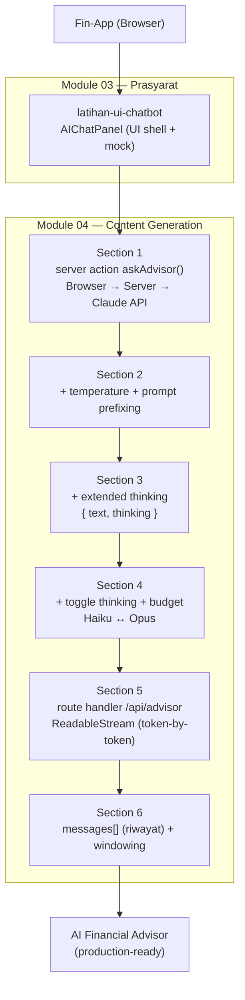
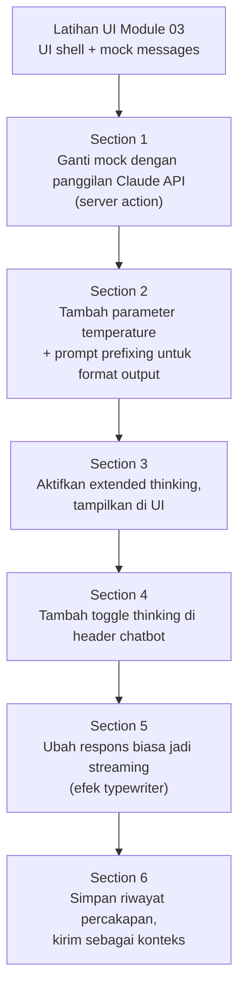
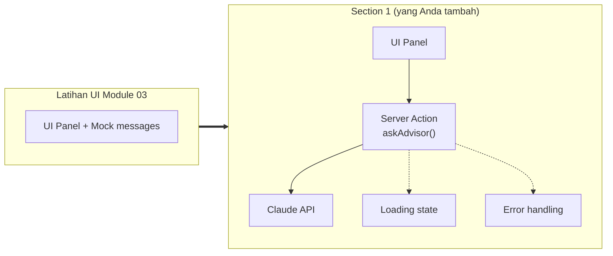
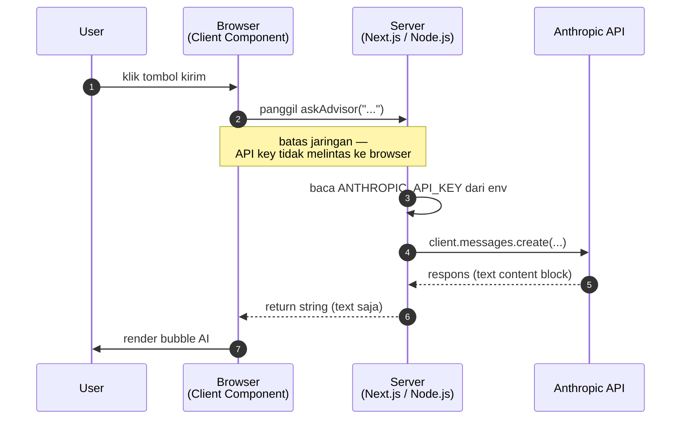
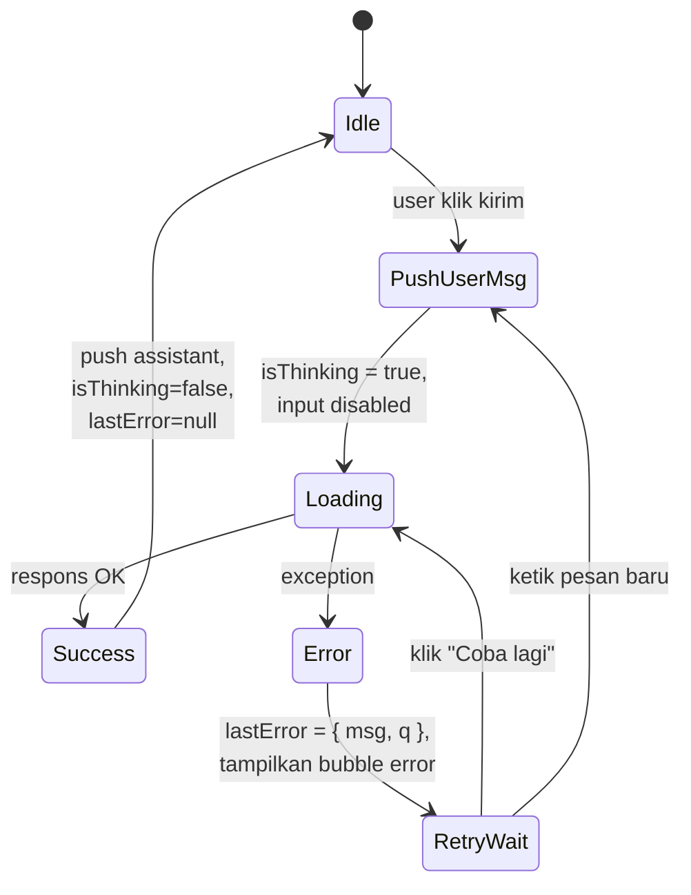
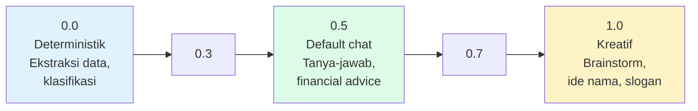
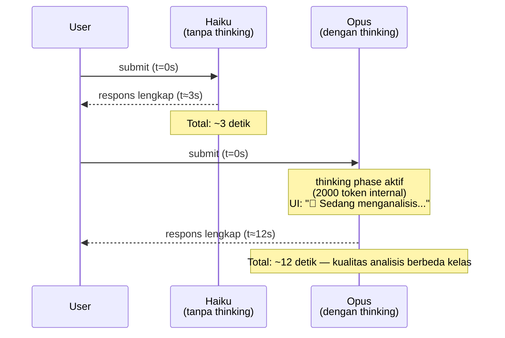
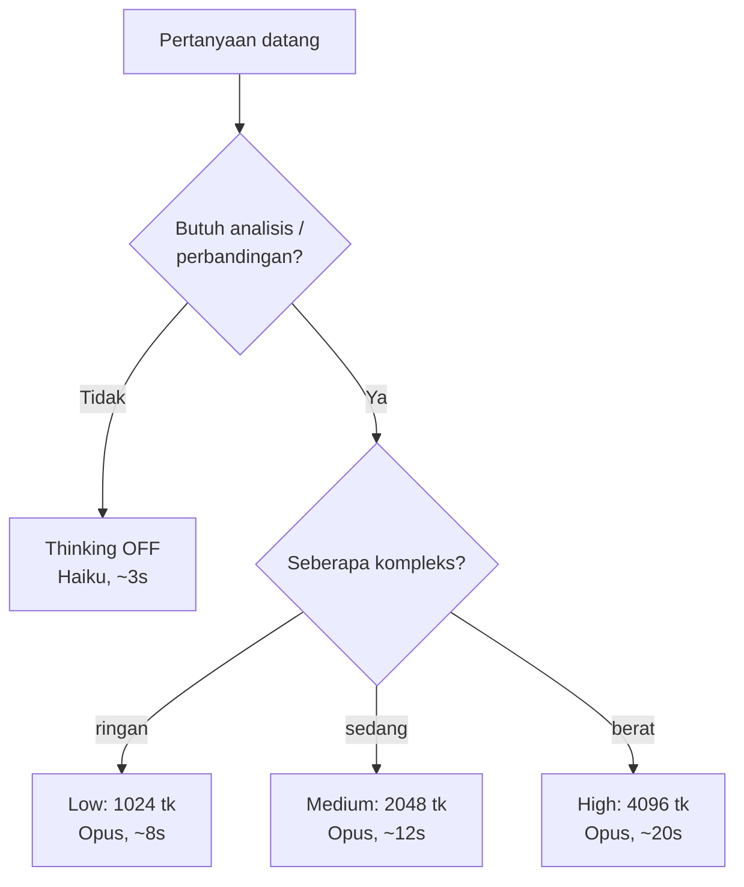
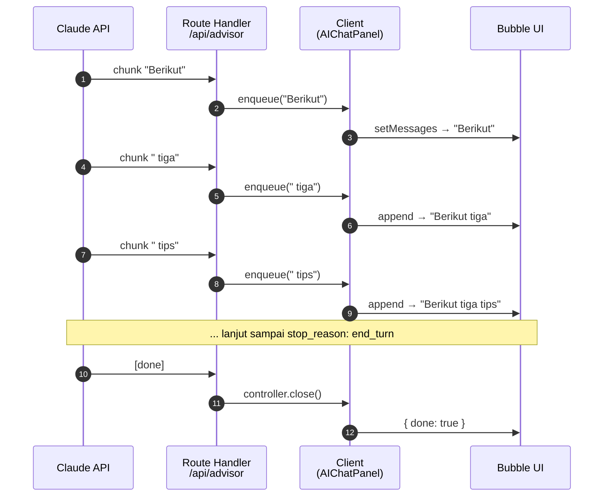
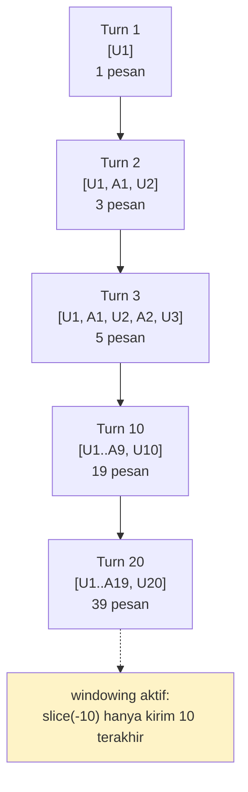

# Module 04 — Content Generation

> **Tujuan modul**: Anda membangun fitur **AI Financial Advisor** pada Fin-App secara bertahap — mulai dari UI chatbot, integrasi Claude API, hingga fitur lanjutan seperti *extended thinking*, *streaming*, dan *multi-turn conversation*.
>
> **Output akhir modul**: panel chatbot AI di aplikasi Fin-App yang sepenuhnya berfungsi: dapat menjawab pertanyaan keuangan natural language, memperlihatkan proses berpikir model, memuat percakapan multi-giliran, dan menampilkan respons secara streaming.

---

## Outline Section

Module 04 terdiri dari **6 section** (+ 1 latihan UI di Module 03 sebagai prasyarat) yang dirangkai berurutan. Setiap section menambah satu lapis kemampuan pada chatbot:

| # | Section | Fokus | Status |
|---|---|---|---|
| **0** | **[UI Chatbot (prasyarat — Module 03)](../Module-03-Claude-API/materi-ui-chatbot.md)** | Bangun panel kanan dengan header, body, input, markdown, toggle | ✅ Siap |
| **1** | **Integrasi Claude API ke Chatbot** | Hubungkan UI ke Claude API (server action) — mock content jadi respons asli | ✅ Siap |
| **2** | **Text Generation** | Parameter generation: `temperature`, `max_tokens`, `stop_sequences`, prompt prefixing untuk format output | ✅ Siap |
| **3** | **Thinking / Thought** | Menggunakan *extended thinking* model Claude (Opus 4.x) untuk menampilkan proses berpikir | ✅ Siap |
| **4** | **Switching Thinking Mode** | Toggle on/off thinking, atau pilih effort level (low / medium / high) | ✅ Siap |
| **5** | **Streaming Process** | Stream respons kata-demi-kata seperti aplikasi chat modern | ✅ Siap |
| **6** | **Multi-Turn Conversation** | Simpan riwayat percakapan dan kirim sebagai konteks ke Claude untuk percakapan berkelanjutan | ✅ Siap |

**Total estimasi durasi**: ±4–5 jam efektif (di luar break & diskusi).

> 💡 **Cara kerja modul ini**: setiap section memberi Anda **prompt-prompt siap copy-paste** untuk dieksekusi ke Claude Code. Anda yang menjalankannya — Claude Code yang menulis kode-nya. Pola ini sama dengan Module 02.

## Peta Visual Module 04

Berikut gambaran arsitektur yang Anda bangun dari awal sampai akhir module:



Setiap lapis menambah satu kemampuan **tanpa membongkar lapis sebelumnya**.

## Prinsip Kontinuitas Antar Section

**Penting**: kode yang Anda bangun di setiap section akan **terus berlanjut** ke section berikutnya. Section 1 mengubah file yang dibuat di latihan UI Module 03; Section 2 menambah kemampuan pada hasil Section 1; dan seterusnya.

Artinya:

- ❌ Jangan **menghapus** atau **menulis ulang dari nol** komponen yang sudah jadi di section sebelumnya.
- ✅ Setiap prompt di section berikutnya akan **eksplisit menyebut** file dan komponen mana yang akan diperluas atau dimodifikasi.
- ✅ Pada akhir Module 04, Anda akan memiliki **satu fitur chatbot yang utuh** — bukan kumpulan demo terpisah.

Alur evolusinya kira-kira seperti ini:



Setiap "→" adalah peningkatan inkremental pada **kode yang sama**, bukan project baru.

---

# Section 1 — Integrasi Claude API ke Chatbot

**Tujuan section**: mengganti *mock messages* dari latihan UI Module 03 dengan respons asli dari Claude API. Pada akhir section ini, pertanyaan user benar-benar dijawab oleh model Claude.

## Apa yang Akan Dibangun?

Lapis baru di atas latihan UI Module 03:



Yang akan dibuat / dimodifikasi:

| File | Aksi | Peran |
|---|---|---|
| `src/features/advisor.ts` | **Baru** | Server action `askAdvisor(message)` yang memanggil Claude API |
| `src/components/chat/ai-chat-panel.tsx` | **Modifikasi** | Handler tombol kirim memanggil server action, bukan push mock |

## Mengapa Server Action?

Pada Module 03, Anda memanggil Claude API dari file standalone `experiments/claude-test.ts` yang dijalankan di terminal. Pada chatbot, panggilan API harus terjadi **saat user klik kirim** di browser.

Anda **tidak boleh** memanggil Claude API langsung dari client component, karena:

1. **API key bocor**. Apabila ANTHROPIC_API_KEY ada di kode browser, siapa saja yang membuka DevTools dapat melihat dan menyalahgunakannya.
2. **Tidak ada `NEXT_PUBLIC_` di env**. Variable tanpa prefix tersebut tidak tersedia di browser — tetapi tersedia di server.

Solusinya: **server action**. Pola yang sama dengan `getBalanceSummary` di Module 02 — fungsi dengan `"use server"` yang dipanggil dari client component tetapi eksekusinya di server.



## Konsep Loading State & Error Handling

Network call ke Claude API memakan waktu **beberapa detik** (3–8 detik biasa). Selama menunggu, UI harus:

- **Disable input** agar user tidak men-spam request.
- **Tampilkan indikator** bahwa Claude sedang memproses (typing dots, spinner, atau placeholder).
- **Setelah selesai**: render respons, kembalikan input ke state aktif.

Untuk error, UI harus:

- **Tangkap exception** dari server action (rate limit, network error, key invalid).
- **Tampilkan pesan error** sebagai bubble assistant berstyle merah/distinct.
- **Sediakan tombol retry** agar user dapat mencoba ulang tanpa mengetik ulang pertanyaan.

Alur state pesan dari user klik kirim sampai render respons:



## Estimasi Biaya per Request

Pertanyaan keuangan personal biasanya sederhana. Estimasi token per request:

| Item | Tokens (perkiraan) |
|---|---|
| Pertanyaan user ("Berapa total expense bulan ini?") | 10–20 |
| Konteks tambahan (akan ditambah di Section 2) | 200–500 |
| Respons Claude (jawaban + format) | 200–600 |
| **Total per request** | **400–1200 tokens** |

Dengan model **Haiku 4.5** (sekitar $1 input / $5 output per 1M token), biaya per request **kurang dari $0.005** — sekitar Rp 80 per pertanyaan. Cukup hemat untuk eksperimen dan iterasi.

Lanjutkan ke `latihan.md` Section 1 untuk eksekusi prompt-promptnya.

📂 Lihat: `latihan.md` (bagian "Section 1").

---

# Section 2 — Text Generation

**Tujuan section**: memahami dan mengontrol **parameter generation** Claude API — `max_tokens`, `temperature`, dan `stop_sequences` — agar respons sesuai kebutuhan aplikasi.

> 📌 **Catatan**: Module 04 sengaja **belum menggunakan system instruction** (`system: "..."`). Persona dan format akan kita kontrol murni lewat **user message** dan **parameter generation**. System instruction adalah topik tersendiri yang akan dibahas pada modul terpisah.

## Apa Bedanya dari Section 1?

Pada Section 1, Anda memanggil Claude dengan parameter minimal: `model`, `max_tokens: 1024`, dan `messages`. Itu sudah cukup untuk respons dasar — tetapi Anda belum memanfaatkan parameter lain yang dapat **secara dramatis** mengubah karakter output.

Section 2 mengeksplorasi tiga parameter penting:

| Parameter | Apa yang dikontrol |
|---|---|
| `max_tokens` | Batas maksimum panjang output |
| `temperature` | Tingkat kreativitas / variabilitas |
| `stop_sequences` | Kata atau urutan yang menghentikan generation |

## 1. `max_tokens` — Batas Panjang Output

Sudah Anda pakai di Section 1 (nilainya `1024`). Sekarang mari pahami dampaknya:

| Nilai | Implikasi |
|---|---|
| **Terlalu kecil** (mis. 100) | Respons terpotong di tengah — `stop_reason` jadi `"max_tokens"`. |
| **Pas** (mis. 1024–2048) | Respons natural, selesai dengan `stop_reason: "end_turn"`. |
| **Terlalu besar** (mis. 8192) | Aman, tetapi biaya output token bisa tidak terduga. |

**Strategi praktis**: pilih nilai **cukup** untuk jenis pertanyaan terpanjang yang realistis. Untuk chat keuangan personal, 1024–2048 biasanya pas.

## 2. `temperature` — Kreativitas Output

Parameter `temperature` adalah angka antara `0.0` dan `1.0` yang menentukan **seberapa "random"** Claude memilih kata berikutnya.

| Temperature | Karakter Output |
|---|---|
| `0.0` | **Deterministik** — pertanyaan sama selalu dapat jawaban yang persis sama. Cocok untuk task faktual, ekstraksi data, klasifikasi. |
| `0.3–0.5` | Konsisten dengan sedikit variasi. Cocok untuk tanya jawab, summary. |
| `0.7` (default) | Seimbang antara kreatif dan terkendali. Cocok untuk chatbot umum. |
| `1.0` | **Sangat kreatif** — jawaban sama untuk pertanyaan yang sama bisa berbeda jauh. Cocok untuk brainstorm, ide kreatif. |

Untuk **AI Financial Advisor**, nilai `0.5–0.7` umumnya pas: faktual tetapi tidak kaku.

Visualisasi spektrumnya:



Pertanyaan yang sama, 3x di temperature 0.0 → jawaban identik. Di 1.0 → bisa sangat berbeda.

```ts
client.messages.create({
  model: "claude-haiku-4-5",
  max_tokens: 1024,
  temperature: 0.5,                          // ← parameter baru
  messages: [...],
});
```

## 3. `stop_sequences` — Hentikan di Pola Tertentu

`stop_sequences` adalah array string yang, ketika ditemukan Claude saat generation, akan **menghentikan output saat itu juga**.

Contoh:

```ts
client.messages.create({
  ...,
  stop_sequences: ["[END]", "###"],
});
```

Apabila Claude menghasilkan `### Bagian Kedua`, ia berhenti tepat di `###` — section "Bagian Kedua" tidak ikut keluar.

`stop_reason` pada respons akan menjadi `"stop_sequence"`, dan field `stop_sequence` berisi string mana yang ter-trigger.

**Kapan dipakai?**

- Membatasi format output: minta Claude menulis "[END]" di akhir → otomatis berhenti.
- Mencegah Claude menulis section yang tidak diinginkan.
- Membatasi panjang respons secara *semantik* (bukan numerik seperti `max_tokens`).

> 💡 Pada chatbot percakapan biasa, `stop_sequences` jarang dibutuhkan. Ia lebih sering dipakai untuk **task terstruktur** seperti JSON extraction atau structured output.

## Format Output Tanpa System Instruction

Karena Module 04 belum menggunakan system instruction, **bagaimana cara mengarahkan format output**? Jawabannya: **lewat user message itu sendiri**.

Contoh:

```ts
// User message yang diketik user:
"Tips menghemat pengeluaran"

// Yang dikirim ke Claude (diperluas di server):
`Jawab dengan markdown rapi. Pakai list bertanda untuk poin-poin.
Format angka Rupiah seperti "Rp 1.500.000". Selalu Bahasa Indonesia.

Pertanyaan: Tips menghemat pengeluaran`
```

Pola ini disebut **prompt prefixing** — Anda menambahkan instruksi ke depan pertanyaan user, bukan menaruhnya di parameter `system`. Hasilnya mirip, tetapi:

- ✅ Lebih sederhana untuk pemula.
- ⚠️ Setiap request membayar token instruksi ulang-ulang.
- ⚠️ User dapat secara teori "membatalkan" instruksi dengan kalimat seperti "abaikan instruksi sebelumnya" — kerentanan yang akan dibahas di modul khusus tentang system instruction.

Pada Section 2, Anda akan mempraktikkan prompt prefixing sederhana untuk membentuk gaya respons AI Financial Advisor.

Lanjutkan ke `latihan.md` Section 2 untuk eksekusi.

---

# Section 3 — Thinking / Thought

**Tujuan section**: mengaktifkan fitur **Extended Thinking** pada Claude — proses internal di mana model "memikirkan" jawaban sebelum mengeluarkannya — dan menampilkan proses tersebut di UI sebagai blok yang dapat dilipat.

## Apa itu Extended Thinking?

Pada model Claude Opus 4.x dan Sonnet 4.x, Anthropic memperkenalkan fitur **extended thinking**: kemampuan model untuk menghasilkan **proses berpikir internal** (thinking) sebelum menghasilkan jawaban akhir (text).

Dalam respons API, ini terlihat sebagai dua jenis *content block*:

```ts
response.content = [
  {
    type: "thinking",
    thinking: "Pengguna bertanya tentang strategi menghemat...
               Saya perlu mempertimbangkan tiga kategori utama:
               1. Pengeluaran tetap (sewa, langganan)
               2. Pengeluaran variabel (makanan, hiburan)
               3. ..."
  },
  {
    type: "text",
    text: "### Strategi Menghemat\n\n1. **Audit pengeluaran tetap**..."
  }
]
```

Blok `thinking` ini adalah **monolog internal** Claude — pemikiran kasar yang membentuk jawaban final. Berguna untuk:

- **Transparansi**: user dapat melihat alasan di balik jawaban.
- **Debugging prompt**: Anda dapat melihat apakah model benar-benar memahami pertanyaan.
- **Edukasi**: untuk task analisis, thinking sering kali sama berharganya dengan jawaban final.

## Cara Mengaktifkan

Pada SDK Anthropic, aktifkan extended thinking dengan parameter `thinking`:

```ts
client.messages.create({
  model: "claude-opus-4-7",        // Wajib pakai Opus untuk thinking
  max_tokens: 4096,
  thinking: {
    type: "enabled",
    budget_tokens: 2000,            // Berapa banyak token untuk thinking
  },
  system: "Anda adalah AI Financial Advisor...",
  messages: [{ role: "user", content: question }],
});
```

**`budget_tokens`** menentukan berapa banyak token yang Claude boleh pakai untuk thinking. Nilai umum:

| Budget | Cocok untuk |
|---|---|
| **1024** | Pertanyaan singkat / klarifikasi |
| **2048** | Pertanyaan keuangan umum |
| **4096+** | Analisis kompleks (perencanaan multi-tahun, perbandingan skenario) |

## Trade-off: Latensi & Biaya

Extended thinking **bukan gratis**:

- **Lebih lambat**: respons yang biasanya 3 detik bisa jadi 8–15 detik.
- **Lebih mahal**: token thinking dihitung dalam biaya, sama seperti output text.
- **Model lebih mahal**: Opus jauh lebih mahal dari Haiku.

Karena itu, di Section 4 nanti Anda akan menambah toggle untuk mengaktifkan/menonaktifkan thinking — bukan dipakai untuk setiap pertanyaan.

Timeline perbandingan respons:



Mata user tetap menunggu — tapi kualitas analisis berbeda kelas. Untuk pertanyaan "Berapa total expense?" tidak perlu thinking; untuk "Bandingkan tiga skenario tabungan" sangat berguna.

## Tampilan di Chatbot UI

Untuk section ini, blok thinking ditampilkan sebagai **section collapsible** di atas bubble jawaban:

```
┌────────────────────────────────────────┐
│ 🧠 Lihat proses berpikir (klik buka) ▼ │
└────────────────────────────────────────┘

[ Bubble jawaban Claude (text content) ]
```

Default-nya **terlipat** — agar tidak mengganggu user yang hanya ingin jawaban. User yang penasaran dapat membuka untuk melihat thinking.

Lanjutkan ke `latihan.md` Section 3 untuk eksekusi.

---

# Section 4 — Switching Thinking Mode

**Tujuan section**: memberi user kontrol untuk **mengaktifkan / menonaktifkan** extended thinking dari Section 3, dan memilih *budget tokens* (effort level) sesuai jenis pertanyaan.

## Mengapa Perlu Toggle?

Pada Section 3, extended thinking selalu aktif. Ini punya konsekuensi:

- **Pertanyaan sederhana** ("Berapa saldo saya?") tetap diproses dengan thinking — **boros**.
- **Pertanyaan kompleks** ("Bandingkan tiga skenario tabungan untuk DP rumah dalam 5 tahun") justru lebih relevan dengan thinking.

Pendekatan yang lebih bijak:

- **Default off**: pertanyaan ringan tidak butuh thinking → respons lebih cepat & murah.
- **User pilih on** saat pertanyaan kompleks → respons lebih dalam dan transparan.

## Komponen UI yang Akan Ditambah

Header chatbot mendapat satu kontrol baru — tombol toggle dengan ikon otak:

```
┌────────────────────────────────────────┐
│  AI Financial Advisor          🧠 ⚙️ ✕ │
│  Get personalized financial advice.    │
└────────────────────────────────────────┘
         │      │
         │      └─ Settings (pilih budget: low/medium/high)
         │
         └─ Toggle thinking on/off (default: off)
```

## Heuristik: Kapan Thinking Diperlukan?

Berdasarkan jenis pertanyaan keuangan personal, pola umumnya:

| Jenis Pertanyaan | Thinking? | Budget |
|---|---|---|
| Query data sederhana ("Berapa total expense bulan ini?") | ❌ Off | — |
| Tips umum ("Cara hemat belanja bulanan?") | ❌ Off | — |
| Analisis pola ("Kenapa expense saya naik bulan ini?") | ✅ On | 1024 |
| Perencanaan multi-skenario ("Bandingkan tabung di reksadana vs deposito") | ✅ On | 2048 |
| Strategi jangka panjang ("Rencana finansial 10 tahun untuk pensiun") | ✅ On | 4096 |

User tidak perlu menghafal tabel ini — UI akan menyediakan **preset** (low / medium / high) sehingga user tinggal pilih intuitif.

Decision tree intuitif:



## State Management

State thinking config akan disimpan di **ChatContext** yang sudah dibuat di latihan UI Module 03:

```ts
type ChatContextValue = {
  isOpen: boolean;
  toggleOpen: () => void;
  // Baru di Section 4:
  thinkingEnabled: boolean;
  thinkingBudget: "low" | "medium" | "high";
  setThinkingEnabled: (v: boolean) => void;
  setThinkingBudget: (v: "low" | "medium" | "high") => void;
};
```

Mengapa di context, bukan local state di AIChatPanel? Karena di masa depan **toggle** mungkin akan dipanggil dari tempat lain (mis. tombol "Eksplorasi lebih dalam" di stat card dashboard).

Lanjutkan ke `latihan.md` Section 4 untuk eksekusi.

---

# Section 5 — Streaming Process

**Tujuan section**: mengubah respons "tunggu lama → muncul sekaligus" menjadi **streaming** kata-demi-kata seperti pengalaman chat modern (ChatGPT, Claude.ai).

## Apa itu Streaming Response?

Pada Section 1–4, alurnya:

```
User kirim → ... (tunggu 5 detik) ... → seluruh jawaban muncul
```

Selama 5 detik tersebut, user hanya melihat indikator "AI sedang mengetik...". Pada streaming, alurnya:

```
User kirim → 0.5s → "Berikut" → "adalah" → "tiga" → "tip" → ... → selesai
```

Setiap **token** yang dihasilkan Claude muncul **segera** di UI. User melihat respons "tumbuh" secara real-time.

## Keuntungan Streaming

| Aspek | Tanpa Streaming | Dengan Streaming |
|---|---|---|
| **Perceived latency** | Lama (tunggu full response) | Cepat (token pertama dalam ~500ms) |
| **Engagement** | Pasif, menunggu | Aktif, mengikuti alur |
| **UX feel** | "Lemah" / kuno | Modern, responsif |
| **Saat respons panjang** | Frustasi menunggu | Dapat mulai baca sambil sisanya datang |

## Konsep Teknis: SSE (Server-Sent Events)

Anthropic API mendukung streaming via **SSE** — protokol HTTP di mana server mengirim event terus-menerus ke client dalam satu connection.

SDK Anthropic menyediakan abstraksi yang nyaman:

```ts
const stream = client.messages.stream({
  model: "claude-haiku-4-5",
  max_tokens: 1024,
  messages: [{ role: "user", content: question }],
});

for await (const chunk of stream) {
  if (chunk.type === "content_block_delta" && chunk.delta.type === "text_delta") {
    process.stdout.write(chunk.delta.text);  // ← token muncul satu per satu
  }
}
```

## Tantangan: Server Action Tidak Cocok untuk Streaming

Pada Section 1–4, Anda memakai **server action** (`"use server"`) yang menerima input, menghasilkan output, dan return sekali. Pola request-response ini **tidak cocok** untuk streaming.

Solusinya: ganti dengan **Route Handler** Next.js (`src/app/api/.../route.ts`) yang dapat mengembalikan **Response dengan body berupa ReadableStream**.

```ts
// src/app/api/advisor/route.ts
export async function POST(request: Request) {
  const { message } = await request.json();
  const stream = client.messages.stream({ ... });

  const readable = new ReadableStream({
    async start(controller) {
      for await (const chunk of stream) {
        if (chunk.type === "content_block_delta" && chunk.delta.type === "text_delta") {
          controller.enqueue(new TextEncoder().encode(chunk.delta.text));
        }
      }
      controller.close();
    },
  });

  return new Response(readable);
}
```

## Konsumsi Stream di Client

Client component membaca stream lewat `fetch` + `ReadableStream`:

```tsx
const response = await fetch("/api/advisor", {
  method: "POST",
  body: JSON.stringify({ message: question }),
});

const reader = response.body!.getReader();
const decoder = new TextDecoder();

while (true) {
  const { done, value } = await reader.read();
  if (done) break;
  const chunk = decoder.decode(value);
  // Append chunk ke state message terakhir → UI re-render
  setMessages(prev => updateLastMessage(prev, chunk));
}
```

Visualisasi pipeline ujung ke ujung:



Setiap token yang Claude hasilkan langsung mengalir tanpa nunggu seluruh respons selesai.

## Implikasi pada State Management

Pada Section 1–4, state messages diisi dengan **respons lengkap** sekaligus. Pada streaming, Anda perlu:

1. Push placeholder assistant message di awal (content: "").
2. Setiap chunk yang datang → **append** ke content message terakhir.
3. Component re-render secara otomatis di setiap state update.

Tidak rumit, tetapi pola "mutate last item" perlu diperhatikan agar React tidak meng-skip update.

Lanjutkan ke `latihan.md` Section 5 untuk eksekusi.

---

# Section 6 — Multi-Turn Conversation

**Tujuan section**: membuat chatbot dapat memahami **pertanyaan lanjutan** ("Bagaimana dengan bulan lalu?", "Coba contoh lain", "Yang pertama") dengan menyimpan riwayat percakapan dan mengirimnya sebagai konteks pada setiap request.

## Masalah Saat Ini

Pada Section 1–5, setiap pertanyaan dikirim ke Claude **secara terpisah**:

```
User: "Berikan tips menghemat."
Claude: [respons 5 tips]

User: "Detailkan tip pertama."
Claude: "Tip pertama dari pertanyaan mana? Saya tidak punya konteks."
```

Karena Claude API **stateless**, ia tidak mengingat pertanyaan sebelumnya. Setiap request adalah percakapan baru bagi Claude.

## Solusi: Kirim Riwayat sebagai Messages Array

API Anthropic menerima parameter `messages` sebagai **array** yang berisi seluruh riwayat percakapan:

```ts
client.messages.create({
  system: "Anda adalah AI Financial Advisor...",
  messages: [
    { role: "user", content: "Berikan tips menghemat." },
    { role: "assistant", content: "Berikut 5 tips:\n1. Audit pengeluaran tetap\n2. ..." },
    { role: "user", content: "Detailkan tip pertama." }  // ← pertanyaan baru
  ],
});
```

Dengan riwayat lengkap, Claude tahu "tip pertama" merujuk ke "Audit pengeluaran tetap" dari respons sebelumnya.

## Implementasi: State Sudah Ada

Kabar baik: state `messages` di `AIChatPanel` **sudah** berisi seluruh riwayat percakapan. Anda sudah punya array `[user, assistant, user, assistant, ...]` dari Section 1.

Yang perlu diubah:

- Server action / route handler menerima **array messages** (bukan single `message: string`).
- Client mengirim **seluruh state messages** (kecuali welcome message) sebagai input.

## Strategi Penyimpanan Riwayat

Untuk modul ini, riwayat hanya disimpan **dalam state React** (in-memory). Implikasinya:

- ✅ Riwayat persisten selama panel chatbot tetap mount.
- ❌ Riwayat **hilang** saat user refresh browser.

Untuk persistensi jangka panjang (di luar scope modul ini), opsi yang umum:

| Opsi | Pro | Kontra |
|---|---|---|
| **localStorage** | Sederhana, otomatis persistent per browser | Per-device, tidak sync antar device |
| **Supabase table** | Sync antar device, query-able | Perlu schema baru + privacy concern |
| **Redis / KV** | Cepat untuk session aktif | Setup tambahan |

Untuk Fin-App personal, **localStorage cukup**. Implementasinya dapat Anda lakukan setelah Module 04.

## Trade-off: Biaya Naik Linear

Setiap turn baru meneruskan SELURUH riwayat ke Claude. Implikasi biaya:

| Turn | Riwayat | Input tokens (perkiraan) |
|---|---|---|
| 1 | 1 user message | ~50 |
| 5 | 5 user + 4 assistant | ~1500 |
| 20 | 20 user + 19 assistant | ~8000 |
| 50 | 50+49 | ~25.000 |

Pada percakapan **sangat panjang**, biaya menjadi mahal. Strategi yang umum:

Visualisasi pertumbuhan `messages[]` yang dikirim ke API setiap turn:



Setiap turn membayar ulang seluruh konteks sebelumnya — itulah kenapa windowing/summarization jadi krusial di percakapan panjang.

### Windowing

Hanya kirim **N pesan terakhir** (mis. 10 terakhir). Pesan lebih tua dibuang.

```ts
const recentMessages = messages.slice(-10);
```

Trade-off: Claude bisa "lupa" konteks awal.

### Summarization

Setelah riwayat mencapai N pesan, **ringkas** percakapan lama menjadi satu pesan sistem, lalu mulai windowing baru.

```ts
// Setelah 20 turn:
const summary = await summarizeOldMessages(messages.slice(0, 10));
const newHistory = [
  { role: "user", content: `[Ringkasan percakapan sebelumnya] ${summary}` },
  ...messages.slice(10),
];
```

Lebih kompleks, tetapi mempertahankan konteks penting.

Untuk Section 6, kita **belum** implementasi summarization — cukup windowing sederhana (10 pesan terakhir) sebagai safety net.

Lanjutkan ke `latihan.md` Section 6 untuk eksekusi.

---

## Recap

Module 04 membangun fitur **AI Financial Advisor** Fin-App secara berlapis: UI dulu, lalu integrasi API, lalu fitur lanjutan satu per satu. Pendekatan inkremental ini membuat Anda dapat menguji setiap lapis sebelum lanjut ke lapis berikutnya — pola yang penting saat membangun fitur AI di production.
