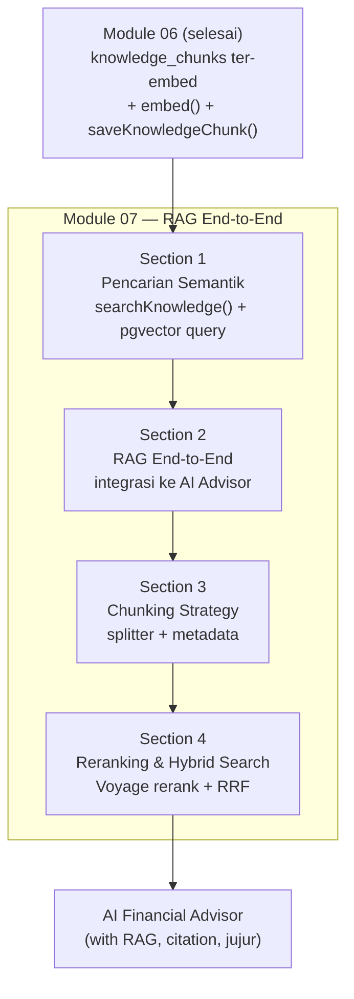
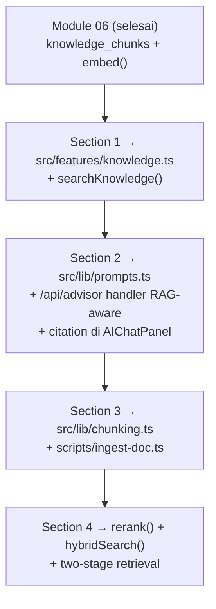
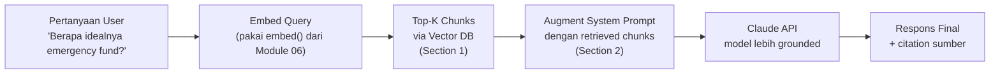
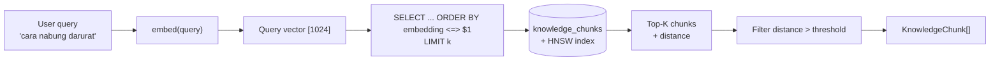
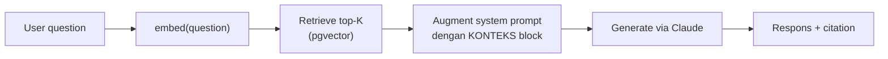
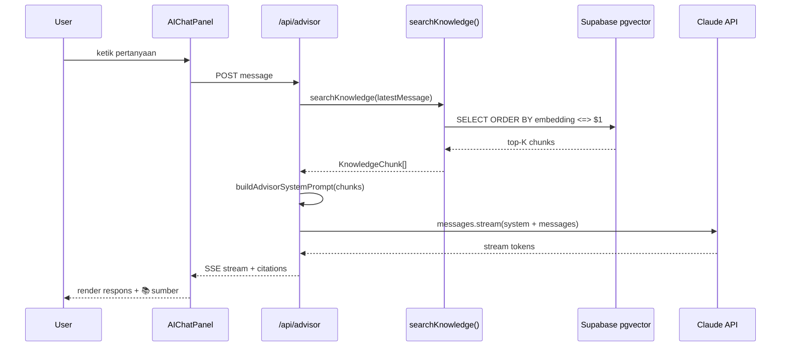
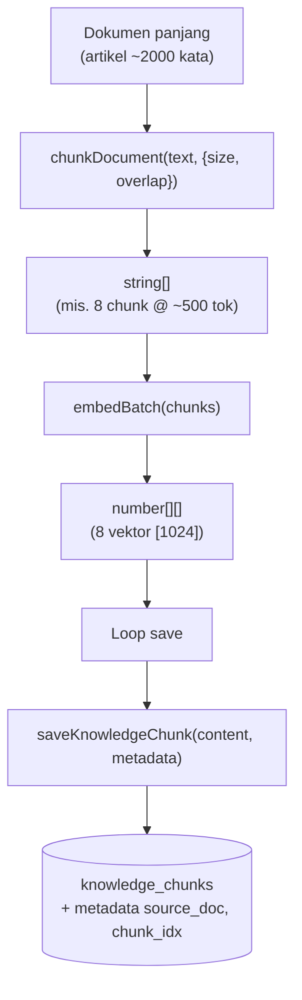
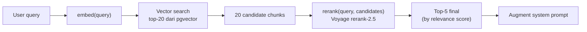

# Module 07 — RAG (Retrieval Augmented Generation)

> **Tujuan modul**: Anda membangun **RAG end-to-end** di atas fondasi embedding dari Module 06 — mulai dari pencarian semantik, integrasi ke AI Financial Advisor, strategi chunking untuk dokumen panjang, hingga optimasi kualitas via reranking + hybrid search.
>
> **Output akhir modul**: AI Advisor di Fin-App yang **menjawab dengan basis pengetahuan** — bukan halusinasi — dan menampilkan **sumber kutipan** ke user.

---

## Outline Section

Module ini membangun **RAG end-to-end** di atas fondasi embedding dari Module 06. Setiap section menambah satu lapis kapabilitas RAG ke Fin-App:

| # | Section | Fokus | Status |
|---|---|---|---|
| **1** | **Pencarian Semantik (Vector Query)** | Helper `searchKnowledge()` + SQL pgvector + threshold tuning | ✅ Siap |
| **2** | **RAG End-to-End: Integrasi ke AI Advisor** | System prompt RAG-aware + route handler + citation di UI | ✅ Siap |
| **3** | **Chunking Strategy** | Splitter untuk dokumen panjang + metadata + ingest pipeline | ✅ Siap |
| **4** | **Reranking & Hybrid Search** | Voyage `rerank-2.5` + PostgreSQL full-text + RRF | ✅ Siap |

**Total estimasi durasi**: ±4–5 jam efektif (di luar break & diskusi).

> 💡 **Cara kerja modul ini**: sama dengan Module 04–06 — setiap section memberi prompt-prompt siap copy-paste untuk dieksekusi ke Claude Code, yang akan menambah kode RAG di Fin-App secara inkremental.

## Peta Visual Module 07

Berikut gambaran arsitektur RAG yang Anda bangun di atas fondasi Module 06:



Setiap section adalah peningkatan kualitas RAG — dari sekadar bisa retrieve, sampai retrieval production-grade dengan reranking + hybrid.

## Prinsip Kontinuitas Antar Section

Sama dengan module-module sebelumnya, kode dari section sebelumnya **terus berlanjut** dan diperluas:



Pada akhir Module 07, Fin-App Anda memiliki **AI Advisor RAG-aware** yang menjawab berdasarkan basis pengetahuan, jujur saat tidak tahu, dan dapat ditingkatkan kualitasnya secara modular.

---

## Konsep RAG

Sebelum mulai eksekusi, pahami dulu **apa itu RAG dan mengapa penting**. Tanpa intuisi konseptual yang baik, Anda akan terjebak menulis kode tanpa memahami trade-off-nya.

### Definisi

**RAG (Retrieval Augmented Generation)** adalah pola arsitektur AI di mana respons model bahasa **diperkaya** dengan informasi yang **diambil** (retrieve) dari sumber data eksternal sebelum **dihasilkan** (generate).

Tiga komponen intinya:

1. **Retrieve** — cari potongan informasi paling relevan dari knowledge base (vector DB, dokumen, dll.)
2. **Augment** — sisipkan informasi tersebut ke konteks prompt model
3. **Generate** — model menjawab pertanyaan user dengan **berlandaskan** informasi yang sudah disisipkan

### Mengapa RAG?

Model bahasa seperti Claude punya beberapa keterbatasan mendasar yang RAG selesaikan:

| Aspek | Tanpa RAG | Dengan RAG |
|---|---|---|
| **Pengetahuan** | Sebatas training cut-off date | Bisa akses data terbaru (FAQ, dokumen, transaksi user) |
| **Akurasi detail spesifik** | Kadang **halusinasi** angka/fakta | Berdasarkan sumber yang dapat diverifikasi |
| **Data proprietary** | Tidak tahu konteks internal (data Fin-App) | Akses penuh ke knowledge base Anda |
| **Updatability** | Perlu fine-tune mahal | Tinggal tambah/ubah chunks di DB |
| **Citation** | Tidak ada sumber | Bisa tampilkan sumber chunk |

Untuk Fin-App: tanpa RAG, advisor Claude tidak tahu kebijakan "emergency fund 3–6 bulan" yang spesifik di FAQ Anda. Dengan RAG, FAQ tersebut otomatis diambil saat user bertanya tentang darurat keuangan.

### Pipeline Big Picture



Perhatikan bahwa RAG **tidak mengganti** model — ia hanya **memberi makan konteks yang lebih relevan** ke model. Kualitas akhir bergantung pada: (1) kualitas chunks di DB, (2) akurasi retrieval, (3) cara augmentasi disusun.

### Variasi RAG

Module ini fokus pada **naive RAG** sebagai fondasi. Tapi penting Anda tahu ada variasi lain yang mungkin Anda butuhkan kelak:

| Variasi | Karakteristik | Kapan dipakai |
|---|---|---|
| **Naive RAG** | Retrieve top-K → augment → generate. Satu kali per query. | Default. Fondasi yang akan Anda bangun di Section 1–2. |
| **Agentic RAG** | Model sendiri memutuskan kapan retrieve, via tool use | Pertanyaan kompleks yang butuh multiple-step reasoning. Overlap dengan Module 05 Section 4. |
| **Multi-hop RAG** | Beberapa retrieve berurutan untuk pertanyaan kompleks | "Bandingkan kebijakan A vs B" — butuh fetch dua dokumen. |
| **Hybrid Search** | Vector search + keyword search digabung via RRF | Query yang punya kata kunci eksak (mis. nama produk). Section 4. |
| **GraphRAG** | Knowledge base berbasis graf relasi entitas | Domain dengan banyak relasi (legal, scientific). Advanced, di luar scope module ini. |

### Kapan RAG TIDAK Tepat?

RAG bukan silver bullet. Hindari kalau:

- Pertanyaan bisa dijawab dari **training data Claude** (mis. "Apa itu inflasi?") — RAG hanya menambah latensi tanpa manfaat.
- Butuh **komputasi terstruktur** dari data user (mis. "Berapa total expense bulan ini?") — pakai **tool use** (Module 05 Section 4 Agentic) yang query DB secara deterministik, bukan via similarity.
- Use case butuh **match eksak**, bukan **kemiripan semantik** — keyword search biasa lebih tepat dan murah.

Dengan pemahaman ini, Anda siap mulai membangun komponen RAG satu per satu. Section berikutnya membangun primitif retrieval.

---

# Section 1 — Pencarian Semantik (Vector Query)

**Tujuan section**: bangun **primitif retrieval** — function yang menerima query natural language dan mengembalikan top-K chunk paling relevan dari `knowledge_chunks`.

## Apa itu Vector Query / Pencarian Semantik?

**Vector query** adalah operasi pencarian di vector database: diberi satu **query vector**, kembalikan top-K row yang vektornya **paling dekat** dengan query vector (berdasarkan metrik distance yang dipilih).

Alur konseptualnya:

1. User kirim natural language: `"cara nabung darurat"`.
2. Sistem `embed()` query → dapat query vector berdimensi 1024.
3. SQL: `ORDER BY embedding <=> $query_vector LIMIT k` → ambil top-K row.
4. Return chunk-chunk tersebut beserta **distance** (untuk filter/threshold).

Output ini adalah **kandidat konteks** yang nanti diinject ke prompt Claude di Section 2.

## Anatomi Query Pgvector

Pgvector menyediakan tiga operator distance — di Module 06 sudah dibahas, di sini kita fokus pada **bentuk SQL siap pakai**:

```sql
SELECT
  id,
  content,
  metadata,
  embedding <=> $1 AS distance
FROM knowledge_chunks
ORDER BY embedding <=> $1
LIMIT $2;
```

| Bagian | Penjelasan |
|---|---|
| `$1` | Query vector (hasil `embed(userQuery)`), dikirim sebagai parameter — biasanya `number[]` yang di-cast `::vector` di pgvector. |
| `<=>` | Cosine **distance** (`1 - cosine_similarity`). Range: 0 (identik) s.d. 2 (berlawanan). |
| `ORDER BY ... ASC` | Default ASC = paling dekat (distance terkecil) dulu. |
| `LIMIT $2` | Top-K. Praktis: 3–10. |

> 📌 **Penting**: pakai operator yang **konsisten** dengan index HNSW (`vector_cosine_ops`). Mismatch → query lambat (full scan) karena index tidak terpakai.

## Strategi Top-K

`k` adalah hyperparameter krusial yang menentukan **berapa banyak konteks** yang akan diberi ke Claude:

| Nilai `k` | Karakter | Pakai kapan? |
|---|---|---|
| **k = 1** | Hanya 1 chunk paling mirip. Tight & cepat, tetapi sering miss konteks pendukung. | Lookup ketat (mis. exact FAQ). |
| **k = 3–5** | **Sweet spot RAG umum**. Cukup konteks tanpa membanjiri prompt. | Default untuk AI Advisor. |
| **k = 10+** | Banyak konteks, tetapi noise tinggi — chunk yang tidak relevan ikut masuk. | **Butuh reranking** (Section 4) untuk menyaring ulang. |

**Trade-off konkret**: setiap chunk tambahan menambah token ke prompt Claude → biaya naik + risiko Claude bingung memilih konteks mana yang relevan. Mulailah dengan `k=5`, naikkan kalau Anda menambah reranking.

## Mermaid: Query Flow



## Threshold Distance (kapan dianggap "tidak relevan")

Tidak semua query punya jawaban di knowledge base. Untuk membedakan **"hasil relevan"** vs **"sebenarnya tidak ada yang match"**, gunakan threshold distance:

| Distance (cosine) | Interpretasi |
|---|---|
| `< 0.2` | Sangat mirip — chunk hampir pasti relevan. |
| `0.2–0.5` | Cukup mirip — kemungkinan relevan, tergantung query. |
| `> 0.5` | Mulai diragukan — bisa jadi tidak related. |
| `> 0.8` | Hampir pasti tidak related. |

Dua opsi penerapan:

1. **Filter di SQL**: tambah `WHERE embedding <=> $1 < 0.5` — query mengembalikan **kosong** kalau memang tidak ada chunk relevan.
2. **Filter di kode**: ambil top-K dulu, lalu di TypeScript buang yang `distance > threshold`.

Opsi (2) lebih fleksibel untuk logging — Anda masih lihat distance asli di server. Opsi (1) lebih efisien kalau dataset besar.

## TypeScript Helper

Bentuk function yang akan dibangun di latihan:

```ts
import "server-only";
import { createServerSupabase } from "@/lib/supabase/server";
import { embed } from "@/lib/embeddings";

export type KnowledgeChunk = {
  id: string;
  content: string;
  metadata: Record<string, unknown>;
  distance: number;
};

export async function searchKnowledge(
  query: string,
  k: number = 5,
  threshold: number = 0.5,
): Promise<KnowledgeChunk[]> {
  const queryVector = await embed(query);
  const supabase = await createServerSupabase();
  const { data, error } = await supabase.rpc("match_knowledge_chunks", {
    query_embedding: queryVector,
    match_count: k,
  });
  if (error) throw new Error(`Search failed: ${error.message}`);
  return (data ?? []).filter((c: KnowledgeChunk) => c.distance <= threshold);
}
```

> 📌 Karena Supabase REST tidak men-support operator `<=>` langsung dari client builder, cara paling clean adalah membuat **SQL function `match_knowledge_chunks(query_embedding, match_count)`** lalu memanggilnya via `supabase.rpc(...)`. Alternatif: pakai raw SQL via Postgres client.

Lanjutkan ke `latihan.md` Section 1 untuk eksekusi.

---

# Section 2 — RAG End-to-End: Integrasi ke AI Advisor

**Tujuan section**: hubungkan retrieval (Section 1) ke Claude — sebelum Claude menjawab, sistem mengambil chunk relevan dan menyuntikkannya ke **system prompt** sebagai konteks otoritatif.

## Apa itu RAG?

**RAG (Retrieval Augmented Generation)** adalah pola arsitektur di mana **output LLM diaugmentasi dengan konteks** yang di-retrieve dari basis pengetahuan eksternal sebelum generation. Tujuannya:

- **Mengurangi halusinasi** — Claude tidak perlu menebak, ia diberi fakta.
- **Sumber dapat diperbarui** — basis pengetahuan bisa di-update tanpa retrain model.
- **Citation-friendly** — sistem tahu chunk mana yang dipakai → bisa ditampilkan ke user.

Big picture:



## Anatomi System Prompt yang RAG-aware

System prompt RAG memiliki struktur yang konsisten — persona + instruksi penggunaan konteks + KONTEKS block + aturan kejujuran:

```
<persona dari Module 05>

Anda diberi konteks pengetahuan berikut yang relevan dengan
pertanyaan user. JIKA konteks tidak cukup untuk menjawab,
katakan terus terang — JANGAN mengarang.

=== KONTEKS ===
{retrieved_chunks}
=== AKHIR KONTEKS ===

Pertanyaan user akan datang sebagai message berikutnya.
```

`{retrieved_chunks}` di-format sebagai daftar bernomor:

```
[1] Cara membuat budget bulanan: aturan 50/30/20 ...
[2] Apa itu emergency fund? 3–6× pengeluaran bulanan ...
[3] Rasio utang sehat: maksimum 30% pendapatan bersih ...
```

**Aturan kejujuran** (eksplisit di prompt) adalah komponen kritis. Tanpa itu, Claude cenderung mengisi celah dengan pengetahuan umum → mengaburkan citation.

## Pipeline End-to-End



## Trade-off: Latensi vs Relevansi

Tiap langkah RAG menambah waktu sebelum token pertama Claude muncul:

| Tahap | Estimasi latensi |
|---|---|
| `embed(query)` (Voyage) | ~150–250 ms |
| SQL pgvector + HNSW | ~20–80 ms |
| Claude streaming (token pertama) | ~1–3 s |
| Claude streaming (selesai 200 tok) | ~3–6 s |
| **Total user experience** | **~4–9 s** |

Optimasi yang lazim: **stream Claude segera** setelah retrieval selesai (jangan tunggu reranking kalau quality budget OK), parallelize embed + chat history fetching.

## Kapan TIDAK pakai RAG?

RAG bukan solusi untuk semua hal. Hindari RAG saat:

- **Pertanyaan sederhana tanpa basis pengetahuan**: "Berapa 2+2?", "Saya namanya siapa?". Tidak ada chunk yang relevan — retrieval malah inject noise.
- **Perhitungan dari data user**: "Berapa total pengeluaran bulan ini?" → gunakan **tool use** (Module 05 Section 4 Agentic), Claude memanggil function ke DB transaksi.
- **Kreativitas murni**: brainstorming, naming, copywriting. Konteks FAQ keuangan tidak menambah nilai.
- **Aturan deterministik**: validasi format, perhitungan pajak fix. Lebih baik kode biasa.

**Heuristik praktis**: kalau pertanyaan butuh **fakta domain-spesifik yang ada di knowledge base**, pakai RAG. Selain itu, pakai tool use atau jangan augment sama sekali.

Lanjutkan ke `latihan.md` Section 2 untuk eksekusi.

---

# Section 3 — Chunking Strategy

**Tujuan section**: untuk dokumen yang lebih panjang dari FAQ pendek (mis. artikel keuangan, ebook, panduan), pelajari bagaimana **memecahnya menjadi chunk-chunk** yang optimal untuk retrieval.

## Mengapa Chunking?

`knowledge_chunks` di Module 06 berisi FAQ pendek (~1–2 kalimat) — itu sudah pas, langsung embed sebagai 1 chunk = 1 row. Tetapi untuk **dokumen panjang** (artikel 2000 kata, ebook, transkrip), Anda tidak bisa embed seluruh dokumen sebagai 1 vektor karena:

1. **Limit token model embedding** (Voyage `voyage-3` max ~32K token/input, tapi kualitas turun untuk input panjang).
2. **Granularitas retrieval**: kalau 1 dokumen = 1 vektor, Anda akan retrieve seluruh dokumen — banyak teks tidak relevan ikut. Lebih baik retrieve **bagian dokumen yang relevan**.
3. **Token budget Claude**: konteks yang masuk ke prompt harus terbatas — chunk kecil = lebih banyak chunk berbeda muat di prompt.

## Strategi Umum

| Strategi | Cara kerja | Kelebihan | Kekurangan |
|---|---|---|---|
| **Fixed-size chunking** | Potong tiap N karakter/token (mis. 500 token). | Paling sederhana. | Konteks bisa kepotong di tengah kalimat. |
| **Sliding window + overlap** | Potong tiap N token, **overlap M token** antar chunk berikutnya. | Konteks terjaga di batas chunk. | Sedikit duplikasi storage. |
| **Semantic chunking** | Split di natural boundary: paragraf, heading, kalimat. | Konteks terjaga, chunk koheren. | Implementasi lebih kompleks. |
| **Recursive character splitter** (Langchain-style) | Coba split dengan separator besar dulu (`\n\n`), kalau masih panjang split dengan separator lebih kecil (`\n`, `. `, ` `). | Robust untuk berbagai format teks. | Hyperparameter banyak. |

**Default untuk Fin-App**: **Sliding window dengan overlap** (size 500 token, overlap 50 token). Cukup baik untuk artikel keuangan, implementasi sederhana.

## Ukuran Chunk yang Ideal

| Ukuran | Karakter | Pakai kapan? |
|---|---|---|
| ~200 token (small) | Tepat sasaran, tetapi sering miss konteks pendukung. | Q&A pendek, FAQ. |
| **~500 token (medium)** | **Sweet spot RAG umum.** | **Default untuk artikel/dokumen.** |
| ~1000 token (large) | Banyak konteks, tetapi noisy + token budget Claude cepat habis. | Dokumen yang kohesi kuat antar paragraf. |

## Overlap

**Mengapa overlap?** Bayangkan dokumen dipotong tepat di tengah kalimat: `"...emergency fund sebaiknya disimpan di | reksadana pasar uang karena likuid."`. Chunk pertama tidak punya alasannya, chunk kedua tidak punya subjeknya. Overlap menjamin **konteks transisi ikut terbawa** di salah satu chunk.

**Range overlap**: biasa 10–20% dari ukuran chunk. Untuk size 500 token → overlap 50–100 token.

## Mermaid: Chunking Pipeline



## Metadata yang Wajib

Saat Anda chunk dokumen panjang, simpan **metadata** yang membantu citation dan debugging:

| Field | Tipe | Wajib? | Kegunaan |
|---|---|---|---|
| `source_doc` | string | ✅ | Identifier dokumen asal (mis. `"sample-finance-article.md"`). |
| `chunk_idx` | number | ✅ | Index chunk di dalam dokumen (0-based). |
| `total_chunks` | number | ✅ | Total chunk dari dokumen yang sama — berguna untuk "chunk N of M". |
| `section_heading` | string | optional | Judul section terdekat — sangat membantu citation user-facing. |
| `source_url` | string | optional | URL asli kalau scrape web. |

Contoh metadata satu row:

```json
{
  "source": "ingest",
  "source_doc": "sample-finance-article.md",
  "chunk_idx": 3,
  "total_chunks": 8,
  "section_heading": "Emergency Fund 101"
}
```

Lanjutkan ke `latihan.md` Section 3 untuk eksekusi.

---

# Section 4 — Reranking & Hybrid Search

**Tujuan section**: meningkatkan **kualitas retrieval** lewat dua teknik production-grade — **reranking** dengan Voyage `rerank-2.5` dan **hybrid search** (vector + keyword) yang digabungkan dengan **Reciprocal Rank Fusion**.

## Mengapa Reranking?

Embedding similarity adalah **approximation** — ia cepat tapi tidak selalu menempatkan chunk paling relevan di posisi teratas. Beberapa kasus umum kegagalan:

- Query punya **negasi** (mis. "investasi yang BUKAN saham") — embedding sering miss nuansa.
- Query pendek dengan **multi-intent** — embedding rata-rata makna.
- Chunk dengan kata kunci mirip tetapi makna berbeda.

**Reranker** adalah model klasifikasi yang menerima `(query, candidate_text)` dan mengembalikan **relevance score** yang lebih akurat. Karena ia membaca pasangan langsung (bukan dot product vektor), ia menangkap nuansa lebih baik. Trade-off: lebih lambat → hanya dipakai untuk top-K kecil yang sudah disaring vector search.

## Voyage Rerank-2.5

Voyage AI menyediakan model rerank `rerank-2.5`:

- **Input**: `query` (string) + `documents` (string[]).
- **Output**: untuk tiap dokumen, ada `relevance_score` (0–1) dan `index` referensi ke input.
- **Latensi**: ~100–300 ms untuk 20 candidate.

Contoh signature TypeScript yang akan dibangun:

```ts
import { VoyageAIClient } from "voyageai";

const client = new VoyageAIClient({ apiKey: process.env.VOYAGE_API_KEY! });

export async function rerank(
  query: string,
  candidates: string[],
  k: number = 5,
): Promise<{ index: number; score: number }[]> {
  const res = await client.rerank({
    query,
    documents: candidates,
    model: "rerank-2.5",
    topK: k,
  });
  return res.data!.map((r) => ({
    index: r.index!,
    score: r.relevanceScore!,
  }));
}
```

## Pipeline Two-Stage Retrieval

Pola standar production RAG: **retrieve banyak, rerank sedikit**.



**Mengapa top-20 sebelum rerank?** Memberi reranker ruang untuk **menemukan kembali** chunk yang vector search tempatkan di posisi 15–20 tetapi sebenarnya paling relevan. Kalau langsung rerank top-5, Anda tidak memberi rerank kesempatan menyelamatkan miss.

## Hybrid Search

Vector search bagus untuk **makna**, tetapi sering miss **exact keyword match**. Contoh: query `"BCA Mobile"` → embedding mungkin lebih dekat ke chunk umum tentang "mobile banking" daripada chunk yang menyebut "BCA Mobile" eksplisit.

**Hybrid search** menjalankan **dua pencarian paralel** dan menggabungkan hasilnya:

1. **Vector search** — `ORDER BY embedding <=> $1 LIMIT N` (semantic).
2. **Keyword search** — PostgreSQL full-text: `WHERE to_tsvector('simple', content) @@ plainto_tsquery($q)` (literal).

Hasil kedua dikombinasikan via algoritma seperti **RRF** (di bawah).

## RRF (Reciprocal Rank Fusion)

RRF adalah algoritma fusion sederhana namun efektif untuk menggabungkan ranking dari beberapa sumber. Formula:

```
score(doc) = sum over each ranker i of: 1 / (k + rank_i(doc))
```

dengan `k = 60` (konstanta standar dari paper aslinya — Cormack et al., 2009).

| Properti | Penjelasan |
|---|---|
| Tidak peduli skala score asli — hanya peduli **rank**. | Cocok untuk kombinasi vector (distance) + keyword (tsvector score) yang skalanya beda. |
| Dokumen yang muncul di **kedua** ranker dapat boost otomatis. | RRF additive — kalau muncul di vector top-3 dan keyword top-5, dapat dua kontribusi. |
| `k = 60` adalah konvensi — bisa di-tune (lebih kecil = posisi tinggi lebih dominan). | Mulai dengan default. |

Pseudo-code:

```ts
function rrf(rankings: string[][], k = 60): { id: string; score: number }[] {
  const scores = new Map<string, number>();
  for (const ranking of rankings) {
    ranking.forEach((id, rank) => {
      scores.set(id, (scores.get(id) ?? 0) + 1 / (k + rank + 1));
    });
  }
  return [...scores.entries()]
    .map(([id, score]) => ({ id, score }))
    .sort((a, b) => b.score - a.score);
}
```

## Trade-off Performa

Setiap layer optimasi ada biayanya:

| Konfigurasi | Latensi tambahan | Kualitas |
|---|---|---|
| Vector search saja | 0 (baseline) | Baseline |
| + Reranking | +100–300 ms | Naik signifikan untuk query nuansa |
| + Hybrid (vector + keyword + RRF) | +50–150 ms | Naik untuk query keyword-heavy |
| + Reranking + Hybrid | +200–500 ms | Production-grade |

**Heuristik praktis**:

- MVP / prototype → vector search saja.
- Iterasi awal production → tambah reranking dulu (gain terbesar).
- Domain dengan banyak istilah literal (kode produk, nama brand) → tambah hybrid.

Lanjutkan ke `latihan.md` Section 4 untuk eksekusi.

---

## Recap

Pada akhir Module 07, Anda telah membangun **RAG end-to-end production-ready** di Fin-App:

- **Section 1**: helper `searchKnowledge()` — pencarian semantik top-K dengan threshold tuning.
- **Section 2**: AI Advisor RAG-aware — system prompt dengan KONTEKS block, route handler integrasi retrieval, citation di UI, dan kejujuran saat tidak tahu.
- **Section 3**: chunking strategy — `chunkDocument()` dengan sliding window + overlap, script ingest dokumen panjang, metadata `source_doc / chunk_idx / total_chunks` untuk citation.
- **Section 4**: optimasi kualitas — two-stage retrieval (vector → rerank), hybrid search (vector + keyword + RRF) untuk query keyword-heavy.

RAG bukan tujuan akhir — ia adalah **infrastruktur pengetahuan** yang membuat AI Advisor Anda **jujur, dapat diverifikasi, dan dapat di-update tanpa retrain**. Module berikutnya akan membangun di atas fondasi ini (topik TBD — kemungkinan evaluasi RAG, multi-turn dengan memory, atau guardrail/safety).
