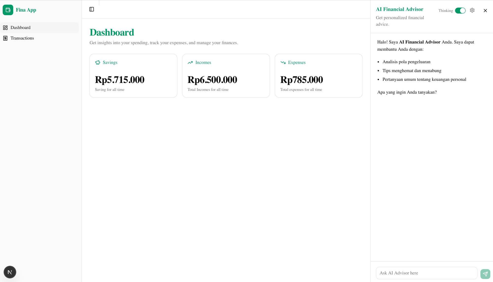

# Section 4 — Switching Thinking Mode

> Bagian dari **[Module 04 — Latihan](./latihan.md)**. Lanjutan dari **[Section 3](./latihan-3-thinking.md)**.

> Latihan untuk memberi user kontrol mengaktifkan / menonaktifkan extended thinking dan memilih budget effort. Empat prompt siap copy-paste.
>
> **Estimasi Section 4**: 30–40 menit.

## Prasyarat Section 4

- [ ] Section 1–3 selesai (+ Latihan UI Module 03). Extended thinking aktif default; thinking block tampil di UI.
- [ ] Anda sudah membaca bagian Section 4 di `materi.md`.

---

## 📚 Referensi Dokumentasi

Section ini membangun **toggle thinking** + **branching model** (Haiku ↔ Opus). Referensi yang relevan:

- **[Extended Thinking](https://docs.claude.com/en/docs/build-with-claude/extended-thinking)** — overview + `output_config.effort` levels (`"low"` / `"medium"` / `"high"` / `"xhigh"` / `"max"`).
- **[Models overview](https://docs.claude.com/en/docs/about-claude/models/overview)** — perbandingan Haiku 4.5 vs Opus 4.7: kecepatan, kemampuan, harga.
- **[Pricing](https://docs.claude.com/en/docs/about-claude/pricing)** — biaya per 1M input/output token (relevan saat user toggle on thinking — biaya naik signifikan).
- **[Conditional API parameters](https://docs.claude.com/en/api/messages)** — pola spread `...(condition && { param })` umum dipakai untuk feature flags.

---

## Prompt 1 — Tambah State Thinking di ChatContext

### Walkthrough Manual (sebelum pakai prompt)

State global di context supaya header (toggle UI) dan handler kirim bisa baca yang sama. Pola sama dengan `isOpen` dari Latihan UI Module 03.

📂 **File yang diubah**: `src/components/chat/chat-context.tsx` (modifikasi)

**1. Update tipe `ChatContextValue`**

📍 Lokasi: **di bagian `type ChatContextValue = { ... }`**.

```tsx
// src/components/chat/chat-context.tsx — tipe
type ThinkingBudget = "low" | "medium" | "high" | "xhigh" | "max";

type ChatContextValue = {
  isOpen: boolean;
  open: () => void;
  close: () => void;
  // ↓ BARU
  thinkingEnabled: boolean;
  setThinkingEnabled: (v: boolean) => void;
  thinkingBudget: ThinkingBudget;
  setThinkingBudget: (v: ThinkingBudget) => void;
};
```

**2. Tambah state + setter di Provider**

📍 Lokasi: **di dalam `ChatProvider`**, bersama `useState` untuk `isOpen`.

```tsx
// src/components/chat/chat-context.tsx — di dalam ChatProvider
const [thinkingEnabled, setThinkingEnabled] = useState<boolean>(false);   // ← default OFF (hemat biaya, respons cepat)
const [thinkingBudget, setThinkingBudget] = useState<ThinkingBudget>("medium"); // ← default medium saat user aktifkan
```

> 💡 **Mengapa default OFF?** User pertama kali membuka chatbot tidak perlu menunggu 10–20 detik untuk respons sederhana. Biarkan mereka secara sadar mengaktifkan thinking saat butuh analisis mendalam — ini juga hemat biaya secara signifikan.

**3. Expose lewat `value` provider**

📍 Lokasi: **di `<ChatContext.Provider value={...}>`**.

```tsx
// src/components/chat/chat-context.tsx — value
<ChatContext.Provider value={{
  isOpen, open, close,
  thinkingEnabled, setThinkingEnabled,
  thinkingBudget, setThinkingBudget,
}}>
```

### Yang TIDAK perlu

- ❌ Persist ke localStorage (cukup state in-memory).
- ❌ Reducer / useReducer — useState cukup untuk 2 nilai.
- ❌ Export mapping budget→token dari context (itu di Prompt 3 di server action).
- ❌ Mengubah `isOpen` / `open` / `close` yang sudah ada.

### Verifikasi setelah file diubah

1. Build/dev compile tanpa error TypeScript.
2. Buka React DevTools → cari `ChatProvider` → state `thinkingEnabled: false`, `thinkingBudget: "medium"` terlihat.
3. Belum ada perubahan visual.

---

<details>
<summary><strong>Salin prompt berikut, paste ke Claude Code</strong></summary>

```
Tambahkan state thinking config di ChatContext yang sudah ada.

GOAL:
- Modifikasi src/components/chat/chat-context.tsx (atau file
  context yang dibuat di Latihan UI Module 03).
- Tambah state baru:
  - thinkingEnabled: boolean (default: false)
  - thinkingBudget: "low" | "medium" | "high" (default: "medium")
- Ekspos setter: setThinkingEnabled, setThinkingBudget.
- Update tipe ChatContextValue.

CONTEXT:
- Mapping budget ke parameter `output_config.effort`
  (dipakai di prompt berikutnya):
  low    → effort: "low"
  medium → effort: "medium"
  high   → effort: "high"
  xhigh  → effort: "xhigh"
  max    → effort: "max"
- Default thinkingEnabled = false & thinkingBudget = "medium"
  agar chatbot cepat saat pertama dibuka. User aktifkan
  secara sadar saat butuh analisis mendalam.

GUARDRAIL:
- Pertahankan state isOpen dan toggleOpen dari Latihan UI Module 03.
- JANGAN tambah konstanta mapping token — nilai
  thinkingBudget dipakai langsung sebagai `output_config.effort`
  di Prompt 3.
- Tambah JSDoc singkat di tipe baru.
- Buat type alias ThinkingBudget = "low" | "medium" | "high"
  | "xhigh" | "max" untuk konsistensi (dipakai di context
  dan di signature askAdvisor).
```

</details>

**Verifikasi:**

1. Buka React DevTools → cari ChatProvider → state baru terlihat: `thinkingEnabled: false`, `thinkingBudget: "medium"`.
2. Belum ada perubahan visual (UI control di Prompt 2).

---

## Prompt 2 — Toggle UI di Header Chatbot

### Walkthrough Manual (sebelum pakai prompt)

UI kontrol di header: Switch (toggle thinking) + DropdownMenu (pilih budget). Bound langsung ke state context.

📂 **File yang diubah**: `src/components/chat/ai-chat-panel.tsx` (modifikasi)

**1. Install Switch (kalau belum)**

```bash
npx shadcn@latest add switch
```

**2. Import komponen + ikon + hook context**

📍 Lokasi: **bagian import**.

```tsx
// src/components/chat/ai-chat-panel.tsx — import
import { Settings } from "lucide-react";
import { Switch } from "@/components/ui/switch";
import {
  DropdownMenu,
  DropdownMenuContent,
  DropdownMenuRadioGroup,
  DropdownMenuRadioItem,
  DropdownMenuTrigger,
} from "@/components/ui/dropdown-menu";
```

**3. Baca state thinking dari context**

📍 Lokasi: **di dalam function `AIChatPanel`**, ganti destructure `useChatPanel()` jadi mencakup state baru.

```tsx
// src/components/chat/ai-chat-panel.tsx — di dalam component
const {
  isOpen, close,
  thinkingEnabled, setThinkingEnabled,
  thinkingBudget, setThinkingBudget,
} = useChatPanel();
```

**4. Render Switch + DropdownMenu di header**

📍 Lokasi: **di JSX header `<header>`**, di sebelah kiri tombol close `X`.

```tsx
// src/components/chat/ai-chat-panel.tsx — di header
<div className="flex items-center gap-2">
  <label className="flex items-center gap-1.5 text-xs">
    <span className="sr-only sm:not-sr-only">Thinking</span>
    <Switch
      checked={thinkingEnabled}
      onCheckedChange={setThinkingEnabled}
    />
  </label>

  {thinkingEnabled && (
    <DropdownMenu>
      <DropdownMenuTrigger className="rounded p-1 hover:bg-muted">
        <Settings className="h-4 w-4" />
      </DropdownMenuTrigger>
      <DropdownMenuContent>
        <DropdownMenuRadioGroup
          value={thinkingBudget}
          onValueChange={(v) => setThinkingBudget(v as ThinkingBudget)}
        >
          <DropdownMenuRadioItem value="low">Low</DropdownMenuRadioItem>
          <DropdownMenuRadioItem value="medium">Medium</DropdownMenuRadioItem>
          <DropdownMenuRadioItem value="high">High</DropdownMenuRadioItem>
          <DropdownMenuRadioItem value="xhigh">X-High</DropdownMenuRadioItem>
          <DropdownMenuRadioItem value="max">Max (recommended)</DropdownMenuRadioItem>
        </DropdownMenuRadioGroup>
      </DropdownMenuContent>
    </DropdownMenu>
  )}

  <Button onClick={close} size="icon" variant="ghost">
    <X className="h-4 w-4" />
  </Button>
</div>
```

### Yang TIDAK perlu

- ❌ Persist preference ke storage.
- ❌ Animasi expand/collapse settings — biar muncul/hilang saja.
- ❌ Label di mobile — pakai `sr-only`.
- ❌ Mengubah handler kirim (itu Prompt 3).

### Verifikasi setelah file diubah

1. Reload, panel chatbot terbuka.
2. Switch "Thinking" tampil di header. Klik → state berubah, ikon Settings muncul.
3. Klik Settings → menu Low/Medium/High muncul; pilih satu → `thinkingBudget` berubah di DevTools.
4. Judul "AI Financial Advisor" tidak shift.

---

<details>
<summary><strong>Salin prompt berikut, paste ke Claude Code</strong></summary>

```
Tambahkan tombol toggle thinking dan pemilih budget di header
chatbot.

GOAL:
- Di header AIChatPanel, tambahkan dua kontrol baru di kiri
  tombol close:
  1. Switch (Shadcn Switch component) berlabel "Thinking" —
     bound ke thinkingEnabled di context.
  2. Saat thinkingEnabled = true, tampilkan DropdownMenu
     dengan trigger ikon Settings (lucide-react).
     - Item menu: 3 radio button untuk budget (Low / Medium / High).
     - Bound ke thinkingBudget di context.

- Tata letak: <div className="flex items-center gap-2"> dengan
  switch, settings (kalau aktif), separator, close button.

CONTEXT:
- Pakai Switch dari Shadcn (apabila belum: npx shadcn@latest
  add switch).
- Pakai DropdownMenu yang sudah ter-install.
- Gunakan useChatContext hook untuk akses state.

GUARDRAIL:
- Switch dan settings TIDAK boleh shift judul "AI Financial
  Advisor" — gunakan ukuran kecil dan posisinya konsisten.
- Saat thinking dimatikan, settings hilang dengan smooth.
- Label "Thinking" boleh disembunyikan di mobile (sr-only).
```

</details>

**Verifikasi:**

1. Header chatbot kini memiliki switch "Thinking" + (saat aktif) ikon gear ⚙️ + tombol close ✕.
2. Klik switch → switch berubah state, tombol gear muncul/hilang.
3. Klik gear → menu Low / Medium / High / X-High / Max muncul. Pilih satu → state thinkingBudget berubah.

**Contoh tampilan setelah Prompt 2 selesai:**



Header panel chatbot sekarang menampilkan label "Thinking" + Switch (aktif/hijau) + ikon gear ⚙️ (untuk pilih budget) + tombol close ✕ — semuanya rapi di kanan, tidak menggeser judul "AI Financial Advisor".

---

## Prompt 3 — Pass Thinking Config ke Server Action

### Walkthrough Manual (sebelum pakai prompt)

Connect UI toggle ke API. `askAdvisor` jadi punya `opts` parameter dan branching: Haiku tanpa thinking vs Opus dengan thinking + budget.

📂 **File yang diubah**: `src/features/advisor.ts` + `src/components/chat/ai-chat-panel.tsx`

**1. Update signature + branching di `askAdvisor`**

📍 Lokasi: **`src/features/advisor.ts`**, signature function + body.

```ts
// src/features/advisor.ts
import type { ThinkingBudget } from "@/components/chat/chat-context"; // atau pindahkan ke shared types

export async function askAdvisor(
  message: string,
  opts?: { thinking?: boolean; budget?: ThinkingBudget }
): Promise<{ text: string; thinking: string | null }> {
  if (!message.trim()) throw new Error("Pesan tidak boleh kosong");

  const useThinking = opts?.thinking === true;
  const effort = opts?.budget ?? "medium";                           // ← default medium saat user aktifkan thinking

  const response = await client.messages.create({
    model: useThinking ? "claude-opus-4-7" : "claude-haiku-4-5",
    max_tokens: useThinking ? 4096 : 1024,
    temperature: useThinking ? 1 : 0.5,                              // ← thinking aktif wajib 1
    ...(useThinking && {
      thinking: { type: "adaptive" as const, display: "summarized" as const },
      output_config: { effort },
    }),
    messages: [{ role: "user", content: INSTRUCTION_PREFIX + message }],
  });

  let text = "";
  let thinking: string | null = null;
  for (const block of response.content) {
    if (block.type === "thinking") thinking = block.thinking;
    if (block.type === "text") text = block.text;
  }
  if (!text) throw new Error("Respons tidak berisi teks");
  return { text, thinking };
}
```

**2. Pass opts dari client ke server action**

📍 Lokasi: **`src/components/chat/ai-chat-panel.tsx`**, di dalam handler kirim.

```tsx
// src/components/chat/ai-chat-panel.tsx — di dalam handler
const { text, thinking } = await askAdvisor(text, {
  thinking: thinkingEnabled,
  budget: thinkingBudget,
});
```

**3. Conditional indikator typing**

📍 Lokasi: **di JSX body messages**, `{isWaiting && ...}` block. Branching pesan berdasarkan `thinkingEnabled`.

```tsx
// src/components/chat/ai-chat-panel.tsx — di JSX body
{isWaiting && (thinkingEnabled ? (
  <div className="flex flex-col gap-1">
    <div className="flex items-center gap-2 text-sm text-muted-foreground">
      <Brain className="h-4 w-4 animate-pulse" />
      <span>🧠 Sedang menganalisis...</span>
    </div>
    <p className="ml-6 text-xs text-muted-foreground/80">
      Mode thinking aktif — respons mungkin butuh 10-20 detik.
    </p>
  </div>
) : (
  <div className="flex items-center gap-2 text-sm text-muted-foreground">
    <Loader2 className="h-4 w-4 animate-spin" />
    AI sedang mengetik...
  </div>
))}
```

### Yang TIDAK perlu

- ❌ Hardcode model di luar branching.
- ❌ Mengirim `thinking: { type: "disabled" }` — cukup omit parameter saat off.
- ❌ Mengubah `INSTRUCTION_PREFIX`, `temperature`, atau validasi kosong dari Section 2.
- ❌ Parameter `system` (Module 04 belum pakai).

### Verifikasi setelah file diubah

1. Switch off → kirim pertanyaan → respons cepat (~3 detik), tidak ada box thinking, indikator "AI sedang mengetik...".
2. Switch on, budget Medium → respons lebih lama (~10 detik) dengan box "Proses berpikir", indikator "Sedang menganalisis...".
3. Ganti ke High → respons lebih dalam/panjang.
4. Switch off lagi → kembali ke Haiku, cepat.

---

<details>
<summary><strong>Salin prompt berikut, paste ke Claude Code</strong></summary>

```
Sekarang sambungkan toggle dari UI ke server action agar
benar-benar mempengaruhi panggilan API.

GOAL:
- Modifikasi signature askAdvisor di src/features/advisor.ts:
  askAdvisor(message: string, opts?: {
    thinking?: boolean;
    budget?: "low" | "medium" | "high" | "xhigh" | "max";
  })

- Di dalam askAdvisor:
  - Apabila opts.thinking !== true: panggil API TANPA
    parameter thinking, dan gunakan model "claude-haiku-4-5"
    (hemat).
  - Apabila opts.thinking === true: gunakan model
    "claude-opus-4-7" + parameter:
      thinking: { type: "adaptive", display: "summarized" }
      output_config: { effort: opts.budget ?? "max" }
- Return type tetap { text: string; thinking: string | null }.
  Saat thinking = false, thinking field selalu null.

- Modifikasi handler di AIChatPanel:
  - Baca thinkingEnabled & thinkingBudget dari useChatContext.
  - Pass sebagai opts saat memanggil askAdvisor.

CONTEXT:
- File: src/features/advisor.ts dan
  src/components/chat/ai-chat-panel.tsx.
- max_tokens: 1024 saat thinking off, 4096+ saat on.

GUARDRAIL:
- JANGAN hardcode model di luar branching. Setiap mode pakai
  model yang sesuai.
- Pertahankan validasi kosong, prompt prefixing, parameter
  temperature, dan error handling dari section sebelumnya.
- JANGAN tambah parameter system — Module 04 belum pakai.
- Indikator "Sedang menganalisis" dari Section 3 hanya
  tampil saat thinkingEnabled = true. Saat off, kembalikan
  ke "AI sedang mengetik..." dari Section 1.
```

</details>

**Verifikasi:**

1. Switch off → kirim pertanyaan → respons CEPAT (~3 detik) tanpa box thinking. Indikator "sedang mengetik...".
2. Switch on, budget medium → respons LEBIH LAMBAT (~10 detik) dengan box "Proses berpikir". Indikator "sedang menganalisis...".
3. Ganti budget ke high → respons lebih panjang & dalam, thinking lebih luas.
4. Switch off lagi → kembali ke mode cepat tanpa thinking.

---

## Prompt 4 — Indikator Konfigurasi Saat ini di Header

### Walkthrough Manual (sebelum pakai prompt)

Indikator kecil di header yang menampilkan mode aktif — supaya user tidak perlu klik dropdown untuk tahu konfigurasi sekarang.

📂 **File yang diubah**: `src/components/chat/ai-chat-panel.tsx` (modifikasi)

**1. Render baris indikator di bawah subtitle**

📍 Lokasi: **di JSX header**, di bawah `<h2>` / subtitle "Get personalized financial advice."

```tsx
// src/components/chat/ai-chat-panel.tsx — di header, di bawah subtitle
const BUDGET_LABEL: Record<ThinkingBudget, string> = {
  low: "Low",
  medium: "Medium",
  high: "High",
  xhigh: "X-High",
  max: "Max",
};

<p className="text-xs text-muted-foreground">
  {thinkingEnabled
    ? `🧠 Mode: thinking · budget ${BUDGET_LABEL[thinkingBudget]}`
    : "💡 Mode: cepat (Haiku)"}
</p>
```

### Yang TIDAK perlu

- ❌ Tooltip / popover penjelasan budget — cukup label simpel.
- ❌ Jargon teknis (mis. "effort=medium").
- ❌ Refactor header layout.
- ❌ Animasi transisi antar mode.

### Verifikasi setelah file diubah

1. Toggle off → indikator: "💡 Mode: cepat (Haiku)".
2. Toggle on, budget Low → "🧠 Mode: thinking · budget Low".
3. Ganti budget → indikator update real-time.
4. Ukuran teks kecil, tidak menggangu judul.

---

<details>
<summary><strong>Salin prompt berikut, paste ke Claude Code</strong></summary>

```
Tambahkan indikator visual kecil di header agar user paham
konfigurasi current.

GOAL:
- Di bawah subtitle "Get personalized financial advice.",
  tambahkan satu baris keterangan kecil tentang mode aktif:

  Saat thinkingEnabled = false:
  "💡 Mode: cepat (Haiku)"

  Saat thinkingEnabled = true:
  "🧠 Mode: thinking · budget {budget}"

  (Pakai label rapi: Low / Medium / High / X-High / Max —
   bukan langsung print thinkingBudget yang lowercase.)

CONTEXT:
- File: ai-chat-panel.tsx.
- Style: text-xs text-muted-foreground, padding minimal.

GUARDRAIL:
- Indikator tidak boleh berukuran besar — fungsinya hint, bukan
  call-to-action.
- JANGAN tambah jargon teknis di indikator (mis. "effort=medium")
  — gunakan kata yang dipahami user awam.
```

</details>

**Verifikasi:**

1. Toggle off → indikator: "💡 Mode: cepat (Haiku)".
2. Toggle on, budget Low → "🧠 Mode: thinking · budget Low".
3. Ganti budget → indikator update real-time.

---

## Validasi Akhir Section 4

- [ ] State thinkingEnabled & thinkingBudget ada di ChatContext.
- [ ] Switch + dropdown setting tampil di header chatbot.
- [ ] Server action menggunakan model & parameter berbeda berdasarkan toggle.
- [ ] Respons benar-benar lebih cepat saat thinking off.
- [ ] Indikator mode aktif tampil di header.
- [ ] Tidak ada regresi dari Section 1–3 (+ Latihan UI Module 03).

## Refleksi Section 4

1. Default OFF dengan budget `medium` saat diaktifkan — apakah ini pilihan yang Anda setujui? Kapan Anda akan mengubah default menjadi ON?
2. Apakah user awam paham perbedaan budget low / medium / high / xhigh / max? Cara menjelaskannya?
3. Pertanyaan tipe apa yang paling sering Anda toggle thinking off (karena tidak perlu reasoning)?
4. Apakah perbedaan kualitas jawaban antara `low` vs `max` terasa signifikan? Cukup besar untuk membenarkan latensi extra?
5. Apakah Anda akan expose semua 5 budget level ke user, atau cukup 3 (Low/Medium/Max)?

---

⬅️ Kembali: **[Section 3](./latihan-3-thinking.md)** · ➡️ Lanjut: **[Section 5 — Streaming Process](./latihan-5-streaming.md)**
