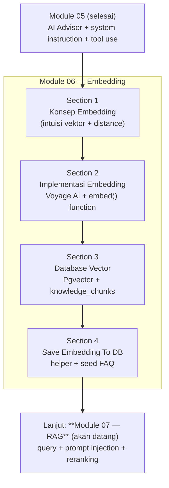
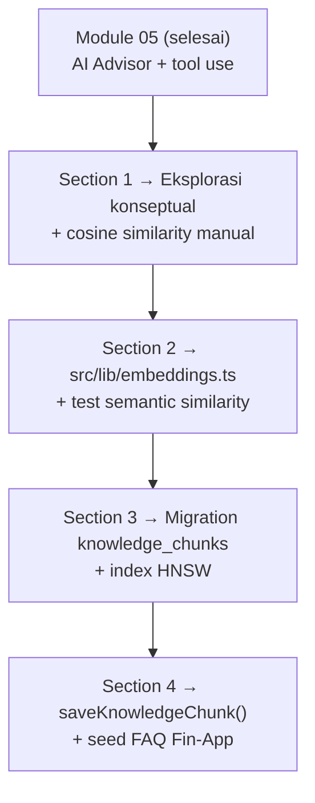
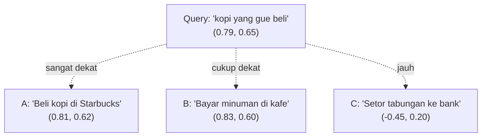
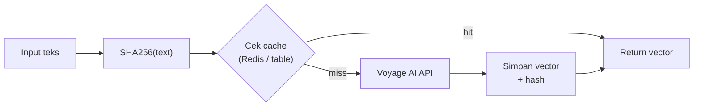
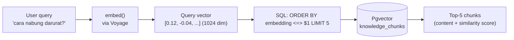
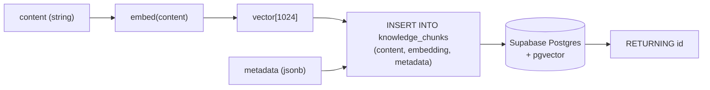

# Module 06 — Embedding

> **Tujuan modul**: Anda memahami fondasi **RAG** — bagaimana teks diubah menjadi **vektor** (embedding), bagaimana vektor disimpan di **vector database**, dan bagaimana data tersebut menjadi dasar pencarian semantik yang akan dipakai AI Financial Advisor di Fin-App.
>
> **Output akhir modul (iterasi awal)**: pipeline siap pakai — function `embed()`, table `knowledge_chunks` di Supabase pgvector, dan FAQ keuangan personal yang sudah ter-embed dan tersimpan, siap di-query di iterasi berikutnya.

---

## Peta Visual Module 06

Berikut gambaran arsitektur RAG yang Anda bangun di atas hasil Module 05:



Setiap section adalah peningkatan fondasi — bukan fitur UI baru, melainkan **kapabilitas data** baru yang nantinya akan diintegrasikan ke chatbot AI Advisor.

## Prinsip Kontinuitas Antar Section

Sama dengan Module 04 & 05, kode dari section sebelumnya **terus berlanjut** dan diperluas — tidak ditulis ulang:



Pada akhir Module 06 (iterasi awal), Fin-App Anda memiliki **basis pengetahuan ter-embed** yang siap dipakai untuk pencarian semantik di iterasi RAG selanjutnya.

---

# Section 1 — Konsep Embedding

**Tujuan section**: memahami konsep embedding — bagaimana teks diubah menjadi vektor numerik yang dapat dibandingkan secara semantik.

## Apa itu Embedding?

**Embedding** adalah fungsi yang memetakan input (teks, gambar, audio) ke sebuah **vektor angka berdimensi tinggi**. Untuk teks, embedding model dilatih sedemikian rupa sehingga **kalimat dengan makna mirip menghasilkan vektor yang berdekatan** di ruang vektor tersebut.

Anggap saja seperti **koordinat semantik**. Apabila Anda punya peta dunia dua dimensi (latitude, longitude), kota-kota yang berdekatan secara geografis akan punya koordinat yang mirip. Embedding melakukan hal serupa, tetapi:

- **Bukan 2 dimensi**, melainkan **ratusan hingga ribuan dimensi** (Voyage `voyage-3` = 1024 dim, OpenAI `text-embedding-3-large` = 3072 dim).
- **Bukan posisi geografis**, melainkan **posisi makna**.

**Karakteristik penting:**

| Properti | Penjelasan |
|---|---|
| **Deterministik** | Input teks yang sama → vektor yang sama (untuk model yang sama). |
| **Padat (dense)** | Hampir semua elemen vektor non-zero — berbeda dengan TF-IDF / bag-of-words. |
| **Tidak interpretable** | Anda tidak bisa membaca arti satu dimensi spesifik — yang bermakna adalah **arah** dan **jarak** antar vektor. |
| **Model-spesifik** | Vektor dari Voyage TIDAK kompatibel dengan vektor dari OpenAI. Jangan campur. |

## Intuisi: "Beli kopi" vs "Bayar minuman di kafe"

Bayangkan tiga teks transaksi di Fin-App:

- A: `"Beli kopi di Starbucks"`
- B: `"Bayar minuman di kafe"`
- C: `"Setor tabungan ke bank"`

Secara **keyword matching** (LIKE `%kopi%`), A dan B tidak match — beda kata. Tetapi secara **makna**, A dan B nyaris identik, sementara C berbeda jauh.

Embedding menangkap hubungan ini. Kalau Anda embed ketiganya dan visualisasikan (disederhanakan ke 2D), hasilnya kira-kira:



Query natural language `"kopi yang gue beli minggu lalu"` akan **dekat** dengan A dan B, **jauh** dari C — tanpa perlu keyword matching eksplisit. Ini adalah **pencarian semantik**, fondasi RAG.

## Distance Metrics

Bagaimana cara mengukur "dekat" antar vektor? Ada tiga metrik utama:

| Metrik | Rumus singkat | Range | Karakter | Pakai kapan? |
|---|---|---|---|---|
| **Cosine similarity** | `dot(a,b) / (|a| · |b|)` | -1 s.d. 1 | Mengukur **arah**, bukan magnitude. Default RAG. | Embedding teks (paling umum). |
| **Dot product** | `dot(a,b)` | tidak terbatas | Lebih cepat. Sensitif terhadap magnitude. | Apabila vektor sudah dinormalisasi. |
| **L2 (Euclidean)** | `sqrt(sum((a-b)²))` | 0 s.d. ∞ | Jarak geometris. | Embedding gambar, atau kasus khusus. |

**Default praktis di RAG teks**: **cosine similarity**. Voyage dan OpenAI menormalisasi output mereka ke unit vector, jadi cosine = dot product untuk embedding mereka — sama-sama valid.

> 📌 Cosine similarity `1.0` = identik, `0.0` = ortogonal (tidak related), `-1.0` = berlawanan. Dalam praktek RAG teks, hampir tidak ada nilai negatif — biasanya `0.3` sudah dianggap "tidak related", `0.7+` dianggap "sangat mirip".

## Dimensi Vektor (Trade-off)

Dimensi vektor menentukan **kapasitas representasi** vs **biaya storage & compute**:

| Dimensi | Contoh model | Storage per row | Kualitas | Biaya |
|---|---|---|---|---|
| 384 | `all-MiniLM-L6-v2` (HF) | ~1.5 KB | Cukup untuk task sederhana | Sangat murah |
| 768 | `bge-base`, `e5-base` | ~3 KB | Baseline production | Murah |
| **1024** | **`voyage-3`** | **~4 KB** | **Sangat baik (rekomendasi Anthropic)** | **Sedang** |
| 1536 | OpenAI `text-embedding-3-small` | ~6 KB | Baik | Sedang |
| 3072 | OpenAI `text-embedding-3-large` | ~12 KB | Terbaik untuk task kompleks | Mahal |

**Trade-off konkret**: di 10.000 row, perbedaan 1024 vs 3072 dim = ~80 MB extra storage + query lebih lambat. Untuk Fin-App, **1024 dim** adalah sweet spot.

## Use Case di Fin-App

Embedding membuka beberapa fitur yang sulit/mustahil dengan SQL biasa:

1. **Search transaksi via natural language**
   - User: `"kopi yang gue beli minggu lalu di mall"`
   - Sistem: embed query → match dengan embedding `description` setiap transaksi → return top 5.
2. **FAQ knowledge base**
   - User tanya `"gimana cara mulai nabung darurat?"` ke AI Advisor.
   - Sistem: cari chunk FAQ terdekat (mis. "Apa itu emergency fund?") → inject ke prompt Claude sebagai konteks.
3. **Auto-categorize transaction**
   - User input deskripsi tanpa pilih kategori.
   - Sistem: embed deskripsi → cari embedding kategori terdekat ("Food", "Transport", "Entertainment") → suggest kategori.
4. **Deteksi duplikat / similar expense**
   - "Sepertinya transaksi ini mirip dengan 'Bayar listrik' yang sudah kamu input kemarin — yakin mau lanjut?"

Section 1 fokus pada **konsep**. Implementasi dimulai di Section 2.

Lanjutkan ke `latihan.md` Section 1 untuk eksekusi.

---

# Section 2 — Implementasi Embedding

**Tujuan section**: setup provider embedding dan bangun function `embed()` reusable di project Fin-App.

## Pilihan Provider

Ada tiga jalur utama untuk mendapatkan embedding teks:

| Provider | Model unggulan | Dimensi | Karakter | Harga (USD/1M token) |
|---|---|---|---|---|
| **Voyage AI** | `voyage-3` | 1024 | Rekomendasi resmi Anthropic, kualitas tinggi, ramah harga | ~$0.06 |
| OpenAI | `text-embedding-3-small` | 1536 | Familiar untuk developer | ~$0.02 |
| OpenAI | `text-embedding-3-large` | 3072 | Akurasi tertinggi, mahal | ~$0.13 |
| Hugging Face (self-host) | `bge-base`, `e5-base` | 768 | Gratis tapi infra sendiri | Gratis (+ infra) |

**Untuk modul ini kami pakai Voyage AI (`voyage-3`)** karena:

- Direkomendasikan langsung oleh Anthropic untuk pipeline RAG dengan Claude.
- Kualitas semantik teks Indonesia cukup baik di benchmark internal.
- Harga kompetitif dan SDK Node mudah dipakai.

## Setup Voyage AI

1. Daftar di [voyageai.com](https://www.voyageai.com/) → ambil API key.
2. Install SDK:
   ```bash
   npm install voyageai
   ```
3. Tambah ke `.env.local`:
   ```
   VOYAGE_API_KEY=pa-xxxxxxxxxxxxxxxxxxxxxxxx
   ```
4. Tambahkan placeholder ke `.env.example` (tanpa nilai asli).

## Function `embed()`

Buat file `src/lib/embeddings.ts` (server-only) dengan dua function:

```ts
import "server-only";
import { VoyageAIClient } from "voyageai";

const client = new VoyageAIClient({
  apiKey: process.env.VOYAGE_API_KEY!,
});

const MODEL = "voyage-3";

export async function embed(text: string): Promise<number[]> {
  const res = await client.embed({
    input: [text],
    model: MODEL,
  });
  return res.data![0].embedding!;
}

export async function embedBatch(texts: string[]): Promise<number[][]> {
  const res = await client.embed({
    input: texts,
    model: MODEL,
  });
  return res.data!.map((d) => d.embedding!);
}
```

Karakter penting:

- `"server-only"` — pastikan API key tidak bocor ke client bundle.
- **Batch version** untuk efisiensi — sekali request bisa embed banyak teks (cek limit provider, biasanya 128–1000 per batch).
- Return `number[]` agar mudah disisipkan ke SQL pgvector (cast `vector(1024)`).

## Strategi Caching

**Jangan embed string yang sama dua kali.** Embedding bersifat deterministik — hasil identik untuk input identik. Caching jadi hemat besar:



**Implementasi sederhana** (cukup untuk Fin-App skala kecil): in-memory `Map<hash, vector>` di sisi server, atau table `embedding_cache (hash TEXT PRIMARY KEY, vector vector(1024))` di Supabase. Mulai sederhana, optimalkan nanti.

## Cost & Rate Limit

| Metrik | Voyage `voyage-3` (approx) |
|---|---|
| Harga | ~$0.06 per 1M token input |
| Rate limit | ~300 RPM (free tier), lebih tinggi di paid |
| Max input per request | 1000 dokumen, 120K token total |

Untuk Fin-App skala personal, biaya embedding akan **sangat kecil** (biasanya < $1/bulan kalau hanya FAQ + transaksi user).

Lanjutkan ke `latihan.md` Section 2 untuk eksekusi.

---

# Section 3 — Database Vector

**Tujuan section**: memahami apa itu vector database, lalu memilih dan setup **pgvector** sebagai backend Fin-App.

## Apa itu Vector Database?

Vector database adalah database yang **mengoptimalkan penyimpanan dan query vektor berdimensi tinggi**. Kemampuan utama:

1. **Storage** — simpan vektor ribuan dimensi dengan efisien.
2. **Similarity search** — cari top-K vektor terdekat dengan query vector, dalam latensi sub-detik bahkan untuk jutaan row.
3. **Filter hybrid** — kombinasi similarity + filter SQL biasa (mis. "FAQ terkait budgeting yang dibuat setelah 2025").

Tanpa indexing khusus, query similarity bersifat O(n) — harus bandingkan query ke setiap row. Vector DB pakai struktur indeks khusus (HNSW, IVFFlat) untuk membuatnya **approximate nearest neighbor** dalam O(log n).

## Pilihan Populer

| Database | Tipe | Karakter | Pakai kapan? |
|---|---|---|---|
| **Pgvector** | Postgres extension | Hybrid (vector + relational), open source | Sudah pakai Postgres / Supabase |
| Pinecone | Managed (cloud) | Mudah, mahal, scale tinggi | Production scale, butuh ops minimal |
| Weaviate | Self-host / cloud | Schema fleksibel, built-in modules | Use case kompleks (multi-modal) |
| Qdrant | Self-host / cloud | Performa tinggi, Rust | Latency-sensitive |

**Untuk Fin-App kami pakai Pgvector** karena:

- Sudah **enabled** di Supabase sejak Module 01 (cek migration awal).
- Hybrid query — bisa join dengan table `transactions` / `users` Anda yang sudah ada, tanpa data duplication.
- Tidak menambah service baru — satu Postgres untuk semuanya.

## Schema Dasar

Berikut schema yang akan dipakai untuk knowledge base Fin-App:

```sql
CREATE TABLE knowledge_chunks (
  id          UUID PRIMARY KEY DEFAULT gen_random_uuid(),
  content     TEXT NOT NULL,
  embedding   vector(1024) NOT NULL,    -- voyage-3 = 1024 dim
  metadata    JSONB DEFAULT '{}'::jsonb, -- {source, category, tags, ...}
  created_at  TIMESTAMPTZ DEFAULT now()
);
```

Kolom `embedding` bertipe `vector(N)` — N harus **konsisten** dengan dimensi model yang Anda pakai (1024 untuk voyage-3).

## Distance Operators di Pgvector

Pgvector menyediakan tiga operator distance:

| Operator | Metrik | Order | Catatan |
|---|---|---|---|
| `<=>` | Cosine distance (`1 - cosine_similarity`) | ASC = paling mirip | **Default untuk teks**. |
| `<->` | L2 (Euclidean) distance | ASC = paling dekat | Untuk embedding non-teks. |
| `<#>` | Negative inner product | ASC = paling tinggi inner product | Cepat, tetapi butuh vektor ternormalisasi. |

Contoh query top-5 chunk yang paling mirip dengan query vector:

```sql
SELECT id, content, 1 - (embedding <=> $1) AS similarity
FROM knowledge_chunks
ORDER BY embedding <=> $1
LIMIT 5;
```

`$1` adalah query vector (hasil `embed(userQuery)`) yang dikirim sebagai parameter, biasanya berbentuk string `'[0.12, -0.04, ...]'::vector`.

## Indexing: HNSW vs IVFFlat

Untuk dataset > ~10K row, tambahkan index agar query cepat:

| Index | Karakter | Trade-off |
|---|---|---|
| **HNSW** (Hierarchical Navigable Small World) | Graph-based, akurasi tinggi, query cepat | Build slow, RAM lebih besar |
| IVFFlat | Cluster-based, lebih cepat build | Akurasi sedikit lebih rendah |

**Rekomendasi default Fin-App**: HNSW (akurasi lebih penting daripada build time untuk knowledge base statis).

```sql
CREATE INDEX ON knowledge_chunks
USING hnsw (embedding vector_cosine_ops);
```

Visualisasi alur query end-to-end:



Lanjutkan ke `latihan.md` Section 3 untuk eksekusi.

---

# Section 4 — Save Embedding To DB Vector

**Tujuan section**: bikin migration final + helper function untuk **menyimpan teks beserta embedding-nya** ke Supabase pgvector, lalu seed FAQ keuangan personal untuk Fin-App.

## Skema Final `knowledge_chunks`

Migration final yang akan dibuat (`supabase/migrations/0003_knowledge_chunks.sql`):

```sql
-- Pastikan extension aktif (idempotent)
CREATE EXTENSION IF NOT EXISTS vector;

CREATE TABLE IF NOT EXISTS knowledge_chunks (
  id          UUID PRIMARY KEY DEFAULT gen_random_uuid(),
  content     TEXT NOT NULL,
  embedding   vector(1024) NOT NULL,
  metadata    JSONB NOT NULL DEFAULT '{}'::jsonb,
  created_at  TIMESTAMPTZ NOT NULL DEFAULT now()
);

-- Index HNSW untuk cosine similarity (default RAG teks)
CREATE INDEX IF NOT EXISTS knowledge_chunks_embedding_idx
  ON knowledge_chunks
  USING hnsw (embedding vector_cosine_ops);

COMMENT ON TABLE knowledge_chunks IS
  'FAQ + knowledge base ter-embed untuk RAG di AI Financial Advisor.';
```

## Workflow Save

Alur saat menyimpan satu chunk:



## Helper Function di Server Action

Buat `src/features/knowledge.ts`:

```ts
"use server";

import { createServerSupabase } from "@/lib/supabase/server";
import { embed } from "@/lib/embeddings";

export async function saveKnowledgeChunk(params: {
  content: string;
  metadata?: Record<string, unknown>;
}): Promise<{ id: string }> {
  const { content, metadata = {} } = params;

  const embedding = await embed(content);

  const supabase = await createServerSupabase();
  const { data, error } = await supabase
    .from("knowledge_chunks")
    .insert({
      content,
      embedding,        // pgvector menerima number[] langsung
      metadata,
    })
    .select("id")
    .single();

  if (error) throw new Error(`Save chunk failed: ${error.message}`);
  return { id: data.id };
}
```

> 📌 Apabila helper Supabase server Anda berbeda (misalnya dari Module 01), sesuaikan import. Yang penting: function ini dipanggil dari server, bukan client.

## Seed Data untuk Fin-App

Set FAQ awal yang akan di-seed sebagai knowledge base AI Advisor:

1. `"Cara membuat budget bulanan: alokasikan 50% kebutuhan, 30% keinginan, 20% tabungan & investasi (aturan 50/30/20)."`
2. `"Apa itu emergency fund? Dana darurat sebesar 3–6 kali pengeluaran bulanan, disimpan di instrumen likuid (tabungan / reksadana pasar uang)."`
3. `"Tabungan vs investasi untuk pemula: tabungan untuk dana < 1 tahun, investasi (reksadana / obligasi) untuk > 3 tahun."`
4. `"Cara melacak pengeluaran harian: catat setiap transaksi di hari yang sama, kategorisasi sederhana (makanan, transport, hiburan)."`
5. `"Rasio utang sehat: total cicilan bulanan tidak melebihi 30% pendapatan bersih."`
6. `"Reksadana pasar uang cocok untuk: dana darurat dan tujuan jangka pendek (< 1 tahun), risiko sangat rendah."`
7. `"Tips menabung untuk DP rumah: tentukan target nominal, bagi dengan jumlah bulan, otomatisasi transfer ke rekening terpisah di tanggal gajian."`
8. `"Apa itu inflasi dan dampaknya: kenaikan harga umum yang menurunkan daya beli uang — itulah sebabnya menabung saja tidak cukup, perlu investasi."`
9. `"Cara mengevaluasi pengeluaran bulanan: review per kategori di akhir bulan, identifikasi kategori yang melebihi anggaran, sesuaikan untuk bulan berikutnya."`
10. `"Reksadana saham vs obligasi: saham lebih volatile dengan potensi return lebih tinggi (jangka > 5 tahun), obligasi lebih stabil (jangka 2–5 tahun)."`

Setiap entry akan disimpan dengan metadata `{ source: "seed", category: "personal-finance-faq" }` agar mudah difilter nantinya.

## Verifikasi

Setelah seed, jalankan query di Supabase SQL Editor untuk memastikan data tersimpan dengan benar:

```sql
SELECT
  id,
  content,
  vector_dims(embedding) AS dims,
  metadata
FROM knowledge_chunks;
```

Yang Anda harapkan lihat:

- `dims = 1024` di semua row.
- `content` sesuai input.
- `metadata` JSONB ter-set sesuai seed.
- Jumlah row = jumlah FAQ yang Anda seed (mis. 10).

Apabila salah satu kondisi tidak terpenuhi, debug sebelum lanjut ke iterasi RAG berikutnya — fondasi yang rusak akan menyulitkan section selanjutnya.

Lanjutkan ke `latihan.md` Section 4 untuk eksekusi.

---

## Recap

Pada akhir Module 06 iterasi awal, Anda telah membangun **fondasi data** untuk RAG di Fin-App:

- **Konsep embedding** dipahami — vektor sebagai koordinat semantik, cosine similarity sebagai default metrik, trade-off dimensi.
- **Function `embed()`** siap pakai dengan Voyage AI di `src/lib/embeddings.ts`, plus strategi caching dasar.
- **Table `knowledge_chunks`** dengan pgvector + index HNSW siap menerima query similarity.
- **Helper `saveKnowledgeChunk()`** + seed 10 FAQ keuangan personal sudah tersimpan dan terverifikasi.

Module 07 (RAG) menyusul: **query vector** dengan natural language user, **inject** hasil similarity ke prompt Claude (RAG end-to-end), dan **optimasi** dengan reranking. Tetapi tanpa fondasi yang Anda bangun di 4 section ini, RAG tidak mungkin jalan — jadi pastikan validasi setiap section sebelum lanjut.
