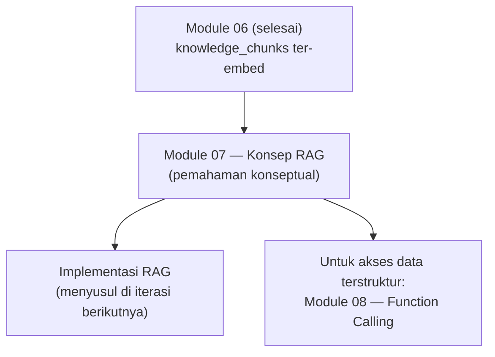
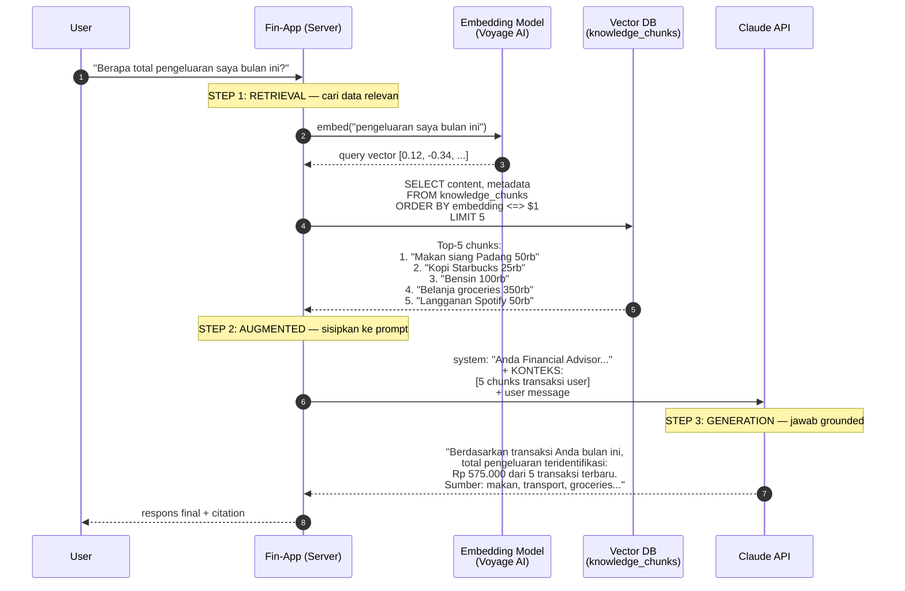

# Module 07 — RAG (Retrieval Augmented Generation)

> **Tujuan modul**: Anda memahami **konsep RAG** sebagai pola arsitektur untuk mengatasi halusinasi LLM — mulai dari masalah yang diselesaikan, analogi closed-book vs open-book, sampai alur kerja konkret.
>
> **Output modul**: pemahaman konseptual yang solid tentang kapan dan kenapa RAG dipakai. Implementasi teknis (retrieval, augmentation, chunking, reranking) adalah topik tersendiri untuk iterasi/module berikutnya.

---

## Peta Visual Module 07



Module 07 menempatkan **fondasi konseptual** sebelum Anda memilih path implementasi: RAG penuh (retrieval semantik untuk dokumen/FAQ) atau **function calling** (untuk query data terstruktur — dibahas di Module 08).

---

## Konsep RAG

Sebelum mulai eksekusi, pahami dulu **masalah** yang RAG selesaikan dan **cara kerjanya secara konseptual**. Tanpa intuisi yang kuat di sini, Anda akan terjebak menulis kode tanpa memahami trade-off-nya.

### Kelemahan Terbesar LLM: Halusinasi

Saat Anda mengembangkan aplikasi berbasis LLM seperti Claude, **musuh nomor satu** Anda adalah **halusinasi** — kondisi di mana model menghasilkan respons yang **terdengar meyakinkan tetapi salah**. Angka yang dikarang, fakta yang dibuat-buat, nama yang tidak pernah ada, kebijakan yang tidak pernah dibuat.

Ini bukan bug yang bisa diperbaiki dengan tambal-sulam — ini **kelemahan struktural** LLM yang harus Anda atasi di lapisan arsitektur aplikasi.

#### Penyebab Halusinasi

| Penyebab | Penjelasan |
|---|---|
| **Training cut-off date** | Model dilatih sampai tanggal tertentu (mis. Januari 2026). Apa pun setelah itu = tidak tahu. |
| **Tidak bisa baca data internal Anda** | Model tidak punya akses ke database Fin-App, file proprietary, atau dokumen perusahaan Anda. |
| **Model = text generator probabilistik** | LLM secara fundamental memprediksi token berikutnya. Saat tidak tahu, ia **mengisi gap dengan tebakan paling probable** — bukan bilang "tidak tahu". |
| **Tidak ada mekanisme self-verification** | Berbeda dengan database query yang bisa return "not found", LLM selalu generate sesuatu — bahkan ketika seharusnya stuck. |

**Contoh konkret di Fin-App**: User bertanya _"Berapa total pengeluaran saya bulan ini?"_. Tanpa akses ke data Anda, Claude bisa:

- **Mengarang angka**: _"Total pengeluaran Anda Rp 4.500.000."_ (acak, tidak berdasar)
- **Generic tidak berguna**: _"Rata-rata pengeluaran orang Indonesia adalah..."_
- **Mengabaikan konteks**: _"Mohon berikan data transaksi Anda dulu."_

Tidak ada yang benar — dan user tidak tahu mana yang halusinasi.

### Mengapa Halusinasi Sulit Diatasi Tanpa RAG

Pendekatan naif: **update training model setiap saat**. Masukkan data Fin-App ke training set, retrain Claude supaya tahu transaksi user.

Masalahnya:

1. **Anda tidak bisa retrain Claude.** Model dimiliki dan dilatih Anthropic. Fine-tuning pun terbatas dan mahal.
2. **Data Anda berubah konstan.** Setiap input transaksi user = data baru. Retrain model setiap perubahan = mustahil.
3. **Data internal seharusnya privat.** Memasukkan data user ke training = bocor ke semua user lain. Privacy disaster.
4. **Tidak skalabel.** Tiap perusahaan tidak bisa punya Claude versi sendiri yang tahu data internal mereka.

Jadi: **menambah pengetahuan model lewat training BUKAN solusi yang realistis**. Kita butuh cara lain untuk **memberi konteks yang relevan ke model saat runtime** — itulah RAG.

### Analogi: Ujian Closed Book vs Open Book

Bayangkan dua siswa ujian:

| Aspek | **Tanpa RAG (Closed Book)** | **Dengan RAG (Open Book)** |
|---|---|---|
| **Sumber jawaban** | Hanya dari ingatan (training) | Boleh buka buku/catatan (knowledge base) |
| **Akurasi detail spesifik** | Sering lupa angka, salah nama, mengarang | Tinggal cek di buku, akurat |
| **Pertanyaan di luar materi** | Sok tahu / halusinasi | Bisa bilang "tidak ada di buku ini" |
| **Update materi** | Harus belajar ulang dari awal | Tinggal tambah/ganti halaman buku |
| **Skala pengetahuan** | Otak terbatas | Buku bisa setebal apa pun |
| **Verifikasi** | Sulit (jawaban tanpa sumber) | Mudah (sumber dapat dirujuk) |

**Tanpa RAG**, Claude seperti siswa closed book — pengetahuannya beku di training cut-off, dan apa yang tidak ada di "kepala"-nya akan diisi tebakan.

**Dengan RAG**, Claude jadi siswa open book — sebelum menjawab, ia "buka catatan" Anda (knowledge base), baca yang relevan, baru menjawab berdasarkan apa yang ada di sana.

### Apa itu RAG?

**RAG (Retrieval Augmented Generation)** adalah pola arsitektur di mana LLM **diberi konteks** dari sumber data eksternal **sebelum** menjawab. Tiga komponen intinya, tercermin dari namanya:

1. **Retrieval** — cari potongan informasi paling relevan dari knowledge base (vector DB, dokumen, dll.)
2. **Augmented** — sisipkan informasi tersebut ke konteks prompt model
3. **Generation** — model menjawab pertanyaan user dengan **berlandaskan** informasi yang sudah disisipkan

Perhatikan: RAG **tidak mengubah model**. Ia hanya mengubah **konteks yang dikirim ke model** setiap query. Itulah mengapa pendekatan ini elegan dan praktis — Anda dapat update knowledge base kapan saja tanpa retrain apa pun.

### Alur Kerja RAG: Contoh "Pengeluaran Bulan Ini"

Mari telusuri alur konkret. Misalkan user di Fin-App bertanya: _"Berapa total pengeluaran saya bulan ini?"_



#### Anatomi Setiap Langkah

**STEP 1 — Retrieval**: pertanyaan user diubah jadi vektor numerik (embedding). Vektor ini dibandingkan dengan vektor chunks di database, ambil top-K yang paling **mirip secara semantik**. Bukan keyword matching — kata "pengeluaran" tidak harus muncul di chunk; selama chunk **bermakna mirip**, ia akan muncul di top-K.

**STEP 2 — Augmented**: chunks yang sudah diambil **disisipkan ke system prompt** sebelum dikirim ke Claude. Template-nya bisa sesederhana:

```
Anda Financial Advisor untuk Fin-App.

Konteks transaksi user yang relevan dengan pertanyaan:
{retrieved_chunks_di_sini}

JIKA konteks tidak cukup untuk menjawab pertanyaan,
katakan terus terang. JANGAN mengarang angka.
```

**STEP 3 — Generation**: Claude menerima system prompt + user message dan menyusun jawaban. Karena konteks sudah berisi data nyata, Claude tidak perlu menebak — jawaban-nya **grounded** di data Anda.

#### Empat Hal yang Membuat Ini Bekerja

1. **Knowledge base sudah berisi data Anda** (transaksi, FAQ, atau dokumen) — Anda menyiapkan ini di Module 06.
2. **Embedding** mengubah pertanyaan user jadi representasi yang bisa dibandingkan secara semantik.
3. **Vector DB** mencari chunks paling **mirip makna** dengan pertanyaan — bukan keyword exact match.
4. **System prompt yang di-augment** memberi Claude konteks faktual sebelum ia menulis jawaban.

Tanpa langkah 1–3, Claude akan halusinasi. Dengan langkah 1–3, Claude jadi grounded di **data nyata Anda**.

### Variasi RAG

Module ini fokus pada **naive RAG** sebagai fondasi. Tapi penting Anda tahu ada variasi lain yang mungkin Anda butuhkan kelak:

| Variasi | Karakteristik | Kapan dipakai |
|---|---|---|
| **Naive RAG** | Retrieve top-K → augment → generate. Satu kali per query. | Default. Fondasi yang akan Anda bangun di Section 1–2. |
| **Agentic RAG** | Model sendiri memutuskan kapan retrieve, via tool use | Pertanyaan kompleks yang butuh multi-step reasoning. |
| **Multi-hop RAG** | Beberapa retrieve berurutan untuk pertanyaan kompleks | "Bandingkan kebijakan A vs B" — butuh fetch dua dokumen. |
| **Hybrid Search** | Vector search + keyword search digabung via RRF | Query dengan kata kunci eksak (mis. nama produk). Section 4. |
| **GraphRAG** | Knowledge base berbasis graf relasi entitas | Domain dengan banyak relasi (legal, scientific). Advanced, di luar scope module ini. |

### Kapan RAG TIDAK Tepat?

RAG bukan silver bullet. Hindari kalau:

- Pertanyaan bisa dijawab dari **training data Claude** (mis. _"Apa itu inflasi?"_) — RAG hanya menambah latensi tanpa manfaat.
- Butuh **komputasi terstruktur** dari data user (mis. _"Berapa SUM expense kategori food bulan ini?"_) — pakai **function calling** (Module 08 Section 2) yang query SQL secara deterministik. RAG memberi chunks mirip, tapi tidak menjamin perhitungan numerik akurat.
- Use case butuh **match eksak**, bukan kemiripan semantik — keyword search biasa lebih tepat dan murah.

> 💡 **Catatan tentang contoh "pengeluaran bulan ini"**: Di production, kasus ini sebenarnya lebih cocok dengan **function calling** (query SQL `SUM(amount) WHERE month = ...`) karena perhitungan numerik harus presisi. RAG di contoh tadi dipakai sebagai **ilustrasi konsep** agar Anda paham alurnya. Di aplikasi nyata, gabungkan: **RAG** untuk FAQ/dokumen + **function calling** untuk query terstruktur.

Dengan pemahaman ini, Anda siap mulai membangun komponen RAG satu per satu. Section berikutnya membangun primitif retrieval — function yang mengambil top-K chunks dari vector DB.

---

## Recap

Module 07 ini **fokus pada konsep RAG** — bukan implementasi.

Yang Anda pelajari:

- **Kelemahan terbesar LLM**: halusinasi karena training cut-off, tidak bisa baca data internal, model adalah text generator probabilistik.
- **Mengapa retrain bukan solusi**: model dimiliki Anthropic, data berubah konstan, privacy issue, tidak skalabel.
- **Analogi Closed Book vs Open Book** untuk memahami beda LLM tanpa RAG vs dengan RAG.
- **Definisi RAG**: 3 komponen — Retrieval, Augmented, Generation.
- **Alur kerja RAG** lewat contoh "pengeluaran bulan ini": embed query → search vector DB → augment system prompt → generate.
- **Variasi RAG**: Naive, Agentic, Multi-hop, Hybrid Search, GraphRAG.
- **Kapan RAG tidak tepat**: pertanyaan dari training data, komputasi terstruktur (pakai function calling), match eksak (pakai keyword search).

> ⚠️ **Implementasi RAG (pencarian semantik, system prompt RAG-aware, chunking, reranking, hybrid search) tidak dibahas di module ini**. Itu adalah topik tersendiri untuk module/iterasi berikutnya.

Untuk **akses data user secara terstruktur** (mis. catat transaksi, query saldo), lanjut ke **Module 08 — AI Agent & Tools** yang membahas function calling sebagai solusi yang lebih tepat dari RAG untuk kasus tersebut.
