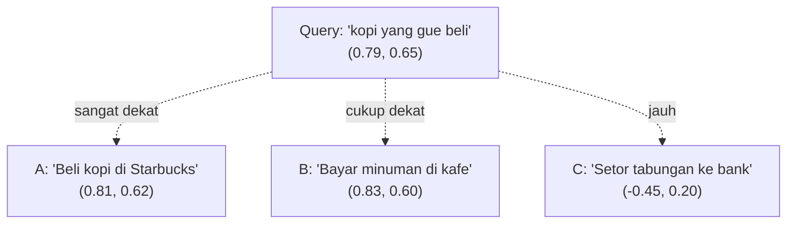
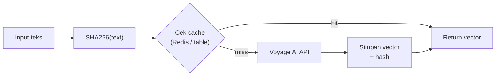
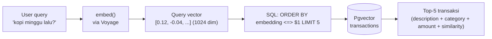
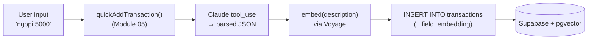

# Module 06 — Embedding

> **Tujuan modul**: Anda memahami fondasi **RAG** — bagaimana teks diubah menjadi **vektor** (embedding), bagaimana vektor disimpan di **vector database**, dan bagaimana data tersebut menjadi dasar pencarian semantik yang akan dipakai AI Financial Advisor di Fin-App.
>
> **Output akhir modul (iterasi awal)**: pipeline siap pakai — function `embed()` via Voyage, tabel `transactions` (dari Module 05) dapat tambahan kolom `embedding` + index HNSW + function `match_transactions`, `quickAddTransaction` auto-embed `description` saat insert, backfill transaksi lama selesai. Fin-App bisa mencari transaksi user dengan natural language ("kopi minggu lalu") — fondasi untuk Module 07 (RAG).

---

# Konsep Embedding (Pendahuluan)

**Tujuan section**: memahami konsep embedding — bagaimana teks diubah menjadi vektor numerik yang dapat dibandingkan secara semantik.

## Apa itu Embedding?

**Embedding** adalah fungsi yang memetakan input (teks, gambar, audio) ke sebuah **vektor angka berdimensi tinggi**. Untuk teks, embedding model dilatih sedemikian rupa sehingga **kalimat dengan makna mirip menghasilkan vektor yang berdekatan** di ruang vektor tersebut.

Anggap saja seperti **koordinat semantik**. Apabila Anda punya peta dunia dua dimensi (latitude, longitude), kota-kota yang berdekatan secara geografis akan punya koordinat yang mirip. Embedding melakukan hal serupa, tetapi:

- **Bukan 2 dimensi**, melainkan **ratusan hingga ribuan dimensi** (Voyage `voyage-3` = 1024 dim, OpenAI `text-embedding-3-large` = 3072 dim).
- **Bukan posisi geografis**, melainkan **posisi makna**.

**Karakteristik penting:**

| Properti | Penjelasan |
|---|---|
| **Deterministik** | Input teks yang sama → vektor yang sama (untuk model yang sama). |
| **Padat (dense)** | Hampir semua elemen vektor non-zero — berbeda dengan TF-IDF / bag-of-words. |
| **Tidak interpretable** | Anda tidak bisa membaca arti satu dimensi spesifik — yang bermakna adalah **arah** dan **jarak** antar vektor. |
| **Model-spesifik** | Vektor dari Voyage TIDAK kompatibel dengan vektor dari OpenAI. Jangan campur. |

## Intuisi: "Beli kopi" vs "Bayar minuman di kafe"

Bayangkan tiga teks transaksi di Fin-App:

- A: `"Beli kopi di Starbucks"`
- B: `"Bayar minuman di kafe"`
- C: `"Setor tabungan ke bank"`

Secara **keyword matching** (LIKE `%kopi%`), A dan B tidak match — beda kata. Tetapi secara **makna**, A dan B nyaris identik, sementara C berbeda jauh.

Embedding menangkap hubungan ini. Kalau Anda embed ketiganya dan visualisasikan (disederhanakan ke 2D), hasilnya kira-kira:



Query natural language `"kopi yang gue beli minggu lalu"` akan **dekat** dengan A dan B, **jauh** dari C — tanpa perlu keyword matching eksplisit. Ini adalah **pencarian semantik**, fondasi RAG.

## Dimensi Vektor (Trade-off)

Dimensi vektor menentukan **kapasitas representasi** vs **biaya storage & compute**:

| Dimensi | Contoh model | Storage per row | Kualitas | Biaya |
|---|---|---|---|---|
| 384 | `all-MiniLM-L6-v2` (HF) | ~1.5 KB | Cukup untuk task sederhana | Sangat murah |
| 768 | `bge-base`, `e5-base` | ~3 KB | Baseline production | Murah |
| **1024** | **`voyage-3`** | **~4 KB** | **Sangat baik (rekomendasi Anthropic)** | **Sedang** |
| 1536 | OpenAI `text-embedding-3-small` | ~6 KB | Baik | Sedang |
| 3072 | OpenAI `text-embedding-3-large` | ~12 KB | Terbaik untuk task kompleks | Mahal |

**Trade-off konkret**: di 10.000 row, perbedaan 1024 vs 3072 dim = ~80 MB extra storage + query lebih lambat. Untuk Fin-App, **1024 dim** adalah sweet spot.

## Use Case di Fin-App

Embedding membuka beberapa fitur yang sulit/mustahil dengan SQL biasa:

1. **Search transaksi via natural language**
   - User: `"kopi yang gue beli minggu lalu di mall"`
   - Sistem: embed query → match dengan embedding `description` setiap transaksi → return top 5.
2. **FAQ knowledge base**
   - User tanya `"gimana cara mulai nabung darurat?"` ke AI Advisor.
   - Sistem: cari chunk FAQ terdekat (mis. "Apa itu emergency fund?") → inject ke prompt Claude sebagai konteks.
3. **Auto-categorize transaction**
   - User input deskripsi tanpa pilih kategori.
   - Sistem: embed deskripsi → cari embedding kategori terdekat ("Food", "Transport", "Entertainment") → suggest kategori.
4. **Deteksi duplikat / similar expense**
   - "Sepertinya transaksi ini mirip dengan 'Bayar listrik' yang sudah kamu input kemarin — yakin mau lanjut?"

Bagian ini adalah **pendahuluan teori** — tidak ada latihan terpisah. Implementasi dimulai di Section 1 (Implementasi Embedding).

Lanjut ke Section 1 berikutnya untuk eksekusi implementasi.

---

# Section 1 — Implementasi Embedding

**Tujuan section**: setup provider embedding dan bangun function `embed()` reusable di project Fin-App.

## Pilihan Provider

Ada tiga jalur utama untuk mendapatkan embedding teks:

| Provider | Model unggulan | Dimensi | Karakter | Harga (USD/1M token) |
|---|---|---|---|---|
| **Voyage AI** | `voyage-3` | 1024 | Rekomendasi resmi Anthropic, kualitas tinggi, ramah harga | ~$0.06 |
| OpenAI | `text-embedding-3-small` | 1536 | Familiar untuk developer | ~$0.02 |
| OpenAI | `text-embedding-3-large` | 3072 | Akurasi tertinggi, mahal | ~$0.13 |
| Hugging Face (self-host) | `bge-base`, `e5-base` | 768 | Gratis tapi infra sendiri | Gratis (+ infra) |

**Untuk modul ini kami pakai Voyage AI (`voyage-3`)** karena:

- Direkomendasikan langsung oleh Anthropic untuk pipeline RAG dengan Claude.
- Kualitas semantik teks Indonesia cukup baik di benchmark internal.
- Harga kompetitif dan SDK Node mudah dipakai.

## Setup Voyage AI

1. Daftar di [voyageai.com](https://www.voyageai.com/) → ambil API key.
2. Install SDK:
   ```bash
   npm install voyageai
   ```
3. Tambah ke `.env.local`:
   ```
   VOYAGE_API_KEY=pa-xxxxxxxxxxxxxxxxxxxxxxxx
   ```
4. Tambahkan placeholder ke `.env.example` (tanpa nilai asli).

## Function `embed()`

Buat file `src/lib/embeddings.ts` (server-only) dengan dua function:

```ts
import "server-only";
import { VoyageAIClient } from "voyageai";

const client = new VoyageAIClient({
  apiKey: process.env.VOYAGE_API_KEY!,
});

const MODEL = "voyage-3";

export async function embed(text: string): Promise<number[]> {
  const res = await client.embed({
    input: [text],
    model: MODEL,
  });
  return res.data![0].embedding!;
}

export async function embedBatch(texts: string[]): Promise<number[][]> {
  const res = await client.embed({
    input: texts,
    model: MODEL,
  });
  return res.data!.map((d) => d.embedding!);
}
```

Karakter penting:

- `"server-only"` — pastikan API key tidak bocor ke client bundle.
- **Batch version** untuk efisiensi — sekali request bisa embed banyak teks (cek limit provider, biasanya 128–1000 per batch).
- Return `number[]` agar mudah disisipkan ke SQL pgvector (cast `vector(1024)`).

## Strategi Caching

**Jangan embed string yang sama dua kali.** Embedding bersifat deterministik — hasil identik untuk input identik. Caching jadi hemat besar:



**Implementasi sederhana** (cukup untuk Fin-App skala kecil): in-memory `Map<hash, vector>` di sisi server, atau table `embedding_cache (hash TEXT PRIMARY KEY, vector vector(1024))` di Supabase. Mulai sederhana, optimalkan nanti.

## Cost & Rate Limit

| Metrik | Voyage `voyage-3` (approx) |
|---|---|
| Harga | ~$0.06 per 1M token input |
| Rate limit | ~300 RPM (free tier), lebih tinggi di paid |
| Max input per request | 1000 dokumen, 120K token total |

Untuk Fin-App skala personal, biaya embedding akan **sangat kecil** (biasanya < $1/bulan kalau hanya FAQ + transaksi user).

Lanjutkan ke `latihan.md` Section 2 untuk eksekusi.

---

# Section 2 — Database Vector

**Tujuan section**: memahami apa itu vector database, lalu memilih dan setup **pgvector** sebagai backend Fin-App.

## Apa itu Vector Database?

Vector database adalah database yang **mengoptimalkan penyimpanan dan query vektor berdimensi tinggi**. Kemampuan utama:

1. **Storage** — simpan vektor ribuan dimensi dengan efisien.
2. **Similarity search** — cari top-K vektor terdekat dengan query vector, dalam latensi sub-detik bahkan untuk jutaan row.
3. **Filter hybrid** — kombinasi similarity + filter SQL biasa (mis. "FAQ terkait budgeting yang dibuat setelah 2025").

Tanpa indexing khusus, query similarity bersifat O(n) — harus bandingkan query ke setiap row. Vector DB pakai struktur indeks khusus (HNSW, IVFFlat) untuk membuatnya **approximate nearest neighbor** dalam O(log n).

## Pilihan Populer

| Database | Tipe | Karakter | Pakai kapan? |
|---|---|---|---|
| **Pgvector** | Postgres extension | Hybrid (vector + relational), open source | Sudah pakai Postgres / Supabase |
| Pinecone | Managed (cloud) | Mudah, mahal, scale tinggi | Production scale, butuh ops minimal |
| Weaviate | Self-host / cloud | Schema fleksibel, built-in modules | Use case kompleks (multi-modal) |
| Qdrant | Self-host / cloud | Performa tinggi, Rust | Latency-sensitive |

**Untuk Fin-App kami pakai Pgvector** karena:

- Sudah **enabled** di Supabase sejak Module 01 (cek migration awal).
- Hybrid query — bisa join dengan table `transactions` / `users` Anda yang sudah ada, tanpa data duplication.
- Tidak menambah service baru — satu Postgres untuk semuanya.

## Schema: Tambah Embedding ke Tabel `transactions`

Fin-App **sudah punya** tabel `transactions` dari Module 05 (quick-add transaksi). Kita **tidak perlu bikin tabel baru** untuk embedding — cukup **tambahkan kolom** `embedding` ke tabel yang sudah ada:

```sql
-- Tabel transactions yang sudah ada (Module 05) — referensi:
-- id, user_id, date, category, type, amount, description, created_at

-- Yang kita tambahkan di Module 06:
ALTER TABLE transactions
  ADD COLUMN IF NOT EXISTS embedding vector(1024);  -- voyage-3 = 1024 dim
```

**Catatan kolom `embedding` nullable**:

Kolom dibuat **nullable** (tanpa `NOT NULL`) karena row transaksi lama yang sudah tersimpan **sebelum** Module 06 belum punya embedding. Pilihannya:

- **Backfill**: script yang loop semua row `WHERE embedding IS NULL`, panggil `embed(description)`, lalu `UPDATE`.
- **Diisi saat insert baru**: modifikasi `quickAddTransaction` (Module 05) untuk juga embed `description` saat user submit transaksi baru.

Di Section 3, kita lakukan keduanya.

## Distance Operators di Pgvector

Pgvector menyediakan tiga operator distance:

| Operator | Metrik | Order | Catatan |
|---|---|---|---|
| `<=>` | Cosine distance (`1 - cosine_similarity`) | ASC = paling mirip | **Default untuk teks**. |
| `<->` | L2 (Euclidean) distance | ASC = paling dekat | Untuk embedding non-teks. |
| `<#>` | Negative inner product | ASC = paling tinggi inner product | Cepat, tetapi butuh vektor ternormalisasi. |

Contoh query top-5 transaksi yang paling mirip dengan query vector:

```sql
SELECT id, description, category, amount, 1 - (embedding <=> $1) AS similarity
FROM transactions
WHERE embedding IS NOT NULL
ORDER BY embedding <=> $1
LIMIT 5;
```

`$1` adalah query vector (hasil `embed(userQuery)`) yang dikirim sebagai parameter, biasanya berbentuk string `'[0.12, -0.04, ...]'::vector`.

## Indexing: HNSW vs IVFFlat

Untuk dataset > ~10K row, tambahkan index agar query cepat:

| Index | Karakter | Trade-off |
|---|---|---|
| **HNSW** (Hierarchical Navigable Small World) | Graph-based, akurasi tinggi, query cepat | Build slow, RAM lebih besar |
| IVFFlat | Cluster-based, lebih cepat build | Akurasi sedikit lebih rendah |

**Rekomendasi default Fin-App**: HNSW (akurasi lebih penting daripada build time untuk transaksi user yang akan di-query semantik berkali-kali).

```sql
CREATE INDEX IF NOT EXISTS transactions_embedding_idx
  ON transactions
  USING hnsw (embedding vector_cosine_ops);
```

Visualisasi alur query end-to-end:



Lanjutkan ke `latihan.md` Section 3 untuk eksekusi.

---

# Section 3 — Save Embedding ke Tabel `transactions`

**Tujuan section**: bikin migration yang **menambah kolom `embedding`** ke tabel `transactions` + **index HNSW** + **function `match_transactions`** (semantic search), lalu modifikasi `quickAddTransaction` (dari Module 05) supaya **otomatis embed `description`** setiap kali user submit transaksi baru, plus **backfill** transaksi lama yang belum punya embedding.

Di akhir Section 3, Fin-App Anda bisa dipakai user untuk mencari transaksi dengan natural language seperti "kopi minggu lalu" — bukan lagi terbatas filter kategori dropdown.

## Migration Final: ALTER + Index HNSW + Function `match_transactions`

Migration ditambahkan **setelah** migration dasar `transactions` (Module 05). Nama file: `supabase/migrations/0004_transactions_semantic_search.sql` (sesuaikan nomor dengan urutan project Anda).

**Prasyarat & penyesuaian penting** (beda dengan contoh generik di banyak tutorial pgvector):

- **Dimensi `vector(1024)`** agar match dengan Voyage `voyage-3` (Section 1). Banyak template di internet pakai `vector(768)` atau `vector(1536)` (model lain) — wajib diselaraskan dengan model embedding Anda.
- **Kolom `embedding` belum ada** di tabel `transactions` (Module 05 hanya membuat kolom dasar) → migration ini mulai dengan `ALTER TABLE ... ADD COLUMN embedding`.
- **Nama kolom teks transaksi** yang akan di-embed adalah `description` (sesuai schema tabel `transactions`). Function `match_transactions` ikut me-return `description`.
- `CREATE EXTENSION IF NOT EXISTS vector` ditulis (idempotent) supaya migration **self-contained** — bisa dijalankan di env fresh tanpa harus runut ke Module 01.

```sql
-- Semantic search function untuk transactions.
-- Prasyarat: tabel transactions sudah ada (Module 05 Section 5).
-- Jalankan via SQL Editor / supabase db push.

-- ---------------------------------------------------------------
-- Pastikan extension vector aktif (idempotent — aman di-rerun).
-- ---------------------------------------------------------------
create extension if not exists vector;

-- ---------------------------------------------------------------
-- Tambahkan kolom embedding ke tabel transactions.
-- Nullable: row lama (sebelum fitur embedding) tetap valid;
-- diisi via backfill atau saat insert baru via embed(description).
-- Dimensi 1024 = Voyage voyage-3.
-- ---------------------------------------------------------------
alter table public.transactions
  add column if not exists embedding vector(1024);

-- ---------------------------------------------------------------
-- Index HNSW di kolom embedding.
-- Index ini bikin nearest-neighbor search cepat. Pakai operator
-- cosine distance (vector_cosine_ops) supaya match dengan `<=>`
-- di function di bawah.
-- ---------------------------------------------------------------
create index if not exists transactions_embedding_idx
  on public.transactions
  using hnsw (embedding vector_cosine_ops);

-- ---------------------------------------------------------------
-- Function: match_transactions
-- Cari transaksi yang vector embedding-nya paling dekat dengan
-- query_embedding (vector dari pertanyaan/teks user).
--
-- Argumen:
--   query_embedding   : vector 1024 dim dari teks query (voyage-3)
--   match_threshold   : skor similarity minimum (0..1). Skor di
--                       bawah threshold akan di-filter keluar.
--   match_count       : maksimal baris yang dikembalikan
--
-- Kembali: kolom-kolom transactions + similarity (1 - cosine_distance).
--
-- Catatan: `<=>` adalah cosine distance dari pgvector. Untuk vector
-- yang dinormalisasi (kebanyakan embedding model output sudah
-- ternormalisasi), 1 - distance ≈ cosine similarity (range 0..1).
-- ---------------------------------------------------------------
create or replace function public.match_transactions (
  query_embedding vector(1024),
  match_threshold float,
  match_count int
)
returns table (
  id          uuid,
  type        text,
  category    text,
  amount      numeric,
  description text,
  date        date,
  user_id     uuid,
  similarity  float
)
language sql stable
as $$
  select
    transactions.id,
    transactions.type,
    transactions.category,
    transactions.amount,
    transactions.description,
    transactions.date,
    transactions.user_id,
    1 - (transactions.embedding <=> query_embedding) as similarity
  from public.transactions
  where transactions.embedding is not null
    and 1 - (transactions.embedding <=> query_embedding) > match_threshold
  order by transactions.embedding <=> query_embedding asc
  limit match_count;
$$;
```

## Penjelasan Bagian per Bagian

Migration ini punya **dua artifact** — sebuah index dan sebuah function. Keduanya saling melengkapi.

### 1. Index HNSW

```sql
create index if not exists transactions_embedding_idx
  on public.transactions
  using hnsw (embedding vector_cosine_ops);
```

| Komponen | Makna |
|---|---|
| `if not exists` | Migration **idempotent** — boleh dijalankan ulang tanpa error. Aman untuk env staging/local yang sering di-reset. |
| `using hnsw` | Memakai struktur graph **Hierarchical Navigable Small World** — algoritma approximate nearest neighbor (ANN) tercepat saat ini untuk vektor. Tanpa index, search jadi sequential scan O(n) — lambat di > 10K row. |
| `vector_cosine_ops` | Operator class untuk **cosine distance**. Harus **match** dengan operator yang dipakai di function (`<=>`). Pgvector punya 3 opsi: `vector_l2_ops` (Euclidean), `vector_ip_ops` (inner product), `vector_cosine_ops` (cosine). Untuk teks/embedding: hampir selalu cosine. |

> 💡 **Trade-off HNSW**: build index lambat (sekali, saat insert/migration), tapi query super cepat (selamanya). Cocok untuk data yang **lebih sering dibaca daripada ditulis** — seperti transactions yang ditambah ~10/hari tapi di-query ratusan kali.

### 2. Function `match_transactions`

```sql
create or replace function public.match_transactions (
  query_embedding vector(1024),
  match_threshold float,
  match_count int
) returns table (...) language sql stable as $$ ... $$;
```

Function ini **dipanggil dari aplikasi** (via `supabase.rpc("match_transactions", {...})`) — bukan dieksekusi langsung sebagai SQL. Membungkus query ke dalam function punya 3 keuntungan:

1. **Single round-trip**: client kirim 3 argumen, server jalankan semua logic.
2. **Konsistensi**: semua fitur RAG di app pakai logic yang sama (threshold, ordering, filter null) — tidak ada drift antar caller.
3. **Type safety**: PostgREST auto-generate type TypeScript dari return signature.

**Argumen**:

| Argumen | Makna | Contoh nilai |
|---|---|---|
| `query_embedding vector(1024)` | Vektor dari teks query user (mis. "kopi minggu lalu") yang sudah di-embed via `embed()`. Dimensinya **wajib sama** dengan kolom `embedding` di tabel — di sini 1024 (Voyage `voyage-3`). |  `[0.012, -0.034, ...]` (1024 angka) |
| `match_threshold float` | Skor similarity **minimum** (0..1). Hasil di bawah threshold dibuang. Mencegah "false positive" — vektor yang sebetulnya tidak relevan tapi kebetulan terdekat. | `0.5` (longgar) – `0.75` (ketat) |
| `match_count int` | Jumlah hasil maksimal (`LIMIT`). Biasanya 5–10 untuk konteks RAG. | `5` |

**Kolom yang di-return** = semua field transaksi (`id`, `type`, `category`, `amount`, `description`, `date`, `user_id`) **+ `similarity`** (skor 0..1 — semakin tinggi, semakin mirip).

### 3. Konversi Distance → Similarity

Ini bagian yang sering bikin bingung:

```sql
1 - (transactions.embedding <=> query_embedding) as similarity
```

| Konsep | Range | Makin tinggi = |
|---|---|---|
| **Cosine distance** (`<=>`) | 0..2 | semakin **berbeda** |
| **Cosine similarity** (`1 - distance`) | 0..1 (untuk vektor ternormalisasi) | semakin **mirip** |

Pgvector secara native menyediakan **distance** (lebih kecil = lebih dekat) karena lebih natural untuk `ORDER BY ... ASC`. Tapi untuk **filter threshold dan tampilan UI**, similarity (0..1) lebih intuitif untuk manusia (`"95% match"` lebih mudah dibaca daripada `"cosine distance 0.05"`).

> ⚠️ **Catatan vektor ternormalisasi**: rumus `1 - cosine_distance = cosine_similarity` **hanya akurat** kalau vektor sudah dinormalisasi (panjang = 1). Untungnya, output dari Voyage, OpenAI, dan kebanyakan embedding model modern **sudah ternormalisasi by default**. Kalau Anda pakai model custom, pastikan normalisasi di `embed()` Anda.

### 4. Filter `WHERE embedding IS NOT NULL`

```sql
where transactions.embedding is not null
```

Ini menjaga function tidak crash kalau ada transaksi **lama yang dibuat sebelum** fitur embedding diaktifkan. Pola umum saat menambahkan kolom embedding ke tabel yang sudah ada: kolom `nullable`, baru diisi saat insert baru atau via **backfill job** terpisah.

### 5. `ORDER BY ... ASC` + `LIMIT`

```sql
order by transactions.embedding <=> query_embedding asc
limit match_count;
```

Kenapa `ASC`? Karena kita meng-order pakai **distance** (bukan similarity) — distance lebih kecil = lebih dekat = lebih relevan. **Penting**: PostgreSQL planner akan pakai **HNSW index** persis ketika `ORDER BY <operator> ASC LIMIT N` — pattern ini wajib agar index kepakai. Kalau Anda `ORDER BY similarity DESC`, index tidak terpakai → sequential scan → lambat.

## Workflow Save — Modifikasi `quickAddTransaction`

Migration di atas hanya **menyediakan kolom + function**. Belum ada yang mengisi `embedding`. Kita perlu **modifikasi** server action `quickAddTransaction` (Module 05 Section 5) supaya **otomatis embed `description`** setiap kali user submit transaksi baru:



Perubahan di `src/features/quick-add.ts`:

```ts
// src/features/quick-add.ts — modifikasi minimal
import { embed } from "@/lib/embeddings";   // ← tambahan

// ... di dalam quickAddTransaction, setelah parsed dari tool_use:
const embedding = await embed(parsed.description);  // ← tambahan

const { error: insertError } = await supabase.from("transactions").insert({
  user_id: user.id,
  amount:   parsed.amount,
  type:     parsed.type,
  category: parsed.category,
  date:     parsed.date,
  description: parsed.description,
  embedding,                                  // ← tambahan
});
```

Hanya **3 baris tambahan**: import `embed`, panggil `embed(parsed.description)`, sertakan di insert object. Sisa pipeline (Claude tool use, RLS, revalidatePath) **tidak berubah**.

> 💡 **Kenapa embed `description`, bukan teks asli user?** `description` adalah hasil parse Claude — sudah dinormalisasi (mis. "ngopi 5k" → `description: "ngopi"`). Embedding-nya akan lebih konsisten antar transaksi sejenis. Kalau Anda mau lebih kaya, embed `description + " " + category` agar konteks kategori ikut ter-encode.

## Backfill: Embedding untuk Transaksi Lama

Saat migration dijalankan, transaksi yang **sudah ada sebelumnya** punya `embedding = NULL` — tidak akan muncul di semantic search. Kita perlu **backfill** sekali jalan:

```ts
// scripts/backfill-transactions-embedding.ts
import { createClient } from "@/lib/supabase/server";
import { embed } from "@/lib/embeddings";

async function main() {
  const supabase = await createClient();
  const { data: rows, error } = await supabase
    .from("transactions")
    .select("id, description")
    .is("embedding", null);

  if (error) throw error;
  if (!rows || rows.length === 0) {
    console.log("Tidak ada transaksi yang perlu backfill. Selesai.");
    return;
  }

  console.log(`Backfill ${rows.length} transaksi...`);
  let ok = 0, fail = 0;
  for (const row of rows) {
    try {
      const embedding = await embed(row.description ?? "");
      const { error: updateError } = await supabase
        .from("transactions")
        .update({ embedding })
        .eq("id", row.id);
      if (updateError) throw updateError;
      ok++;
    } catch (err) {
      console.error(`FAIL id=${row.id}:`, err);
      fail++;
    }
  }
  console.log(`Selesai: ${ok} sukses, ${fail} gagal.`);
}

main().catch(console.error);
```

Jalankan sekali:

```bash
npx tsx --env-file=.env.local scripts/backfill-transactions-embedding.ts
```

**Penting**:

- Script ini **idempotent** — `WHERE embedding IS NULL` membuat re-run hanya menyentuh row yang belum di-backfill. Aman dijalankan ulang kalau di tengah jalan error.
- **Loop sequential**, bukan `Promise.all`, untuk hormat rate limit Voyage (~300 RPM free tier).
- Setelah backfill sukses, semua transaksi punya embedding. Insert baru otomatis dapat embedding dari modifikasi `quickAddTransaction`.

## Cara Pakai dari Aplikasi (TypeScript)

```ts
// src/features/search-transactions.ts
"use server";

import { createServerSupabase } from "@/lib/supabase/server";
import { embed } from "@/lib/embeddings";

export async function searchTransactions(query: string) {
  const queryEmbedding = await embed(query);
  const supabase = await createServerSupabase();

  const { data, error } = await supabase.rpc("match_transactions", {
    query_embedding: queryEmbedding,
    match_threshold: 0.6,
    match_count: 5,
  });

  if (error) throw new Error(error.message);
  return data; // [{ id, type, category, amount, description, ..., similarity }, ...]
}
```

**Contoh hasil** untuk query `"kopi minggu lalu"`:

| description | category | amount | similarity |
|---|---|---|---|
| ngopi di starbucks | Makanan & Minuman | 45000 | 0.89 |
| beli kopi sachet | Makanan & Minuman | 25000 | 0.81 |
| nasi padang | Makanan & Minuman | 28000 | 0.62 |

Perhatikan baris ke-3: **"nasi padang"** tidak mengandung kata "kopi" sama sekali, tapi tetap muncul karena vektor "ngopi/makan/jajan" punya kedekatan semantik. Inilah **kekuatan semantic search** vs LIKE/fulltext — kata berbeda, makna berdekatan, tetap ketemu.

## Verifikasi End-to-End

Setelah migration + modifikasi `quickAddTransaction` + backfill jalan, verifikasi dengan beberapa query di Supabase SQL Editor:

**1. Cek semua transaksi punya embedding:**

```sql
SELECT
  count(*) AS total,
  count(*) FILTER (WHERE embedding IS NOT NULL) AS with_embedding,
  count(*) FILTER (WHERE embedding IS NULL) AS without_embedding
FROM transactions;
```

Yang diharapkan: `total = with_embedding`, `without_embedding = 0` (setelah backfill).

**2. Cek dimensi embedding konsisten 1024:**

```sql
SELECT DISTINCT vector_dims(embedding) AS dims
FROM transactions
WHERE embedding IS NOT NULL;
```

Hanya boleh return **satu row**: `dims = 1024`.

**3. Test semantic search via Supabase RPC:**

```sql
-- Pakai embedding salah satu transaksi sebagai query (cara cepat tanpa panggil Voyage)
SELECT * FROM match_transactions(
  (SELECT embedding FROM transactions WHERE embedding IS NOT NULL LIMIT 1),
  0.5,
  5
);
```

Yang diharapkan: row pertama = transaksi yang embedding-nya kita pakai (similarity ~1.0), diikuti transaksi mirip lainnya.

**4. Test dari TypeScript dengan query natural language:**

```ts
import { searchTransactions } from "@/features/search-transactions";
const results = await searchTransactions("kopi minggu lalu");
console.table(results);
```

Yang diharapkan: top 5 transaksi yang relevan secara semantik (Makanan & Minuman, "ngopi", dst).

## Yang TIDAK Termasuk di Module Ini

- ❌ **Row-Level Security (RLS) eksplisit di function**: function `match_transactions` di atas tidak punya `WHERE user_id = auth.uid()` di body-nya. Kalau Anda **memanggil function dari server action** dengan client yang sudah authenticated, RLS policy table `transactions` (dari Module 05) tetap berlaku. Tapi kalau Anda expose function ke client/admin tool langsung, **wajib** tambahkan filter user_id eksplisit.
- ❌ **Re-embed saat update**: kalau user nanti bisa edit `description` transaksi, embedding lama jadi stale. Solusi: trigger re-embed di update flow (di luar scope Module 06).
- ❌ **Reranking + multi-tool RAG**: setelah punya top-K transaksi, langkah berikutnya adalah **inject** ke prompt Claude sebagai konteks. Itu materi Module 07 (RAG).
- ❌ **Hybrid search** (semantic + keyword filter): mis. "kopi minggu lalu" → filter `date >= 7 days` + semantic search. Pola lanjutan, di-cover di Module 07.

---

## Recap

Pada akhir Module 06, Fin-App Anda punya **kemampuan baru**: pencarian transaksi via natural language.

- **Konsep embedding** dipahami — vektor sebagai koordinat semantik, cosine similarity sebagai default metrik, trade-off dimensi.
- **Function `embed()`** siap pakai dengan Voyage AI di `src/lib/embeddings.ts`, plus strategi caching dasar.
- **Tabel `transactions`** dapat kolom baru `embedding vector(1024)` + index HNSW + function `match_transactions`.
- **`quickAddTransaction`** otomatis embed `description` setiap insert baru.
- **Backfill script** mengisi embedding untuk transaksi lama (sekali jalan).
- **Helper `searchTransactions`** siap dipanggil dari fitur app berikutnya.

Module 07 (RAG) menyusul: **inject** hasil `searchTransactions` ke prompt Claude — jadi user bisa tanya "berapa total kopi saya bulan ini" dan AI Financial Advisor menjawab dengan **data nyata** dari transaksi user, bukan halusinasi.
