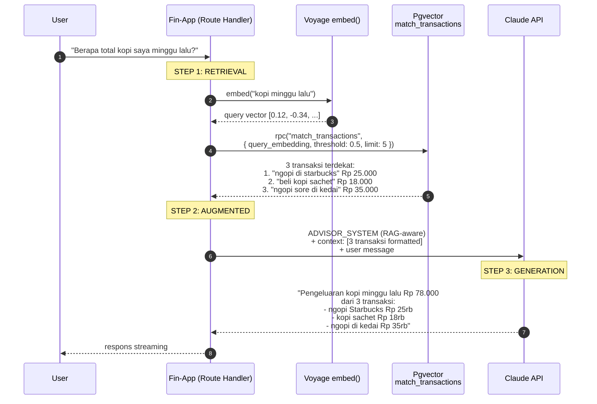
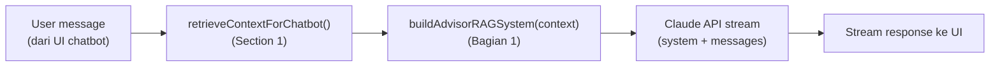
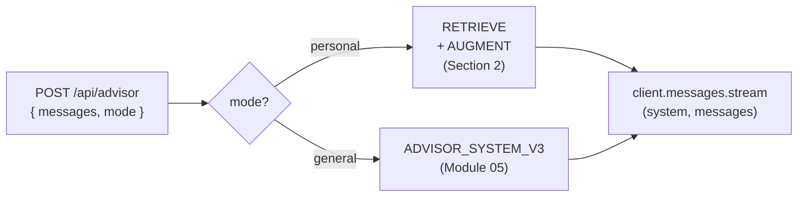

# Module 07 — RAG (Retrieval Augmented Generation)

> **Tujuan modul**: Anda memahami **konsep RAG** sebagai pola arsitektur untuk mengatasi halusinasi LLM, lalu **memasang RAG langsung ke chatbot AI Financial Advisor** (dari Module 05) supaya jawabannya berlandaskan **transaksi nyata user** (dari Module 06).
>
> **Output akhir modul**: chatbot Fin-App bisa menjawab pertanyaan seperti _"ada pengeluaran kopi minggu lalu?"_ dengan data transaksi user yang sesungguhnya — bukan halusinasi. Pipeline lengkap: user message → embed query → `match_transactions` → inject context → Claude jawab grounded.

---

## Konsep RAG

Sebelum mulai eksekusi, pahami dulu **masalah** yang RAG selesaikan dan **cara kerjanya secara konseptual**. Tanpa intuisi yang kuat di sini, Anda akan terjebak menulis kode tanpa memahami trade-off-nya.

### Kelemahan Terbesar LLM: Halusinasi

Saat Anda mengembangkan aplikasi berbasis LLM seperti Claude, **musuh nomor satu** Anda adalah **halusinasi** — kondisi di mana model menghasilkan respons yang **terdengar meyakinkan tetapi salah**. Angka yang dikarang, fakta yang dibuat-buat, nama yang tidak pernah ada, kebijakan yang tidak pernah dibuat.

Ini bukan bug yang bisa diperbaiki dengan tambal-sulam — ini **kelemahan struktural** LLM yang harus Anda atasi di lapisan arsitektur aplikasi.

#### Penyebab Halusinasi

| Penyebab | Penjelasan |
|---|---|
| **Training cut-off date** | Model dilatih sampai tanggal tertentu (mis. Januari 2026). Apa pun setelah itu = tidak tahu. |
| **Tidak bisa baca data internal Anda** | Model tidak punya akses ke database Fin-App, file proprietary, atau dokumen perusahaan Anda. |
| **Model = text generator probabilistik** | LLM secara fundamental memprediksi token berikutnya. Saat tidak tahu, ia **mengisi gap dengan tebakan paling probable** — bukan bilang "tidak tahu". |
| **Tidak ada mekanisme self-verification** | Berbeda dengan database query yang bisa return "not found", LLM selalu generate sesuatu — bahkan ketika seharusnya stuck. |

**Contoh konkret di Fin-App**: User bertanya _"Berapa total pengeluaran saya bulan ini?"_. Tanpa akses ke data Anda, Claude bisa:

- **Mengarang angka**: _"Total pengeluaran Anda Rp 4.500.000."_ (acak, tidak berdasar)
- **Generic tidak berguna**: _"Rata-rata pengeluaran orang Indonesia adalah..."_
- **Mengabaikan konteks**: _"Mohon berikan data transaksi Anda dulu."_

Tidak ada yang benar — dan user tidak tahu mana yang halusinasi.

### Mengapa Halusinasi Sulit Diatasi Tanpa RAG

Pendekatan naif: **update training model setiap saat**. Masukkan data Fin-App ke training set, retrain Claude supaya tahu transaksi user.

Masalahnya:

1. **Anda tidak bisa retrain Claude.** Model dimiliki dan dilatih Anthropic. Fine-tuning pun terbatas dan mahal.
2. **Data Anda berubah konstan.** Setiap input transaksi user = data baru. Retrain model setiap perubahan = mustahil.
3. **Data internal seharusnya privat.** Memasukkan data user ke training = bocor ke semua user lain. Privacy disaster.
4. **Tidak skalabel.** Tiap perusahaan tidak bisa punya Claude versi sendiri yang tahu data internal mereka.

Jadi: **menambah pengetahuan model lewat training BUKAN solusi yang realistis**. Kita butuh cara lain untuk **memberi konteks yang relevan ke model saat runtime** — itulah RAG.

### Analogi: Ujian Closed Book vs Open Book

Bayangkan dua siswa ujian:

| Aspek | **Tanpa RAG (Closed Book)** | **Dengan RAG (Open Book)** |
|---|---|---|
| **Sumber jawaban** | Hanya dari ingatan (training) | Boleh buka buku/catatan (knowledge base) |
| **Akurasi detail spesifik** | Sering lupa angka, salah nama, mengarang | Tinggal cek di buku, akurat |
| **Pertanyaan di luar materi** | Sok tahu / halusinasi | Bisa bilang "tidak ada di buku ini" |
| **Update materi** | Harus belajar ulang dari awal | Tinggal tambah/ganti halaman buku |
| **Skala pengetahuan** | Otak terbatas | Buku bisa setebal apa pun |
| **Verifikasi** | Sulit (jawaban tanpa sumber) | Mudah (sumber dapat dirujuk) |

**Tanpa RAG**, Claude seperti siswa closed book — pengetahuannya beku di training cut-off, dan apa yang tidak ada di "kepala"-nya akan diisi tebakan.

**Dengan RAG**, Claude jadi siswa open book — sebelum menjawab, ia "buka catatan" Anda (knowledge base), baca yang relevan, baru menjawab berdasarkan apa yang ada di sana.

### Apa itu RAG?

**RAG (Retrieval Augmented Generation)** adalah pola arsitektur di mana LLM **diberi konteks** dari sumber data eksternal **sebelum** menjawab. Tiga komponen intinya, tercermin dari namanya:

1. **Retrieval** — cari potongan informasi paling relevan dari knowledge base (vector DB, dokumen, dll.)
2. **Augmented** — sisipkan informasi tersebut ke konteks prompt model
3. **Generation** — model menjawab pertanyaan user dengan **berlandaskan** informasi yang sudah disisipkan

Perhatikan: RAG **tidak mengubah model**. Ia hanya mengubah **konteks yang dikirim ke model** setiap query. Itulah mengapa pendekatan ini elegan dan praktis — Anda dapat update knowledge base kapan saja tanpa retrain apa pun.

### Alur Kerja RAG: Contoh "Pengeluaran Kopi Minggu Lalu"

Mari telusuri alur konkret. Misalkan user di Fin-App bertanya: _"Berapa total pengeluaran kopi saya minggu lalu?"_



#### Anatomi Setiap Langkah

**STEP 1 — Retrieval**: pertanyaan user diubah jadi vektor numerik via `embed()` (Module 06 Section 1). Vektor ini dibandingkan dengan vektor `embedding` di tabel `transactions`, ambil top-K yang paling **mirip secara semantik** via function `match_transactions` (Module 06 Section 2). Bukan keyword matching — kata "kopi" tidak harus muncul di `description`; selama maknanya berdekatan, transaksi "ngopi" tetap ketemu.

**STEP 2 — Augmented**: hasil retrieval **disisipkan ke system prompt** sebelum dikirim ke Claude. Template-nya bisa sesederhana:

```
Anda Financial Advisor untuk Fin-App.

Konteks transaksi user yang relevan dengan pertanyaan:
{retrieved_transactions_di_sini}

JIKA konteks tidak cukup untuk menjawab pertanyaan,
katakan terus terang. JANGAN mengarang angka.
```

**STEP 3 — Generation**: Claude menerima system prompt + user message dan menyusun jawaban. Karena konteks sudah berisi data nyata, Claude tidak perlu menebak — jawaban-nya **grounded** di transaksi user yang sesungguhnya.

#### Empat Hal yang Membuat Ini Bekerja

1. **Tabel `transactions` sudah ber-embedding** — Module 06 sudah menyiapkan kolom `embedding` + index HNSW + auto-embed di `quickAddTransaction`.
2. **Function `embed()`** mengubah pertanyaan user jadi representasi yang bisa dibandingkan secara semantik (Module 06 Section 1).
3. **Function `match_transactions`** mencari transaksi paling mirip makna — bukan keyword exact match (Module 06 Section 2).
4. **System prompt yang di-augment** memberi Claude konteks faktual sebelum ia menulis jawaban (kita bangun di Section 2 module ini).

Tanpa langkah 1–3, Claude akan halusinasi. Dengan langkah 1–3, Claude jadi grounded di data transaksi nyata user.

### Variasi RAG

Module ini fokus pada **naive RAG** sebagai fondasi. Tapi penting Anda tahu ada variasi lain yang mungkin Anda butuhkan kelak:

| Variasi | Karakteristik | Kapan dipakai |
|---|---|---|
| **Naive RAG** | Retrieve top-K → augment → generate. Satu kali per query. | Default. Fondasi yang kita bangun di Section 1–3 module ini. |
| **Agentic RAG** | Model sendiri memutuskan kapan retrieve, via tool use | Pertanyaan kompleks yang butuh multi-step reasoning. |
| **Multi-hop RAG** | Beberapa retrieve berurutan untuk pertanyaan kompleks | "Bandingkan kebijakan A vs B" — butuh fetch dua dokumen. |
| **Hybrid Search** | Vector search + keyword search digabung via RRF | Query dengan kata kunci eksak (mis. nama produk). |
| **GraphRAG** | Knowledge base berbasis graf relasi entitas | Domain dengan banyak relasi (legal, scientific). |

### Kapan RAG TIDAK Tepat?

RAG bukan silver bullet. Hindari kalau:

- Pertanyaan bisa dijawab dari **training data Claude** (mis. _"Apa itu inflasi?"_) — RAG hanya menambah latensi tanpa manfaat.
- Butuh **komputasi terstruktur deterministik** (mis. _"Berapa SUM expense kategori food bulan ini?"_) — pakai **function calling** (Module 08) yang query SQL secara presisi. RAG memberi chunks mirip, tapi tidak menjamin perhitungan numerik akurat.
- Use case butuh **match eksak**, bukan kemiripan semantik — keyword search biasa lebih tepat dan murah.

> 💡 **Catatan tentang contoh "pengeluaran bulan ini"**: Di production, kasus ini sebenarnya lebih cocok dengan **function calling** (query SQL `SUM(amount) WHERE month = ...`) karena perhitungan numerik harus presisi. RAG di module ini dipakai sebagai **ilustrasi konsep** + integrasi end-to-end. Di aplikasi nyata, gabungkan: **RAG** untuk dokumen/FAQ + **function calling** untuk query terstruktur.

Dengan pemahaman ini, Anda siap mulai membangun komponen RAG satu per satu.

---

# Section 1 — Retrieval Helper untuk Chatbot

**Tujuan section**: bangun **retrieval helper** yang siap dipanggil dari chatbot. Helper ini wrap `searchTransactions` (dari Module 06 Section 3) lalu **format hasilnya jadi string konteks** yang siap disisipkan ke system prompt.

## Kenapa Butuh Helper Terpisah?

`searchTransactions` (Module 06) sudah mengembalikan array `TransactionMatch[]` — bagus untuk UI atau export, tapi belum siap dipakai sebagai konteks LLM. Claude butuh **teks plain** yang bisa "dibaca", bukan JSON array.

Kita butuh helper baru `retrieveContextForChatbot(query)` yang:

1. Panggil `searchTransactions(query)` untuk dapat top-K transaksi mirip.
2. Format hasilnya jadi **string multiline** yang readable Claude.
3. Tangani kasus kosong (no result → return string penanda khusus).

## Anatomi Helper

📂 **File baru**: `src/features/rag-context.ts`

```ts
"use server";

import { searchTransactions, type TransactionMatch } from "@/features/search-transactions";

const NO_CONTEXT_MARKER = "(tidak ada transaksi yang relevan ditemukan)";

export async function retrieveContextForChatbot(
  userQuery: string,
  opts: { threshold?: number; limit?: number } = {}
): Promise<string> {
  const matches = await searchTransactions(userQuery, {
    threshold: opts.threshold ?? 0.5,
    limit: opts.limit ?? 5,
  });

  if (matches.length === 0) return NO_CONTEXT_MARKER;

  return matches.map(formatTransactionForContext).join("\n");
}

function formatTransactionForContext(m: TransactionMatch): string {
  const amount = `Rp ${m.amount.toLocaleString("id-ID")}`;
  return `- ${m.date} | ${m.category} | ${m.type} | ${amount} | "${m.description}" (similarity: ${m.similarity.toFixed(2)})`;
}
```

**Contoh output** untuk query `"kopi minggu lalu"`:

```
- 2026-06-23 | Makanan & Minuman | expense | Rp 25.000 | "ngopi di starbucks" (similarity: 0.85)
- 2026-06-22 | Makanan & Minuman | expense | Rp 18.000 | "beli kopi sachet di indomaret" (similarity: 0.81)
- 2026-06-20 | Makanan & Minuman | expense | Rp 35.000 | "ngopi sore di kedai depan kantor" (similarity: 0.78)
```

**Contoh output** untuk query tanpa hasil:

```
(tidak ada transaksi yang relevan ditemukan)
```

Lanjutkan ke `latihan.md` Section 1 untuk eksekusi.

---

# Section 2 — Implementasi RAG di Chatbot AI Advisor

**Tujuan section**: pasang **pipeline RAG end-to-end** ke chatbot AI Advisor. Dua langkah utama: (1) modifikasi `prompts.ts` agar punya `ADVISOR_RAG_INSTRUCTION` + builder `buildAdvisorRAGSystem(context)` (anti-halusinasi guidance + slot konteks runtime), (2) modifikasi route handler `/api/advisor` agar setiap pesan user memicu retrieval → build system prompt → stream Claude.

## Bagian 1: System Prompt yang RAG-Aware

Module 05 sudah punya `ADVISOR_SYSTEM_V3` yang menjawab pertanyaan keuangan personal — tapi dari "kepala" Claude saja (closed book). Sekarang kita siapkan **slot konteks** yang diisi runtime + aturan agar Claude tidak halusinasi ketika konteks kosong.

📂 **File yang dimodifikasi**: `src/features/prompts.ts`

```ts
// src/features/prompts.ts — tambahan
export const ADVISOR_RAG_INSTRUCTION = `
Anda menjawab pertanyaan user tentang keuangan personal mereka.

ATURAN PENGGUNAAN KONTEKS:
1. Bagian "KONTEKS TRANSAKSI" di bawah berisi transaksi user yang RELEVAN dengan pertanyaan.
2. JIKA konteks berisi data → jawab BERLANDASKAN data tersebut. Sebutkan angka, kategori,
   tanggal yang ada di konteks. JANGAN mengarang angka di luar yang tersedia.
3. JIKA konteks = "(tidak ada transaksi yang relevan ditemukan)" → katakan terus terang
   bahwa Anda tidak menemukan transaksi terkait di catatan user. Tawarkan saran umum
   tanpa mengarang angka spesifik.
4. JANGAN bertanya "berapa pengeluaran Anda?" — data sudah ada di konteks. Pakai itu.

KONTEKS TRANSAKSI:
{{CONTEXT}}
`.trim();

export function buildAdvisorRAGSystem(context: string): string {
  return `
# ROLE
${ADVISOR_ROLE}

# CONTEXT
${ADVISOR_CONTEXT}

# OUTPUT FORMAT
${ADVISOR_FORMAT}

# INSTRUCTION
${ADVISOR_RAG_INSTRUCTION.replace("{{CONTEXT}}", context)}
`.trim();
}
```

**Mengapa function builder, bukan konstanta?** Konteks transaksi berbeda **setiap request** (query user berbeda), jadi system prompt-nya pun harus dibangun ulang setiap request. `ADVISOR_SYSTEM_V3` lama (konstanta) tetap dipertahankan — akan dipakai di Section 3 untuk mode General.

**Anti-halusinasi guidance** terletak di tiga aturan eksplisit di `ADVISOR_RAG_INSTRUCTION`:

1. **Pakai konteks** ketika ada — sebutkan angka/tanggal/kategori dari data.
2. **Akui ketidaktahuan** ketika konteks kosong — JANGAN mengarang angka.
3. **Jangan minta user input ulang** — data sudah ada di konteks, langsung pakai.

Tanpa aturan-aturan ini, Claude tetap bisa halusinasi walaupun konteks tersedia.

## Bagian 2: Wire RAG ke Route `/api/advisor`

Sekarang pasang pipeline RAG ke route handler chatbot dari Module 05.



Yang berubah dari versi Module 05: **system prompt dibangun ulang setiap request** dari hasil retrieval, bukan konstanta statis.

📂 **File yang dimodifikasi**: `src/app/api/advisor/route.ts`

```ts
// src/app/api/advisor/route.ts — patch
import { retrieveContextForChatbot } from "@/features/rag-context";
import { buildAdvisorRAGSystem } from "@/features/prompts";

export async function POST(req: Request) {
  const { messages } = await req.json();

  // Ambil pesan user TERAKHIR untuk retrieval
  const lastUserMessage = [...messages]
    .reverse()
    .find((m) => m.role === "user")?.content as string | undefined;

  // Retrieve konteks dengan timing untuk observability
  const t0 = Date.now();
  const context = lastUserMessage
    ? await retrieveContextForChatbot(lastUserMessage, { threshold: 0.5, limit: 5 })
    : "(belum ada pertanyaan)";
  const tRetrieve = Date.now() - t0;

  // Build system prompt yang RAG-aware
  const system = buildAdvisorRAGSystem(context);

  // Logging ringan untuk debugging
  console.log("[advisor/RAG]", {
    query: lastUserMessage?.slice(0, 80),
    retrieveMs: tRetrieve,
    contextChars: context.length,
    hasContext: !context.startsWith("(tidak ada"),
  });

  // Stream Claude response (pola yang sama dengan Module 04/05)
  const stream = client.messages.stream({
    model: "claude-haiku-4-5",
    max_tokens: 1024,
    system,                  // ← system prompt baru per request
    messages,
  });

  // ... return SSE stream seperti sebelumnya
}
```

## Verifikasi End-to-End

Setelah patch diterapkan, buka chatbot di Fin-App lalu coba percakapan berikut:

| User input | Yang diharapkan |
|---|---|
| `"ada pengeluaran kopi minggu lalu?"` | Claude menyebutkan transaksi kopi spesifik dari data Anda dengan angka & tanggal. |
| `"transport paling sering ke mana?"` | Claude menyebut bensin/ojek/grab dari transaksi Anda. |
| `"berapa total belanja bulan ini?"` | Claude **mungkin** menjawab "tidak yakin" karena belum punya kemampuan SUM agregat — itu kelemahan RAG murni (gunakan function calling di Module 08). |
| `"info pesawat ke Jepang"` | Konteks kosong → Claude bilang "tidak ada transaksi terkait di catatan Anda" tanpa mengarang. |

## Yang TIDAK Berubah

- ❌ Streaming SSE dari Module 04 — tetap pakai pattern yang sama.
- ❌ ADVISOR_ROLE/CONTEXT/FORMAT dari Module 05 — di-reuse di builder, tidak ditulis ulang.
- ❌ quickAddTransaction — itu jalur insert, RAG hanya di jalur chat (route advisor).
- ❌ Tabel `transactions` & function `match_transactions` — sudah final dari Module 06.
- ❌ ADVISOR_SYSTEM_V3 lama — tetap diekspor, akan dipakai di Section 3 (mode toggle).

Lanjutkan ke `latihan.md` Section 2 untuk eksekusi.

---

# Section 3 — Mode Toggle: Personal (RAG) vs General (Chatbot Biasa)

**Tujuan section**: beri user kontrol untuk memilih perilaku chatbot per percakapan — mode **Personal** memakai RAG (Section 2), mode **General** mem-bypass retrieval dan pakai system prompt biasa (`ADVISOR_SYSTEM_V3` dari Module 05).

## Kenapa Butuh Toggle?

Setelah Section 2, chatbot **selalu** retrieve transaksi untuk setiap pertanyaan. Ini bagus untuk pertanyaan keuangan personal, tapi **boros** untuk pertanyaan konsep umum:

| Pertanyaan | Mode yang cocok | Alasan |
|---|---|---|
| _"kopi minggu lalu?"_ | Personal | Butuh data transaksi spesifik user. |
| _"transport paling sering?"_ | Personal | Butuh data kategori user. |
| _"apa itu inflasi?"_ | General | Pertanyaan konsep — tidak butuh data user. |
| _"jelaskan reksadana saham"_ | General | Edukasi umum — retrieval malah noise. |

Default kita pilih **General** — pendekatan privacy-friendly: user harus **opt-in** secara eksplisit ke Personal sebelum chatbot membaca transaksi mereka.

## Anatomi Branching di Route Handler



📂 **File yang dimodifikasi**: `src/app/api/advisor/route.ts`.

```ts
// src/app/api/advisor/route.ts — branching mode
import { ADVISOR_SYSTEM_V3 } from "@/features/prompts";

type ChatMode = "personal" | "general";

const { messages, mode: rawMode } = await req.json();
const mode: ChatMode = rawMode === "personal" ? "personal" : "general"; // default general

let system: string;
if (mode === "personal") {
  const context = lastUserMessage
    ? await retrieveContextForChatbot(lastUserMessage, { threshold: 0.5, limit: 5 })
    : "(belum ada pertanyaan)";
  system = buildAdvisorRAGSystem(context);
} else {
  system = ADVISOR_SYSTEM_V3;  // skip retrieval
}

// ... stream Claude pakai variable system
```

> 💡 **Hemat di mode general**: skip `embed()` + `match_transactions` → latency turun ~200–500ms, 1 Voyage API call hilang.

## UI Toggle (Segmented Control)

📂 **File yang dimodifikasi**: komponen chatbot client (mis. `src/components/advisor-chat.tsx`).

```tsx
// state lokal
const [mode, setMode] = useState<ChatMode>("general");  // default general — privacy-friendly

// segmented control di atas input
<div className="mb-3 flex gap-1 rounded-lg border bg-gray-50 p-1">
  <button onClick={() => setMode("personal")}
    className={mode === "personal" ? "bg-white shadow-sm" : "text-gray-500"}>
    🎯 Personal
  </button>
  <button onClick={() => setMode("general")}
    className={mode === "general" ? "bg-white shadow-sm" : "text-gray-500"}>
    💬 General
  </button>
</div>

// kirim di POST body
body: JSON.stringify({ messages, mode })
```

Tagline ringkas di bawah toggle membantu user mengingat efek tiap mode:

- 🎯 Personal: _"Jawaban berdasarkan transaksi Anda."_
- 💬 General: _"Chatbot umum tanpa konteks transaksi."_

Lanjutkan ke `latihan.md` Section 3 untuk eksekusi.

---

## Recap

Pada akhir Module 07, Fin-App Anda punya **chatbot AI Advisor yang RAG-aware dengan mode toggle**:

- **Konsep RAG** dipahami — Retrieval + Augmented + Generation, plus kapan TIDAK dipakai.
- **Section 1** — Helper `retrieveContextForChatbot(query)` yang wrap `searchTransactions` (Module 06) dan format hasilnya jadi string konteks.
- **Section 2** — Implementasi RAG end-to-end di chatbot: `ADVISOR_RAG_INSTRUCTION` + `buildAdvisorRAGSystem(context)` di `prompts.ts`, plus route handler `/api/advisor` yang per request retrieve top-K → build system prompt → stream Claude (dengan logging untuk observability). RAG hidup di UI chatbot.
- **Section 3** — Mode toggle UI + backend branching: user bisa memilih `🎯 Personal` (RAG, jawab dari transaksi nyata) atau `💬 General` (chatbot biasa tanpa retrieval). User punya kontrol penuh kapan butuh data pribadi dan kapan cukup jawaban umum.

> ⚠️ **Yang belum dibahas di module ini** (akan datang di module berikutnya / iterasi lanjutan): chunking dokumen panjang, reranking untuk presisi, hybrid search (vector + keyword), GraphRAG, dan caching retrieval. Untuk **akses data terstruktur** (mis. SUM/COUNT/agregasi presisi), lanjut ke **Module 08 — AI Agent & Tools** (function calling).
