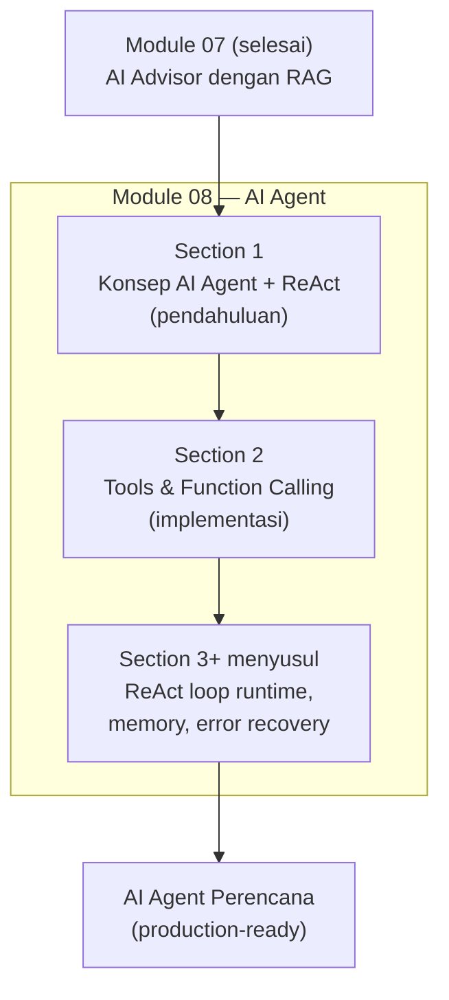
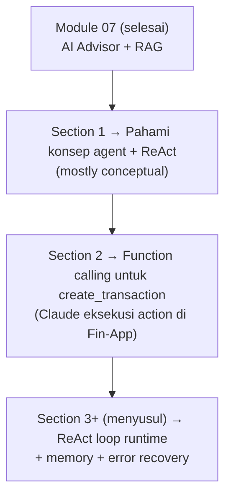
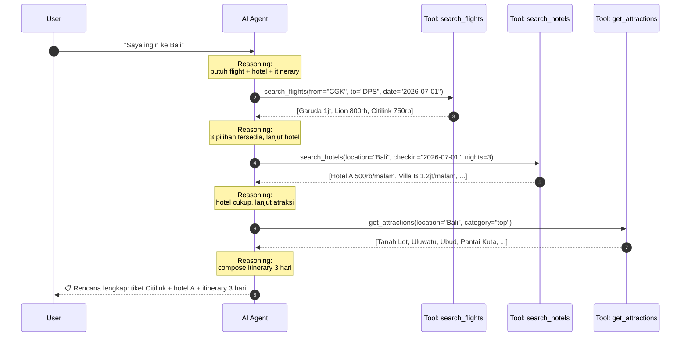
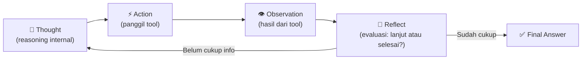
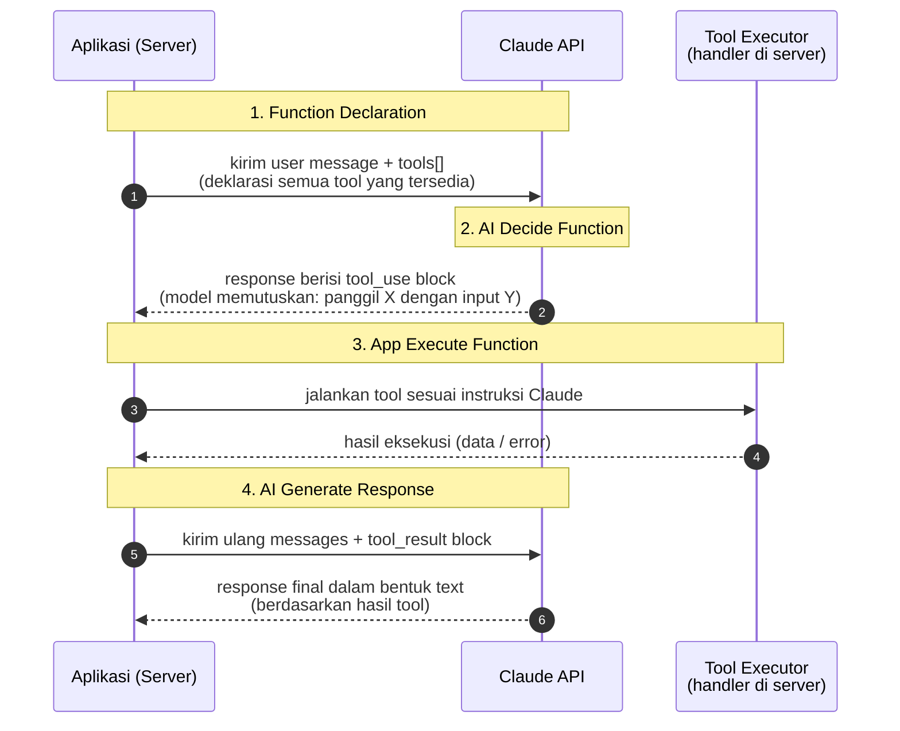
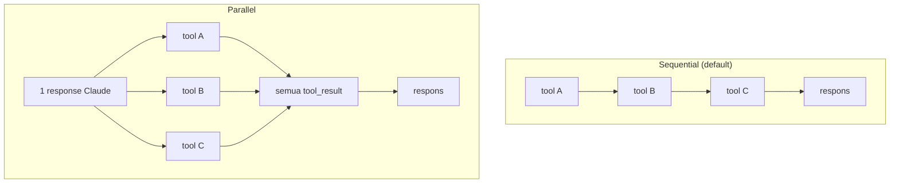
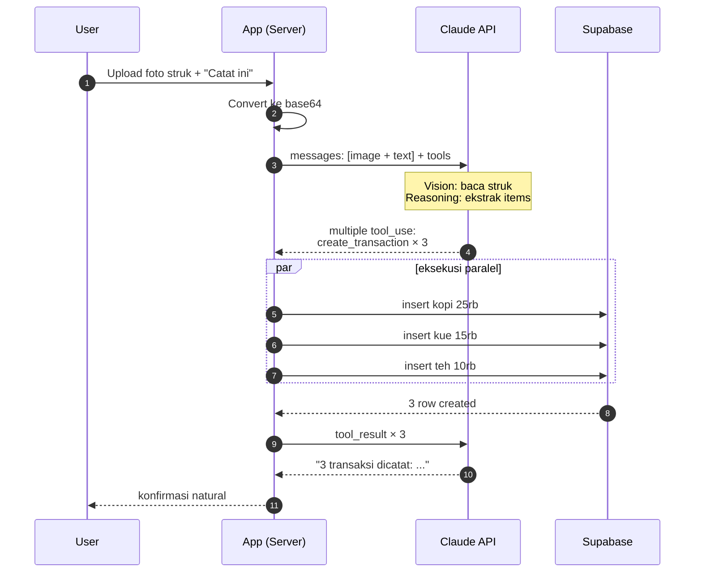

# Module 08 — AI Agent

> **Tujuan modul**: Anda memahami **paradigma AI Agent** — sistem AI yang otonom menjalankan tugas multi-langkah dengan kemampuan reasoning dan akses tools — dan menguasai pola **ReAct (Reasoning + Acting)** sebagai fondasi pemikiran agent modern.
>
> **Output akhir modul** (setelah seluruh section selesai): agent perencana sederhana di Fin-App yang dapat menjalankan task multi-step seperti "Buatkan rencana budget bulanan saya" dengan akses tools (DB transaksi, kalkulator, dll.).

---

## Outline Section

Module ini terdiri dari **2 section** (lebih banyak akan ditambah di iterasi berikutnya — ReAct loop, memory, error recovery, multi-agent):

| # | Section | Fokus | Status |
|---|---|---|---|
| **1** | **Konsep AI Agent** | AI sebagai sistem otonom + 3 kemampuan inti + pola ReAct + contoh konkret | ✅ Siap |
| **2** | **Tools & Function Calling** | Jenis tools Claude API + function calling custom + flow 4-step + studi kasus | ✅ Siap |

**Total estimasi durasi**: ±2–3 jam (Section 1 konseptual + Section 2 implementasi function calling).

> 💡 **Cara kerja modul ini**: sama dengan modul-modul sebelumnya — gabungan materi konseptual + latihan eksekusi via Claude Code. Section 1 ini fokus pada **intuisi & pola pikir** sebelum coding intens di section-section berikutnya.

## Peta Visual Module 08

Berikut gambaran arsitektur agent yang akan Anda bangun bertahap:



## Prinsip Kontinuitas Antar Section

Sama dengan modul sebelumnya, kode dari section sebelumnya **terus berlanjut**:



Pada akhir Section 1, Anda **belum membangun agent operasional** — tetapi memiliki **mental model yang solid** untuk merancang agent di section berikutnya. Tanpa fondasi konseptual yang baik, Anda akan terjebak debugging tanpa memahami akar masalahnya.

---

# Section 1 — Konsep AI Agent

**Tujuan section**: memahami **apa itu AI Agent**, kemampuan intinya, dan pola **ReAct** sebagai cetak biru cara agent berpikir + bertindak.

## Apa itu AI Agent?

**AI Agent** adalah sistem AI yang **otonom** menjalankan tugas multi-langkah untuk mencapai tujuan tertentu, dengan kemampuan **bernalar** (reasoning) dan **berinteraksi dengan dunia luar** lewat **tools**.

Berbeda dengan chatbot biasa yang sudah Anda bangun di Module 04–07:

| Aspek | Chatbot Reguler (M04–07) | AI Agent (M08) |
|---|---|---|
| **Pola interaksi** | Satu shot: user tanya → AI jawab | Multi-step: user beri goal → AI eksekusi serangkaian langkah |
| **Inisiatif** | Pasif — tunggu instruksi spesifik | Proaktif — decompose goal jadi sub-task sendiri |
| **Dunia luar** | Hanya teks (mungkin retrieval di RAG) | Pakai tools: API, DB, file system, kalender, browser |
| **State** | Sebatas riwayat percakapan (multi-turn) | Maintain working memory + plan + observation log |
| **Kepastian output** | Selalu produk akhir (respons teks) | Bisa loop berkali-kali sebelum produce final answer |

> 📌 **Catatan**: Module 05 Section 4 (Agentic Workflow) sudah memperkenalkan `tool_use` di Claude API. Itu adalah **batu loncatan** menuju AI Agent penuh — tetapi belum mencakup pola **multi-step reasoning** + **memory** yang dibahas di module ini.

## Tiga Kemampuan Inti AI Agent

Setiap AI Agent yang baik memiliki tiga kemampuan fundamental:

### 1. Otonom (Autonomy)

Agent bisa eksekusi tugas **tanpa intervensi user di setiap step**. User cukup memberi goal (tujuan tingkat tinggi), agent breakdown jadi sub-task dan eksekusi sendiri.

Contoh:
- User: "Saya ingin ke Bali minggu depan dengan budget Rp 3 juta"
- Agent: secara otonom cari tiket → bandingkan harga → cari hotel → rancang itinerary → present rencana final

### 2. Reasoning (Penalaran)

Agent bisa **decompose problem kompleks** jadi langkah-langkah logis. Bukan sekadar menebak satu jawaban — tapi memikirkan "untuk capai X, saya butuh Y, dan untuk Y butuh Z dulu".

Contoh reasoning yang baik:
- "User mau ke Bali. Butuh: (1) tiket pesawat, (2) penginapan, (3) itinerary aktivitas, (4) estimasi biaya total. Mulai dari yang paling membatasi: tiket pesawat ada di tanggal yang user inginkan?"

### 3. Integrasi Tools

Agent bisa memanggil **tools eksternal** — API, database, browser, file system — untuk mengakses dunia nyata. Ini yang membedakan agent dari chatbot: agent **menjalankan** sesuatu, bukan hanya **bercerita** tentangnya.

Tools umum:
- **Information retrieval**: search engine, RAG, database query
- **Computation**: kalkulator, code executor
- **Side effects**: kirim email, buat kalender event, panggil API pihak ketiga
- **File system**: baca/tulis file lokal

## Contoh Konkret: "Saya Ingin ke Bali"

Skenario klasik untuk memahami agent. User memberi goal sederhana, agent eksekusi serangkaian langkah:



Perhatikan: user **tidak diminta** ke mana harus klik atau API mana yang dipanggil. Agent yang merencanakan semuanya.

## Pola ReAct (Reasoning + Acting)

**ReAct** adalah pola interaksi paling fundamental untuk AI Agent. Diperkenalkan dalam paper "ReAct: Synergizing Reasoning and Acting in Language Models" (Yao et al., 2023). Inti idenya: agent berpikir dan bertindak **bergantian** dalam loop sampai goal tercapai.

### Loop ReAct



### Anatomi Setiap Langkah

| Langkah | Pertanyaan yang Dijawab | Output Konkret |
|---|---|---|
| **Thought** | "Apa yang harus saya lakukan sekarang? Info apa yang masih kurang?" | Reasoning text internal (chain-of-thought) |
| **Action** | "Tool mana yang harus dipanggil + parameter apa?" | Tool call (mis. `search_flights(from="CGK", ...)`) |
| **Observation** | "Apa yang dikembalikan tool tersebut?" | Hasil eksekusi tool (data, error, atau null) |
| **Reflect** | "Apakah saya sudah punya cukup info untuk jawab final? Atau perlu langkah lain?" | Continue loop / produce final answer |

### Contoh ReAct untuk "Saya Ingin ke Bali"

Berikut transcript ReAct yang konkret — bayangkan ini adalah log internal agent:

```
=== Iterasi 1 ===
Thought: User ingin ke Bali. Saya butuh tahu tanggal & budget dulu,
         tapi untuk contoh ini asumsi 3 hari minggu depan.
         Mulai dari tiket pesawat — paling membatasi.

Action: search_flights(from="CGK", to="DPS", date="2026-07-01")

Observation: [
  { airline: "Garuda", price: 1000000, time: "07:00" },
  { airline: "Lion",   price: 800000,  time: "09:30" },
  { airline: "Citilink", price: 750000, time: "11:00" }
]

Reflect: 3 pilihan flight ada. Citilink termurah. Lanjut cari hotel.

=== Iterasi 2 ===
Thought: Sekarang butuh penginapan untuk 3 malam. Asumsi user budget
         tengah, pilih hotel mid-range.

Action: search_hotels(location="Bali", checkin="2026-07-01", nights=3)

Observation: [
  { name: "Hotel A", price: 500000, rating: 4.2 },
  { name: "Villa B", price: 1200000, rating: 4.8 },
  ...
]

Reflect: Hotel A bagus & terjangkau. Lanjut cari aktivitas.

=== Iterasi 3 ===
Thought: Butuh rekomendasi tempat wisata. Cari yang top-rated.

Action: get_attractions(location="Bali", category="top")

Observation: ["Tanah Lot", "Uluwatu", "Ubud Monkey Forest",
              "Pantai Kuta", "Tegallalang Rice Terrace", ...]

Reflect: Sudah cukup data. Compose itinerary final.

=== Final Answer ===
📋 Rencana 3 hari ke Bali:
- Tiket: Citilink CGK→DPS, 1 Juli 2026, Rp 750.000
- Hotel: Hotel A (Seminyak), 3 malam, Rp 1.500.000
- Itinerary:
  Hari 1: Tanah Lot + Uluwatu sunset
  Hari 2: Ubud Monkey Forest + Tegallalang
  Hari 3: Pantai Kuta + shopping
- Total estimasi: Rp 2.250.000 (sebelum makan & oleh-oleh)
```

## Mengapa Pola ReAct Penting?

ReAct bukan satu-satunya pola agent, tapi yang paling fundamental. Empat alasan utama:

1. **Transparansi** — setiap langkah Thought & Action terlihat di log. Bukan black-box. User/developer bisa baca: "Oh agent memutuskan cari tiket dulu karena tanggal yang paling membatasi."

2. **Debugging** — kalau hasil agent salah, bisa di-trace ke Thought atau Action mana yang gagal. Contoh: "Thought iterasi 2 salah asumsi budget tengah — harusnya tanya user dulu."

3. **Recovery dari kegagalan** — kalau tool gagal (mis. API timeout, hasil kosong), agent bisa reasoning ulang di iterasi berikutnya: "Hotel search gagal — coba pakai filter lebih longgar atau location alternatif."

4. **Composability** — bisa kombinasikan banyak tools secara dinamis. Agent tidak perlu di-hardcode "flight dulu, hotel kedua, atraksi ketiga" — ia memutuskan urutan sendiri berdasarkan reasoning.

## Hubungan ReAct dengan Tool Use Claude

Anda mungkin ingat **Module 05 Section 4 — Agentic Workflow** yang memperkenalkan `tool_use` di Claude API. Itu **implementasi konkret dari pola ReAct** di stack Claude:

| ReAct Konseptual | Claude API (Module 05) |
|---|---|
| **Thought** | Internal reasoning model — tidak selalu terlihat di response (kadang terlihat di `thinking` block kalau extended thinking aktif) |
| **Action** | `content_block` bertipe `tool_use` dengan tool name + JSON input |
| **Observation** | Anda kirim balik `tool_result` block sebagai konteks turn berikutnya |
| **Reflect** | Model otomatis: di turn berikutnya, ia akan baik produce `tool_use` lain (lanjut loop) atau text final (selesai) |

Jadi Anda **sudah punya** primitif untuk membangun ReAct agent — yang belum Anda punya adalah:
- Pattern loop yang bersih (sampai kapan stop?)
- Memory antar iterasi (selain riwayat messages)
- Error handling saat tool gagal
- Multi-tool orchestration

Section-section berikutnya (menyusul) akan menjawab semuanya.

## Variasi & Evolusi Agent

ReAct adalah fondasi. Tapi industri sudah berkembang ke pola yang lebih canggih:

| Pola | Karakteristik | Use Case |
|---|---|---|
| **Naive ReAct** | Thought → Action → Observation loop. Satu agent, satu loop. | Default untuk task tunggal. Section 2 akan implement ini. |
| **Plan-and-Execute** | Agent buat plan lengkap di awal, lalu eksekusi step-by-step. | Task yang strukturnya jelas, ingin estimasi dulu sebelum eksekusi. |
| **Reflexion** | Agent self-critique hasilnya, retry kalau jelek. | Task yang butuh kualitas tinggi (writing, coding). |
| **Multi-agent** | Beberapa agent kolaborasi (mis. researcher + writer + critic). | Task kompleks dengan sub-domain berbeda. |
| **Tree-of-Thoughts** | Eksplorasi banyak Thought branch sebelum eksekusi. | Problem solving dengan banyak path possible. |

Module 08 fokus pada **Naive ReAct** dulu sebagai fondasi. Variasi lain akan disinggung di section lanjutan kalau relevan.

## Kapan AI Agent TIDAK Tepat?

Agent powerful, tapi jangan over-engineer. Hindari kalau:

- ❌ Task bisa diselesaikan **single prompt** (mis. "summarize this article") — pakai Claude biasa saja.
- ❌ Task **deterministik** dengan flow yang jelas (mis. "validate form input → save to DB") — pakai kode imperatif biasa.
- ❌ Task **mission-critical** tanpa human-in-the-loop — agent bisa salah, dan kalau action-nya destruktif (mis. transfer uang, hapus data), tanpa konfirmasi user bisa katastropik.
- ❌ Latensi-sensitif — ReAct loop = banyak round-trip API → respons lambat (10–60 detik biasa).

**Rule of thumb**: pakai agent kalau task punya 3+ langkah, butuh reasoning dinamis, dan tidak ada cara deterministik yang lebih sederhana.

Lanjutkan ke `latihan.md` Section 1 untuk latihan konseptual — Anda akan menulis transcript ReAct manual untuk memperkuat intuisi sebelum coding.

---

# Section 2 — Tools & Function Calling

**Tujuan section**: memahami **jenis-jenis tools** yang tersedia di Claude API, cara kerja **function calling** untuk tools custom (konek API/database), dan implementasi konkret tool `create_transaction` di Fin-App agar Claude dapat **mencatat pengeluaran user lewat percakapan natural**.

## Apa itu Tools & Function Calling?

**Tools** (dalam konteks Claude API) adalah **kemampuan eksternal** yang Anda berikan ke model agar ia dapat berinteraksi dengan dunia di luar teks — memanggil API, query database, baca file, eksekusi kode, dll.

**Function calling** adalah pola di mana model **memutuskan sendiri** tool mana yang perlu dipanggil + parameter apa, lalu **aplikasi Anda yang mengeksekusi** tool tersebut dan mengembalikan hasilnya ke model.

Bedakan dua peran:

| Peran | Yang melakukan |
|---|---|
| **Memutuskan** tool mana dipanggil + parameter | Claude (model) |
| **Mengeksekusi** tool (jalankan kode, akses DB, panggil API) | Aplikasi Anda (server) |
| **Menyusun jawaban** dengan hasil tool | Claude (model), di turn berikutnya |

Pemisahan ini penting: model tidak punya akses langsung ke DB atau internet — ia hanya **menghasilkan instruksi** dalam bentuk `tool_use` block. Aplikasi Anda yang menjalankan instruksi tersebut.

## Jenis Tools di Claude API

Claude API menawarkan dua kategori besar:

### 1. Built-in Tools (Server-Side, dikelola Anthropic)

Anthropic menyediakan beberapa tools yang **siap pakai** tanpa Anda perlu implementasi eksekusinya — Anthropic yang menjalankan, Anda hanya enable dan terima hasilnya.

| Tool | Kemampuan | Use Case |
|---|---|---|
| **Web Search** | Cari informasi terkini di web | Pertanyaan tentang berita / fakta terbaru |
| **Web Fetch** | Ambil konten URL tertentu | Summarize artikel, analisis halaman web |
| **Code Execution** | Jalankan kode Python di sandbox | Komputasi numerik, data analysis, plotting |
| **Computer Use** | Kontrol komputer (mouse, keyboard, screen) | Automasi UI, testing |
| **Text Editor** | Baca/tulis/edit file lokal | Coding assistant (dipakai Claude Code) |
| **Bash** | Jalankan perintah shell | DevOps task, file system operations |

> 📌 Built-in tools praktis tapi punya **batasan kontrol** — Anda tidak bisa custom logic-nya. Kalau use case Anda butuh akses ke Supabase Fin-App, Anda **harus pakai function calling custom**.

### 2. Custom Function Calling (Anda Yang Implementasi)

Inilah pola yang akan Anda pakai di Fin-App. Anda mendefinisikan tools sendiri yang sesuai kebutuhan:

| Kategori | Contoh Tool Custom | Implementasi |
|---|---|---|
| **Konek Database** | `get_transactions(filters)`, `create_transaction(data)`, `get_balance_summary()` | Query/Insert ke Supabase via Postgres client |
| **Konek API Eksternal** | `search_flights(from, to, date)`, `get_weather(city)`, `send_email(to, body)` | Fetch ke third-party API |
| **Komputasi Custom** | `calculate_compound_interest(principal, rate, years)`, `format_idr(amount)` | TypeScript function lokal |
| **File System** | `read_csv(path)`, `export_pdf(data)` | Node.js fs module |
| **Side Effects** | `create_calendar_event`, `send_slack_notification`, `trigger_webhook` | Memanggil service eksternal |

Module 05 Section 4 sebenarnya sudah memperkenalkan function calling dasar (tool use). Section 2 ini memperdalam: anatomi tool declaration, flow lengkap, dan studi kasus konkret.

## Studi Kasus Function Calling

Tiga kategori use case besar yang menjustifikasi penggunaan function calling:

### Kategori 1: Menambahkan Pengetahuan AI

Claude punya cut-off date training. Function calling memungkinkan akses **pengetahuan yang lebih baru** atau **proprietary**.

Contoh:
- `get_user_transactions(month)` → ambil transaksi user terbaru dari Supabase (data proprietary, tidak ada di training)
- `get_latest_news(topic)` → fetch berita keuangan terkini
- `lookup_company_info(ticker)` → query info perusahaan dari API saham

> 💡 **Beda dengan RAG (Module 07)**: RAG cocok untuk pengetahuan **semi-statis** yang sudah di-embed di vector DB. Function calling cocok untuk pengetahuan **dinamis** (mis. saldo terkini, harga real-time) atau **query terstruktur** (mis. filter transaksi by category).

### Kategori 2: Memperluas Kemampuan AI

Claude bagus di reasoning, tapi lemah di komputasi presisi tinggi dan task spesifik.

Contoh:
- `calculate_compound_interest(p, r, n)` → kalkulasi finansial akurat (lebih reliable dibanding minta Claude hitung sendiri)
- `convert_currency(amount, from, to)` → currency conversion real-time
- `parse_receipt_ocr(image_url)` → ekstraksi data dari foto struk
- `categorize_transaction(description)` → ML classifier khusus

### Kategori 3: Melakukan Action (Side Effects)

Ini yang paling powerful — Claude bisa **mengubah state dunia** lewat aplikasi Anda.

Contoh:
- `create_transaction(type, amount, category, description)` → catat pengeluaran ke DB Fin-App
- `update_budget(category, new_limit)` → ubah budget user
- `send_reminder(user_id, message)` → kirim push notification
- `transfer_funds(from, to, amount)` → transfer antar rekening

> ⚠️ **Action = ada konsekuensi.** Action yang destruktif (transfer uang, hapus data) **wajib** punya konfirmasi user atau guardrail. Section ini akan implement `create_transaction` yang **idempoten dan reversible** (user bisa hapus kalau salah).

## Flow Function Calling (4 Langkah)

Flow ini adalah **kontrak inti** antara aplikasi Anda dan Claude API. Pahami sampai mendetail karena setiap implementasi function calling mengikuti pola ini.



### Detail Setiap Langkah

#### Langkah 1: Function Declaration

Aplikasi mendeklarasikan **daftar tools** yang model bisa pakai. Setiap tool punya:

```ts
{
  name: "create_transaction",
  description: "Catat transaksi baru (income/expense) ke database Fin-App user.",
  input_schema: {
    type: "object",
    properties: {
      type:        { type: "string", enum: ["income", "expense"] },
      amount:      { type: "number", description: "Nominal dalam Rupiah" },
      category:    { type: "string", description: "Kategori, mis. 'food', 'transport'" },
      description: { type: "string", description: "Deskripsi singkat" },
    },
    required: ["type", "amount", "category", "description"],
  },
}
```

> 📌 **Description sangat penting** — itulah yang dibaca Claude untuk memutuskan kapan & bagaimana memanggil tool. Tulis sejelas mungkin.

#### Langkah 2: AI Decide Function

Berdasarkan user message + tool declarations, Claude **memutuskan**:
- Apakah perlu panggil tool sama sekali? (kalau tidak, jawab langsung text)
- Tool mana yang dipanggil?
- Parameter apa yang dipassing?

Response Claude akan berisi `tool_use` block:

```json
{
  "type": "tool_use",
  "id": "toolu_abc123",
  "name": "create_transaction",
  "input": {
    "type": "expense",
    "amount": 25000,
    "category": "food",
    "description": "Kopi di Starbucks"
  }
}
```

#### Langkah 3: App Execute Function

Aplikasi Anda **menjalankan** tool sesuai instruksi. Ini kode normal — bukan AI. Misalnya untuk `create_transaction`:

```ts
async function executeCreateTransaction(input: CreateTransactionInput) {
  const { data, error } = await supabase
    .from("transactions")
    .insert({ ...input, user_id: getCurrentUserId() })
    .select()
    .single();

  if (error) throw new Error(error.message);
  return data; // { id, type, amount, ... }
}
```

Hasilnya dikemas dalam `tool_result` block:

```json
{
  "type": "tool_result",
  "tool_use_id": "toolu_abc123",
  "content": "{ \"id\": 42, \"type\": \"expense\", \"amount\": 25000, ... }"
}
```

#### Langkah 4: AI Generate Response

Aplikasi kirim ulang messages array (dengan `tool_result` ditambahkan) ke Claude. Claude membaca hasilnya dan **menyusun respons final** untuk user:

> "Sip, sudah dicatat: pengeluaran Rp 25.000 untuk kopi di Starbucks (kategori food). Saldo Anda sekarang Rp X."

User melihat ini sebagai chat reply biasa — proses 4-langkah tadi sepenuhnya **transparan** baginya.

## Anatomi Pipeline End-to-End (di Route Handler Next.js)

```mermaid
flowchart TD
    Start["User: 'Catat kopi 25rb tadi siang'"]
    Send["POST /api/advisor<br/>{ messages, tools }"]
    Claude1["Claude API merespons<br/>dengan tool_use block"]
    Detect{"Response berisi<br/>tool_use?"}
    Execute["Eksekusi handler<br/>create_transaction()"]
    Append["Append tool_result<br/>ke messages array"]
    Claude2["Panggil Claude API lagi<br/>(model lihat hasil tool)"]
    Final["Response final text<br/>(natural language)"]
    Reply["Stream balik ke client"]

    Start --> Send --> Claude1 --> Detect
    Detect -->|Ya| Execute --> Append --> Claude2 --> Detect
    Detect -->|Tidak (text)| Final --> Reply
```

**Loop point**: kalau Claude mengembalikan `tool_use` lagi setelah `tool_result`, ulangi langkah 3–4. Ini cara model bisa chain beberapa tool calls. Pasang **max iterations** (mis. 5) untuk safety.

## Parallel Function Calling

Sejauh ini kita anggap Claude memanggil **satu** tool per turn. Tetapi Claude API mendukung **parallel function calling** — beberapa `tool_use` block dalam **satu response**, yang aplikasi Anda dapat eksekusi secara bersamaan.

### Kapan Berguna?

Ketika user query butuh **multiple independent data** yang tidak saling bergantung:

> _"Tampilkan ringkasan keuangan saya: total expense food, total income bulan ini, dan 3 transaksi terbesar."_

Tanpa parallel: Claude harus 3 turn — query food, lalu income, lalu top transactions. Total latensi = 3× API + 3× DB roundtrip.

Dengan parallel: Claude mengeluarkan **3 `tool_use` block** sekaligus, app eksekusi paralel via `Promise.all`, semua selesai dalam waktu yang hampir sama dengan 1 query.

### Anatomi Response Paralel

Claude mengembalikan **array content blocks** dengan beberapa `tool_use`:

```ts
response.content = [
  { type: "text", text: "Saya akan ambil data berikut..." },
  { type: "tool_use", id: "tu_1", name: "get_total_by_category", input: { category: "food" } },
  { type: "tool_use", id: "tu_2", name: "get_total_income", input: { month: "2026-06" } },
  { type: "tool_use", id: "tu_3", name: "get_top_transactions", input: { limit: 3 } },
];
```

App memprosesnya:

```ts
const toolUseBlocks = response.content.filter((c) => c.type === "tool_use");

// Eksekusi semua tool paralel
const results = await Promise.all(
  toolUseBlocks.map(async (tu) => ({
    type: "tool_result" as const,
    tool_use_id: tu.id,
    content: JSON.stringify(await executeToolByName(tu.name, tu.input)),
  }))
);

// Kirim semua tool_result ke Claude dalam satu user message
messages.push({ role: "user", content: results });
```

### Visualisasi



### Kapan TIDAK Pakai Parallel?

- Tool kedua **butuh hasil tool pertama** (mis. `get_user_id` → `get_user_balance(user_id)`). Claude akan otomatis chaining sequential — tidak perlu paksa paralel.
- Tool yang **side-effect** (insert/update DB) — paralel berisiko race condition. Lebih aman sequential dengan idempotency key.

> 📌 Parallel function calling **aktif by default** di model Claude 4.x. Tidak perlu setting khusus — Claude akan memutuskan sendiri kapan paralel masuk akal.

## Menangani Multiple Function (Multi-Tool Dispatcher)

Saat aplikasi Anda punya **banyak tool** terdaftar (3, 5, 10+ tools), Anda butuh pola **dispatcher** yang clean untuk routing tool_use ke handler yang tepat.

### Anti-Pattern: Switch Raksasa

Hindari switch panjang di route handler:

```ts
// ❌ Tidak skalabel
if (toolUse.name === "create_transaction") return executeCreateTransaction(...);
else if (toolUse.name === "get_balance_summary") return executeGetBalance(...);
else if (toolUse.name === "search_transactions") return executeSearchTx(...);
// ... 20 baris lagi
```

### Pattern: Tool Registry

Definisikan registry yang mapping `name` → `(declaration, handler)`:

```ts
// src/lib/tool-registry.ts
import { z } from "zod";

type ToolDef<TInput> = {
  name: string;
  description: string;
  input_schema: object;
  inputSchema: z.ZodType<TInput>;  // Zod untuk validasi runtime
  handler: (input: TInput) => Promise<unknown>;
};

export const toolRegistry: Record<string, ToolDef<any>> = {
  create_transaction: {
    name: "create_transaction",
    description: "Catat transaksi baru ...",
    input_schema: { /* JSON Schema untuk Claude */ },
    inputSchema: CreateTransactionSchema,  // Zod schema
    handler: executeCreateTransaction,
  },
  get_balance_summary: { /* ... */ },
  search_transactions: { /* ... */ },
};
```

Lalu dispatcher generik:

```ts
export async function executeToolByName(name: string, input: unknown) {
  const tool = toolRegistry[name];
  if (!tool) {
    return { success: false, error: `Unknown tool: ${name}` };
  }

  // Validasi input dengan Zod
  const parsed = tool.inputSchema.safeParse(input);
  if (!parsed.success) {
    return { success: false, error: `Invalid input: ${parsed.error.message}` };
  }

  try {
    const result = await tool.handler(parsed.data);
    return { success: true, data: result };
  } catch (err) {
    return { success: false, error: err instanceof Error ? err.message : "Unknown error" };
  }
}
```

Untuk passing tools ke Claude API:

```ts
const tools = Object.values(toolRegistry).map(({ name, description, input_schema }) => ({
  name,
  description,
  input_schema,
}));
```

### Keuntungan Pattern Registry

| Aspek | Switch | Registry |
|---|---|---|
| **Tambah tool baru** | Edit 2+ tempat (declaration + handler dispatch) | Edit 1 entry registry |
| **Validasi input** | Manual per tool | Otomatis via Zod |
| **Error handling** | Per case | Terpusat |
| **Type safety** | Manual cast | Bisa di-infer dari Zod |
| **Testing** | Test seluruh route | Test per handler isolated |

> 💡 **Best practice**: kalau Anda punya >5 tool, refactor ke registry **wajib**. Maintenance kode jadi jauh lebih murah.

## Multi-Modal Tool Use (Image, PDF)

Claude API mendukung **multi-modal input** — selain teks, message bisa berisi **gambar** atau **PDF**. Saat dikombinasikan dengan tool use, ini membuka use case yang sangat powerful.

### Use Case Fin-App: Catat Struk Belanja dari Foto

User mengirim foto struk + pesan _"Catat semua belanjaan ini"_. Alur:

1. User upload foto struk ke chatbot.
2. Aplikasi kirim ke Claude API dengan content block tipe `image`.
3. Claude **membaca struk** (vision) → ekstrak items → **panggil tool `create_transaction`** untuk masing-masing item.
4. Aplikasi eksekusi insert ke DB → return tool_result.
5. Claude konfirmasi: _"3 transaksi sudah dicatat: kopi Rp 25.000, kue Rp 15.000, ..."_

### Anatomi Message dengan Image

Format Anthropic SDK:

```ts
client.messages.create({
  model: "claude-sonnet-4-6",
  max_tokens: 1024,
  tools,
  messages: [
    {
      role: "user",
      content: [
        {
          type: "image",
          source: {
            type: "base64",
            media_type: "image/jpeg",
            data: base64ImageString,
          },
        },
        {
          type: "text",
          text: "Catat semua transaksi di struk ini.",
        },
      ],
    },
  ],
});
```

Format alternatif: `source.type: "url"` apabila gambar di-host publicly.

### Pipeline Vision + Tool Use



Perhatikan ini gabungan **3 fitur**: vision, parallel function calling, dan dispatcher multi-tool. Pattern arsitektur Anda yang sudah baik akan menampung semua tanpa refactor besar.

### Use Case Multi-Modal Lain di Fin-App

| Use case | Input | Tool yang dipanggil |
|---|---|---|
| Catat dari foto struk | Image (struk) | `create_transaction` (multiple) |
| Analisis pengeluaran dari screenshot mobile banking | Image (notifikasi mutasi) | `create_transaction`, `categorize` |
| Audit dokumen PDF kontrak/invoice | PDF (kontrak) | `extract_payment_terms`, `create_reminder` |
| Klasifikasi receipt vs invoice vs lainnya | Image | `classify_document`, branch ke handler beda |
| Convert handwritten ledger ke digital | Image (catatan tangan) | `create_transaction` (batch) |

### Trade-off Multi-Modal

| Aspek | Catatan |
|---|---|
| **Biaya** | Image dihitung tokens (Sonnet/Opus: ~1500 token per gambar resolusi standar). Lebih mahal dari pure text. |
| **Latensi** | Tambah ~1–2 detik vs pure text. |
| **Akurasi vision** | Sangat baik untuk struk cetak. Untuk handwriting/blur, hasilnya tidak konsisten — selalu validasi via tool_result yang menampilkan hasil parsing ke user untuk konfirmasi. |
| **Privasi** | Gambar dikirim ke Anthropic. Untuk data sensitif (mis. dokumen finansial perusahaan), pertimbangkan policy yang sesuai. |
| **Model support** | Vision butuh **Claude Sonnet/Opus**, tidak tersedia di Haiku versi lama. Pakai `claude-sonnet-4-6` atau yang lebih baru. |

> ⚠️ **Untuk action destruktif via vision** (mis. auto-insert 10 transaksi dari foto struk), **wajib** ada layer konfirmasi user di UI sebelum eksekusi. Vision bisa salah parse — user harus punya kesempatan review.

## Best Practices

1. **Tool description sejelas mungkin** — itu satu-satunya cara Claude tahu kapan memakainya. Sertakan contoh penggunaan kalau perlu.
2. **Input schema strict** — pakai `enum`, `required`, validasi range. Lebih ketat schema, makin reliable hasil.
3. **Idempotency untuk action** — kalau tool dipanggil dua kali dengan input sama, jangan double-execute (mis. tambah `idempotency_key`).
4. **Error message yang model-friendly** — kalau tool gagal, return error dalam format yang Claude bisa pahami dan recover.
5. **Guardrail untuk action destruktif** — konfirmasi user sebelum execute `transfer_funds`, `delete_*`, dll.
6. **Logging setiap tool call** — penting untuk debugging dan audit (terutama action yang mengubah data).
7. **Batasi jumlah tools** — kalau ada >10 tools, model mulai bingung. Pertimbangkan group/hierarchical tools.

## Trade-off: Function Calling vs RAG vs Direct Prompt

Kapan pakai yang mana?

| Kebutuhan | Pakai |
|---|---|
| Pengetahuan **statis** (FAQ, artikel) | **RAG** (Module 07) |
| Pengetahuan **dinamis terstruktur** (saldo terkini, query DB) | **Function calling** (Section ini) |
| Komputasi numerik / format spesifik | **Function calling** (tool custom) |
| **Action / side effect** (insert, update, send) | **Function calling** (dengan guardrail) |
| Jawaban dari pengetahuan umum Claude | **Direct prompt** (tanpa tool) |

Sering ketiganya **dikombinasikan** dalam satu agent: RAG untuk FAQ, function calling untuk DB query + action, dan direct prompt untuk reasoning bridge antar-step.

Lanjutkan ke `latihan.md` Section 2 untuk implementasi konkret `create_transaction` di Fin-App — chatbot Anda akan bisa mencatat pengeluaran user lewat pesan natural seperti "Catat kopi 25rb tadi siang".

---

## Recap

**Section 1 — Konsep AI Agent:**

- **AI Agent** = sistem otonom multi-step dengan reasoning + tools.
- **Tiga kemampuan inti**: otonom, reasoning, integrasi tools.
- **Pola ReAct** = Thought → Action → Observation → Reflect → (loop atau selesai).
- Contoh "Saya ingin ke Bali" mendemonstrasikan multi-step autonomous planning.
- Claude API `tool_use` (Module 05) adalah primitif untuk implement ReAct di Claude.
- Kapan jangan pakai agent: task single-shot, deterministik, atau mission-critical tanpa human-in-loop.

**Section 2 — Tools & Function Calling:**

- **Tools** = kemampuan eksternal yang aplikasi berikan ke Claude (API, DB, file, dll.).
- **Function calling** = pemisahan peran: Claude memutuskan, aplikasi mengeksekusi.
- **Dua kategori tools di Claude API**: built-in (web search, code exec, computer use) dan custom (Anda implementasi).
- **Tiga kategori use case**: menambah pengetahuan (data dinamis), memperluas kemampuan (komputasi presisi), melakukan action (side effects).
- **Flow 4-langkah**: Declaration → AI Decide → App Execute → AI Generate Response. Bisa loop kalau multi-tool.
- **Best practices**: description jelas, schema strict, idempotency untuk action, guardrail untuk destructive ops.

**Section 3+ menyusul**: ReAct loop runtime (multi-iteration agent), memory antar percakapan, error recovery & fallback, multi-agent coordination.
