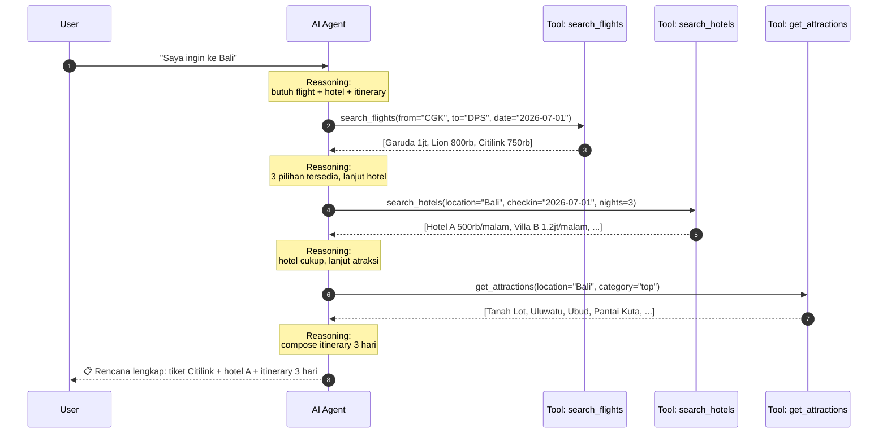
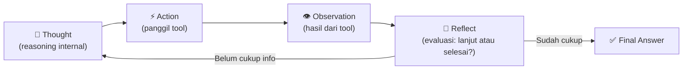
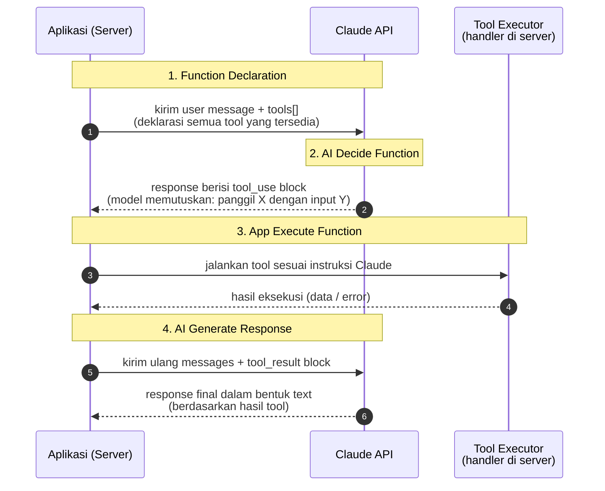
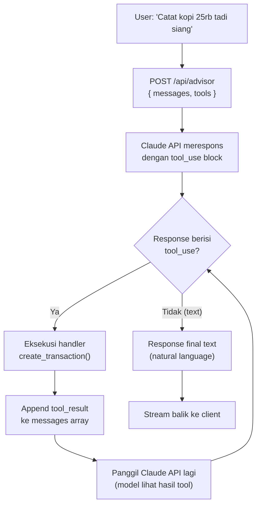
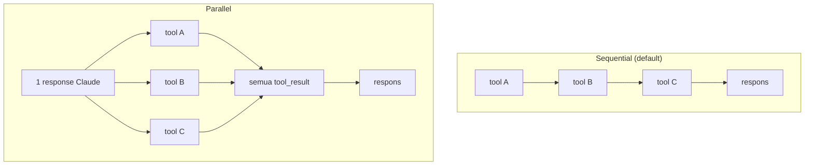

# Module 08 — AI Agent

> **Tujuan modul**: Anda memahami **paradigma AI Agent** — sistem AI otonom menjalankan tugas multi-langkah dengan reasoning + tools — menguasai pola **ReAct (Reasoning + Acting)**, lalu mengintegrasikan **function calling** ke chatbot AI Advisor di Fin-App agar Claude dapat **mencatat transaksi user lewat percakapan natural** ("Catat kopi 25rb tadi siang").
>
> **Output akhir modul**: chatbot Fin-App tidak hanya menjawab pertanyaan keuangan (RAG dari Module 07), tetapi juga **mengeksekusi action** ke database lewat tool `create_transaction`. Pipeline lengkap: user message → Claude decide tool → app execute insert → Claude konfirmasi natural.

# Section 1 — Konsep AI Agent

**Tujuan section**: memahami **apa itu AI Agent**, kemampuan intinya, dan pola **ReAct** sebagai cetak biru cara agent berpikir + bertindak.

## Apa itu AI Agent?

**AI Agent** adalah sistem AI yang **otonom** menjalankan tugas multi-langkah untuk mencapai tujuan tertentu, dengan kemampuan **bernalar** (reasoning) dan **berinteraksi dengan dunia luar** lewat **tools**.

Berbeda dengan chatbot biasa yang sudah Anda bangun di Module 04–07:

| Aspek | Chatbot Reguler (M04–07) | AI Agent (M08) |
|---|---|---|
| **Pola interaksi** | Satu shot: user tanya → AI jawab | Multi-step: user beri goal → AI eksekusi serangkaian langkah |
| **Inisiatif** | Pasif — tunggu instruksi spesifik | Proaktif — decompose goal jadi sub-task sendiri |
| **Dunia luar** | Hanya teks (mungkin retrieval di RAG) | Pakai tools: API, DB, file system, kalender, browser |
| **State** | Sebatas riwayat percakapan (multi-turn) | Maintain working memory + plan + observation log |
| **Kepastian output** | Selalu produk akhir (respons teks) | Bisa loop berkali-kali sebelum produce final answer |

> 📌 **Catatan**: Module 05 Section 4 (Agentic Workflow) sudah memperkenalkan `tool_use` di Claude API. Itu adalah **batu loncatan** menuju AI Agent penuh — tetapi belum mencakup pola **multi-step reasoning** + **memory** yang dibahas di module ini.

## Tiga Kemampuan Inti AI Agent

Setiap AI Agent yang baik memiliki tiga kemampuan fundamental:

### 1. Otonom (Autonomy)

Agent bisa eksekusi tugas **tanpa intervensi user di setiap step**. User cukup memberi goal (tujuan tingkat tinggi), agent breakdown jadi sub-task dan eksekusi sendiri.

Contoh:
- User: "Saya ingin ke Bali minggu depan dengan budget Rp 3 juta"
- Agent: secara otonom cari tiket → bandingkan harga → cari hotel → rancang itinerary → present rencana final

### 2. Reasoning (Penalaran)

Agent bisa **decompose problem kompleks** jadi langkah-langkah logis. Bukan sekadar menebak satu jawaban — tapi memikirkan "untuk capai X, saya butuh Y, dan untuk Y butuh Z dulu".

Contoh reasoning yang baik:
- "User mau ke Bali. Butuh: (1) tiket pesawat, (2) penginapan, (3) itinerary aktivitas, (4) estimasi biaya total. Mulai dari yang paling membatasi: tiket pesawat ada di tanggal yang user inginkan?"

### 3. Integrasi Tools

Agent bisa memanggil **tools eksternal** — API, database, browser, file system — untuk mengakses dunia nyata. Ini yang membedakan agent dari chatbot: agent **menjalankan** sesuatu, bukan hanya **bercerita** tentangnya.

Tools umum:
- **Information retrieval**: search engine, RAG, database query
- **Computation**: kalkulator, code executor
- **Side effects**: kirim email, buat kalender event, panggil API pihak ketiga
- **File system**: baca/tulis file lokal

## Contoh Konkret: "Saya Ingin ke Bali"

Skenario klasik untuk memahami agent. User memberi goal sederhana, agent eksekusi serangkaian langkah:



Perhatikan: user **tidak diminta** ke mana harus klik atau API mana yang dipanggil. Agent yang merencanakan semuanya.

## Pola ReAct (Reasoning + Acting)

**ReAct** adalah pola interaksi paling fundamental untuk AI Agent. Diperkenalkan dalam paper "ReAct: Synergizing Reasoning and Acting in Language Models" (Yao et al., 2023). Inti idenya: agent berpikir dan bertindak **bergantian** dalam loop sampai goal tercapai.

### Loop ReAct



### Anatomi Setiap Langkah

| Langkah | Pertanyaan yang Dijawab | Output Konkret |
|---|---|---|
| **Thought** | "Apa yang harus saya lakukan sekarang? Info apa yang masih kurang?" | Reasoning text internal (chain-of-thought) |
| **Action** | "Tool mana yang harus dipanggil + parameter apa?" | Tool call (mis. `search_flights(from="CGK", ...)`) |
| **Observation** | "Apa yang dikembalikan tool tersebut?" | Hasil eksekusi tool (data, error, atau null) |
| **Reflect** | "Apakah saya sudah punya cukup info untuk jawab final? Atau perlu langkah lain?" | Continue loop / produce final answer |

### Contoh ReAct untuk "Saya Ingin ke Bali"

Berikut transcript ReAct yang konkret — bayangkan ini adalah log internal agent:

```
=== Iterasi 1 ===
Thought: User ingin ke Bali. Saya butuh tahu tanggal & budget dulu,
         tapi untuk contoh ini asumsi 3 hari minggu depan.
         Mulai dari tiket pesawat — paling membatasi.

Action: search_flights(from="CGK", to="DPS", date="2026-07-01")

Observation: [
  { airline: "Garuda", price: 1000000, time: "07:00" },
  { airline: "Lion",   price: 800000,  time: "09:30" },
  { airline: "Citilink", price: 750000, time: "11:00" }
]

Reflect: 3 pilihan flight ada. Citilink termurah. Lanjut cari hotel.

=== Iterasi 2 ===
Thought: Sekarang butuh penginapan untuk 3 malam. Asumsi user budget
         tengah, pilih hotel mid-range.

Action: search_hotels(location="Bali", checkin="2026-07-01", nights=3)

Observation: [
  { name: "Hotel A", price: 500000, rating: 4.2 },
  { name: "Villa B", price: 1200000, rating: 4.8 },
  ...
]

Reflect: Hotel A bagus & terjangkau. Lanjut cari aktivitas.

=== Iterasi 3 ===
Thought: Butuh rekomendasi tempat wisata. Cari yang top-rated.

Action: get_attractions(location="Bali", category="top")

Observation: ["Tanah Lot", "Uluwatu", "Ubud Monkey Forest",
              "Pantai Kuta", "Tegallalang Rice Terrace", ...]

Reflect: Sudah cukup data. Compose itinerary final.

=== Final Answer ===
📋 Rencana 3 hari ke Bali:
- Tiket: Citilink CGK→DPS, 1 Juli 2026, Rp 750.000
- Hotel: Hotel A (Seminyak), 3 malam, Rp 1.500.000
- Itinerary:
  Hari 1: Tanah Lot + Uluwatu sunset
  Hari 2: Ubud Monkey Forest + Tegallalang
  Hari 3: Pantai Kuta + shopping
- Total estimasi: Rp 2.250.000 (sebelum makan & oleh-oleh)
```

## Mengapa Pola ReAct Penting?

ReAct bukan satu-satunya pola agent, tapi yang paling fundamental. Empat alasan utama:

1. **Transparansi** — setiap langkah Thought & Action terlihat di log. Bukan black-box. User/developer bisa baca: "Oh agent memutuskan cari tiket dulu karena tanggal yang paling membatasi."

2. **Debugging** — kalau hasil agent salah, bisa di-trace ke Thought atau Action mana yang gagal. Contoh: "Thought iterasi 2 salah asumsi budget tengah — harusnya tanya user dulu."

3. **Recovery dari kegagalan** — kalau tool gagal (mis. API timeout, hasil kosong), agent bisa reasoning ulang di iterasi berikutnya: "Hotel search gagal — coba pakai filter lebih longgar atau location alternatif."

4. **Composability** — bisa kombinasikan banyak tools secara dinamis. Agent tidak perlu di-hardcode "flight dulu, hotel kedua, atraksi ketiga" — ia memutuskan urutan sendiri berdasarkan reasoning.

## Hubungan ReAct dengan Tool Use Claude

Anda mungkin ingat **Module 05 Section 4 — Agentic Workflow** yang memperkenalkan `tool_use` di Claude API. Itu **implementasi konkret dari pola ReAct** di stack Claude:

| ReAct Konseptual | Claude API (Module 05) |
|---|---|
| **Thought** | Internal reasoning model — tidak selalu terlihat di response (kadang terlihat di `thinking` block kalau extended thinking aktif) |
| **Action** | `content_block` bertipe `tool_use` dengan tool name + JSON input |
| **Observation** | Anda kirim balik `tool_result` block sebagai konteks turn berikutnya |
| **Reflect** | Model otomatis: di turn berikutnya, ia akan baik produce `tool_use` lain (lanjut loop) atau text final (selesai) |

Jadi Anda **sudah punya** primitif untuk membangun ReAct agent — yang belum Anda punya adalah:
- Pattern loop yang bersih (sampai kapan stop?)
- Memory antar iterasi (selain riwayat messages)
- Error handling saat tool gagal
- Multi-tool orchestration

Section-section berikutnya (menyusul) akan menjawab semuanya.

## Variasi & Evolusi Agent

ReAct adalah fondasi. Tapi industri sudah berkembang ke pola yang lebih canggih:

| Pola | Karakteristik | Use Case |
|---|---|---|
| **Naive ReAct** | Thought → Action → Observation loop. Satu agent, satu loop. | Default untuk task tunggal. Section 2 akan implement ini. |
| **Plan-and-Execute** | Agent buat plan lengkap di awal, lalu eksekusi step-by-step. | Task yang strukturnya jelas, ingin estimasi dulu sebelum eksekusi. |
| **Reflexion** | Agent self-critique hasilnya, retry kalau jelek. | Task yang butuh kualitas tinggi (writing, coding). |
| **Multi-agent** | Beberapa agent kolaborasi (mis. researcher + writer + critic). | Task kompleks dengan sub-domain berbeda. |
| **Tree-of-Thoughts** | Eksplorasi banyak Thought branch sebelum eksekusi. | Problem solving dengan banyak path possible. |

Module 08 fokus pada **Naive ReAct** dulu sebagai fondasi. Variasi lain akan disinggung di section lanjutan kalau relevan.

## Kapan AI Agent TIDAK Tepat?

Agent powerful, tapi jangan over-engineer. Hindari kalau:

- ❌ Task bisa diselesaikan **single prompt** (mis. "summarize this article") — pakai Claude biasa saja.
- ❌ Task **deterministik** dengan flow yang jelas (mis. "validate form input → save to DB") — pakai kode imperatif biasa.
- ❌ Task **mission-critical** tanpa human-in-the-loop — agent bisa salah, dan kalau action-nya destruktif (mis. transfer uang, hapus data), tanpa konfirmasi user bisa katastropik.
- ❌ Latensi-sensitif — ReAct loop = banyak round-trip API → respons lambat (10–60 detik biasa).

**Rule of thumb**: pakai agent kalau task punya 3+ langkah, butuh reasoning dinamis, dan tidak ada cara deterministik yang lebih sederhana.

Lanjutkan ke `latihan.md` Section 1 untuk latihan konseptual — Anda akan menulis transcript ReAct manual untuk memperkuat intuisi sebelum coding.

---

# Section 2 — Tools & Function Calling

**Tujuan section**: memahami **jenis-jenis tools** yang tersedia di Claude API, cara kerja **function calling** untuk tools custom (konek API/database), dan implementasi konkret tool `create_transaction` di Fin-App agar Claude dapat **mencatat pengeluaran user lewat percakapan natural**.

## Apa itu Tools & Function Calling?

**Tools** (dalam konteks Claude API) adalah **kemampuan eksternal** yang Anda berikan ke model agar ia dapat berinteraksi dengan dunia di luar teks — memanggil API, query database, baca file, eksekusi kode, dll.

**Function calling** adalah pola di mana model **memutuskan sendiri** tool mana yang perlu dipanggil + parameter apa, lalu **aplikasi Anda yang mengeksekusi** tool tersebut dan mengembalikan hasilnya ke model.

Bedakan dua peran:

| Peran | Yang melakukan |
|---|---|
| **Memutuskan** tool mana dipanggil + parameter | Claude (model) |
| **Mengeksekusi** tool (jalankan kode, akses DB, panggil API) | Aplikasi Anda (server) |
| **Menyusun jawaban** dengan hasil tool | Claude (model), di turn berikutnya |

Pemisahan ini penting: model tidak punya akses langsung ke DB atau internet — ia hanya **menghasilkan instruksi** dalam bentuk `tool_use` block. Aplikasi Anda yang menjalankan instruksi tersebut.

## Jenis Tools di Claude API

Claude API menawarkan dua kategori besar:

### 1. Built-in Tools (Server-Side, dikelola Anthropic)

Anthropic menyediakan beberapa tools yang **siap pakai** tanpa Anda perlu implementasi eksekusinya — Anthropic yang menjalankan, Anda hanya enable dan terima hasilnya.

| Tool | Kemampuan | Use Case |
|---|---|---|
| **Web Search** | Cari informasi terkini di web | Pertanyaan tentang berita / fakta terbaru |
| **Web Fetch** | Ambil konten URL tertentu | Summarize artikel, analisis halaman web |
| **Code Execution** | Jalankan kode Python di sandbox | Komputasi numerik, data analysis, plotting |
| **Computer Use** | Kontrol komputer (mouse, keyboard, screen) | Automasi UI, testing |
| **Text Editor** | Baca/tulis/edit file lokal | Coding assistant (dipakai Claude Code) |
| **Bash** | Jalankan perintah shell | DevOps task, file system operations |

> 📌 Built-in tools praktis tapi punya **batasan kontrol** — Anda tidak bisa custom logic-nya. Kalau use case Anda butuh akses ke Supabase Fin-App, Anda **harus pakai function calling custom**.

### 2. Custom Function Calling (Anda Yang Implementasi)

Inilah pola yang akan Anda pakai di Fin-App. Anda mendefinisikan tools sendiri yang sesuai kebutuhan:

| Kategori | Contoh Tool Custom | Implementasi |
|---|---|---|
| **Konek Database** | `get_transactions(filters)`, `create_transaction(data)`, `get_balance_summary()` | Query/Insert ke Supabase via Postgres client |
| **Konek API Eksternal** | `search_flights(from, to, date)`, `get_weather(city)`, `send_email(to, body)` | Fetch ke third-party API |
| **Komputasi Custom** | `calculate_compound_interest(principal, rate, years)`, `format_idr(amount)` | TypeScript function lokal |
| **File System** | `read_csv(path)`, `export_pdf(data)` | Node.js fs module |
| **Side Effects** | `create_calendar_event`, `send_slack_notification`, `trigger_webhook` | Memanggil service eksternal |

Module 05 Section 4 sebenarnya sudah memperkenalkan function calling dasar (tool use). Section 2 ini memperdalam: anatomi tool declaration, flow lengkap, dan studi kasus konkret.

## Flow Function Calling (4 Langkah)

Flow ini adalah **kontrak inti** antara aplikasi Anda dan Claude API. Pahami sampai mendetail karena setiap implementasi function calling mengikuti pola ini.



### Detail Setiap Langkah

#### Langkah 1: Function Declaration

Aplikasi mendeklarasikan **daftar tools** yang model bisa pakai. Setiap tool punya:

```ts
{
  name: "create_transaction",
  description: "Catat transaksi baru (income/expense) ke database Fin-App user.",
  input_schema: {
    type: "object",
    properties: {
      type:        { type: "string", enum: ["income", "expense"] },
      amount:      { type: "number", description: "Nominal dalam Rupiah" },
      category:    { type: "string", description: "Kategori, mis. 'food', 'transport'" },
      description: { type: "string", description: "Deskripsi singkat" },
    },
    required: ["type", "amount", "category", "description"],
  },
}
```

> 📌 **Description sangat penting** — itulah yang dibaca Claude untuk memutuskan kapan & bagaimana memanggil tool. Tulis sejelas mungkin.

#### Langkah 2: AI Decide Function

Berdasarkan user message + tool declarations, Claude **memutuskan**:
- Apakah perlu panggil tool sama sekali? (kalau tidak, jawab langsung text)
- Tool mana yang dipanggil?
- Parameter apa yang dipassing?

Response Claude akan berisi `tool_use` block:

```json
{
  "type": "tool_use",
  "id": "toolu_abc123",
  "name": "create_transaction",
  "input": {
    "type": "expense",
    "amount": 25000,
    "category": "food",
    "description": "Kopi di Starbucks"
  }
}
```

#### Langkah 3: App Execute Function

Aplikasi Anda **menjalankan** tool sesuai instruksi. Ini kode normal — bukan AI. Misalnya untuk `create_transaction`:

```ts
async function executeCreateTransaction(input: CreateTransactionInput) {
  const { data, error } = await supabase
    .from("transactions")
    .insert({ ...input, user_id: getCurrentUserId() })
    .select()
    .single();

  if (error) throw new Error(error.message);
  return data; // { id, type, amount, ... }
}
```

Hasilnya dikemas dalam `tool_result` block:

```json
{
  "type": "tool_result",
  "tool_use_id": "toolu_abc123",
  "content": "{ \"id\": 42, \"type\": \"expense\", \"amount\": 25000, ... }"
}
```

#### Langkah 4: AI Generate Response

Aplikasi kirim ulang messages array (dengan `tool_result` ditambahkan) ke Claude. Claude membaca hasilnya dan **menyusun respons final** untuk user:

> "Sip, sudah dicatat: pengeluaran Rp 25.000 untuk kopi di Starbucks (kategori food). Saldo Anda sekarang Rp X."

User melihat ini sebagai chat reply biasa — proses 4-langkah tadi sepenuhnya **transparan** baginya.

## Anatomi Pipeline End-to-End (di Route Handler Next.js)



**Loop point**: kalau Claude mengembalikan `tool_use` lagi setelah `tool_result`, ulangi langkah 3–4. Ini cara model bisa chain beberapa tool calls. Pasang **max iterations** (mis. 5) untuk safety.

## Mendaftarkan Multiple Tools + Mengontrol `tool_choice`

Saat aplikasi punya lebih dari satu tool (mis. di Fin-App: simpan, hapus, ubah transaksi), Anda mendaftarkannya dalam **array `tools`** dan mengatur **`tool_choice`** untuk mengarahkan perilaku Claude.

```ts
const resp = await client.messages.create({
  model: "claude-haiku-4-5",
  max_tokens: 1024,
  system: QUICK_ADD_SYSTEM,
  tools: [
    SAVE_TRANSACTION_TOOL,
    DELETE_TRANSACTION_TOOL,
    UPDATE_TRANSACTION_TOOL,
  ],
  tool_choice: { type: "any" },
  messages: [{ role: "user", content: text }],
});
```

### Anatomi Parameter `tools`

`tools` adalah **array `Anthropic.Messages.Tool[]`** yang Anda kirim **setiap request**. Tiap entry punya 3 field wajib:

| Field | Fungsi |
|---|---|
| `name` | Identifier unik (snake_case). Yang Claude pakai untuk memanggil + yang dispatcher Anda baca untuk routing handler. |
| `description` | Penjelasan natural language yang **dibaca Claude** untuk memutuskan kapan tool ini cocok dipakai. **Ini bagian terpenting** — semakin jelas KAPAN dan JANGAN PAKAI, semakin akurat keputusan Claude. |
| `input_schema` | JSON Schema yang mendefinisikan field input + tipe + validasi. Claude wajib mematuhi schema ini saat menghasilkan `tool_use.input`. |

Order entry di array tidak menentukan prioritas — Claude pilih berdasarkan **kesesuaian description dengan intent user**, bukan urutan. Tapi keep order yang konsisten (mis. CRUD: Create → Read → Update → Delete) supaya developer mudah membaca.

> 💡 **Berapa banyak tools yang ideal?** Untuk model Claude 4.x, hingga ~10 tools masih konsisten. Lewat itu Claude mulai bingung memilih — pertimbangkan grouping/hierarchical tools atau routing tier (tier 1: "kategorisasi intent → choose subset tools").

### Tiga Mode `tool_choice`

Parameter `tool_choice` mengontrol **apakah Claude harus, boleh, atau wajib** memanggil tool tertentu. Tiga mode utama:

| `tool_choice` | Arti | Kapan dipakai |
|---|---|---|
| `{ type: "auto" }` (default kalau tidak disertakan) | Claude **bebas memilih**: jawab tekstual atau panggil 1+ tool. | Chatbot umum di mana sebagian pertanyaan tidak butuh tool (mis. _"apa itu inflasi?"_ vs _"berapa saldo saya?"_). |
| `{ type: "any" }` | Claude **wajib panggil tool minimal 1×** (apa saja dari array `tools`). Tidak boleh jawab tekstual murni. | Endpoint khusus action seperti `quickAddTransaction` — kita selalu ingin ada eksekusi DB, bukan respons "saya tidak yakin". |
| `{ type: "tool", name: "X" }` | Claude **wajib panggil tool spesifik** `X`. Tool lain di array di-abaikan untuk request ini. | Parser dengan output ter-struktur ketat (mis. Module 09 receipt extraction) — kita sudah tahu pasti tool mana yang harus dipanggil. |

> 💡 **Mengapa Module 08 latihan pakai `any`, bukan `auto`?** Quick-add adalah pipeline yang **selalu** menghasilkan action (save/delete/update). Kalau `auto`, ada risiko Claude menjawab _"saya tidak yakin apa yang Anda maksud"_ tanpa memanggil tool — user tidak dapat hasil apa pun. `any` mencegah ini dengan memastikan minimal satu tool ter-trigger. Kalau salah, tinggal diperbaiki oleh user lewat input berikutnya.

### Single vs Multiple Tool Call per Response

Walaupun `tool_choice: "any"` mewajibkan **minimal** satu panggilan tool, Claude bisa mengembalikan **beberapa** `tool_use` block dalam satu response — tergantung apa yang dimaksud user di input. Aplikasi Anda yang memutuskan bagaimana memprosesnya:

| Strategi extract | Cocok untuk |
|---|---|
| `.find((b) => b.type === "tool_use")` — ambil pertama, abaikan sisa | Tahap belajar single-tool, atau ketika Anda benar-benar hanya butuh satu action per request. |
| `.filter((b) => b.type === "tool_use")` + `Promise.all` | Multi-action atau mixed action dalam satu kalimat user (mis. _"ngopi 25rb dan hapus parkir kemarin"_) — dibahas di Parallel Function Calling section berikutnya. |

## Parallel Function Calling

Sejauh ini kita anggap Claude memanggil **satu** tool per turn. Tetapi Claude API mendukung **parallel function calling** — beberapa `tool_use` block dalam **satu response**, yang aplikasi Anda dapat eksekusi secara bersamaan.

### Kapan Berguna?

Ketika user query butuh **multiple independent data** yang tidak saling bergantung:

> _"Tampilkan ringkasan keuangan saya: total expense food, total income bulan ini, dan 3 transaksi terbesar."_

Tanpa parallel: Claude harus 3 turn — query food, lalu income, lalu top transactions. Total latensi = 3× API + 3× DB roundtrip.

Dengan parallel: Claude mengeluarkan **3 `tool_use` block** sekaligus, app eksekusi paralel via `Promise.all`, semua selesai dalam waktu yang hampir sama dengan 1 query.

### Anatomi Response Paralel

Claude mengembalikan **array content blocks** dengan beberapa `tool_use`:

```ts
response.content = [
  { type: "text", text: "Saya akan ambil data berikut..." },
  { type: "tool_use", id: "tu_1", name: "get_total_by_category", input: { category: "food" } },
  { type: "tool_use", id: "tu_2", name: "get_total_income", input: { month: "2026-06" } },
  { type: "tool_use", id: "tu_3", name: "get_top_transactions", input: { limit: 3 } },
];
```

App memprosesnya:

```ts
const toolUseBlocks = response.content.filter((c) => c.type === "tool_use");

// Eksekusi semua tool paralel
const results = await Promise.all(
  toolUseBlocks.map(async (tu) => ({
    type: "tool_result" as const,
    tool_use_id: tu.id,
    content: JSON.stringify(await executeToolByName(tu.name, tu.input)),
  }))
);

// Kirim semua tool_result ke Claude dalam satu user message
messages.push({ role: "user", content: results });
```

### Visualisasi



### Kapan TIDAK Pakai Parallel?

- Tool kedua **butuh hasil tool pertama** (mis. `get_user_id` → `get_user_balance(user_id)`). Claude akan otomatis chaining sequential — tidak perlu paksa paralel.
- Tool yang **side-effect** (insert/update DB) — paralel berisiko race condition. Lebih aman sequential dengan idempotency key.

> 📌 Parallel function calling **aktif by default** di model Claude 4.x. Tidak perlu setting khusus — Claude akan memutuskan sendiri kapan paralel masuk akal.

> 💡 **Multi-modal (image + PDF) tool use** dibahas terpisah di **[Module 09 — Multimodal & Document Understanding](../Module-09-Multimodal/materi.md)** — termasuk pipeline lengkap "upload foto kwitansi → vision baca struk → tool `save_receipt_transactions` (array items) → insert paralel ke `transactions`". Modul ini fokus pada text-only tool use.

## Best Practices

1. **Tool description sejelas mungkin** — itu satu-satunya cara Claude tahu kapan memakainya. Sertakan contoh penggunaan kalau perlu.
2. **Input schema strict** — pakai `enum`, `required`, validasi range. Lebih ketat schema, makin reliable hasil.
3. **Idempotency untuk action** — kalau tool dipanggil dua kali dengan input sama, jangan double-execute (mis. tambah `idempotency_key`).
4. **Error message yang model-friendly** — kalau tool gagal, return error dalam format yang Claude bisa pahami dan recover.
5. **Guardrail untuk action destruktif** — konfirmasi user sebelum execute `transfer_funds`, `delete_*`, dll.
6. **Logging setiap tool call** — penting untuk debugging dan audit (terutama action yang mengubah data).
7. **Batasi jumlah tools** — kalau ada >10 tools, model mulai bingung. Pertimbangkan group/hierarchical tools.

## Trade-off: Function Calling vs RAG vs Direct Prompt

Kapan pakai yang mana?

| Kebutuhan | Pakai |
|---|---|
| Pengetahuan **statis** (FAQ, artikel) | **RAG** (Module 07) |
| Pengetahuan **dinamis terstruktur** (saldo terkini, query DB) | **Function calling** (Section ini) |
| Komputasi numerik / format spesifik | **Function calling** (tool custom) |
| **Action / side effect** (insert, update, send) | **Function calling** (dengan guardrail) |
| Jawaban dari pengetahuan umum Claude | **Direct prompt** (tanpa tool) |

Sering ketiganya **dikombinasikan** dalam satu agent: RAG untuk FAQ, function calling untuk DB query + action, dan direct prompt untuk reasoning bridge antar-step.

Lanjutkan ke `latihan.md` untuk implementasi konkret **multi-tool + parallel function calling** di pipeline quick-add yang sudah ada — dibangun **bertahap** dalam 3 prompt:
- **Prompt 1**: definisi 2 tool baru (`delete_transactions` + `update_transaction`) + handler-nya, tanpa menyentuh `quickAddTransaction`.
- **Prompt 2**: wire ketiga tool (save + delete + update) ke `quickAddTransaction` lewat dispatcher — **single tool per request** (`.find`).
- **Prompt 3**: upgrade ke **parallel** — `.filter` + `Promise.all` supaya bisa _"ngopi 25rb dan hapus parkir kemarin"_ (mixed save+delete dalam satu kalimat).

---

## Recap

**Section 1 — Konsep AI Agent:**

- **AI Agent** = sistem otonom multi-step dengan reasoning + tools.
- **Tiga kemampuan inti**: otonom, reasoning, integrasi tools.
- **Pola ReAct** = Thought → Action → Observation → Reflect → (loop atau selesai).
- Contoh "Saya ingin ke Bali" mendemonstrasikan multi-step autonomous planning.
- Claude API `tool_use` (Module 05) adalah primitif untuk implement ReAct di Claude.
- Kapan jangan pakai agent: task single-shot, deterministik, atau mission-critical tanpa human-in-loop.

**Section 2 — Tools & Function Calling:**

- **Tools** = kemampuan eksternal yang aplikasi berikan ke Claude (API, DB, file, dll.).
- **Function calling** = pemisahan peran: Claude memutuskan, aplikasi mengeksekusi.
- **Dua kategori tools di Claude API**: built-in (web search, code exec, computer use) dan custom (Anda implementasi).
- **Tiga kategori use case**: menambah pengetahuan (data dinamis), memperluas kemampuan (komputasi presisi), melakukan action (side effects).
- **Flow 4-langkah**: Declaration → AI Decide → App Execute → AI Generate Response. Bisa loop kalau multi-tool.
- **Parallel function calling**: Claude bisa kembalikan beberapa `tool_use` block dalam satu response — aplikasi eksekusi paralel via `Promise.all`. Pattern ini yang kita pakai di latihan untuk multi-transaksi quick-add.
- **Best practices**: description jelas, schema strict, idempotency untuk action, guardrail untuk destructive ops.

**Section 3+ menyusul**: ReAct loop runtime (multi-iteration agent), memory antar percakapan, error recovery & fallback, multi-agent coordination.
