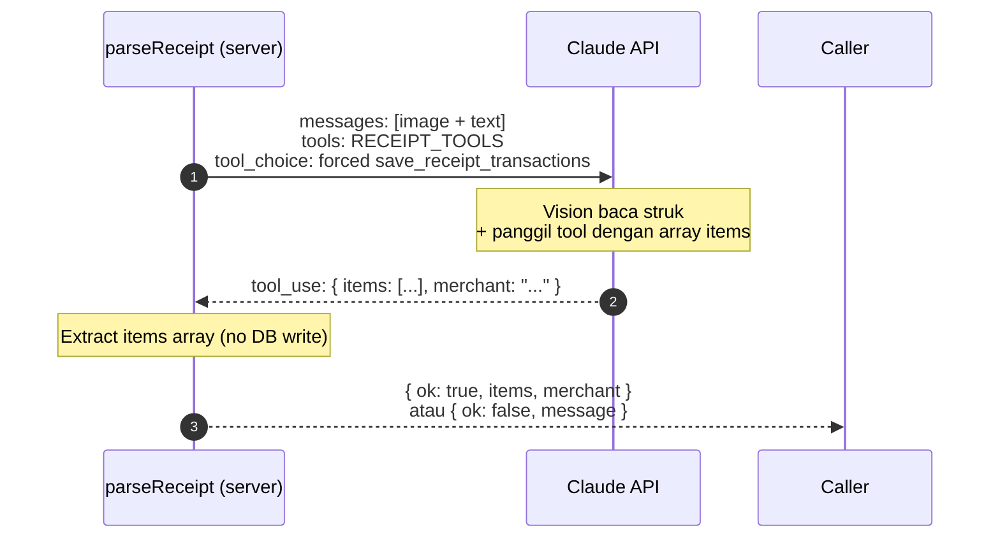
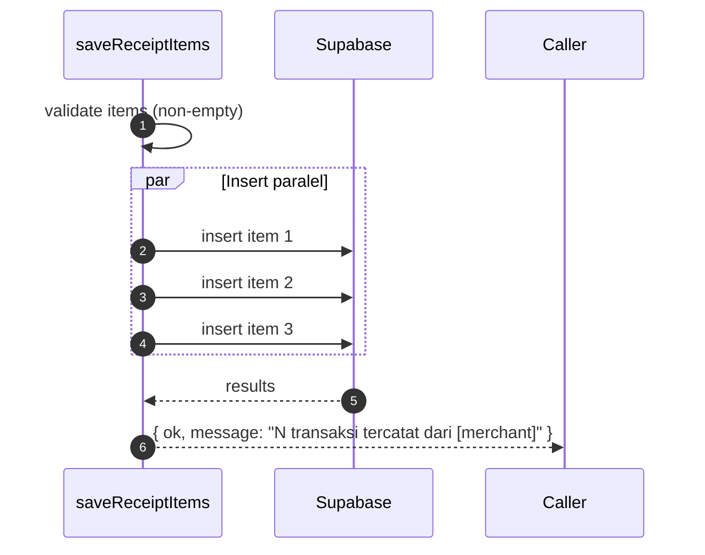

# Section 3 — Receipt Extraction + Auto-Insert ke `transactions`

> Bagian dari **[Module 09 — Latihan](./latihan.md)**. Lanjutan dari **[Section 2 — Upload UI + Base64 Pipeline](./latihan-2-upload-ui.md)**.

> Di section ini kita **lengkapi `parseReceipt`** dengan pendekatan **human-in-the-loop**. Pipeline: foto base64 → Claude vision + tool use `save_receipt_transactions` (force tool choice) → array items dikembalikan ke client → **modal validasi editable** → user konfirmasi → insert paralel ke `transactions`. Setelah selesai, user upload foto struk → modal muncul → user verifikasi/edit → klik Simpan → 200–500ms semua transaksi tercatat. Tiga prompt siap copy-paste.
>
> **Alur belajarnya**: deklarasi tool `save_receipt_transactions` (untuk array items) → upgrade `parseReceipt` jadi 2 server action (parse only + saveReceiptItems) → tambah modal validasi editable di UI lalu test 3 skenario foto.
>
> **Estimasi waktu**: 70–90 menit.

## Prasyarat Section 3

- [ ] Section 1 & 2 selesai. Script vision PoC jalan + UI upload pipeline kirim base64 ke server.
- [ ] Module 05 Section 5 selesai. Pattern tool use (`SAVE_TRANSACTION_TOOL` + `quickAddTransaction`) sudah familiar.
- [ ] Module 08 Section 2 selesai. Anda paham `tool_choice: { type: "tool", name: "..." }` untuk force panggil tool.
- [ ] Tabel `transactions` siap menerima insert (kolom: id, type, category, amount, description, date, user_id nullable, embedding nullable, created_at).
- [ ] Anda punya 2–3 foto kwitansi nyata dengan kompleksitas berbeda (struk biasa, struk multi-item, struk dengan PPN) untuk test di Prompt 3.

> ⚠️ **Penting**: Section ini melakukan **insert ke DB tanpa konfirmasi user**. Untuk production wajib tambah review step. Di latihan ini kita prioritaskan demo flow end-to-end. Buat branch git baru sebelum mulai.

---

## 📚 Referensi Dokumentasi

- **[Anthropic tool use — forcing](https://docs.claude.com/en/docs/agents-and-tools/tool-use/implement-tool-use#forcing-tool-use)** — pattern `tool_choice: { type: "tool", name }` agar Claude wajib memanggil tool.
- **[Anthropic vision + tools](https://docs.claude.com/en/docs/build-with-claude/vision)** — image content block bisa digabung dengan tools dalam satu request.
- **[Supabase insert reference](https://supabase.com/docs/reference/javascript/insert)** — pattern insert single + batch.

---

## Prompt 1 — Deklarasi Tool `save_receipt_transactions` di `src/lib/tools.ts`

### Walkthrough Manual

Tool ini berbeda dengan `save_transaction` (Module 05 Section 5) yang menerima **single item**: struk biasanya berisi **banyak item**, jadi kita pakai schema dengan **array `items`**. Plus optional `merchant` untuk konteks tambahan.

📂 **File yang dimodifikasi/dibuat**: `src/lib/tools.ts` (extend dari Module 08, atau buat `src/lib/receipt-tools.ts` terpisah supaya lebih modular).

**1. Tool definition dengan array items**

📍 Lokasi: ekspor baru `RECEIPT_TOOLS` (atau tambah ke `TOOLS` yang sudah ada — pilih sesuai preferensi arsitektur Anda). Saran: file terpisah supaya tool chatbot vs tool receipt-parser jelas pemisahannya.

```ts
// src/lib/tools.ts — atau src/lib/receipt-tools.ts
import type Anthropic from "@anthropic-ai/sdk";

export const RECEIPT_TOOLS: Anthropic.Messages.Tool[] = [
  {
    name: "save_receipt_transactions",
    description: `Ekstrak dan simpan SEMUA transaksi yang terlihat di struk/kwitansi.

KAPAN DIPAKAI:
- Setiap kali user mengirim foto struk/kwitansi.
- Panggil SEKALI dengan array items berisi SEMUA line item yang terbaca.

FIELD per item:
- amount: angka penuh Rupiah (integer positif).
- category: salah satu dari "food", "transport", "shopping", "bills",
  "entertainment", "health", "education", "other".
- description: nama item dari struk (≤40 char).
- date: tanggal struk ISO 8601 (YYYY-MM-DD). Default hari ini kalau tidak terbaca.

ATURAN PARSING:
- type per item SELALU "expense" (struk = pengeluaran user).
- Kalau struk berisi 1 total saja tanpa breakdown, return 1 item dengan
  description = nama merchant / jenis pembayaran.
- Skip baris non-transaksi (header struk, footer, "Subtotal", "Kembalian",
  "Tunai", "Diterima").
- Untuk PPN/pajak: ada 2 opsi:
  (a) Distribusikan proporsional ke amount item terkait (lebih akurat),
      atau
  (b) Buat 1 item terpisah dengan description "PPN" category "other".
  Pilih (a) kalau jumlah item ≤ 5 (mudah dibagi), (b) kalau banyak.
- merchant: opsional, nama toko/kafe untuk konteks user di respons.`,
    input_schema: {
      type: "object" as const,
      properties: {
        items: {
          type: "array",
          description: "Array semua line item yang terbaca dari struk",
          items: {
            type: "object",
            properties: {
              amount: { type: "number", description: "Nominal Rupiah (integer positif)" },
              category: { type: "string", description: "Kategori (food/transport/shopping/bills/entertainment/health/education/other)" },
              description: { type: "string", description: "Nama item dari struk (≤40 char)" },
              date: { type: "string", description: "ISO 8601 YYYY-MM-DD" },
            },
            required: ["amount", "category", "description", "date"],
          },
        },
        merchant: { type: "string", description: "Nama merchant/toko dari struk (opsional)" },
      },
      required: ["items"],
    },
  },
];
```

> 💡 **Mengapa tool terpisah dari `save_transaction` (Module 05)?** Schema-nya beda: receipt punya `items[]` (array), `save_transaction` single object. Pisah agar prompt + handler tetap clean. Plus kita tidak ingin Claude bingung memilih tool mana untuk receipt vs quick-add text.

### Yang sebaiknya tidak dilakukan

- ❌ Memakai `save_transaction` (Module 05) untuk receipt — schema-nya single item, tidak cocok untuk struk multi-item.
- ❌ Menerima `type` per item di schema — receipt selalu expense, hindari ambiguitas.
- ❌ Mengizinkan `category` sebagai string bebas (tanpa enum guidance di description) — Claude bisa keluar dari kategori yang Fin-App pakai.
- ❌ Memakai `tool_choice: "auto"` di Section 3 — receipt parser harus **force** call tool, jangan biarkan Claude jawab dengan text panjang.

### Verifikasi setelah file dibuat/diubah

1. File yang berisi `RECEIPT_TOOLS` ada (di `tools.ts` atau `receipt-tools.ts` terpisah).
2. Ekspor `RECEIPT_TOOLS: Anthropic.Messages.Tool[]` dengan 1 tool `save_receipt_transactions`.
3. Schema punya `items: array` dengan field per-item required: `amount`, `category`, `description`, `date`.
4. `npx tsc --noEmit` clean.
5. Description tool punya section KAPAN DIPAKAI + FIELD + ATURAN PARSING (handling PPN dll.).

---

**Silakan salin prompt berikut, lalu paste ke Claude Code:**

```
Tambah tool definition save_receipt_transactions untuk
ekstraksi multi-item dari foto kwitansi. Tool ini terpisah
dari save_transaction (Module 05 Section 5) karena schema-nya
berbeda (array items vs single object).

GOAL:
- Buat file baru src/lib/receipt-tools.ts (atau extend
  src/lib/tools.ts — pilih sesuai preferensi arsitektur).
- Ekspor RECEIPT_TOOLS: Anthropic.Messages.Tool[] berisi 1 tool:
  save_receipt_transactions.

- Schema input_schema:
  - items: array of object, required:
    - amount: number (Rupiah integer)
    - category: string (enum food/transport/shopping/bills/
      entertainment/health/education/other)
    - description: string ≤40 char
    - date: string ISO 8601 (YYYY-MM-DD)
  - merchant: string opsional
  - required: ["items"]

- Description tool WAJIB punya section:
  KAPAN DIPAKAI:
  - Setiap kali user kirim foto struk/kwitansi.
  - Panggil SEKALI dengan array items berisi semua line item.

  FIELD per item:
  - (jelaskan amount, category enum, description ≤40 char,
    date ISO default hari ini).

  ATURAN PARSING:
  - type per item SELALU "expense" (struk = pengeluaran).
  - Struk 1 total saja → 1 item description = merchant name.
  - Skip baris non-transaksi (Subtotal, Kembalian, Tunai, dll.).
  - PPN handling: distribusi proporsional kalau item ≤5,
    item terpisah "PPN" category "other" kalau banyak.
  - merchant opsional untuk konteks respons.

CONTEXT:
- Tool ini dipanggil dengan tool_choice forced di Prompt 2
  (parseReceipt).
- Kategori sesuai dengan yang dipakai di transactions (food,
  transport, shopping, bills, entertainment, health, education,
  other).
- Pattern Anthropic.Messages.Tool[] sama dengan TOOLS di Module
  08 Section 2.

GUARDRAIL:
- JANGAN duplikat / extend save_transaction Module 05 —
  schema berbeda (array vs single).
- JANGAN expose type di schema item — receipt selalu expense.
- JANGAN bikin category sebagai string bebas tanpa enum
  guidance — kategori harus match yang dipakai di Fin-App.
- WAJIB `type: "object" as const` untuk TypeScript happy.
- WAJIB items.items.required lengkap (amount, category,
  description, date).
```

**Verifikasi singkat:**

1. File yang berisi `RECEIPT_TOOLS` ada.
2. Schema valid dengan `items: array` + required field per item.
3. Description punya section KAPAN/FIELD/ATURAN PARSING.
4. `npx tsc --noEmit` clean.

---

## Prompt 2 — Upgrade `parseReceipt` ke Vision + Tool Call (parse-only, NO insert)

### Walkthrough Manual

Sekarang inti integrasi: ganti placeholder `parseReceipt` (Section 2 Prompt 1) dengan implementasi vision + tool call. **PENTING:** parsing dan insert ke DB sekarang **dipisah** menjadi 2 server action. `parseReceipt` hanya mengembalikan hasil ekstraksi; insert dilakukan oleh `saveReceiptItems` setelah user mengkonfirmasi via modal validasi di Prompt 3.

Alur internal `parseReceipt`:



Alur internal `saveReceiptItems` (server action terpisah untuk Prompt 3):



📂 **File yang dimodifikasi**: `src/features/receipt-parser.ts` (skeleton dari Section 2).

**1. Imports**

📍 Lokasi: baris atas.

```ts
// src/features/receipt-parser.ts
"use server";

import Anthropic from "@anthropic-ai/sdk";
import { createClient } from "@/lib/supabase/server";
import { RECEIPT_TOOLS } from "@/lib/receipt-tools";  // atau "@/lib/tools" kalau Anda inline

const client = new Anthropic();

export type ReceiptItem = {
  amount: number;
  category: string;
  description: string;
  date: string;
};

export type ParseReceiptResult =
  | { ok: true; items: ReceiptItem[]; merchant?: string }
  | { ok: false; message: string };

export type SaveReceiptResult = {
  ok: boolean;
  message: string;
};
```

**2. Function `parseReceipt` (overwrite skeleton) — return items, JANGAN insert**

📍 Lokasi: replace function yang ada dari Section 2.

```ts
export async function parseReceipt(input: {
  base64: string;
  mediaType: string;
}): Promise<ParseReceiptResult> {
  const t0 = Date.now();

  const response = await client.messages.create({
    model: "claude-haiku-4-5",
    max_tokens: 2048,
    tools: RECEIPT_TOOLS,
    tool_choice: { type: "tool", name: "save_receipt_transactions" },
    messages: [
      {
        role: "user",
        content: [
          {
            type: "image",
            source: {
              type: "base64",
              media_type: input.mediaType as "image/jpeg" | "image/png" | "image/webp",
              data: input.base64,
            },
          },
          {
            type: "text",
            text: "Ini foto struk/kwitansi. Ekstrak SEMUA transaksi yang terlihat dan panggil tool save_receipt_transactions dengan array items lengkap.",
          },
        ],
      },
    ],
  });

  const visionMs = Date.now() - t0;
  console.log("[parseReceipt] vision:", { ms: visionMs, stop_reason: response.stop_reason });

  const toolUse = response.content.find((c) => c.type === "tool_use");
  if (!toolUse || toolUse.type !== "tool_use") {
    return { ok: false, message: "Claude tidak memanggil tool. Coba foto yang lebih jelas." };
  }

  const { items, merchant } = toolUse.input as { items: ReceiptItem[]; merchant?: string };
  console.log("[parseReceipt] extracted:", { merchant, count: items?.length ?? 0 });

  if (!items || items.length === 0) {
    return { ok: false, message: "Tidak ada item terbaca dari foto. Coba foto yang lebih jelas." };
  }

  // PENTING: JANGAN insert di sini. Kembalikan items ke client untuk validasi via modal.
  return { ok: true, items, merchant };
}
```

**3. Function `saveReceiptItems` (server action baru untuk insert setelah konfirmasi)**

📍 Lokasi: tambahkan di file yang sama, di bawah `parseReceipt`.

```ts
export async function saveReceiptItems(
  items: ReceiptItem[],
  merchant?: string,
): Promise<SaveReceiptResult> {
  if (!items || items.length === 0) {
    return { ok: false, message: "Tidak ada item untuk disimpan." };
  }

  const t0 = Date.now();
  const supabase = await createClient();

  const inserts = await Promise.all(
    items.map((item) =>
      supabase.from("transactions").insert({
        type: "expense",
        amount: item.amount,
        category: item.category,
        description: item.description.slice(0, 40),
        date: item.date,
      }),
    ),
  );

  const oks = inserts.filter((r) => !r.error).length;
  const fails = inserts.length - oks;
  console.log("[saveReceiptItems] inserts:", { oks, fails, totalMs: Date.now() - t0 });

  return {
    ok: fails === 0,
    message: `${oks} transaksi tercatat${merchant ? ` dari ${merchant}` : ""}${fails > 0 ? ` (${fails} gagal)` : ""}.`,
  };
}
```

> 💡 **Kenapa split jadi 2 server action?** Memberi user kesempatan **review & edit** sebelum data masuk DB. Claude vision bisa salah (PPN double-count, kategori miss-classified, harga ter-baca salah), jadi human-in-the-loop wajib untuk operasi destruktif/persisten. Pattern ini juga membuat retry murah — user bisa edit items lalu klik "Simpan" lagi tanpa charge Voyage/Claude.

> 💡 **Mengapa `tool_choice` force?** Tanpa force, Claude bisa jawab dengan text "saya tidak yakin struk ini bisa dibaca dengan baik" — yang tidak bisa kita parse. Force memastikan output selalu structured. Kalau benar-benar tidak bisa baca, items akan kosong dan kita handle terpisah.

### Yang sebaiknya tidak dilakukan

- ❌ **Insert ke DB di `parseReceipt`** — itu sudah pindah ke `saveReceiptItems` agar ada human-in-the-loop validation. Kalau insert di parse, modal validasi jadi tidak ada gunanya.
- ❌ Looping tool_use (multi-iteration) — receipt parser **single-shot**, tidak butuh ReAct loop. Force tool choice + extract sekali sudah cukup.
- ❌ Mengisi `user_id` dengan UUID acak — biarkan NULL (project belum punya auth, sama seperti `quickAddTransaction` Module 05).
- ❌ Embed `description` di sini — biarkan NULL. Kalau perlu di-embed nanti, jalankan backfill terpisah seperti Module 06 Section 3.
- ❌ Mengembalikan error mentah ke client — wrap di `message` string yang user-friendly.
- ❌ Skip logging — `[parseReceipt] vision` + `[saveReceiptItems] inserts` log penting untuk debugging "kenapa hasil parse aneh".
- ❌ Memakai `model: "claude-opus-4-7"` untuk struk biasa — Haiku cukup & lebih hemat. Upgrade hanya kalau Section 3 verifikasi nunjukin akurasi rendah.

### Verifikasi setelah file diubah

1. File `src/features/receipt-parser.ts` ter-upgrade (bukan lagi placeholder).
2. Imports lengkap: Anthropic, createClient, RECEIPT_TOOLS.
3. **Dua server action ekspor**: `parseReceipt` (return items, NO insert) + `saveReceiptItems` (insert paralel).
4. Type ekspor: `ReceiptItem`, `ParseReceiptResult`, `SaveReceiptResult`.
5. `tool_choice` di-force ke `save_receipt_transactions`.
6. `saveReceiptItems` pakai `Promise.all` untuk insert.
7. `npx tsc --noEmit` clean.
8. Belum di-test dari UI — modal validasi + test ada di Prompt 3.

---

**Silakan salin prompt berikut, lalu paste ke Claude Code:**

```
Upgrade parseReceipt (skeleton dari Section 2 Prompt 1)
menjadi 2 server action: parseReceipt (vision + tool call,
return items SAJA, NO insert) + saveReceiptItems (insert
paralel setelah user mengkonfirmasi via modal di Prompt 3).

GOAL:
- Modifikasi src/features/receipt-parser.ts.
- Tambah imports: Anthropic, createClient dari
  "@/lib/supabase/server", RECEIPT_TOOLS dari
  "@/lib/receipt-tools" (atau "@/lib/tools" kalau Anda inline).
- Ekspor types: ReceiptItem (amount, category, description, date),
  ParseReceiptResult (union: { ok:true, items, merchant? }
  | { ok:false, message }), SaveReceiptResult ({ ok, message }).
- const client = new Anthropic().

- Replace function parseReceipt(input): Promise<ParseReceiptResult>:
  1. Catat timing t0 = Date.now().
  2. await client.messages.create:
     - model: "claude-haiku-4-5"
     - max_tokens: 2048
     - tools: RECEIPT_TOOLS
     - tool_choice: { type: "tool", name: "save_receipt_transactions" }
     - messages: [{ role: "user", content: [image_block, text_block] }]
     - text_block: "Ini foto struk/kwitansi. Ekstrak SEMUA transaksi
       yang terlihat dan panggil tool save_receipt_transactions dengan
       array items lengkap."
  3. Log [parseReceipt] vision: { ms, stop_reason }.
  4. Cari tool_use block. Kalau tidak ada → return
     { ok:false, message: "Claude tidak memanggil tool. Coba foto
     yang lebih jelas." }.
  5. Extract { items, merchant }. Log [parseReceipt] extracted:
     { merchant, count }. Kalau items kosong → return
     { ok:false, message: "Tidak ada item terbaca dari foto." }.
  6. Return { ok:true, items, merchant }. JANGAN INSERT.

- Tambah function saveReceiptItems(items, merchant?):
  Promise<SaveReceiptResult>:
  1. Kalau items kosong → return { ok:false, message }.
  2. createClient(), Promise.all insert per item dengan payload:
     type "expense", amount, category, description.slice(0,40),
     date.
  3. Hitung oks/fails. Log [saveReceiptItems] inserts.
  4. Return { ok: fails===0, message: "${oks} transaksi tercatat
     ${merchant?dari merchant:''}${fails>0?(${fails} gagal):''}." }.

CONTEXT:
- Skeleton parseReceipt sudah ada dari Section 2 Prompt 1.
- RECEIPT_TOOLS sudah dibuat di Prompt 1 Section ini.
- Modal validasi di Prompt 3 akan: terima items dari parseReceipt,
  user edit/hapus, lalu panggil saveReceiptItems untuk commit.
- Pattern createClient supabase sama dengan
  quickAddTransaction Module 05.

GUARDRAIL:
- WAJIB pisah parse vs save jadi 2 server action — itu inti
  human-in-the-loop. JANGAN insert di parseReceipt.
- JANGAN loop tool_use — receipt parser single-shot.
- JANGAN isi user_id (biarkan NULL).
- JANGAN embed description di sini.
- JANGAN expose error mentah Supabase ke client — wrap di
  message user-friendly.
- WAJIB tool_choice forced supaya output selalu structured.
- WAJIB log vision timing + extracted count + insert results.
- Truncate description.slice(0, 40) untuk jaga DB column
  length (defensive).
- Pakai Haiku — Opus overkill untuk struk biasa.
```

**Verifikasi singkat:**

1. File `src/features/receipt-parser.ts` ter-upgrade.
2. `npx tsc --noEmit` clean.
3. Dev server jalan tanpa error.
4. **Dua server action ekspor**: `parseReceipt` (return items, NO insert) + `saveReceiptItems` (insert paralel).
5. Belum bisa test dari UI sampai modal di Prompt 3 dipasang.

---

## Prompt 3 — Modal Validasi Hasil Parsing + Test End-to-End

### Walkthrough Manual

Karena di Prompt 2 kita pisah `parseReceipt` (parse only) dan `saveReceiptItems` (insert), sekarang UI harus jadi **2-step flow**: upload → modal review → confirm save. Kita refactor `src/components/upload-kwitansi.tsx` agar membuka Dialog setelah parse berhasil. Di dalam Dialog, user lihat tabel editable berisi semua item, bisa edit/hapus per baris, lalu klik "Simpan N transaksi" untuk commit ke DB.

Setelah modal terpasang, baru kita test dengan **3 foto** yang merepresentasikan kompleksitas berbeda.

📂 **File yang dimodifikasi**: `src/components/upload-kwitansi.tsx` (Section 2 Prompt 2).

**1. Refactor `upload-kwitansi.tsx` jadi 2-step flow**

📍 Lokasi: `src/components/upload-kwitansi.tsx`. Tambahkan state untuk items hasil parse + Dialog dari `@/components/ui/dialog`. Setelah `parseReceipt` sukses, isi state `items` (yang membuka Dialog). Tombol "Simpan" di footer Dialog memanggil `saveReceiptItems`.

Outline state & handler kunci (bukan kode lengkap — pakai sebagai skeleton):

```ts
const [busy, setBusy] = useState(false);            // saat parsing vision
const [items, setItems] = useState<ReceiptItem[] | null>(null);  // null = modal closed
const [merchant, setMerchant] = useState<string | undefined>();
const [saving, setSaving] = useState(false);        // saat insert paralel

async function handleFileChange(e) {
  const file = e.target.files?.[0];
  if (!file) return;
  setBusy(true);
  try {
    const base64 = await fileToBase64(file);
    const result = await parseReceipt({ base64, mediaType: file.type });
    if (!result.ok) { toast.error(result.message); return; }
    setItems(result.items); setMerchant(result.merchant);  // open modal
  } finally { setBusy(false); e.target.value = ""; }
}

async function handleConfirm() {
  if (!items?.length) return;
  setSaving(true);
  const result = await saveReceiptItems(items, merchant);
  if (result.ok) {
    toast.success(result.message);
    queryClient.invalidateQueries({ queryKey: ["transactions"] });
    queryClient.invalidateQueries({ queryKey: ["balance-summary"] });
    setItems(null); setMerchant(undefined);  // close modal
  } else toast.error(result.message);
  setSaving(false);
}
```

Dialog body berisi `<table>` dengan kolom: **Deskripsi** (text Input), **Kategori** (`<select>` dari 8 enum food/transport/shopping/bills/entertainment/health/education/other), **Tanggal** (date Input), **Jumlah** (number Input right-aligned), **Hapus** (icon button). Footer tampilkan total `Rp <sum>.toLocaleString("id-ID")` + tombol **Batal** & **Simpan N transaksi** (disabled saat `saving`).

> 💡 **Kenapa editable, bukan read-only confirm?** Karena Claude vision sering miss-classify (mis. "Kopi Susu" → category `food` ✅ tapi "Bensin Pertamax" → category `other` ❌). Edit di tempat lebih murah & cepat daripada commit-then-edit-via-CRUD.

**2. Siapkan 3 foto kwitansi**

- **A. Sederhana**: struk dengan 1–2 item (mis. struk parkir, kuitansi tunggal).
- **B. Multi-item**: struk supermarket / kafe dengan 5–10 item.
- **C. Dengan PPN/pajak**: struk yang punya breakdown "Subtotal + PPN 11% = Total" (mis. restoran besar, hotel, retail formal).

**3. Tiga skenario test**

📍 Lokasi: chatbot UI Fin-App di browser → halaman transaksi → tombol Upload Kwitansi.

| # | Foto | Yang diharapkan | Cek di Supabase |
|---|---|---|---|
| 1 | A — Sederhana | `"1–2 transaksi tercatat dari [merchant]"` | 1–2 row baru muncul, amount + description sesuai |
| 2 | B — Multi-item | `"5–10 transaksi tercatat dari [merchant]"` | Semua item ter-insert paralel dengan kategori yang sesuai |
| 3 | C — Dengan PPN | `"N transaksi tercatat dari [merchant]"` (N bisa = jumlah item + 1 item PPN, atau N = jumlah item dengan amount sudah ter-distribusi PPN) | Cek apakah total sum amount items ≈ total tertulis di struk |

**4. Hal yang harus diperhatikan**

- ✅ Setelah upload, **modal terbuka otomatis** dengan tabel editable berisi items hasil parse + merchant di description.
- ✅ User bisa **edit per kolom** (deskripsi, kategori, tanggal, jumlah) dan **hapus baris** sebelum confirm.
- ✅ Latency parsing ~1.5–2.5 detik (vision Haiku). Insert paralel saat klik "Simpan" ~200–500ms.
- ✅ Log terminal: `[parseReceipt] vision: { ms, stop_reason }` + `extracted: { count }` saat upload, lalu `[saveReceiptItems] inserts: { oks, fails }` saat confirm.
- ✅ Setelah confirm, pesan toast `"N transaksi tercatat dari [merchant]."` + tabel transaksi auto-refresh.
- ✅ Cek Supabase Table Editor → row baru sesuai apa yang ditampilkan di modal (setelah edit user).
- ⚠️ **Red flag**: Claude mengarang angka (mis. total 100rb tapi sum items jadi 250rb). Mitigasi: user lihat **total agregat di footer modal**, bisa langsung edit atau batal.

**5. (Opsional) Bandingkan dengan model Sonnet untuk foto sulit**

Kalau foto C menghasilkan parse yang kurang akurat (mis. PPN salah dihitung), ubah `model` di `parseReceipt` ke `claude-sonnet-4-6` dan jalankan ulang. Bandingkan akurasi vs biaya.

### Yang sebaiknya tidak dilakukan

- ❌ Membuat script automation — verifikasi manual via UI cukup untuk fase eksplorasi.
- ❌ Skip skenario C — itu test paling penting untuk membuktikan tool description "handling PPN" bekerja.
- ❌ Auto-insert tanpa konfirmasi user — flow modal validation ada di sini untuk alasan: vision Claude tidak deterministik, butuh human-in-the-loop.
- ❌ Skip edit kolom (read-only modal) — edit-then-confirm jauh lebih cepat daripada commit-then-edit-via-CRUD.

### Verifikasi setelah eksperimen

1. Modal terbuka setelah parse berhasil di semua skenario.
2. User bisa edit/hapus baris dan total agregat ter-update real-time.
3. Skenario A (sederhana): 1–2 item di modal → setelah confirm, 1–2 row baru di Supabase, toast message sesuai.
4. Skenario B (multi-item): 5–10 item di modal, semua kategori valid (food/transport/dll.) → setelah confirm, insert paralel cepat.
5. Skenario C (PPN): jumlah item + sum amount approximate total struk. Strategi PPN (item terpisah atau distribusi) terlihat dari modal sebelum confirm.
6. Klik **Batal** menutup modal tanpa insert (verifikasi: count row Supabase tidak naik).
7. Tidak ada error 500 di route.
8. Log terminal lengkap dengan timing per stage (vision ms, save ms).

---

**Silakan salin prompt berikut, lalu paste ke Claude Code:**

```
Refactor src/components/upload-kwitansi.tsx jadi 2-step flow:
upload → modal validasi (editable) → confirm save. Lalu bantu
saya test end-to-end pipeline upload kwitansi dengan 3 skenario
manual via UI.

GOAL — Bagian 1: UI modal validasi:
- Modifikasi src/components/upload-kwitansi.tsx.
- Tambah state: busy (parsing), items (ReceiptItem[] | null,
  null = modal closed), merchant, saving (insert in-flight).
- handleFileChange: panggil parseReceipt; sukses → setItems
  (membuka modal); gagal → toast.error.
- Modal pakai Dialog dari @/components/ui/dialog.
- Body modal: tabel dengan kolom Deskripsi (Input), Kategori
  (<select> dari 8 enum), Tanggal (Input type=date), Jumlah
  (Input type=number right-align), Hapus (Trash icon button).
- Footer modal: total agregat Rp <sum>.toLocaleString("id-ID")
  + count, tombol Batal + "Simpan N transaksi".
- handleConfirm: saveReceiptItems(items, merchant); sukses →
  toast.success, invalidate queries ["transactions"] &
  ["balance-summary"], close modal (setItems null).
- Anti race: Dialog onOpenChange disabled saat saving=true.

GOAL — Bagian 2: panduan test 3 skenario:
- A. Sederhana (1-2 item, mis. struk parkir).
- B. Multi-item (5-10 item, mis. struk supermarket).
- C. Dengan PPN (breakdown Subtotal + PPN 11% = Total).

- Untuk tiap skenario, checklist observasi:
  - Modal muncul dengan item terbaca?
  - Field editable (deskripsi, kategori, tanggal, jumlah)
    benar-benar bisa diubah?
  - Total agregat di footer update real-time saat edit?
  - Klik Batal → modal close, count Supabase tidak naik?
  - Klik Simpan → toast sukses, tabel auto-refresh, row baru di DB?
  - Log terminal: [parseReceipt] vision saat upload,
    [saveReceiptItems] inserts saat confirm?
  - Untuk PPN: strategi handling (item terpisah "PPN" atau
    distribusi proporsional) terlihat di modal sebelum confirm?

- Diagnose:
  (a) Pesan UI "Claude tidak memanggil tool" → cek apakah
      foto jelas, atau coba model Sonnet.
  (b) Jumlah items kurang dari yang terlihat di struk →
      perketat description tool ATURAN PARSING.
  (c) Amount salah magnitude (25rb jadi 250rb) → user bisa
      edit langsung di modal SEBELUM confirm.
  (d) PPN handling tidak konsisten → eksplisitkan strategi
      di description tool, atau user adjust di modal.
  (e) Error 500 → cek tool_choice format & response shape.

CONTEXT:
- Pipeline parseReceipt sudah split jadi parseReceipt
  (parse only) + saveReceiptItems (insert) di Prompt 2.
- Tabel transactions siap menerima insert.
- Project pakai Tailwind + shadcn (Dialog/Input/Button tersedia).
- Punya 2-3 foto kwitansi nyata untuk test.

GUARDRAIL:
- JANGAN auto-insert tanpa konfirmasi user — flow modal wajib.
- JANGAN skip kolom editable — read-only confirm tidak cukup.
- JANGAN modifikasi receipt-parser.ts di prompt ini.
- JANGAN bikin preview thumbnail foto di modal — fokus pada
  data tabel.
- WAJIB anti-race: tutup modal disabled saat saving=true.
- WAJIB invalidate React Query setelah confirm untuk
  refresh tabel transaksi.
- WAJIB highlight skenario C sebagai test paling penting
  (PPN handling = bukti tool description ATURAN PARSING bekerja).
```

**Verifikasi singkat:**

1. `src/components/upload-kwitansi.tsx` refactored — modal terbuka setelah parse.
2. User bisa edit/hapus tiap baris, total agregat update real-time.
3. Skenario A: modal 1–2 item → confirm → row baru di Supabase + toast sukses.
4. Skenario B: 5–10 item editable di modal → confirm.
5. Skenario C: PPN handling terlihat di modal sebelum confirm.
6. Tombol Batal menutup modal tanpa nambah row di DB.
7. Log terminal: `[parseReceipt] vision` (upload) → `[saveReceiptItems] inserts` (confirm).

---

## Validasi Akhir Section 3

Sebelum Anda menyelesaikan Module 09, mari pastikan pipeline upload kwitansi bekerja end-to-end:

- [ ] File `src/lib/receipt-tools.ts` (atau extend `tools.ts`) ekspor `RECEIPT_TOOLS` dengan tool `save_receipt_transactions`.
- [ ] Schema tool punya `items: array` dengan field required per item + optional `merchant`.
- [ ] `src/features/receipt-parser.ts` ter-upgrade: **2 server action** — `parseReceipt` (vision call + `tool_choice` forced, return items, NO insert) + `saveReceiptItems` (insert paralel).
- [ ] `src/components/upload-kwitansi.tsx` membuka **modal validasi editable** setelah parse, dengan tabel kolom Deskripsi/Kategori/Tanggal/Jumlah/Hapus + total agregat di footer.
- [ ] Tombol Batal di modal tidak insert apapun ke DB.
- [ ] Tombol Simpan memanggil `saveReceiptItems` dan invalidate React Query `["transactions"]` & `["balance-summary"]`.
- [ ] Logging `[parseReceipt]` muncul saat upload (`vision`, `extracted`); `[saveReceiptItems]` muncul saat confirm (`inserts`) + timing.
- [ ] Test skenario A (struk sederhana): modal muncul → confirm → row baru muncul di Supabase, toast sesuai.
- [ ] Test skenario B (multi-item): semua items terlihat editable di modal → confirm → insert paralel.
- [ ] Test skenario C (dengan PPN): strategi handling PPN konsisten (item terpisah atau distribusi) terlihat di modal sebelum confirm.
- [ ] Tidak ada regresi: quick-add (Module 05) + RAG chatbot (Module 07) + tool use chatbot (Module 08) tetap jalan.
- [ ] `npx tsc --noEmit` clean.
- [ ] Build production sukses (`npm run build`).

## Refleksi Section 3

Refleksikan pertanyaan berikut secara mendalam:

1. Pipeline saat ini **auto-insert tanpa konfirmasi user**. Apa risiko UX-nya — apakah ada skenario di mana user marah karena transaksi salah ter-insert? Bagaimana cara design preview UI yang minimal friction tapi tetap memberi user kontrol (mis. tampil 3 detik countdown sebelum confirm, atau modal review)?
2. Strategi PPN dipilih oleh Claude (terdistribusi proporsional vs item terpisah). Apa konsekuensi untuk **analytics** di Fin-App? (mis. kategori "other" untuk PPN bisa membengkak; sum per kategori jadi over/under count). Bagaimana cara desain skema yang lebih bersih?
3. Saat ini tool description tidak menyebut handling **mata uang non-IDR** (mis. struk hotel luar negeri dalam USD/SGD). Bagaimana Anda extend tool agar handle currency? Apakah cukup tambah field `currency` di item, atau perlu konversi runtime?
4. Vision Haiku biaya ~$0.0003 per image. Kalau Fin-App punya 10K user yang upload 5 struk/bulan = 50K image = ~$15/bulan. Pada skala apa biaya jadi concern, dan apa strategi caching (mis. hash file → skip duplikat)?
5. Sekarang user upload **satu foto** per request. Bagaimana cara handle **multi-foto sekaligus** (mis. user foto 5 struk dalam satu sesi)? Apakah pattern paralel sama atau perlu queue/batch?
6. Pipeline ini terpisah dari chatbot AI Advisor. Bagaimana cara **integrasikan ke chatbot** supaya user bisa attach foto langsung di percakapan ("nih catat kopi ini" + attachment)? Apa file/route mana yang perlu diubah?
7. Anda men-design tool dengan field `category` enum-like di description. Bagaimana cara membuat enum **dynamic** (mis. user bisa custom kategori di settings)? Apakah perlu fetch list dari DB → inject ke description runtime?

---

⬅️ Kembali: **[Section 2 — Upload UI](./latihan-2-upload-ui.md)** · 🏠 Index: **[Module 09 — Latihan](./latihan.md)** · ➡️ Lanjut: **Module 10+** (akan datang)
