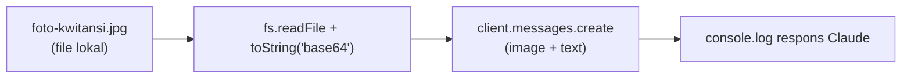
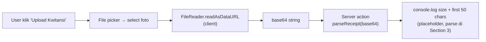
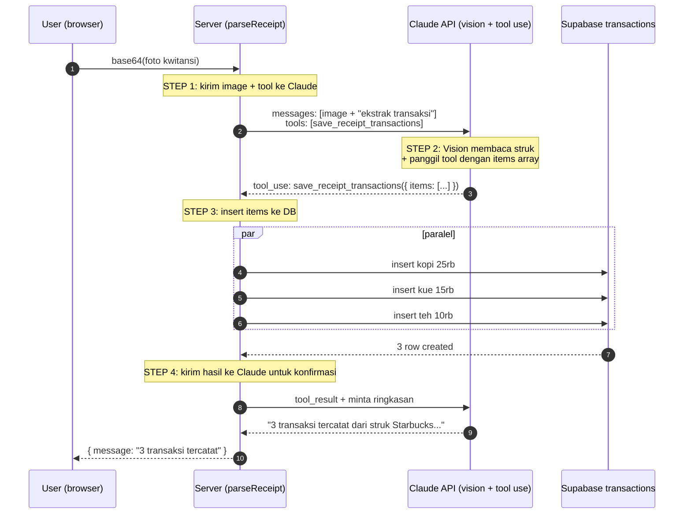

# Module 09 — Multimodal & Document Understanding

> **Tujuan modul**: Anda memahami kemampuan **multimodal** Claude (vision + dokumen) dan mengimplementasikan use case nyata di Fin-App: **upload foto kwitansi → Claude membaca → ekstrak ke struktur transaksi → insert ke database**. Pipeline yang sama bisa di-extend untuk PDF invoice, screenshot mutasi bank, atau catatan tangan.
>
> **Output akhir modul**: tombol upload kwitansi di halaman transaksi Fin-App. User foto struk → 2–3 detik kemudian transaksi (atau beberapa transaksi sekaligus) sudah tercatat di DB dengan kategori, amount, dan deskripsi yang ter-ekstrak otomatis.

---

## Konsep Multimodal

Selama Module 04–08 kita selalu mengirim **teks** ke Claude. Tapi Claude API menerima input lebih dari sekadar teks — **gambar** dan **dokumen PDF** juga didukung secara native, tanpa perlu pre-processing OCR eksternal. Ini yang disebut **multimodal**.

### Apa yang Claude Bisa "Lihat"?

| Input | Format yang didukung | Catatan |
|---|---|---|
| **Image** | JPG, PNG, GIF, WebP | Max 5 MB per gambar, max 30 MB per request (multi-image). Resolusi optimal: long-edge ≤ 1568px. |
| **PDF** | PDF dengan teks atau gambar | Maksimum 32 MB per PDF, ~100 halaman per request. Claude proses teks + visual layout. |
| **Text** | UTF-8 | Default — sudah dipakai sejak Module 04. |

### Model yang Mendukung Vision

| Model | Vision | Catatan |
|---|---|---|
| `claude-haiku-4-5` | ✅ Ya | Cepat & murah, cocok untuk task vision sederhana (baca struk, klasifikasi). |
| `claude-sonnet-4-6` | ✅ Ya | Akurasi vision lebih tinggi, cocok untuk dokumen kompleks atau handwriting. |
| `claude-opus-4-7` | ✅ Ya | Akurasi tertinggi, paling mahal — untuk dokumen multi-halaman atau struk yang sangat sulit dibaca. |

Untuk Fin-App (baca struk cetak yang umum), `claude-haiku-4-5` sudah memadai dan jauh lebih hemat.

### Cara Mengirim Image ke Claude API

Format Anthropic SDK menerima image sebagai **content block** di dalam `messages`:

```ts
client.messages.create({
  model: "claude-haiku-4-5",
  max_tokens: 1024,
  messages: [
    {
      role: "user",
      content: [
        {
          type: "image",
          source: {
            type: "base64",
            media_type: "image/jpeg",
            data: base64ImageString,   // file ter-encode base64
          },
        },
        {
          type: "text",
          text: "Apa yang tertulis di struk ini?",
        },
      ],
    },
  ],
});
```

Alternatif format: `source.type: "url"` apabila gambar di-host publicly (mis. Supabase Storage). Format `"base64"` lebih cocok untuk upload langsung dari browser supaya tidak butuh storage perantara.

### Biaya & Latensi

Image **tidak gratis** — Claude menghitung tokens berdasarkan ukuran:

| Resolusi gambar | Token (perkiraan) | Biaya Haiku |
|---|---|---|
| 200×200 | ~250 tokens | < $0.0001 |
| 800×800 | ~1100 tokens | ~$0.0003 |
| 1568×1568 | ~1600 tokens | ~$0.0005 |

Plus latency tambahan ~1–2 detik vs request text-only. Untuk batch banyak struk, pertimbangkan kompresi sebelum upload (resize ke 1568px long-edge sudah cukup untuk OCR).

### Use Case di Fin-App

Bagian materi ini fokus pada **catat kwitansi dari foto**, tapi pattern yang sama bisa di-extend ke:

| Use case | Input | Output yang diharapkan |
|---|---|---|
| **Catat kwitansi dari foto** (focus modul ini) | Foto struk (kasir, ATM, parkir) | 1+ transaksi ter-insert ke DB |
| Analisis pengeluaran dari screenshot mobile banking | Screenshot notifikasi mutasi | Beberapa transaksi (multi-line statement) |
| Audit dokumen PDF kontrak/invoice | PDF invoice multi-halaman | Termin pembayaran, total tagihan, due date |
| Klasifikasi dokumen sebelum routing | Image apa saja | Tag jenis dokumen (struk / invoice / kuitansi handwritten / bukan keuangan) |
| Digitisasi catatan tangan | Foto buku catatan keuangan manual | Batch transaksi |

Lanjut ke Section 1 untuk membangun proof-of-concept vision sederhana, lalu Section 2 untuk UI upload, lalu Section 3 untuk pipeline lengkap kwitansi → DB.

---

# Section 1 — Vision API Basics: Script PoC

**Tujuan section**: membuktikan **Claude vision bekerja** dengan script terminal sederhana — kirim foto kwitansi (file lokal), terima deskripsi teks. Tidak ada UI, tidak ada DB. Fokus: pastikan API call + base64 encoding benar sebelum membangun pipeline lengkap.

## Alur



## Anatomi Script

📂 **File baru**: `scripts/test-vision.ts`

```ts
// scripts/test-vision.ts
import Anthropic from "@anthropic-ai/sdk";
import { readFileSync } from "fs";
import { resolve } from "path";

const client = new Anthropic();

async function main() {
  const imagePath = resolve(process.argv[2] ?? "./scripts/sample-kwitansi.jpg");
  const imageData = readFileSync(imagePath).toString("base64");
  const mediaType = imagePath.endsWith(".png") ? "image/png" : "image/jpeg";

  const response = await client.messages.create({
    model: "claude-haiku-4-5",
    max_tokens: 1024,
    messages: [
      {
        role: "user",
        content: [
          {
            type: "image",
            source: { type: "base64", media_type: mediaType, data: imageData },
          },
          {
            type: "text",
            text: "Apa yang tertulis di foto ini? Sebutkan: total amount, nama merchant, tanggal kalau ada.",
          },
        ],
      },
    ],
  });

  const textBlock = response.content.find((c) => c.type === "text");
  console.log(textBlock?.text ?? "(no text response)");
}

main().catch(console.error);
```

Jalankan:

```bash
npx tsx --env-file=.env.local scripts/test-vision.ts ./path/to/kwitansi.jpg
```

Output yang diharapkan: deskripsi tekstual isi struk — Claude bisa baca total, merchant name, tanggal, item-list, dst.

Lanjut ke `latihan.md` Section 1 untuk eksekusi.

---

# Section 2 — Upload UI + Base64 Pipeline

**Tujuan section**: bikin tombol **"Upload Kwitansi"** di halaman transaksi Fin-App. User klik → pilih foto → file ter-convert base64 di client → dikirim ke server action. Belum sampai parse — fokus pada **delivery path** dari browser ke server.

## Alur



## Komponen UI

📂 **File baru**: `src/components/upload-kwitansi.tsx`

```tsx
"use client";

import { useState } from "react";
import { parseReceipt } from "@/features/receipt-parser";

export function UploadKwitansi() {
  const [busy, setBusy] = useState(false);
  const [result, setResult] = useState<string | null>(null);

  async function handleFileChange(e: React.ChangeEvent<HTMLInputElement>) {
    const file = e.target.files?.[0];
    if (!file) return;

    setBusy(true);
    setResult(null);
    try {
      const base64 = await fileToBase64(file);
      const response = await parseReceipt({ base64, mediaType: file.type });
      setResult(response.message ?? "OK");
    } catch (err) {
      setResult(`Error: ${err instanceof Error ? err.message : "unknown"}`);
    } finally {
      setBusy(false);
    }
  }

  return (
    <div className="mb-4 rounded-lg border border-dashed border-gray-300 p-4">
      <label className="block cursor-pointer text-sm font-medium text-blue-600">
        📸 {busy ? "Memproses..." : "Upload Kwitansi (foto)"}
        <input
          type="file"
          accept="image/jpeg,image/png,image/webp"
          className="hidden"
          disabled={busy}
          onChange={handleFileChange}
        />
      </label>
      {result && <p className="mt-2 text-sm text-gray-600">{result}</p>}
    </div>
  );
}

function fileToBase64(file: File): Promise<string> {
  return new Promise((resolve, reject) => {
    const reader = new FileReader();
    reader.onload = () => {
      const dataUrl = reader.result as string;
      // dataUrl = "data:image/jpeg;base64,/9j/4AAQSkZJRgABA..."
      resolve(dataUrl.split(",")[1]);
    };
    reader.onerror = () => reject(reader.error);
    reader.readAsDataURL(file);
  });
}
```

## Server Action (Skeleton)

📂 **File baru**: `src/features/receipt-parser.ts`

```ts
"use server";

export async function parseReceipt(input: { base64: string; mediaType: string }) {
  console.log("[parseReceipt] received:", {
    mediaType: input.mediaType,
    sizeKB: Math.round((input.base64.length * 0.75) / 1024),
    preview: input.base64.slice(0, 50),
  });

  // Section 3: panggil Claude vision + tool use untuk parse → insert
  return { message: `Foto diterima (${input.mediaType}, ${Math.round((input.base64.length * 0.75) / 1024)} KB). Implementasi parsing menyusul di Section 3.` };
}
```

Pasang komponen di halaman transaksi:

```tsx
// src/app/transactions/page.tsx — di atas daftar transaksi
import { UploadKwitansi } from "@/components/upload-kwitansi";

<UploadKwitansi />
```

Lanjut ke `latihan.md` Section 2 untuk eksekusi.

---

# Section 3 — Receipt Extraction + Auto-Insert ke Transactions

**Tujuan section**: lengkapi `parseReceipt` agar **benar-benar membaca kwitansi** lewat Claude vision, ekstrak ke struktur transaksi via **tool use** (pattern yang sama dengan Module 05 Section 5 `save_transaction`), lalu insert ke DB. Setelah selesai, user upload foto kwitansi → 2–3 detik kemudian transaksi tercatat di tabel `transactions`.

## Alur



## Tool Definition: `save_receipt_transactions`

Berbeda dengan `save_transaction` (single, dari Module 05 Section 5), tool ini menerima **array** karena satu struk biasanya berisi beberapa item.

📂 **File yang dimodifikasi**: `src/lib/tools.ts` (extend array `TOOLS` dari Module 08, atau buat array terpisah khusus parser).

```ts
// src/lib/tools.ts — tambahan, atau di file baru receipt-tools.ts
export const RECEIPT_TOOLS: Anthropic.Messages.Tool[] = [
  {
    name: "save_receipt_transactions",
    description: `Ekstrak dan simpan SEMUA transaksi yang terlihat di struk/kwitansi.

KAPAN DIPAKAI:
- Setiap kali user mengirim foto struk/kwitansi.
- Panggil SEKALI dengan array items berisi semua line item.

FIELD per item:
- amount: angka penuh Rupiah (integer).
- category: salah satu dari "food", "transport", "shopping", "bills",
  "entertainment", "health", "education", "other".
- description: nama item dari struk (≤40 char).
- date: tanggal struk (ISO YYYY-MM-DD). Default hari ini kalau tidak terbaca.

CATATAN:
- type SELALU "expense" (struk = pengeluaran).
- Kalau struk berisi 1 total saja tanpa breakdown, return 1 item dengan
  description = nama merchant.
- Skip baris non-transaksi (header, footer, "Subtotal", "PPN", "Total").
  Untuk PPN: gabungkan ke amount item terkait atau buat 1 item "Pajak" terpisah.`,
    input_schema: {
      type: "object" as const,
      properties: {
        items: {
          type: "array",
          items: {
            type: "object",
            properties: {
              amount: { type: "number" },
              category: { type: "string" },
              description: { type: "string" },
              date: { type: "string" },
            },
            required: ["amount", "category", "description", "date"],
          },
        },
        merchant: { type: "string", description: "Nama merchant/toko dari struk" },
      },
      required: ["items"],
    },
  },
];
```

## Server Action Lengkap

📂 **File yang dimodifikasi**: `src/features/receipt-parser.ts`

```ts
"use server";

import Anthropic from "@anthropic-ai/sdk";
import { createClient } from "@/lib/supabase/server";
import { RECEIPT_TOOLS } from "@/lib/tools";

const client = new Anthropic();

type ReceiptItem = {
  amount: number;
  category: string;
  description: string;
  date: string;
};

export async function parseReceipt(input: { base64: string; mediaType: string }) {
  const response = await client.messages.create({
    model: "claude-haiku-4-5",
    max_tokens: 2048,
    tools: RECEIPT_TOOLS,
    tool_choice: { type: "tool", name: "save_receipt_transactions" }, // force panggil
    messages: [
      {
        role: "user",
        content: [
          {
            type: "image",
            source: {
              type: "base64",
              media_type: input.mediaType as "image/jpeg" | "image/png" | "image/webp",
              data: input.base64,
            },
          },
          {
            type: "text",
            text: "Ini foto struk/kwitansi. Ekstrak semua transaksi yang terlihat dan panggil tool save_receipt_transactions dengan array items lengkap.",
          },
        ],
      },
    ],
  });

  const toolUse = response.content.find((c) => c.type === "tool_use");
  if (!toolUse || toolUse.type !== "tool_use") {
    return { message: "Claude tidak memanggil tool. Coba foto yang lebih jelas." };
  }

  const { items, merchant } = toolUse.input as { items: ReceiptItem[]; merchant?: string };
  if (!items || items.length === 0) {
    return { message: "Tidak ada transaksi ter-ekstrak dari foto." };
  }

  // Insert paralel via Promise.all
  const supabase = await createClient();
  const inserts = await Promise.all(
    items.map((item) =>
      supabase.from("transactions").insert({
        type: "expense",
        amount: item.amount,
        category: item.category,
        description: item.description,
        date: item.date,
      })
    )
  );

  const fails = inserts.filter((r) => r.error).length;
  const oks = inserts.length - fails;

  return {
    message: `${oks} transaksi tercatat${merchant ? ` dari ${merchant}` : ""}${fails > 0 ? ` (${fails} gagal)` : ""}.`,
    items,
  };
}
```

> 💡 **Mengapa `tool_choice` di-force?** Untuk receipt parsing, kita **selalu** ingin tool dipanggil — bukan jawaban tekstual. Force tool choice memastikan Claude tidak menjawab "saya tidak yakin" atau memberikan deskripsi panjang yang tidak bisa di-parse.

## Yang Perlu Diwaspadai

| Risiko | Mitigasi |
|---|---|
| **Vision salah baca angka** (mis. 25.000 vs 250.000) | Tampilkan hasil parse ke user **sebelum** confirm — beri tombol "Edit" sebelum simpan permanen. Untuk latihan ini kita auto-insert tanpa konfirmasi, di production wajib ada review step. |
| **Resolusi rendah / blur** | Validasi minimum dimension di client sebelum upload, dan retry-able server response (kalau Claude bilang "tidak terbaca"). |
| **Duplikat upload** (user upload foto sama 2×) | Tambah idempotency key (hash dari base64) — di luar scope modul, untuk iterasi berikutnya. |
| **PII / privasi** | Foto kwitansi mungkin mengandung nomor kartu / nama pribadi. JANGAN log full base64 di production. |
| **Cost spike** | Kompresi image di client sebelum upload (resize 1568px long-edge, JPEG quality 80%). |

Lanjut ke `latihan.md` Section 3 untuk eksekusi.

---

## Recap

Pada akhir Module 09, Fin-App Anda punya **kemampuan baru**: catat transaksi dari foto kwitansi.

- **Konsep Multimodal** dipahami — Claude API menerima image + PDF native, model yang support, format `content block`.
- **Section 1** — Script PoC vision (`scripts/test-vision.ts`) membuktikan API + base64 encoding bekerja sebelum membangun UI.
- **Section 2** — Komponen upload (`UploadKwitansi`) di halaman transaksi dengan pipeline `FileReader → base64 → server action`.
- **Section 3** — Pipeline lengkap: foto → Claude vision + tool `save_receipt_transactions` (force tool choice) → insert paralel ke `transactions`.

> ⚠️ **Yang belum dibahas** (akan datang di iterasi lanjutan): UI preview & konfirmasi sebelum insert (production-grade UX), kompresi image di client, OCR untuk PDF multi-halaman, integrasi vision ke chatbot AI Advisor (chat dengan attachment), audit log untuk upload sensitive.
