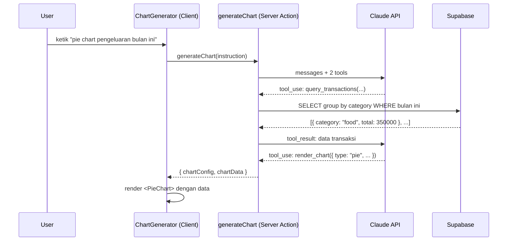

# Module 09a — Generative Dashboard

> **Tujuan modul**: Anda membangun fitur **Natural Language → Chart** di halaman Dashboard Fin-App. User cukup mengetik instruksi seperti _"buatkan pie chart pengeluaran bulan ini"_, Claude menganalisis instruksi, mengambil data dari Supabase via tool, lalu app merender chart yang sesuai secara dinamis.
>
> **Output akhir modul**: sebuah input field di Dashboard yang menghasilkan chart (pie / bar / line / area) dari natural language — tanpa user perlu tahu tipe chart atau struktur data.

---

# Section 1 — Konsep Generative UI

## Apa itu Generative UI?

**Generative UI** adalah pola di mana AI tidak hanya menghasilkan teks, tetapi **memutuskan komponen UI apa yang harus dirender** — dan aplikasi yang mengeksekusi render-nya.

Bedanya dengan chatbot biasa:

| Chatbot Biasa | Generative UI |
|---|---|
| Output: teks | Output: komponen UI (chart, tabel, card) |
| User baca teks | User lihat visual interaktif |
| Claude jawab "pengeluaran food Rp 350.000" | Claude render pie chart dengan breakdown kategori |

## Arsitektur: Natural Language → Chart



## Dua Tool Pattern

Modul ini memakai **2 tools dalam satu flow**:

### Tool 1 — `query_transactions`

Claude pakai ini untuk **meminta data** dari database. Claude menentukan:
- `group_by` — kelompokkan per kategori, tanggal, atau tipe
- `period` — bulan ini, bulan lalu, tahun ini
- `type` — expense, income, atau semua

Claude **tidak tahu** isi database — ia hanya mendeklarasikan "saya butuh data ini", dan server yang mengeksekusi query.

### Tool 2 — `render_chart`

Setelah Claude menerima data, ia pakai tool ini untuk **menentukan visualisasi**:
- `chart_type` — pie / bar / line / area
- `title` — judul chart
- `data_key` — field yang jadi nilai (mis. `total`)
- `label_key` — field yang jadi label (mis. `category`)

App yang mengeksekusi render berdasarkan config ini.

## Mengapa Dua Tool, Bukan Satu?

Pemisahan ini penting untuk **separation of concerns**:

```
query_transactions → Claude tahu APA yang dibutuhkan, bukan BAGAIMANA mengambilnya
render_chart       → Claude tahu APA yang ditampilkan, bukan BAGAIMANA merendernya
```

Kalau digabung jadi satu tool, Claude harus tahu SQL sekaligus tahu React component API — terlalu banyak tanggung jawab di satu tempat.

## Library: Recharts

Modul ini pakai **[Recharts](https://recharts.org)** — library chart React yang deklaratif dan ringan.

```bash
npm install recharts
```

Empat tipe chart yang didukung:

| `chart_type` | Komponen Recharts | Cocok untuk |
|---|---|---|
| `pie` | `<PieChart>` + `<Pie>` | Proporsi / persentase per kategori |
| `bar` | `<BarChart>` + `<Bar>` | Perbandingan antar kategori |
| `line` | `<LineChart>` + `<Line>` | Tren waktu (harian, mingguan) |
| `area` | `<AreaChart>` + `<Area>` | Tren waktu dengan emphasis volume |

## Contoh Instruksi → Output

| Instruksi User | Claude Panggil | Chart Dirender |
|---|---|---|
| "pie chart pengeluaran bulan ini" | `query_transactions({ group_by: "category", period: "this_month", type: "expense" })` → `render_chart({ chart_type: "pie", ... })` | PieChart breakdown kategori |
| "bar chart income vs expense 3 bulan terakhir" | `query_transactions({ group_by: "type", period: "last_3_months", type: "all" })` → `render_chart({ chart_type: "bar", ... })` | BarChart income vs expense |
| "tren pengeluaran harian bulan ini" | `query_transactions({ group_by: "date", period: "this_month", type: "expense" })` → `render_chart({ chart_type: "line", ... })` | LineChart per tanggal |

---

# Section 2 — Implementasi

Implementasi dibagi 3 prompt bertahap:

- **Prompt 1** — Tool definitions + Server Action `generateChart` (backend logic)
- **Prompt 2** — Client component `ChartGenerator` + `DynamicChart` renderer
- **Prompt 3** — Wire ke halaman Dashboard + test end-to-end

Lanjutkan ke `latihan.md` untuk implementasi.
