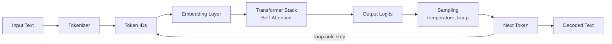

# Module 1 — Introduction to LLM & Claude

**Durasi**: 90 menit
**Posisi**: Modul pembuka Day 1
**Mode**: Lecture + live demo + diskusi pendek

---

## Learning Outcomes

Setelah modul ini, peserta mampu:

1. **Menjelaskan** komponen utama LLM (tokenization, embedding, transformer, decoding) dalam analogi non-teknis yang akurat.
2. **Membedakan** kapabilitas tiga keluarga model Claude (Opus, Sonnet, Haiku) dan memilih model yang sesuai untuk kebutuhan latency, biaya, dan kompleksitas.
3. **Mengidentifikasi** minimal 4 limitasi LLM (hallucination, knowledge cutoff, context window finit, bias) dan strategi mitigasinya pada level prompt.
4. **Mendiskusikan** trade-off antara reasoning model vs fast model dalam konteks bisnis nyata.

---

## 1. Apa itu LLM?

Large Language Model (LLM) adalah model statistik yang dilatih untuk memprediksi **token berikutnya** berdasarkan konteks token-token sebelumnya. Sederhananya: LLM adalah mesin autocomplete super besar yang dilatih dari triliunan token teks.

Tiga properti yang membuat LLM modern (Claude, GPT, Gemini) berbeda dari autocomplete biasa:

| Properti | Penjelasan |
|----------|------------|
| **Skala** | Ratusan miliar parameter, dilatih atas korpus internet + buku + kode. |
| **In-context learning** | Mampu mempelajari pola dari contoh dalam prompt tanpa retraining. |
| **Instruction following** | Setelah fine-tuning + RLHF/Constitutional AI, model mengikuti instruksi natural language. |

### Cara Kerja Generative AI (alur sederhana)



Inti yang harus diingat peserta:
- LLM **tidak** "mengerti" seperti manusia; ia menghitung probabilitas.
- LLM **stateless** per request — semua konteks harus diberikan ulang setiap kali (inilah peran context window).
- LLM **non-deterministik** secara default (temperature > 0).

---

## 2. Transformer Architecture (level intuitif)

Transformer adalah arsitektur neural network yang menjadi pondasi semua LLM modern (paper *Attention Is All You Need*, 2017). Komponen kuncinya:

1. **Token Embedding** — token diubah menjadi vektor numerik berdimensi tinggi.
2. **Positional Encoding** — informasi posisi token ditambahkan.
3. **Self-Attention** — setiap token "melihat" semua token lain dan menghitung relevansinya. Inilah yang membuat model memahami konteks panjang.
4. **Feed-Forward Network** — transformasi non-linear per posisi.
5. **Layer Normalization & Residual Connection** — stabilisasi training.
6. **Output Head** — memetakan vektor akhir kembali ke probabilitas token.

Analogi diskusi: bayangkan setiap kata di kalimat sebagai orang dalam rapat. Self-attention adalah mekanisme di mana setiap orang mendengarkan semua orang lain dan memberi bobot pada siapa yang paling relevan untuk konteks saat ini.

---

## 3. Tokenization & Context Window

### Tokenization

LLM tidak membaca karakter atau kata — ia membaca **token**. Token bisa berupa kata utuh, sub-kata, atau bahkan satu karakter.

| Teks                        | Perkiraan token (BPE) |
|-----------------------------|-----------------------|
| `Hello`                     | 1                     |
| `Halo`                      | 1                     |
| `Multimatics`               | 3–4                   |
| `claude-sonnet-4-5`         | 5–6                   |
| 1 kalimat bahasa Indonesia (10 kata) | 15–25         |

Rule of thumb: **1 token ≈ 4 karakter bahasa Inggris ≈ 0.75 kata**. Bahasa Indonesia umumnya 20–30% lebih banyak token dibanding Inggris karena vocabulary BPE bias ke Inggris.

### Context Window

Context window = jumlah maksimal token (input + output) yang bisa diproses sekali request.

| Model                  | Context window | Catatan                       |
|------------------------|----------------|-------------------------------|
| Claude Haiku 3.5       | 200K           | Cepat, murah                  |
| Claude Sonnet 4.x      | 200K (1M tier) | Workhorse                     |
| Claude Opus 4.x        | 200K (1M tier) | Reasoning terbaik             |

**Implikasi praktis**:
- Dokumen panjang (PDF, transkrip) yang melebihi context window harus di-chunk atau di-summarize.
- Biaya naik linear dengan jumlah token input — context engineering = cost engineering.

---

## 4. Claude — Kapabilitas & Limitasi

### Keluarga Model Claude (rekomendasi pemilihan)

| Model     | Sweet spot                                            | Latency | Biaya relatif |
|-----------|-------------------------------------------------------|---------|---------------|
| **Haiku** | Klasifikasi, ekstraksi sederhana, high-volume         | Sangat cepat | $ |
| **Sonnet**| Customer-facing chat, coding, RAG, agent loop standar | Cepat        | $$ |
| **Opus**  | Reasoning kompleks, riset, multi-step planning        | Lebih lambat | $$$ |

### Kapabilitas Inti

- Generasi teks panjang (esai, laporan, kode).
- Pemahaman multi-bahasa (termasuk bahasa Indonesia yang baik).
- Reasoning langkah-demi-langkah (terutama Opus & extended thinking).
- Vision (input gambar) pada model multimodal.
- Tool use / function calling (akan dibahas Day 3).

### Limitasi yang Wajib Diingat

| Limitasi              | Manifestasi                                         | Mitigasi prompt-level                              |
|-----------------------|-----------------------------------------------------|----------------------------------------------------|
| Hallucination         | Mengarang fakta, sitasi palsu                       | Berikan source, minta "jika tidak tahu, katakan tidak tahu" |
| Knowledge cutoff      | Tidak tahu peristiwa setelah tanggal training       | Inject konteks terbaru via prompt / tool search    |
| Context window finit  | Konteks terlalu panjang dipotong                    | Summarize, chunk, atau pindah ke model 1M tier     |
| Bias                  | Reflect bias dari data training                     | Audit output, instruksi netralitas eksplisit       |
| Non-determinism       | Output berbeda antar run                            | `temperature=0`, seed (jika tersedia), evaluasi statistik |
| Math & counting       | Kesalahan aritmatika kompleks                       | Minta CoT, atau delegasikan ke tool calculator     |

---

## 5. AI Reasoning & Hallucination

**Reasoning** dalam konteks LLM bukanlah penalaran formal seperti prover matematika. Ia adalah kemampuan menggenerate rantai token yang *menyerupai* langkah-langkah berpikir manusia. Claude (terutama Opus dan mode extended thinking) dilatih agar rantai ini lebih konsisten dan dapat diaudit.

**Hallucination** muncul karena model selalu mencoba "melanjutkan kalimat dengan probabilitas tertinggi" — bahkan ketika ia seharusnya bilang "saya tidak tahu". Penyebab utama:
- Prompt ambigu atau under-specified.
- Permintaan fakta spesifik yang tidak ada di training data.
- Tekanan format (mis. "buatkan tabel 10 baris") memaksa model mengisi sel kosong dengan tebakan.

Strategi anti-hallucination (level prompt):
1. **Grounding**: lampirkan source teks; instruksikan "jawab hanya berdasarkan teks di atas".
2. **Permission to abstain**: "jika tidak ada di sumber, jawab 'INFO_TIDAK_TERSEDIA'".
3. **Citation forcing**: "kutip kalimat persis dari sumber sebelum menyimpulkan".
4. **Chain-of-thought**: paksa model berpikir sebelum menjawab, tangkap reasoning untuk audit.

---

## Demo Live (15 menit)

**Skenario**: Tunjukkan perbedaan respons Claude terhadap prompt yang sama dengan dan tanpa grounding.

### Langkah

1. Buka **claude.ai** dengan model Sonnet 4.x.
2. **Demo A — tanpa grounding**:
   Prompt: `Siapa CEO Multimatics saat ini dan kapan mereka menjabat?`
   Amati: model mungkin halusinasi atau abstain. Catat respons.
3. **Demo B — dengan grounding**:
   Tempel paragraf singkat (fiktif/aktual dari website) tentang Multimatics, lalu prompt:
   `Berdasarkan teks di atas saja, siapa CEO Multimatics dan kapan menjabat? Jika tidak disebut, jawab "TIDAK DISEBUTKAN".`
4. **Demo C — tokenization**: buka https://platform.openai.com/tokenizer (proxy mental model) atau hitung manual; tunjukkan bahwa "Multimatics" = beberapa token.
5. **Demo D — perbandingan model**: jalankan prompt reasoning sedang (mis. soal logika cerita) di Haiku vs Sonnet vs Opus di Console Workbench.

Diskusikan: mengapa output berbeda? Apa implikasi biaya & latency?

---

## Contoh Konkret: Poor → Good → Better

### Contoh 1 — Pertanyaan Faktual

```text
[POOR]
Jelaskan tentang regulasi perlindungan data di Indonesia.
```
Masalah: tidak ada batas waktu, sumber, atau format. Risiko halusinasi tinggi.

```text
[GOOD]
Jelaskan UU Perlindungan Data Pribadi (UU PDP) Indonesia No. 27 Tahun 2022.
Fokus pada: definisi data pribadi, hak subjek data, sanksi.
Jika ada poin yang Anda tidak yakin, tandai dengan [UNCERTAIN].
```
Masalah teratasi sebagian: batasan jelas, ada permission to abstain.

```text
[BETTER]
<sumber>
{tempel teks UU PDP pasal 1, 4-16, 57-67 di sini}
</sumber>

Berdasarkan <sumber> di atas saja, jelaskan dalam 5 bullet:
1. Definisi data pribadi (Pasal mana?)
2. 3 hak utama subjek data
3. Sanksi administratif vs pidana

Format: markdown bullet dengan sitasi pasal di akhir tiap poin.
Jika informasi tidak ada di <sumber>, tulis "TIDAK ADA DI SUMBER".
```
Mengapa lebih baik: grounding eksplisit, abstain rule, format terstruktur, sitasi wajib.

### Contoh 2 — Ringkasan

```text
[POOR]
Ringkas dokumen ini.
```

```text
[GOOD]
Ringkas dokumen ini menjadi 3 paragraf untuk audiens eksekutif.
```

```text
[BETTER]
Anda adalah analis bisnis senior. Ringkas dokumen <doc> di bawah untuk
CFO yang tidak punya waktu membaca detail teknis.

Output:
- Paragraf 1: Konteks & masalah (maks 60 kata)
- Paragraf 2: Temuan utama (3 bullet, angka kunci di-bold)
- Paragraf 3: Rekomendasi & risiko (maks 80 kata)

Hindari jargon teknis. Jika ada angka, cantumkan satuan.
```

### Contoh 3 — Klasifikasi

```text
[POOR]
Tiket ini tentang apa: "Aplikasi crash setiap saya buka menu profil"
```

```text
[GOOD]
Klasifikasikan tiket berikut ke kategori: Bug, Feature Request, Question.
Tiket: "Aplikasi crash setiap saya buka menu profil"
```

```text
[BETTER]
Anda adalah triager support tier-1. Klasifikasikan tiket ke salah satu:
- BUG (functional error / crash)
- FEATURE_REQUEST
- QUESTION (how-to)
- COMPLAINT (kepuasan, non-functional)

Output JSON: {"category": "...", "severity": "low|medium|high|critical", "rationale": "<=20 kata"}

Tiket: "Aplikasi crash setiap saya buka menu profil"
```

---

## Hands-on Lab

Modul 1 bersifat konseptual; **tidak ada lab khusus**. Aktivitas hands-on hari ini dimulai di Module 2 (Lab 01).

Sebagai aktivitas reflektif, lihat: [`diskusi.md`](./diskusi.md) — ice breaker + 3 pertanyaan diskusi kelompok.

---

## Wrap-up & Q&A

Pertanyaan refleksi:

1. Jika Claude adalah "mesin autocomplete probabilistik", apa konsekuensinya bagi cara Anda menulis instruksi?
2. Kapan Anda akan memilih Haiku dibanding Sonnet untuk use case di organisasi Anda?
3. Sebutkan satu pekerjaan harian Anda yang berisiko jika dijalankan dengan output LLM yang ber-hallucinate. Apa mitigasinya?
4. Mengapa context window besar tidak otomatis = jawaban lebih baik?
5. Apa beda "reasoning" pada LLM vs reasoning manusia menurut pemahaman Anda sekarang?

---

## Bacaan Lanjutan

- Anthropic — *Introduction to Claude*: https://docs.anthropic.com/en/docs/intro-to-claude
- Anthropic — *Models overview*: https://docs.anthropic.com/en/docs/about-claude/models
- Anthropic — *Glossary*: https://docs.anthropic.com/en/docs/resources/glossary
- *Attention Is All You Need* (Vaswani et al., 2017): https://arxiv.org/abs/1706.03762
- Anthropic — *Constitutional AI*: https://www.anthropic.com/research/constitutional-ai-harmlessness-from-ai-feedback
- Anthropic — *Reducing hallucinations*: https://docs.anthropic.com/en/docs/test-and-evaluate/strengthen-guardrails/reduce-hallucinations
