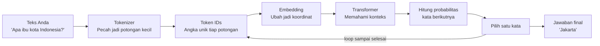

# Module 1 — Mengenal LLM & Claude

**Durasi**: 90 menit
**Posisi**: Modul pembuka Day 1
**Mode**: Penjelasan + demo langsung + diskusi singkat

---

## Apa yang Akan Anda Bisa Setelah Modul Ini

Setelah modul ini selesai, Anda diharapkan bisa:

1. **Menjelaskan** bagaimana LLM bekerja — pakai analogi yang masuk akal, tidak perlu rumus.
2. **Memilih** model Claude yang tepat (Opus, Sonnet, Haiku) sesuai kebutuhan — mana yang cepat, mana yang murah, mana yang pintar.
3. **Mengenali** 4 keterbatasan utama LLM (ngarang, info kadaluarsa, batas memori, bias) dan cara mengatasinya lewat prompt.
4. **Mendiskusikan** kapan harus pakai model "pemikir" vs model "cepat" untuk kasus bisnis Anda.

---

## 1. Apa Itu LLM?

**LLM (Large Language Model)** itu intinya adalah **mesin tebak kata berikutnya — versi raksasa**.

Bayangkan fitur *autocomplete* di keyboard HP Anda. Saat Anda mengetik "selamat", HP menebak kata berikutnya: "pagi", "siang", "malam", "datang". LLM bekerja persis seperti itu — hanya saja **jauh lebih besar dan jauh lebih pintar konteks**. Ia tidak hanya menebak 1 kata, tapi terus-menerus menebak kata demi kata sampai membentuk paragraf, esai, bahkan kode program.

Tiga hal yang membuat LLM modern (Claude, ChatGPT, Gemini) berbeda dari autocomplete biasa di HP:

| Properti | Penjelasan sederhana |
|----------|---------------------|
| **Skala raksasa** | Dilatih dari triliunan kata: seluruh internet, jutaan buku, miliaran baris kode. Ibarat membaca semua perpustakaan di dunia. |
| **Belajar dari contoh dalam prompt** *(in-context learning)* | Anda kasih 2-3 contoh di prompt, model langsung "nangkep" polanya tanpa harus dilatih ulang. |
| **Mengikuti instruksi** *(instruction following)* | Setelah dilatih khusus, model paham kalau Anda nulis "ringkas ini jadi 3 poin", ya dia akan ringkas jadi 3 poin. |

### Bagaimana Cara Kerjanya? (Alur Sederhana)



Tiga hal penting untuk diingat:

- **LLM tidak benar-benar "mengerti"** seperti manusia. Ia menghitung peluang. "Kata apa yang paling mungkin muncul setelah ini?"
- **LLM tidak punya memori antar percakapan** *(stateless)*. Setiap kali Anda kirim pesan, semua konteks harus disertakan ulang. Ibarat ngobrol dengan orang yang amnesia setiap 1 menit — Anda harus selalu ngingetin "tadi kita lagi bahas X ya".
- **LLM tidak selalu kasih jawaban sama** *(non-deterministik)*. Tanya pertanyaan yang sama 2x, jawabannya bisa beda. Ini fitur, bukan bug — kecuali Anda sengaja set agar deterministik.

---

## 2. Transformer — "Mesin" di Balik LLM

**Transformer** adalah arsitektur (semacam blueprint) yang membuat LLM modern bisa eksis. Diperkenalkan tahun 2017 lewat paper berjudul *"Attention Is All You Need"*.

Anda tidak perlu paham matematikanya. Cukup paham **analogi rapat tim** ini:

> Bayangkan setiap kata di kalimat Anda adalah seorang peserta rapat. Saat mereka harus memahami konteks, setiap orang **mendengarkan semua peserta lain** sekaligus, lalu memberi bobot: "siapa yang paling relevan untuk saya saat ini?". Mekanisme inilah yang disebut **Self-Attention** — jantung dari Transformer.

Itulah kenapa Claude bisa memahami konteks panjang. Saat Anda kasih dokumen 50 halaman lalu nanya soal halaman 47, model bisa "melihat balik" semua halaman sekaligus dan fokus ke bagian yang relevan.

Komponen lainnya (sekadar untuk Anda tahu istilahnya):

| Istilah | Fungsi singkat |
|---------|---------------|
| **Token Embedding** | Ubah kata jadi koordinat angka, supaya komputer bisa "hitung" |
| **Positional Encoding** | Tandai posisi: "kata ini di awal", "kata itu di tengah" |
| **Self-Attention** | Mekanisme rapat yang sudah dijelaskan di atas |
| **Feed-Forward** | Lapisan pemrosesan tambahan |
| **Output Head** | Pengambil keputusan: kata apa berikutnya? |

---

## 3. Token & Context Window — Yang Wajib Dipahami

### Apa Itu Token?

LLM **tidak baca kalimat per kalimat** atau kata per kata. Ia baca **token** — potongan-potongan yang bisa berupa kata utuh, suku kata, atau bahkan satu huruf.

| Teks yang Anda tulis | Kira-kira jadi berapa token? |
|----------------------|------------------------------|
| `Hello` | 1 token |
| `Halo` | 1 token |
| `Multimatics` | 3–4 token (dipecah jadi `Multi` + `matics` dll.) |
| `claude-sonnet-4-5` | 5–6 token |
| 1 kalimat Bahasa Indonesia (10 kata) | 15–25 token |

**Rumus kasar yang berguna**:
- 1 token ≈ 4 huruf bahasa Inggris ≈ 3/4 kata
- Bahasa Indonesia umumnya **20-30% lebih boros token** dibanding Inggris

**Kenapa ini penting buat Anda?** Karena Anda **dibayar per token** saat pakai API. Kalimat panjang = token banyak = biaya tinggi.

### Apa Itu Context Window?

**Context window** = "kapasitas memori jangka pendek" model. Total token yang bisa diproses (input + output) dalam **satu kali kirim pesan**.

| Model | Context Window | Catatan |
|-------|---------------|---------|
| Claude Haiku | 200.000 token | Cepat & murah |
| Claude Sonnet | 200.000 (sampai 1 juta untuk tier khusus) | Kuda kerja serbaguna |
| Claude Opus | 200.000 (sampai 1 juta untuk tier khusus) | Pemikir terbaik |

**Analogi**: anggap context window itu **meja kerja** model. 200.000 token = meja super luas, bisa naro buku tebal di atasnya. Tapi kalau Anda taro 5 buku tebal sekaligus, mejanya penuh dan model harus mulai "membuang" yang lama.

**Implikasi praktisnya**:
- Dokumen super panjang (PDF 500 halaman) yang melebihi context window harus **dipotong-potong** *(chunk)* atau **diringkas dulu**.
- Semakin banyak token input → semakin mahal & semakin lambat. Jadi: **hemat konteks = hemat biaya**.

---

## 4. Claude — Apa Saja yang Bisa & Tidak Bisa

### Keluarga Model Claude

Claude punya 3 "varian" utama. Ibarat menu di restoran: ada paket hemat, paket reguler, paket premium.

| Model | Cocok untuk | Kecepatan | Biaya |
|-------|------------|-----------|-------|
| **Haiku** 🐰 | Pekerjaan ringan & banyak: klasifikasi email, tag artikel, ekstraksi data sederhana | Sangat cepat | Murah ($) |
| **Sonnet** 🐎 | Chatbot customer service, coding, RAG, agent biasa | Cepat | Sedang ($$) |
| **Opus** 🦉 | Tugas berat: analisis riset, perencanaan multi-langkah, problem solving kompleks | Lebih lambat | Mahal ($$$) |

**Rule of thumb**:
- Tugas berulang, simpel, volume tinggi → **Haiku**
- Mayoritas use case enterprise → **Sonnet** (sweet spot)
- Butuh "otak" terbaik untuk reasoning → **Opus**

### Yang Claude Bisa

- Tulis teks panjang: artikel, laporan, email, kode program
- Pahami banyak bahasa (Indonesia juga OK)
- Berpikir bertahap (terutama Opus)
- Baca gambar *(vision)* — untuk varian multimodal
- Pakai "alat bantu" eksternal *(tool use)* — akan dibahas hari ke-3

### Yang Claude TIDAK Bisa (atau Berisiko)

Ini bagian penting. **Wajib paham** sebelum pakai untuk pekerjaan beneran:

| Keterbatasan | Wujud nyatanya | Cara mengatasi lewat prompt |
|--------------|---------------|---------------------------|
| **Halusinasi** | Ngarang fakta, bikin sitasi palsu yang kelihatannya kredibel | Kasih sumber asli, suruh dia bilang "tidak tahu" kalau memang tidak ada |
| **Knowledge cutoff** | Tidak tahu kejadian setelah tanggal training-nya | Suplai info terbaru lewat prompt atau tool pencarian |
| **Context window terbatas** | Konteks kepanjangan akan dipotong | Ringkas dulu, atau potong jadi bagian-bagian |
| **Bias** | Mencerminkan bias dari data internet | Audit output, kasih instruksi netral secara eksplisit |
| **Tidak konsisten** | Jawaban beda di run yang berbeda | Set `temperature=0`, evaluasi banyak sampel |
| **Lemah hitung-hitungan rumit** | Salah aritmatika padahal kelihatan yakin | Suruh dia berpikir bertahap, atau delegasikan ke kalkulator |

---

## 5. Reasoning & Halusinasi — Dua Konsep Kunci

### "Reasoning" pada LLM Itu Apa?

Saat orang bilang "Claude bisa reasoning", maksudnya **bukan** dia benar-benar berpikir seperti matematikawan profesional. Yang sebenarnya terjadi: Claude **menghasilkan rangkaian kata yang menyerupai langkah-langkah berpikir manusia**.

Analoginya: seperti murid pintar yang menulis "diketahui... ditanya... jawab..." di kertas — bukan karena dia paham hakikat matematika, tapi karena dia tahu pola jawaban yang biasanya benar dari ribuan contoh yang pernah dia lihat.

Claude Opus (apalagi mode *extended thinking*) dilatih khusus agar rantai berpikir ini **lebih panjang, lebih konsisten, dan bisa diaudit**.

### Kenapa LLM Suka "Mengarang" (Halusinasi)?

Karena tugas dasar LLM adalah **"lanjutkan kalimat dengan probabilitas tertinggi"** — bahkan saat seharusnya dia bilang "saya tidak tahu". Halusinasi sering muncul karena:

- Prompt Anda **ambigu** atau kurang detail
- Anda minta fakta **spesifik** yang tidak ada di data training-nya
- Anda paksa format tertentu (misal: "buat tabel 10 baris") sehingga model **terpaksa ngisi** sel kosong dengan tebakan

**4 Senjata Anti-Halusinasi (level prompt)**:

1. **Grounding (kasih sumber)**: lampirkan teks asli, suruh "jawab hanya berdasarkan teks di atas"
2. **Izinkan mengaku tidak tahu**: "kalau info tidak ada di sumber, tulis `INFO_TIDAK_TERSEDIA`"
3. **Paksa kutip**: "kutip kalimat persis dari sumber sebelum menyimpulkan"
4. **Suruh berpikir bertahap** *(chain-of-thought)*: paksa model menjelaskan logika sebelum memberi jawaban final

---

## Demo Langsung (15 menit)

**Tujuan**: Tunjukkan ke peserta perbedaan respons Claude — dengan dan tanpa "kasih sumber".

### Langkah Demo

1. Buka **claude.ai**, pilih model Sonnet.
2. **Demo A — tanpa kasih sumber**:
   Prompt: `Siapa CEO Multimatics saat ini dan kapan beliau menjabat?`
   → Amati: model mungkin ngarang, atau bilang tidak tahu. Catat.
3. **Demo B — dengan kasih sumber**:
   Tempel 1 paragraf dari website Multimatics, lalu prompt:
   `Berdasarkan teks di atas saja, siapa CEO Multimatics dan kapan menjabat? Kalau tidak disebut, jawab "TIDAK DISEBUTKAN".`
4. **Demo C — token counter**: buka https://platform.openai.com/tokenizer, ketik "Multimatics" → tunjukkan bahwa 1 kata = beberapa token.
5. **Demo D — bandingkan model**: jalankan 1 soal logika cerita di **Haiku vs Sonnet vs Opus** lewat Console Workbench.

Diskusikan: kenapa jawabannya beda? Apa implikasinya untuk biaya & kecepatan?

---

## Contoh Konkret: Prompt Jelek → Bagus → Lebih Bagus

Tiga contoh berikut menunjukkan **evolusi cara nulis prompt**, dari yang seadanya sampai yang siap produksi.

### Contoh 1 — Pertanyaan Faktual

```text
[JELEK]
Jelaskan tentang regulasi perlindungan data di Indonesia.
```
Masalah: tidak ada batas waktu, sumber, atau format. Risiko ngarang tinggi.

```text
[BAGUS]
Jelaskan UU Perlindungan Data Pribadi (UU PDP) Indonesia No. 27 Tahun 2022.
Fokus pada: definisi data pribadi, hak subjek data, sanksi.
Kalau ada poin yang Anda tidak yakin, tandai [UNCERTAIN].
```
Sudah mendingan: batasan jelas, model boleh ngaku ragu.

```text
[LEBIH BAGUS]
<sumber>
{tempel teks UU PDP pasal 1, 4-16, 57-67 di sini}
</sumber>

Berdasarkan <sumber> di atas saja, jelaskan dalam 5 bullet:
1. Definisi data pribadi (Pasal berapa?)
2. 3 hak utama subjek data
3. Sanksi administratif vs pidana

Format: bullet markdown, sebut pasal di akhir tiap poin.
Kalau info tidak ada di <sumber>, tulis "TIDAK ADA DI SUMBER".
```
Kenapa lebih bagus: sumber jelas, model boleh mengaku tidak tahu, format terstruktur, wajib sebut pasal.

### Contoh 2 — Membuat Ringkasan

```text
[JELEK]
Ringkas dokumen ini.
```

```text
[BAGUS]
Ringkas dokumen ini jadi 3 paragraf untuk audiens eksekutif.
```

```text
[LEBIH BAGUS]
Anda adalah analis bisnis senior. Ringkas dokumen <doc> di bawah untuk
CFO yang tidak punya waktu baca detail teknis.

Format output:
- Paragraf 1: Konteks & masalah (maks 60 kata)
- Paragraf 2: Temuan utama (3 bullet, angka penting di-bold)
- Paragraf 3: Rekomendasi & risiko (maks 80 kata)

Hindari jargon teknis. Kalau ada angka, sertakan satuan.
```

### Contoh 3 — Klasifikasi Tiket Support

```text
[JELEK]
Tiket ini tentang apa: "Aplikasi crash setiap saya buka menu profil"
```

```text
[BAGUS]
Klasifikasikan tiket berikut ke salah satu: Bug, Feature Request, Question.
Tiket: "Aplikasi crash setiap saya buka menu profil"
```

```text
[LEBIH BAGUS]
Anda adalah triager tim support tier-1. Klasifikasikan tiket ke salah satu:
- BUG (error fungsional / crash)
- FEATURE_REQUEST (minta fitur baru)
- QUESTION (cara penggunaan)
- COMPLAINT (keluhan kepuasan, bukan teknis)

Output dalam JSON:
{"category": "...", "severity": "low|medium|high|critical", "rationale": "<=20 kata"}

Tiket: "Aplikasi crash setiap saya buka menu profil"
```

---

## Hands-on Lab

Modul 1 ini sifatnya **konseptual** — jadi belum ada lab khusus. Aktivitas hands-on dimulai di Module 2 (Lab 01).

Sebagai gantinya, gunakan [`diskusi.md`](./diskusi.md) — berisi *ice breaker* + 3 pertanyaan diskusi kelompok.

---

## Wrap-up & Q&A

Refleksi yang bisa Anda jawab sendiri di akhir sesi:

1. Kalau Claude itu pada dasarnya "mesin tebak kata berbasis probabilitas", **apa konsekuensinya** terhadap cara Anda menulis instruksi?
2. **Kapan** Anda akan pilih Haiku (lebih murah & cepat) dibanding Sonnet untuk pekerjaan Anda?
3. Sebutkan **1 pekerjaan harian** Anda yang bisa berbahaya kalau LLM-nya ngarang. Apa cara mengantisipasinya?
4. **Kenapa** context window besar tidak otomatis = jawaban lebih bagus?
5. Apa beda **"reasoning" LLM vs "reasoning" manusia** menurut pemahaman Anda sekarang?

---

## Bacaan Lanjutan

- Anthropic — *Introduction to Claude*: https://docs.anthropic.com/en/docs/intro-to-claude
- Anthropic — *Models overview*: https://docs.anthropic.com/en/docs/about-claude/models
- Anthropic — *Glossary*: https://docs.anthropic.com/en/docs/resources/glossary
- *Attention Is All You Need* (Vaswani et al., 2017): https://arxiv.org/abs/1706.03762
- Anthropic — *Constitutional AI*: https://www.anthropic.com/research/constitutional-ai-harmlessness-from-ai-feedback
- Anthropic — *Reducing hallucinations*: https://docs.anthropic.com/en/docs/test-and-evaluate/strengthen-guardrails/reduce-hallucinations
