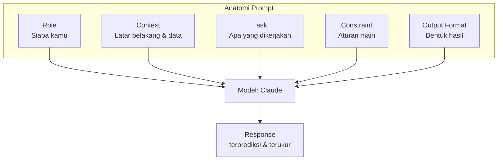

# Module 2 — Prompt Engineering Basics

**Durasi**: 90 menit
**Posisi**: Modul kedua Day 1, fondasi untuk seluruh program.
**Mode**: Lecture + workshop pendek + handoff ke Lab 01.

---

## Learning Outcomes

Setelah modul ini, peserta mampu:

1. **Menguraikan** anatomi prompt yang efektif menjadi 5 komponen: Role, Context, Task, Constraint, Output Format.
2. **Menulis ulang** prompt buruk menjadi prompt yang reliable dengan instruksi eksplisit, tanpa ambiguitas.
3. **Menerapkan** role prompting dan context engineering untuk meningkatkan relevansi output.
4. **Membangun** prompt template yang reusable lintas use case di organisasi.
5. **Mengevaluasi** prompt dengan checklist kualitas (clarity, specificity, testability).

---

## 1. Mengapa Anatomi Penting

Prompt yang buruk biasanya kabur di salah satu (atau beberapa) dari 5 dimensi:

- Siapa model harus berperan? (Role)
- Apa latar belakang & batasan domain? (Context)
- Apa yang spesifik harus dilakukan? (Task)
- Aturan main: dilarang/wajib apa? (Constraint)
- Output dalam bentuk apa? (Output Format)

Mental model: bayangkan Anda mendelegasikan pekerjaan ke **karyawan baru yang sangat cerdas, sangat cepat, tapi nol konteks tentang organisasi Anda**. Kalau briefing-nya kabur, hasil kabur.



---

## 2. Komponen 1 — Role Prompting

Role prompting adalah teknik menetapkan **persona / posisi profesional** model. Bukan kosmetik — ia mengaktifkan distribusi vocabulary dan style yang relevan.

### Pattern

```text
Anda adalah {peran spesifik} dengan {expertise / pengalaman}.
{Optional: konteks organisasi atau audiens}.
```

### Contoh

```text
Anda adalah analis cybersecurity senior dengan 10 tahun pengalaman
di sektor perbankan. Anda menulis untuk Chief Risk Officer yang
tidak punya latar belakang teknis.
```

### Pitfall Role Prompting

- **Persona terlalu generik** ("Anda adalah AI assistant") → tidak memberi sinyal apapun.
- **Persona berlebihan / fantasi** ("Anda adalah dewa programming") → bisa memicu output yang over-confident.
- **Persona yang tidak konsisten dengan task** ("Anda adalah penyair" → diminta menulis laporan finansial).

---

## 3. Komponen 2 — Context Engineering

Context = semua informasi yang model butuhkan untuk menjawab dengan benar tetapi tidak ada di parametric memory-nya. Termasuk:

- Dokumen referensi (kebijakan, kontrak, transkrip).
- Data terstruktur (tabel, JSON).
- State sebelumnya (riwayat chat, hasil tool call).
- Definisi istilah / glosarium internal.

### Best practices

1. **Letakkan context di awal prompt** untuk dokumen panjang; sebagian besar arsitektur attention mendapat manfaat dari posisi awal.
2. **Bungkus dengan tag XML** seperti `<document>`, `<context>`, `<example>` — Claude dilatih untuk memperhatikan struktur ini.
3. **Pisahkan instruksi dari data** dengan tag yang jelas; jangan campur.
4. **Hindari noise**: jangan tempel dokumen 50 halaman jika hanya 2 paragraf relevan.
5. **State permission**: jelaskan apakah model boleh menggunakan knowledge umum atau hanya context.

### Contoh struktur

```text
<context>
{dokumen referensi atau data}
</context>

<task>
{apa yang harus dilakukan}
</task>

<rules>
- Jawab hanya berdasarkan <context>.
- Jika tidak ada di context, jawab "TIDAK ADA DI SUMBER".
</rules>
```

---

## 4. Komponen 3 — Task (Instruction Design)

Instruksi yang baik:

| Atribut          | Buruk                              | Baik                                         |
|------------------|------------------------------------|----------------------------------------------|
| Verb action      | "Bahas tentang X"                  | "Ringkas X menjadi 3 bullet"                 |
| Granularitas     | "Analisis dokumen"                 | "Identifikasi 5 risiko top di dokumen"       |
| Audience         | (tidak disebut)                    | "untuk CFO non-teknis"                       |
| Sukses kriteria  | (tidak disebut)                    | "Maks 200 kata, tanpa jargon"                |

### Decomposition

Jika task kompleks, decompose menjadi langkah:

```text
Lakukan secara berurutan:
1. Baca <kontrak> dan identifikasi klausul pembatalan.
2. Bandingkan dengan kebijakan internal di <policy>.
3. Tandai mismatch dan beri rekomendasi revisi.
4. Output dalam format tabel dengan kolom: klausul, mismatch, rekomendasi.
```

---

## 5. Komponen 4 — Constraint

Constraint adalah pagar (guardrail) yang membuat output predictable dan safe.

### Jenis constraint

- **Length**: "maks 100 kata", "tepat 5 bullet".
- **Tone**: "formal, tidak menggurui", "ramah, casual".
- **Vocabulary**: "hindari jargon teknis", "gunakan istilah dalam <glossary>".
- **Safety**: "jangan sebut nama pelanggan", "jangan beri saran medis".
- **Domain**: "jawab hanya tentang topik X; jika di luar topik, jawab 'OUT_OF_SCOPE'".
- **Format**: "harus valid JSON", "tabel markdown".

### Positive vs Negative Framing

Claude (seperti LLM lain) lebih reliable dengan **instruksi positif** daripada larangan.

```text
[KURANG EFEKTIF]
Jangan pakai bahasa formal.

[LEBIH EFEKTIF]
Gunakan bahasa percakapan sehari-hari, seperti bicara dengan teman.
```

---

## 6. Komponen 5 — Output Format

Format yang eksplisit = parsing yang mudah + UX yang konsisten.

### Pola umum

```text
Output dalam format berikut, tepat sesuai struktur:

## Ringkasan
{1 paragraf, maks 80 kata}

## Temuan Utama
- Temuan 1: ...
- Temuan 2: ...
- Temuan 3: ...

## Rekomendasi
1. ...
2. ...
```

Untuk konsumsi sistem (Day 2+), gunakan JSON dengan schema eksplisit. Ini akan dibahas mendalam di Module 4.

---

## 7. Prompt Template Structure (Reusable)

Template yang reusable memudahkan tim Anda standardize prompt lintas use case.

### Template generik

```text
<role>
Anda adalah {ROLE_TITLE} dengan {EXPERTISE}.
Audiens: {AUDIENCE}.
</role>

<context>
{CONTEXT_DATA}
</context>

<task>
{PRIMARY_TASK}

Langkah:
1. {STEP_1}
2. {STEP_2}
3. {STEP_3}
</task>

<rules>
- {RULE_1}
- {RULE_2}
- Jika informasi kurang, jawab "{ABSTAIN_TOKEN}".
</rules>

<output_format>
{FORMAT_SPEC}
</output_format>
```

### Versioning Prompt

Perlakukan prompt seperti kode:
- Simpan di repo (Git).
- Beri versi (v1, v2, v3) dengan changelog.
- Buat suite evaluasi (Module 4) sebelum mengganti versi production.

---

## Demo Live (15 menit)

**Skenario**: refactor prompt customer service reply dari "buruk" → "berproduksi".

### Langkah

1. **Buka claude.ai**, model Sonnet 4.x.
2. **Iteration 1 — buruk**:
   `Balas keluhan pelanggan ini: "Paket saya hilang sudah 5 hari"`
   Amati: respons terlalu generik, tidak ada empati spesifik, tidak ada SOP.
3. **Iteration 2 — tambah Role + Context**:
   ```text
   Anda adalah CS officer kurir XYZ Express, audiens pelanggan ritel.
   Balas keluhan: "Paket saya hilang sudah 5 hari"
   ```
4. **Iteration 3 — tambah Task + Constraint + Format**:
   ```text
   Anda adalah CS officer kurir XYZ Express.
   SOP: setiap keluhan paket hilang > 3 hari wajib (1) minta nomor resi,
   (2) janjikan tracking dalam 24 jam, (3) tawarkan voucher 50K.
   
   Balas keluhan pelanggan dalam <message> dengan empati, profesional,
   maks 100 kata, format:
   - Salam pembuka
   - Akui & empati (1 kalimat)
   - 3 langkah SOP
   - Closing + nomor tiket placeholder [#TICKET]
   
   <message>Paket saya hilang sudah 5 hari</message>
   ```
5. **Diskusi**: minta peserta tunjuk komponen mana yang membuat output iteration 3 jauh lebih baik.

---

## Contoh Konkret: Poor → Good → Better

### Contoh 1 — Email Internal

```text
[POOR]
Tulis email untuk tim tentang deadline project.
```

```text
[GOOD]
Tulis email internal ke tim engineering tentang pergeseran deadline
project Alpha dari 30 Juni ke 15 Juli. Tone profesional, maks 150 kata.
```

```text
[BETTER]
Anda adalah Engineering Manager menulis ke 8 anggota tim.

Konteks: Deadline project Alpha bergeser dari 30 Juni ke 15 Juli
karena perubahan scope di module billing (request dari Finance).
Tim sudah bekerja overtime 2 minggu terakhir — moral sensitif.

Tulis email dengan struktur:
1. Subject line (maks 8 kata)
2. Konteks perubahan (2 kalimat)
3. Alasan (1 kalimat, akui beban tim)
4. Dampak ke jadwal personal & weekend (eksplisit: TIDAK ada lembur weekend)
5. Next step + thank-you

Tone: empatik tapi tegas. Maks 180 kata. Format markdown.
Hindari corporate-speak ("synergize", "leverage").
```

### Contoh 2 — Ekstraksi Data

```text
[POOR]
Ambil info penting dari teks ini: "{teks}"
```

```text
[GOOD]
Ekstrak nama, tanggal, dan jumlah dari teks berikut:
{teks}
```

```text
[BETTER]
Anda adalah data extractor untuk sistem akuntansi.

Dari <text> di bawah, ekstrak field:
- vendor_name (string)
- invoice_date (YYYY-MM-DD, jika ambigu pilih format DD/MM/YYYY)
- total_amount (number, tanpa simbol mata uang)
- currency (ISO 4217, default "IDR")

Output JSON tepat sesuai schema. Jika field tidak ditemukan,
nilai = null. Jangan tambah field lain.

<text>
{teks}
</text>
```

### Contoh 3 — Klasifikasi Tiket Support

```text
[POOR]
Tiket ini urgent atau tidak: "Server produksi down sejak 30 menit lalu"
```

```text
[GOOD]
Klasifikasikan tingkat urgensi tiket berikut sebagai Low, Medium, High,
atau Critical: "Server produksi down sejak 30 menit lalu"
```

```text
[BETTER]
Anda adalah on-call triager untuk infrastructure team.

Klasifikasi tiket ke salah satu kategori:
- CRITICAL: production outage berdampak ke > 50% user, atau security incident aktif
- HIGH: degradasi performa signifikan, atau outage di sub-system non-critical
- MEDIUM: bug functional yang ada workaround
- LOW: cosmetic, request, atau pertanyaan

Sertakan rationale (maks 15 kata) dan recommended_action.

Output JSON:
{"category": "...", "rationale": "...", "recommended_action": "..."}

Tiket: "Server produksi down sejak 30 menit lalu"
```

---

## Hands-on Lab

[`lab-01-anatomy-prompt/`](./lab-01-anatomy-prompt/) — Refactor 5 prompt buruk menjadi prompt produksi dengan anatomi Role + Context + Task + Constraint + Output Format.

**Durasi**: 45 menit
**Mode**: Individual / pair, lalu peer review.

---

## Wrap-up & Q&A

Pertanyaan refleksi:

1. Dari 5 komponen anatomi, mana yang paling sering Anda lupakan dalam prompt sehari-hari? Mengapa?
2. Apa beda "role prompting" yang efektif vs sekadar kosmetik?
3. Mengapa instruksi positif lebih reliable dibanding larangan?
4. Bagaimana Anda akan men-version prompt di tim Anda — siapa yang menjaga "source of truth"?
5. Apa risiko menulis prompt yang terlalu kaku/over-constrained?

---

## Bacaan Lanjutan

- Anthropic — *Prompt engineering overview*: https://docs.anthropic.com/en/docs/build-with-claude/prompt-engineering/overview
- Anthropic — *Be clear and direct*: https://docs.anthropic.com/en/docs/build-with-claude/prompt-engineering/be-clear-and-direct
- Anthropic — *Use XML tags*: https://docs.anthropic.com/en/docs/build-with-claude/prompt-engineering/use-xml-tags
- Anthropic — *Giving Claude a role with a system prompt*: https://docs.anthropic.com/en/docs/build-with-claude/prompt-engineering/system-prompts
- Anthropic — *Prompt library*: https://docs.anthropic.com/en/prompt-library/library
