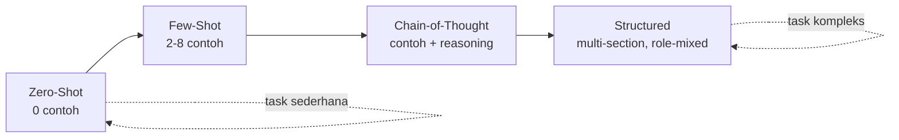

# Module 3 — Prompting Techniques

**Durasi**: 90 menit
**Posisi**: Modul ketiga Day 1; memperluas anatomi (Module 2) ke teknik lanjutan.
**Mode**: Lecture + demo perbandingan + lab.

---

## Learning Outcomes

Setelah modul ini, peserta mampu:

1. **Membedakan** kapan menggunakan zero-shot, few-shot, dan chain-of-thought (CoT) berdasarkan kompleksitas task & ketersediaan contoh.
2. **Menyusun** prompt few-shot dengan contoh berkualitas tinggi (diverse, balanced, formatted).
3. **Memandu** model melalui reasoning step-by-step dan menangkap rantai berpikir untuk audit.
4. **Menerapkan** persona-based prompting dan structured prompting untuk skenario kompleks.
5. **Mengevaluasi** trade-off antara token cost, latency, dan akurasi untuk setiap teknik.

---

## 1. Pengantar — Spectrum Prompting

### Apa Itu Spectrum Prompting?

**Spectrum Prompting** adalah cara berpikir yang menempatkan berbagai teknik prompting dalam sebuah **rentang (spectrum)** — dari yang paling sederhana hingga paling kompleks. Tujuannya: agar Anda **tidak langsung menggunakan teknik kompleks** padahal teknik sederhana sudah cukup.

Analoginya seperti memilih alat di kotak peralatan: untuk memasang paku, Anda tidak perlu palu godam — palu kecil sudah cukup. Begitu pula dengan prompt: untuk task sederhana, jangan langsung pakai teknik berlapis-lapis. Mulailah dari yang paling ringan.



### Mengapa Berpikir dalam Bentuk Spectrum?

Setiap teknik prompting memiliki **trade-off** antara tiga hal:

1. **Biaya token** — semakin banyak teks dalam prompt, semakin tinggi biaya API.
2. **Latency** — prompt yang lebih panjang membutuhkan waktu pemrosesan yang lebih lama.
3. **Akurasi & konsistensi** — teknik yang lebih kompleks umumnya menghasilkan output yang lebih konsisten untuk task yang rumit.

Jika Anda langsung memilih teknik paling kompleks, Anda **membayar biaya tinggi tanpa selalu mendapatkan hasil yang lebih baik**. Sebaliknya, jika Anda menggunakan teknik terlalu sederhana untuk task kompleks, akurasi akan rendah dan Anda akan terus mengulang prompt.

### Empat Tingkat dalam Spectrum

| Tingkat | Teknik | Karakteristik | Biaya |
|---------|--------|--------------|-------|
| **1** | **Zero-Shot** | Instruksi saja, tanpa contoh | Paling rendah |
| **2** | **Few-Shot** | Instruksi + 2 hingga 8 contoh input→output | Sedang |
| **3** | **Chain-of-Thought (CoT)** | Few-shot + minta model menjelaskan reasoning | Sedang–tinggi |
| **4** | **Structured Prompting** | Multi-section dengan peran, sumber, dan format yang dikombinasikan | Tertinggi |

Catatan penting: angka tingkat **bukan** tingkat kualitas. Tingkat 4 bukan otomatis "lebih baik" dari tingkat 1 — ia hanya **lebih cocok untuk task yang lebih kompleks**.

### Aturan Naik Tingkat

Pendekatan yang direkomendasikan: **mulai dari tingkat paling rendah, naik hanya jika hasilnya belum memadai.**

1. **Mulai dengan Zero-Shot.** Coba lebih dulu — paling cepat, paling murah, dan banyak task umum yang sudah berhasil di tingkat ini.
2. **Naik ke Few-Shot jika output tidak konsisten** atau format tidak sesuai harapan. Tambahkan 2–3 contoh untuk "mengunci" pola yang diinginkan.
3. **Naik ke Chain-of-Thought jika task membutuhkan penalaran multi-step** — misalnya kalkulasi bertahap, analisis kausalitas, atau pengambilan keputusan dengan beberapa kriteria.
4. **Naik ke Structured Prompting jika ada beberapa peran atau sumber** yang harus dikombinasikan — misalnya menggabungkan dokumen referensi, riwayat percakapan, dan aturan bisnis dalam satu prompt.

### Bagaimana Memutuskan Titik Awal?

Gunakan tiga pertanyaan diagnostik berikut:

| Pertanyaan | Jika "ya" | Mulai dari |
|-----------|-----------|-----------|
| Apakah task ini umum dan well-known (ringkasan, terjemahan, klasifikasi standar)? | Ya | **Zero-Shot** |
| Apakah ada format khusus atau taksonomi internal yang harus diikuti? | Ya | **Few-Shot** |
| Apakah task membutuhkan reasoning bertahap atau perhitungan yang dapat salah? | Ya | **Chain-of-Thought** |
| Apakah perlu menggabungkan beberapa peran (analis + reviewer) atau beberapa sumber dokumen? | Ya | **Structured** |

### Prinsip Penting

**Naik tingkat = naik biaya dan latency.** Karena itu, keputusan untuk naik tingkat harus berbasis **bukti dari evaluasi**, bukan asumsi. Module 4 (Structured Output & Evaluasi) akan membahas cara mengukur kualitas prompt secara objektif sehingga Anda tahu **kapan benar-benar perlu naik tingkat**, dan kapan teknik yang lebih sederhana sudah memadai.

Bagian selanjutnya akan membahas masing-masing tingkat secara mendalam.

---

## 2. Zero-Shot Prompting

Zero-shot = model diberi instruksi tanpa contoh. Modern LLM (Sonnet, Opus) sangat capable di zero-shot untuk task umum.

### Kapan dipakai

- Task umum yang well-documented (ringkasan, terjemahan, klasifikasi standar).
- Eksplorasi awal sebelum investasi waktu menulis contoh.
- Volume tinggi di mana setiap token contoh = biaya berlipat.

### Contoh

```text
Klasifikasikan sentimen kalimat berikut sebagai POSITIF, NEGATIF, atau NETRAL.

Kalimat: "Saya cukup puas dengan layanannya, walau pengiriman agak lambat."
Sentimen:
```

### Limitasi

- Performa drop pada domain-specific (medical, legal jargon, internal taxonomy).
- Variansi output lebih tinggi tanpa pattern anchor.

---

## 3. Few-Shot Prompting

Few-shot = prompt menyertakan **2–8 contoh** input→output. Model belajar pattern dari contoh (in-context learning).

### Prinsip Contoh yang Baik

| Prinsip      | Penjelasan                                                              |
|--------------|-------------------------------------------------------------------------|
| Diverse      | Cover edge case, bukan hanya kasus mudah.                               |
| Balanced     | Distribusi label seimbang (mis. positif/negatif/netral 1/1/1).          |
| Consistent   | Format input & output sama persis di semua contoh.                       |
| Realistic    | Mirror data produksi (panjang, gaya, noise).                            |
| Labeled clearly | Pakai delimiter konsisten (XML / `###` / newline).                   |

### Contoh Format

```text
Klasifikasikan sentimen kalimat sebagai POSITIF, NEGATIF, atau NETRAL.

<example>
Kalimat: "Produknya sangat membantu pekerjaan saya."
Sentimen: POSITIF
</example>

<example>
Kalimat: "Saya kecewa, fitur yang dijanjikan tidak ada."
Sentimen: NEGATIF
</example>

<example>
Kalimat: "Aplikasinya berfungsi seperti seharusnya."
Sentimen: NETRAL
</example>

<example>
Kalimat: "Bagus sih, tapi mahal."
Sentimen: NETRAL
</example>

Kalimat: "Awalnya senang, tapi setelah update jadi sering crash."
Sentimen:
```

### Trade-off

- Lebih banyak contoh ≠ selalu lebih baik. Setelah 5–8 contoh, marginal gain biasanya turun, tapi cost naik linear.
- Bias contoh = bias output. Jika 4 dari 5 contoh POSITIF, model condong POSITIF.

---

## 4. Chain-of-Thought (CoT) — Step-by-Step Reasoning

CoT = memaksa model menulis langkah berpikir sebelum jawaban akhir. Studi menunjukkan akurasi naik signifikan pada task matematika, logika, dan multi-hop reasoning.

### Pola

```text
{task description}

Pikirkan langkah demi langkah sebelum menjawab.

Jawaban akhir: ...
```

### Contoh

```text
Sebuah toko menjual 3 produk:
- Produk A: harga 50.000, terjual 12 unit
- Produk B: harga 75.000, terjual 8 unit
- Produk C: harga 100.000, terjual 5 unit

Berapa total revenue?

Pikirkan langkah demi langkah:
1. Hitung revenue per produk.
2. Jumlahkan total.

Jawaban akhir dalam format: "Total revenue: Rp X"
```

### CoT + Structured

Untuk audit, pisahkan reasoning dan jawaban:

```text
<thinking>
{model menulis reasoning di sini}
</thinking>

<answer>
{jawaban final}
</answer>
```

Ini memudahkan parsing dan logging untuk evaluasi.

### Catatan untuk Claude

- Claude **Extended Thinking** (Sonnet/Opus 4.x) menyediakan CoT native dengan budget yang dapat dikontrol. Tidak perlu prompt CoT manual untuk task kompleks — cukup aktifkan extended thinking di Console.
- Untuk Haiku, CoT manual via prompt tetap relevan.

---

## 5. Persona-Based Prompting

Persona-based = role prompting tingkat lanjut yang membentuk **karakter konsisten** lintas turn (multi-turn conversation).

### Komponen Persona

```text
<persona>
Nama: AskAura
Peran: Financial wellness coach untuk gig workers Indonesia
Karakter:
  - Empati tinggi, bahasa percakapan
  - Tidak menggurui, tidak judgmental
  - Selalu beri 1 action item konkret di akhir
Pengetahuan:
  - Familiar dengan platform Gojek, Grab, Maxim, Shopee Food
  - Memahami konsep budgeting 50/30/20
Larangan:
  - Tidak memberi rekomendasi investasi spesifik (compliance)
  - Tidak berbicara tentang politik atau agama
</persona>
```

### Use case
- Chatbot dengan brand voice konsisten.
- Persona untuk multiple "agen" dalam sistem yang sama (Day 3 — agentic patterns).

---

## 6. Structured Prompting

Structured prompting = prompt yang menggabungkan **multiple sections** dengan tag XML untuk skenario kompleks. Pattern ini menjadi tulang punggung Day 2–4.

### Template

```text
<system_context>
{deskripsi sistem & tujuan keseluruhan}
</system_context>

<persona>
{role + karakter}
</persona>

<knowledge_base>
{dokumen, glossary, FAQ}
</knowledge_base>

<examples>
<example>
<input>...</input>
<output>...</output>
</example>
</examples>

<task>
{instruksi spesifik untuk turn ini}
</task>

<rules>
{constraint}
</rules>

<output_format>
{schema}
</output_format>
```

### Keuntungan

- Setiap bagian dapat di-versioning terpisah.
- Mudah diubah menjadi template dinamis (variabel `{...}` diisi runtime).
- Mendukung observability — bagian mana yang berubah saat ada regression.

---

## 7. Pemilihan Teknik — Decision Matrix

| Skenario                                       | Rekomendasi teknik              |
|------------------------------------------------|---------------------------------|
| Klasifikasi 3 label, domain umum               | Zero-shot                       |
| Klasifikasi domain-specific (taxonomy internal)| Few-shot (3–5 contoh)           |
| Ekstraksi field terstruktur                    | Few-shot + JSON schema          |
| Soal matematika / logika multi-step            | CoT (atau Extended Thinking)    |
| Customer-facing chatbot                        | Persona-based + structured      |
| Multi-document analysis & synthesis            | Structured + CoT                |
| High-volume tagging                            | Zero-shot Haiku                 |

---

## Demo Live (15 menit)

**Skenario**: bandingkan 3 teknik pada task klasifikasi sentimen tweet bahasa Indonesia bercampur slang.

### Langkah

1. **Buka claude.ai** atau Console Workbench, Sonnet 4.x, `temperature=0`.
2. Siapkan 5 tweet test (sertakan 1 sarkastik, 1 mixed sentiment, 1 slang berat).
3. **Run zero-shot**: prompt klasifikasi dasar tanpa contoh.
4. **Run few-shot**: tambahkan 5 contoh terbalanced.
5. **Run CoT**: tambahkan instruksi "pikirkan langkah demi langkah, identifikasi kata kunci sentimen, baru beri label".
6. Catat output ke tabel perbandingan. Diskusikan: kapan jump dari zero ke few-shot worth? Kapan CoT worth?

---

## Contoh Konkret: Poor → Good → Better

### Contoh 1 — Klasifikasi Domain-Specific

```text
[POOR / zero-shot naive]
Klasifikasikan tiket: "Mau redeem promo cashback 50K untuk transaksi GoFood"
Kategori: ?
```

```text
[GOOD / zero-shot + taxonomy]
Klasifikasikan tiket ke salah satu kategori:
PROMO, PAYMENT, ORDER_ISSUE, ACCOUNT, OTHER.

Tiket: "Mau redeem promo cashback 50K untuk transaksi GoFood"
Kategori:
```

```text
[BETTER / few-shot]
Klasifikasikan tiket ke salah satu kategori:
PROMO, PAYMENT, ORDER_ISSUE, ACCOUNT, OTHER.

<example>
Tiket: "Kartu kredit saya ditolak waktu bayar"
Kategori: PAYMENT
</example>
<example>
Tiket: "Voucher diskon ulang tahun belum masuk"
Kategori: PROMO
</example>
<example>
Tiket: "Pesanan sampai tapi kurang 1 item"
Kategori: ORDER_ISSUE
</example>
<example>
Tiket: "Lupa password dan email lama sudah tidak aktif"
Kategori: ACCOUNT
</example>

Tiket: "Mau redeem promo cashback 50K untuk transaksi GoFood"
Kategori:
```

### Contoh 2 — Reasoning Matematika

```text
[POOR]
Jika saya beli 3 kg apel @25rb, 2 kg jeruk @30rb, dan dapat diskon 10%,
berapa total yang harus dibayar?
```

```text
[GOOD / CoT manual]
Hitung total pembayaran dengan langkah berikut:
1. Subtotal apel.
2. Subtotal jeruk.
3. Total sebelum diskon.
4. Diskon (10%).
5. Total akhir.

Soal: 3 kg apel @25rb + 2 kg jeruk @30rb, diskon 10%.

Tulis langkah lalu jawaban akhir.
```

```text
[BETTER / CoT + structured + abstain]
<task>
Hitung total pembayaran customer.
</task>

<order>
- Apel: 3 kg @ Rp 25.000
- Jeruk: 2 kg @ Rp 30.000
- Diskon: 10% dari subtotal
</order>

<rules>
- Tunjukkan perhitungan langkah demi langkah di dalam <thinking>.
- Jawaban final dalam <answer> dengan format "Rp X".
- Jika ada ambiguitas, jelaskan di <thinking> dan minta klarifikasi di <answer>.
</rules>

<thinking>
{kerjakan langkah di sini}
</thinking>

<answer>
{jawaban final}
</answer>
```

### Contoh 3 — Persona Customer Service Multi-Turn

```text
[POOR]
Kamu adalah CS. Balas: "kenapa pengiriman saya lama?"
```

```text
[GOOD]
Anda adalah CS officer e-commerce yang ramah dan solutif.
Balas keluhan: "kenapa pengiriman saya lama?"
Maks 80 kata.
```

```text
[BETTER]
<persona>
Nama: Mira, CS Senior di e-commerce ABCMart.
Karakter: empati tinggi, lugas, tidak menggurui, selalu tawarkan langkah konkret.
Larangan: tidak menjanjikan refund tanpa eskalasi ke supervisor.
</persona>

<sop>
Untuk keluhan pengiriman lama:
1. Akui & empati (1 kalimat).
2. Minta nomor resi.
3. Janjikan investigasi 1x24 jam.
4. Tawarkan kompensasi voucher 25K untuk delay > 5 hari.
</sop>

<task>
Balas pesan pelanggan dalam <message> mengikuti <sop>. Maks 100 kata.
Format markdown: salam, body, closing dengan nomor tiket [#PLACEHOLDER].
</task>

<message>
Kenapa pengiriman saya lama?
</message>
```

---

## Hands-on Lab

[`lab-02-zero-few-cot/`](./lab-02-zero-few-cot/) — Praktik 3 teknik (zero-shot, few-shot, CoT) pada 3 task: klasifikasi sentimen, ekstraksi entitas, reasoning matematika. Lengkap dengan tabel evaluasi.

**Durasi**: 45 menit
**Mode**: Individual, peer-comparison di akhir.

---

## Wrap-up & Q&A

1. Kapan few-shot tidak worth dibanding zero-shot?
2. Mengapa CoT bisa **menurunkan** kualitas untuk task tertentu? (hint: task sederhana)
3. Apa risiko mempublikasikan reasoning chain ke end user?
4. Bagaimana Anda memilih jumlah contoh few-shot — 2, 5, 8?
5. Apa beda persona-based dengan system prompt biasa?

---

## Bacaan Lanjutan

- Anthropic — *Multishot prompting*: https://docs.anthropic.com/en/docs/build-with-claude/prompt-engineering/multishot-prompting
- Anthropic — *Chain of thought*: https://docs.anthropic.com/en/docs/build-with-claude/prompt-engineering/chain-of-thought
- Anthropic — *Extended thinking*: https://docs.anthropic.com/en/docs/build-with-claude/extended-thinking
- Wei et al. — *Chain-of-Thought Prompting Elicits Reasoning in LLMs*: https://arxiv.org/abs/2201.11903
- Anthropic — *Prompt library — Roleplay*: https://docs.anthropic.com/en/prompt-library/library
