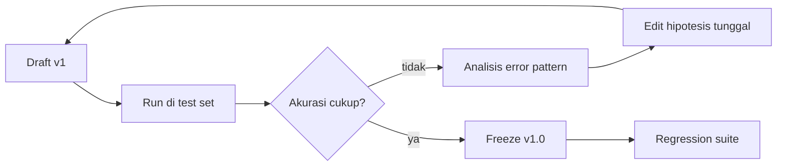

# Module 4 — Structured Output & Optimization

**Durasi**: 90 menit
**Posisi**: Modul penutup Day 1; bridge ke Day 2 (API & integrasi).
**Mode**: Lecture + lab terintegrasi (60 menit teori → 30 menit lab in-class).

---

## Learning Outcomes

Setelah modul ini, peserta mampu:

1. **Mendesain** prompt yang menghasilkan JSON valid dengan schema yang ditentukan, siap dikonsumsi sistem hilir.
2. **Mengendalikan** output Claude melalui prefill, stop sequence, dan format constraint.
3. **Menyusun** proses iteratif prompt refinement berbasis test set, bukan one-shot tweak.
4. **Membangun** framework evaluasi prompt yang mencakup: kriteria sukses, rubrik, error handling, dan regression test.
5. **Menyiapkan** fondasi handoff ke Day 2 (integrasi API & otomasi evaluasi).

---

## 1. Mengapa Structured Output?

Output natural language enak dibaca manusia, tapi sulit dikonsumsi sistem. Begitu Claude masuk pipeline produksi (CRM, ETL, ticketing), Anda hampir selalu butuh **structured output** — JSON, XML, atau CSV.

**Manfaat**:
- Parsing deterministik (no regex magic).
- Validasi schema otomatis.
- Mudah di-versioning + observability.
- Cocok untuk tool use (Day 3).

**Tantangan**:
- LLM tidak natively output JSON — ia mengeluarkan token. JSON valid = disiplin prompt + validation.
- Field optional vs required harus eksplisit.
- Halusinasi field yang tidak diminta = beban downstream.

---

## 2. JSON Output Generation — Best Practices

### Prinsip

1. **Tampilkan schema secara literal** di prompt.
2. **Tunjukkan contoh JSON** lengkap (few-shot).
3. **Spesifikkan tipe data** dan format (mis. tanggal `YYYY-MM-DD`).
4. **Tetapkan null/default** untuk field optional.
5. **Larang field tambahan** secara eksplisit.
6. **Wrap dengan delimiter** (`<json>` tag) atau **prefill** `{` untuk memaksa JSON.

### Template Skeleton

```text
<task>
Ekstrak data invoice dari teks berikut.
</task>

<schema>
{
  "vendor_name": "string",
  "invoice_number": "string",
  "invoice_date": "YYYY-MM-DD",
  "due_date": "YYYY-MM-DD | null",
  "currency": "ISO 4217 (default IDR)",
  "subtotal": "number",
  "tax": "number",
  "total": "number",
  "line_items": [
    {"description": "string", "quantity": "number", "unit_price": "number", "amount": "number"}
  ]
}
</schema>

<rules>
- Output hanya JSON valid, tanpa narasi.
- Field yang tidak ditemukan, set null (jangan dihilangkan).
- Jangan tambah field di luar schema.
- Angka tanpa pemisah ribuan & tanpa simbol mata uang.
</rules>

<text>
{teks invoice}
</text>
```

### Prefill Trick

Pada API (atau Workbench), prefill assistant message dengan `{` untuk memaksa output JSON dari token pertama:

```
user:    {prompt seperti di atas}
assistant: {
```

Ini menjamin model melanjutkan dengan JSON, bukan preamble seperti "Berikut hasilnya:".

### Stop Sequence

Set stop sequence `}` jika JSON Anda flat dan single-object, untuk menghindari token tambahan. Hati-hati pada JSON nested — bisa terpotong.

---

## 3. Controlled Responses

### Length Control

```text
- Maks 3 kalimat.
- Antara 100–150 kata.
- Tepat 5 bullet.
```

### Vocabulary Control

```text
- Hanya gunakan istilah di <glossary>.
- Hindari jargon: "synergize", "leverage", "ecosystem".
```

### Tone Control

```text
- Tone profesional, lugas, tidak menggurui.
- Gunakan 2nd person ("Anda"), bukan 3rd person.
```

### Refusal Control

```text
- Jika permintaan di luar topik {DOMAIN}, jawab dengan JSON:
  {"status": "out_of_scope", "reason": "..."}
- Jika informasi tidak cukup, jawab:
  {"status": "insufficient_info", "missing_fields": [...]}
```

---

## 4. Prompt Refinement — Iterative Loop

Prompt engineering = experimental. Treat seperti A/B testing.



### Aturan Refinement

1. **Satu perubahan per iterasi**. Multi-change = tidak bisa attribute improvement.
2. **Test set tetap** lintas iterasi.
3. **Catat hipotesis** ("saya pikir tambah contoh negatif akan menaikkan recall negatif").
4. **Jangan over-fit** ke 1–2 sampel; ukur di test set 20–50 sampel.

---

## 5. Prompt Testing Strategy

### Hierarki Test Set

| Tier        | Ukuran | Tujuan                                   |
|-------------|--------|------------------------------------------|
| Smoke set   | 3–5    | Quick sanity di setiap edit              |
| Eval set    | 20–50  | Pengukuran akurasi sebenarnya            |
| Regression  | 50–200 | Cegah regression saat upgrade model/prompt|
| Adversarial | 10–30  | Edge case: sarkasme, slang, ambigu       |

### Metrik

- **Akurasi** (klasifikasi).
- **Precision / Recall / F1** (klasifikasi multi-class).
- **JSON validity rate** (% output yang parse).
- **Field completeness rate** (% required field terisi).
- **Schema conformance** (% output yang match schema).
- **Manual quality score** (1–5 likert untuk task generatif).

---

## 6. Error Handling — di Level Prompt

Error tidak hanya di kode; sering muncul di output Claude. Anti-pattern: silently let it pass.

### Pola Error Handling

```text
<rules>
- Jika input tidak mengandung data yang diperlukan:
  Output: {"error": "missing_input", "details": "..."}
- Jika ada konflik data (mis. total ≠ subtotal+tax):
  Output: {"error": "data_inconsistency", "details": "..."}
- Jika bahasa input tidak dikenali:
  Output: {"error": "language_unsupported", "detected": "..."}
- Jika request berada di luar scope:
  Output: {"error": "out_of_scope"}
</rules>
```

### Validation Layer (preview Day 2)

Setelah parsing JSON, validasi dengan schema (mis. Pydantic, JSON Schema, Zod). Jika gagal validasi:
1. Log raw output.
2. Retry dengan prompt yang menyertakan error feedback.
3. Setelah N retry, fallback ke human review.

---

## 7. Prompt Evaluation Framework

Framework yang siap dibawa ke organisasi peserta:

| Aspek            | Pertanyaan kunci                                              |
|------------------|---------------------------------------------------------------|
| Goal             | Apa metric bisnis yang akan berubah?                          |
| Test set         | Siapa kurator? Berapa ukuran? Bagaimana labeling?             |
| Baseline         | Model + prompt mana yang jadi pembanding?                     |
| Criteria         | Threshold lulus (mis. 90% akurasi + JSON validity 99%)?        |
| Versioning       | Di mana prompt disimpan? Bagaimana review?                    |
| Monitoring       | Bagaimana drift dideteksi di produksi?                        |
| Error handling   | Apa SLA untuk human escalation?                               |

### Checklist Pre-Production

- [ ] Schema JSON ter-dokumentasi.
- [ ] Test set ≥ 50 sampel terlabel.
- [ ] Akurasi ≥ threshold di smoke + eval.
- [ ] JSON validity rate ≥ 99%.
- [ ] Adversarial set teruji.
- [ ] Prompt versioned di Git dengan owner.
- [ ] Rollback plan & feature flag.

---

## Demo Live (10 menit)

**Skenario**: ekstraksi invoice teks → JSON.

### Langkah

1. Buka Console Workbench, Sonnet 4.x, `temperature=0`.
2. **Iteration v0**: prompt naïf "ekstrak data invoice ini".
   - Amati: format JSON tidak konsisten, field acak.
3. **Iteration v1**: tambah schema eksplisit + rules + `<text>` wrapping.
   - Amati: JSON lebih baik tapi mungkin masih ada narasi pengantar.
4. **Iteration v2**: tambah prefill `{` dan rule "output hanya JSON".
   - Amati: clean JSON, parsable.
5. **Iteration v3**: tambah error handling untuk total ≠ subtotal+tax.
   - Test dengan invoice yang totalnya salah → model mengeluarkan error JSON.
6. Tunjukkan log perbedaan v0 → v3. Diskusikan: setiap iterasi = hipotesis tunggal.

---

## Contoh Konkret: Poor → Good → Better

### Contoh 1 — Extract JSON dari Email

```text
[POOR]
Ekstrak data dari email ini dan kasih JSON: {email}
```

```text
[GOOD]
Ekstrak data berikut dari <email> dan output dalam JSON dengan field:
sender_name, sender_email, subject, intent, action_required.

<email>
{email}
</email>
```

```text
[BETTER]
<task>
Ekstrak data dari <email> ke JSON sesuai <schema>.
</task>

<schema>
{
  "sender_name": "string | null",
  "sender_email": "string (RFC 5322 valid) | null",
  "subject": "string",
  "intent": "INQUIRY | COMPLAINT | REQUEST | OTHER",
  "action_required": "boolean",
  "deadline": "YYYY-MM-DD | null",
  "confidence": "number (0-1)"
}
</schema>

<rules>
- Output hanya JSON valid, tanpa narasi sebelum atau sesudah.
- Field tidak ditemukan = null (jangan hilangkan key).
- confidence = estimasi kepercayaan terhadap intent.
- Jika email kosong atau tidak parseable: {"error": "invalid_input"}.
</rules>

<email>
{email}
</email>
```

### Contoh 2 — Klasifikasi dengan Confidence

```text
[POOR]
Tiket ini kategorinya apa? "Sistem timeout terus"
```

```text
[GOOD]
Klasifikasikan tiket ke {BUG, FEATURE, QUESTION} dengan format:
{"category": "...", "confidence": "high|medium|low"}

Tiket: "Sistem timeout terus"
```

```text
[BETTER]
<task>
Klasifikasikan tiket support ke kategori dan severity.
</task>

<schema>
{
  "category": "BUG | FEATURE_REQUEST | QUESTION | COMPLAINT",
  "severity": "LOW | MEDIUM | HIGH | CRITICAL",
  "confidence": "number 0-1",
  "rationale": "string, maks 25 kata",
  "needs_human_review": "boolean"
}
</schema>

<rules>
- Set needs_human_review = true jika confidence < 0.7.
- Severity CRITICAL hanya untuk production outage atau security incident.
- Output JSON saja.
</rules>

<ticket>Sistem timeout terus</ticket>
```

### Contoh 3 — Generate dengan Validation

```text
[POOR]
Buat 5 pertanyaan FAQ dari produk: {desc}
```

```text
[GOOD]
Buat 5 pertanyaan FAQ + jawabannya dari deskripsi produk:
{desc}
Format JSON: [{"q": "...", "a": "..."}]
```

```text
[BETTER]
<task>
Buat FAQ dari <product_description>.
</task>

<schema>
{
  "faqs": [
    {
      "q": "string, kalimat tanya lengkap",
      "a": "string, jawaban 1-3 kalimat berdasarkan deskripsi",
      "source_quote": "string, kutipan persis dari deskripsi yang mendukung jawaban",
      "category": "FEATURE | PRICING | SUPPORT | OTHER"
    }
  ]
}
</schema>

<rules>
- Tepat 5 FAQ.
- Setiap jawaban WAJIB punya source_quote (kutipan harfiah dari deskripsi).
- Jika tidak ada source untuk pertanyaan, JANGAN buat FAQ itu — kurangi jumlah.
- Hindari yes/no questions.
- Distribusi kategori: minimal 2 FEATURE.
</rules>

<product_description>
{desc}
</product_description>
```

Pattern source_quote = **anti-hallucination** + auditable.

---

## Hands-on Lab

[`lab-03-json-output-evaluation/`](./lab-03-json-output-evaluation/) — Tulis prompt untuk parsing invoice teks ke structured JSON. Lengkap dengan rubrik evaluasi (validitas JSON, kelengkapan field, akurasi).

**Durasi**: 60 menit
**Mode**: Individual; share results di akhir.

---

## Wrap-up & Q&A

1. Mengapa prefill `{` lebih reliable dibanding instruksi "output hanya JSON"?
2. Apa beda "JSON valid" dengan "schema-conformant"?
3. Bagaimana Anda mendesain test set untuk task ekstraksi invoice?
4. Bagaimana mendeteksi prompt drift di produksi setelah upgrade model?
5. Kapan Anda akan menyerahkan validasi ke layer kode, dan kapan ke prompt itu sendiri?

---

## Bacaan Lanjutan

- Anthropic — *Increase output consistency (JSON mode)*: https://docs.anthropic.com/en/docs/build-with-claude/prompt-engineering/increase-consistency
- Anthropic — *Prefill Claude's response*: https://docs.anthropic.com/en/docs/build-with-claude/prompt-engineering/prefill-claudes-response
- Anthropic — *Control output format (long context)*: https://docs.anthropic.com/en/docs/build-with-claude/prompt-engineering/long-context-tips
- Anthropic — *Test and evaluate*: https://docs.anthropic.com/en/docs/test-and-evaluate/develop-tests
- Anthropic — *Reducing hallucinations*: https://docs.anthropic.com/en/docs/test-and-evaluate/strengthen-guardrails/reduce-hallucinations
- JSON Schema spec: https://json-schema.org/
