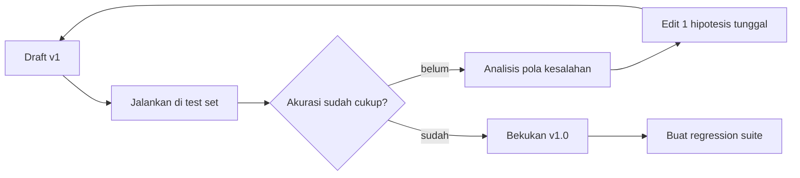

# Module 4 — Structured Output & Optimization

**Durasi belajar**: ±90 menit
**Posisi**: Modul penutup Day 1; jembatan menuju Day 2 (API & integrasi).
**Format**: Baca konsep → praktik mandiri → lab terintegrasi (60 menit teori → 30 menit lab).

---

## Apa yang Akan Anda Bisa Setelah Modul Ini

Setelah selesai membaca dan mempraktikkan modul ini, Anda akan mampu:

1. **Mendesain** prompt yang menghasilkan JSON valid sesuai schema yang ditentukan — siap dikonsumsi sistem hilir.
2. **Mengendalikan** output Claude melalui prefill, stop sequence, dan format constraint.
3. **Menyusun** proses iteratif perbaikan prompt berbasis test set, bukan sekadar tebakan satu kali jadi.
4. **Membangun** kerangka evaluasi prompt yang mencakup: kriteria sukses, rubrik penilaian, error handling, dan regression test.
5. **Menyiapkan** fondasi untuk handoff ke Day 2 (integrasi API & otomasi evaluasi).

---

## 1. Mengapa Structured Output?

Output dalam bentuk natural language memang nyaman dibaca manusia. Namun, ketika Claude masuk ke pipeline produksi (CRM, ETL, sistem ticketing), output bebas berbentuk paragraf justru menjadi masalah — sulit diolah, sulit divalidasi, dan rentan inkonsistensi.

Di sinilah **structured output** berperan: JSON, XML, atau CSV — format terstruktur yang dapat **diparsing secara otomatis dan dipercaya** oleh sistem.

### Manfaat Utama

- **Parsing deterministik** — tidak perlu regex yang rumit untuk mengambil data.
- **Validasi schema otomatis** — output bisa langsung dicek menggunakan JSON Schema, Pydantic, atau Zod.
- **Mudah di-versioning dan diaudit** — perubahan format dapat dilacak antar versi prompt.
- **Cocok untuk tool use** — fondasi untuk AI Agent yang akan dibahas di Day 3.

### Tantangan yang Perlu Anda Pahami

- **Claude tidak secara bawaan menghasilkan JSON.** Yang dihasilkan model adalah token demi token. JSON yang valid datang dari kombinasi **prompt yang disiplin + lapisan validasi**.
- **Field optional vs required** harus dinyatakan secara eksplisit, agar Claude tidak mengarang struktur.
- **Halusinasi field tambahan** (yang tidak diminta) akan menjadi beban bagi sistem hilir Anda.

---

## 2. JSON Output Generation — Praktik Terbaik

### Prinsip Dasar

1. **Tampilkan schema secara literal** di dalam prompt — jangan hanya dijelaskan dalam kalimat.
2. **Sertakan contoh JSON lengkap** sebagai few-shot reference.
3. **Spesifikkan tipe data** dan format yang diharapkan (misalnya tanggal dalam format `YYYY-MM-DD`).
4. **Tetapkan nilai default atau null** untuk field opsional, sehingga Claude tahu kapan boleh kosong.
5. **Larang field tambahan** secara eksplisit, agar tidak ada properti liar di output.
6. **Bungkus output dengan delimiter** (`<json>` tag) atau gunakan **prefill** `{` untuk mengarahkan Claude langsung ke JSON.

### Template Skeleton

```text
<task>
Ekstrak data invoice dari teks berikut.
</task>

<schema>
{
  "vendor_name": "string",
  "invoice_number": "string",
  "invoice_date": "YYYY-MM-DD",
  "due_date": "YYYY-MM-DD | null",
  "currency": "ISO 4217 (default IDR)",
  "subtotal": "number",
  "tax": "number",
  "total": "number",
  "line_items": [
    {"description": "string", "quantity": "number", "unit_price": "number", "amount": "number"}
  ]
}
</schema>

<rules>
- Output hanya JSON valid, tanpa narasi tambahan.
- Field yang tidak ditemukan, isi dengan null (jangan dihilangkan).
- Jangan tambahkan field di luar schema.
- Angka tanpa pemisah ribuan dan tanpa simbol mata uang.
</rules>

<text>
{teks invoice}
</text>
```

### Trik Prefill

Pada Claude API atau Console Workbench, Anda dapat **pre-isi (prefill)** awal balasan dari assistant dengan karakter `{` untuk memaksa Claude langsung memulai output dengan JSON, tanpa preamble seperti "Berikut hasilnya:":

```
user:     {prompt seperti di atas}
assistant: {
```

Trik ini sangat efektif menghindari narasi pengantar yang merusak parsing JSON.

### Stop Sequence

Anda dapat mengatur **stop sequence** `}` jika JSON yang Anda harapkan adalah single-object flat. Claude akan berhenti menghasilkan token setelah `}` pertama muncul. Namun, **berhati-hatilah pada JSON nested** — bisa terpotong di tengah jalan jika stop sequence tidak dipilih dengan tepat.

---

## 3. Mengendalikan Karakter Respons

Selain format, Anda juga dapat mengendalikan **karakter dan perilaku output** secara terperinci.

### Pengendalian Panjang

```text
- Maksimal 3 kalimat.
- Antara 100–150 kata.
- Tepat 5 bullet.
```

### Pengendalian Vocabulary

```text
- Hanya gunakan istilah yang tersedia di <glossary>.
- Hindari jargon seperti: "synergize", "leverage", "ecosystem".
```

### Pengendalian Tone

```text
- Tone profesional, lugas, tidak menggurui.
- Gunakan kata ganti orang kedua ("Anda"), bukan orang ketiga.
```

### Pengendalian Penolakan (Refusal)

```text
- Jika permintaan di luar topik {DOMAIN}, jawab dengan JSON:
  {"status": "out_of_scope", "reason": "..."}
- Jika informasi yang dibutuhkan tidak cukup, jawab:
  {"status": "insufficient_info", "missing_fields": [...]}
```

Pengendalian penolakan sangat penting untuk **sistem produksi** — Anda perlu memastikan model tidak memaksakan jawaban ketika data tidak cukup.

---

## 4. Iteratif Memperbaiki Prompt

Prompt engineering bersifat **eksperimental**. Anggap saja seperti A/B testing: Anda membuat hipotesis, menguji, lalu menyimpulkan berdasarkan data — bukan menebak.



### Aturan Penting saat Memperbaiki Prompt

1. **Satu perubahan per iterasi.** Jika Anda mengubah banyak hal sekaligus, Anda tidak akan tahu **perubahan mana yang sebenarnya berdampak**.
2. **Test set tetap** lintas iterasi. Gunakan set yang sama agar pengukuran adil.
3. **Catat hipotesis tertulis** setiap kali melakukan perubahan. Contoh: *"Saya menduga penambahan contoh negatif akan meningkatkan recall pada kelas negatif."*
4. **Hindari over-fitting** ke 1–2 sampel. Pengukuran yang valid memerlukan test set minimal 20–50 sampel.

---

## 5. Strategi Pengujian Prompt

### Hierarki Test Set

| Tier        | Ukuran | Tujuan                                                  |
|-------------|--------|--------------------------------------------------------|
| **Smoke**   | 3–5    | Pengecekan cepat di setiap edit                        |
| **Eval**    | 20–50  | Pengukuran akurasi yang representatif                  |
| **Regression** | 50–200 | Mencegah penurunan kualitas saat upgrade model/prompt |
| **Adversarial** | 10–30 | Menguji edge case: sarkasme, slang, ambiguitas        |

### Metrik yang Perlu Dipantau

- **Akurasi** — untuk task klasifikasi.
- **Precision / Recall / F1** — untuk klasifikasi multi-kelas.
- **JSON validity rate** — persentase output yang berhasil di-parse.
- **Field completeness rate** — persentase field required yang terisi.
- **Schema conformance** — persentase output yang sesuai schema.
- **Manual quality score** — skala 1–5 (Likert) untuk task generatif yang sulit diukur otomatis.

---

## 6. Error Handling di Level Prompt

Kesalahan tidak hanya terjadi di kode — sering kali muncul juga di output Claude. **Anti-pola yang harus dihindari**: membiarkan output yang tidak valid lewat begitu saja tanpa penanganan.

### Pola Error Handling yang Direkomendasikan

```text
<rules>
- Jika input tidak mengandung data yang diperlukan:
  Output: {"error": "missing_input", "details": "..."}
- Jika ada konflik data (misal: total ≠ subtotal + tax):
  Output: {"error": "data_inconsistency", "details": "..."}
- Jika bahasa input tidak dikenali:
  Output: {"error": "language_unsupported", "detected": "..."}
- Jika permintaan berada di luar scope:
  Output: {"error": "out_of_scope"}
</rules>
```

### Lapisan Validasi (Pratinjau Day 2)

Setelah JSON di-parse, Anda perlu **memvalidasi dengan schema** (Pydantic untuk Python, JSON Schema universal, atau Zod untuk TypeScript). Jika validasi gagal, alur penanganannya:

1. **Catat raw output** untuk keperluan debugging.
2. **Retry dengan prompt yang menyertakan error feedback** — model akan memperbaiki dirinya sendiri.
3. **Setelah N kali retry**, fallback ke **human review** sebagai pengaman terakhir.

---

## 7. Kerangka Evaluasi Prompt

Berikut kerangka yang siap Anda bawa pulang ke organisasi:

| Aspek           | Pertanyaan kunci                                                |
|-----------------|----------------------------------------------------------------|
| **Tujuan**      | Metric bisnis apa yang akan berubah?                            |
| **Test set**    | Siapa yang mengkurasi? Berapa ukurannya? Bagaimana label-nya?   |
| **Baseline**    | Model dan prompt mana yang menjadi pembanding?                   |
| **Kriteria**    | Threshold lulus (misal: 90% akurasi + 99% JSON validity)?        |
| **Versioning**  | Di mana prompt disimpan? Bagaimana proses review-nya?            |
| **Monitoring**  | Bagaimana drift kualitas dideteksi di lingkungan produksi?       |
| **Error handling** | Apa SLA untuk eskalasi ke human review?                       |

### Checklist Pre-Production

- [ ] Schema JSON sudah terdokumentasi dengan jelas.
- [ ] Test set sekurang-kurangnya 50 sampel terlabel.
- [ ] Akurasi sudah memenuhi threshold di smoke + eval.
- [ ] JSON validity rate ≥ 99%.
- [ ] Adversarial set sudah diuji.
- [ ] Prompt sudah ter-versioning di Git, dengan pemilik yang jelas.
- [ ] Rollback plan dan feature flag sudah disiapkan.

---

## Praktik Mandiri (10 menit)

Daripada hanya membaca teori, mari coba alur perbaikan prompt secara langsung. Anda akan melihat sendiri bagaimana **setiap iterasi membawa peningkatan terukur**.

**Skenario**: ekstraksi data invoice dari teks bebas menjadi JSON.

### Langkah-Langkahnya

1. **Setup**: Buka Console Workbench, pilih model Sonnet, atur `temperature=0`.

2. **Iterasi v0** — Prompt naif:
   ```
   Ekstrak data invoice ini.
   ```
   Amati hasilnya. Kemungkinan besar: format JSON tidak konsisten, field acak.

3. **Iterasi v1** — Tambahkan schema eksplisit, aturan, dan pembungkus `<text>`. Amati: JSON sudah lebih baik, tetapi mungkin masih ada narasi pengantar.

4. **Iterasi v2** — Tambahkan prefill `{` dan aturan "output hanya JSON". Amati: JSON sudah bersih dan dapat diparsing.

5. **Iterasi v3** — Tambahkan error handling untuk kasus `total ≠ subtotal + tax`. Uji dengan invoice yang totalnya salah, lihat apakah Claude mengeluarkan JSON error sesuai pola.

6. Bandingkan log dari v0 sampai v3. Perhatikan: **setiap iterasi mewakili satu hipotesis tunggal** yang dapat Anda evaluasi efeknya secara terisolasi.

---

## Contoh Konkret: Prompt Kurang Baik → Baik → Lebih Baik

### Contoh 1 — Ekstraksi Data dari Email

```text
[KURANG BAIK]
Ekstrak data dari email ini dan berikan JSON: {email}
```

```text
[BAIK]
Ekstrak data berikut dari <email> dan output dalam JSON dengan field:
sender_name, sender_email, subject, intent, action_required.

<email>
{email}
</email>
```

```text
[LEBIH BAIK]
<task>
Ekstrak data dari <email> ke JSON sesuai <schema>.
</task>

<schema>
{
  "sender_name": "string | null",
  "sender_email": "string (RFC 5322 valid) | null",
  "subject": "string",
  "intent": "INQUIRY | COMPLAINT | REQUEST | OTHER",
  "action_required": "boolean",
  "deadline": "YYYY-MM-DD | null",
  "confidence": "number (0-1)"
}
</schema>

<rules>
- Output hanya JSON valid, tanpa narasi sebelum maupun sesudah.
- Field yang tidak ditemukan, isi dengan null (jangan hilangkan key).
- confidence = estimasi tingkat keyakinan model terhadap intent.
- Jika email kosong atau tidak dapat diparsing: {"error": "invalid_input"}.
</rules>

<email>
{email}
</email>
```

### Contoh 2 — Klasifikasi dengan Tingkat Keyakinan

```text
[KURANG BAIK]
Tiket ini kategorinya apa? "Sistem timeout terus"
```

```text
[BAIK]
Klasifikasikan tiket ke {BUG, FEATURE, QUESTION} dengan format:
{"category": "...", "confidence": "high|medium|low"}

Tiket: "Sistem timeout terus"
```

```text
[LEBIH BAIK]
<task>
Klasifikasikan tiket support ke kategori dan tingkat severity.
</task>

<schema>
{
  "category": "BUG | FEATURE_REQUEST | QUESTION | COMPLAINT",
  "severity": "LOW | MEDIUM | HIGH | CRITICAL",
  "confidence": "number 0-1",
  "rationale": "string, maksimal 25 kata",
  "needs_human_review": "boolean"
}
</schema>

<rules>
- Set needs_human_review = true jika confidence < 0.7.
- Severity CRITICAL hanya untuk production outage atau insiden keamanan.
- Output JSON saja.
</rules>

<ticket>Sistem timeout terus</ticket>
```

### Contoh 3 — Generasi dengan Validasi Sumber

```text
[KURANG BAIK]
Buat 5 pertanyaan FAQ dari produk: {desc}
```

```text
[BAIK]
Buat 5 pertanyaan FAQ beserta jawabannya dari deskripsi produk:
{desc}
Format JSON: [{"q": "...", "a": "..."}]
```

```text
[LEBIH BAIK]
<task>
Buat FAQ dari <product_description>.
</task>

<schema>
{
  "faqs": [
    {
      "q": "string, kalimat tanya lengkap",
      "a": "string, jawaban 1-3 kalimat berdasarkan deskripsi",
      "source_quote": "string, kutipan persis dari deskripsi yang mendukung jawaban",
      "category": "FEATURE | PRICING | SUPPORT | OTHER"
    }
  ]
}
</schema>

<rules>
- Tepat 5 FAQ.
- Setiap jawaban WAJIB disertai source_quote (kutipan harfiah dari deskripsi).
- Jika tidak ada sumber yang mendukung untuk pertanyaan tertentu, JANGAN buat FAQ tersebut — kurangi jumlah.
- Hindari pertanyaan yes/no.
- Distribusi kategori: minimal 2 FEATURE.
</rules>

<product_description>
{desc}
</product_description>
```

Pola `source_quote` adalah **strategi anti-halusinasi** yang sangat kuat — model dipaksa menunjuk bukti spesifik, sehingga output mudah diaudit.

---

## Hands-on Lab

[`lab-03-json-output-evaluation/`](./lab-03-json-output-evaluation/) — Tulis prompt untuk parsing invoice teks menjadi JSON terstruktur. Dilengkapi rubrik evaluasi (validitas JSON, kelengkapan field, akurasi).

**Durasi**: 60 menit
**Mode**: Individual, lalu berbagi hasil di akhir sesi.

---

## Latihan & Refleksi

Sebelum melanjutkan ke Day 2, pastikan Anda mampu menjawab lima pertanyaan refleksi berikut:

1. Mengapa **prefill `{`** lebih reliable dibanding instruksi "output hanya JSON"?
2. Apa perbedaan antara **"JSON valid"** dan **"schema-conformant"**?
3. Bagaimana Anda akan mendesain **test set** untuk task ekstraksi invoice di organisasi Anda?
4. Bagaimana cara mendeteksi **prompt drift** di lingkungan produksi setelah upgrade model?
5. Kapan Anda akan menyerahkan validasi ke **lapisan kode**, dan kapan ke **prompt itu sendiri**?

---

## Bacaan Lanjutan

- Anthropic — *Increase output consistency (JSON mode)*: https://docs.anthropic.com/en/docs/build-with-claude/prompt-engineering/increase-consistency
- Anthropic — *Prefill Claude's response*: https://docs.anthropic.com/en/docs/build-with-claude/prompt-engineering/prefill-claudes-response
- Anthropic — *Control output format (long context)*: https://docs.anthropic.com/en/docs/build-with-claude/prompt-engineering/long-context-tips
- Anthropic — *Test and evaluate*: https://docs.anthropic.com/en/docs/test-and-evaluate/develop-tests
- Anthropic — *Reducing hallucinations*: https://docs.anthropic.com/en/docs/test-and-evaluate/strengthen-guardrails/reduce-hallucinations
- JSON Schema spec: https://json-schema.org/
