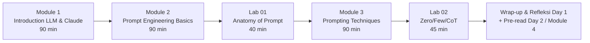

# DAY 1 — Prompt Engineering Fundamentals + Advanced

**Program**: Prompt Engineering, AI Agent & AI App Development with Claude
**Penyelenggara**: Multimatics
**Durasi total program**: 4 hari (40 jam)
**Durasi Day 1**: ±6,5 jam efektif (3 modul × 90 menit + 2 lab + break)
**Target audiens**: Software Developer, AI/ML Engineer, Data Analyst, Product Manager, Innovation Team, IT Architect

---

## Ringkasan Day 1

Day 1 membangun fondasi mental model peserta tentang Large Language Model (LLM), cara Claude bekerja, dan bagaimana berkomunikasi efektif dengannya melalui prompt. Hari ini sengaja **tidak menyentuh kode API** — fokus pada *prompt craft* menggunakan Claude web (claude.ai, free tier sudah cukup). Tujuannya: setiap peserta, terlepas dari latar belakang teknis, mampu menulis prompt yang reliable, terukur, dan siap diintegrasikan ke sistem.

Filosofi Day 1: **"Prompt adalah spesifikasi, bukan obrolan."** Peserta diajak berpikir seperti seorang technical writer + product analyst yang menulis instruksi untuk junior cerdas tapi tanpa konteks.

> 📌 **Catatan struktur**: Mulai cohort ini, **Module 4 (Structured Output & Optimization)** dipindahkan ke Day 2 sebagai pembuka hari kedua. Alasan: M4 dirancang sebagai jembatan langsung ke integrasi API (Day 2+), sehingga lebih natural disampaikan tepat sebelum peserta mulai coding di `fin-app`.

---

## Learning Outcomes Day 1

Setelah menyelesaikan Day 1, peserta diharapkan mampu:

1. **Menjelaskan** cara kerja LLM (tokenization, transformer, context window) dan keterbatasannya (hallucination, knowledge cutoff, bias) dalam bahasa yang dapat dimengerti stakeholder non-teknis.
2. **Mengidentifikasi** kapabilitas dan batas Claude (Opus, Sonnet, Haiku) serta memilih model yang tepat untuk use case tertentu.
3. **Menyusun prompt** menggunakan anatomi standar: Role + Context + Task + Constraint + Output Format.
4. **Menerapkan** teknik prompting lanjutan: zero-shot, few-shot, chain-of-thought, persona, dan structured prompting.

Learning outcome ke-5 tentang structured output (JSON) + framework evaluasi prompt dipindahkan ke Day 2 mengikuti perpindahan Module 4.

---

## Alur Module



---

## Jadwal Harian (indikatif, dapat disesuaikan fasilitator)

| Waktu         | Aktivitas                                               | Durasi |
|---------------|---------------------------------------------------------|--------|
| 08.30 – 09.00 | Registrasi, perkenalan, ice breaker                     | 30 m   |
| 09.00 – 10.30 | **Module 1**: Introduction to LLM & Claude              | 90 m   |
| 10.30 – 10.45 | Coffee break                                            | 15 m   |
| 10.45 – 12.15 | **Module 2**: Prompt Engineering Basics                 | 90 m   |
| 12.15 – 13.15 | Lunch break                                             | 60 m   |
| 13.15 – 13.55 | **Lab 01**: Anatomy of a Prompt                         | 40 m   |
| 13.55 – 15.25 | **Module 3**: Prompting Techniques                      | 90 m   |
| 15.25 – 15.40 | Coffee break                                            | 15 m   |
| 15.40 – 16.25 | **Lab 02**: Zero-shot, Few-shot, Chain-of-Thought       | 45 m   |
| 16.25 – 17.00 | Wrap-up, refleksi, pre-read Day 2 (Module 4 + setup `fin-app`) | 35 m |

Day 1 total efektif: **±6,5 jam**. Slot tersisa dapat digunakan untuk diskusi mendalam atau early dismissal.

---

## Struktur Folder

```
Day-1-Prompt-Engineering/
├── README.md                                       <- file ini
├── Module-01-Introduction-LLM-Claude/
│   ├── materi.md
│   └── latihan.md
├── Module-02-Prompt-Engineering-Basics/
│   ├── materi.md
│   └── lab-01-anatomy-prompt/README.md
└── Module-03-Prompting-Techniques/
    ├── materi.md
    └── lab-02-zero-few-cot/README.md
```

Modul **Structured Output & Optimization (M4)** sekarang berada di [`../Day-2-AI-Workflow-Agent/Module-04-Structured-Output-Optimization/`](../Day-2-AI-Workflow-Agent/Module-04-Structured-Output-Optimization/).

---

## Prasyarat Peserta

- Laptop dengan browser modern (Chrome/Edge/Firefox).
- Akun **claude.ai** (free tier sudah cukup untuk seluruh latihan Day 1).
- Akun **console.anthropic.com** (opsional untuk Day 1; akan menjadi wajib mulai Day 2 untuk API).
- Pemahaman dasar penggunaan komputer dan editor teks. Tidak perlu pengalaman coding di Day 1.

## Prasyarat Fasilitator

- Akun Anthropic Console dengan kredit API (untuk demo opsional Workbench).
- Proyektor + koneksi internet stabil.
- Salinan slide, dataset contoh (sentimen tweet Indonesia, sampel transaksi, paragraf needle-in-haystack).
- Stopwatch / timer untuk lab.

---

## Bahan Bacaan Pra-Day 1

- Anthropic — *Introduction to Claude*: https://docs.anthropic.com/en/docs/intro-to-claude
- Anthropic — *Prompt engineering overview*: https://docs.anthropic.com/en/docs/build-with-claude/prompt-engineering/overview
- Anthropic — *Prompt library*: https://docs.anthropic.com/en/prompt-library/library

---

## Catatan

Day 1 sengaja membatasi cakupan ke *prompt craft*. Topik **structured output (JSON) + framework evaluasi, API integration, tool use, dan agent loop** akan dibahas pada Day 2–4. Peserta diminta menahan godaan untuk "loncat ke kode" — disiplin prompt yang dibangun hari ini akan menjadi tulang punggung kualitas agent yang dibangun di hari berikutnya.
