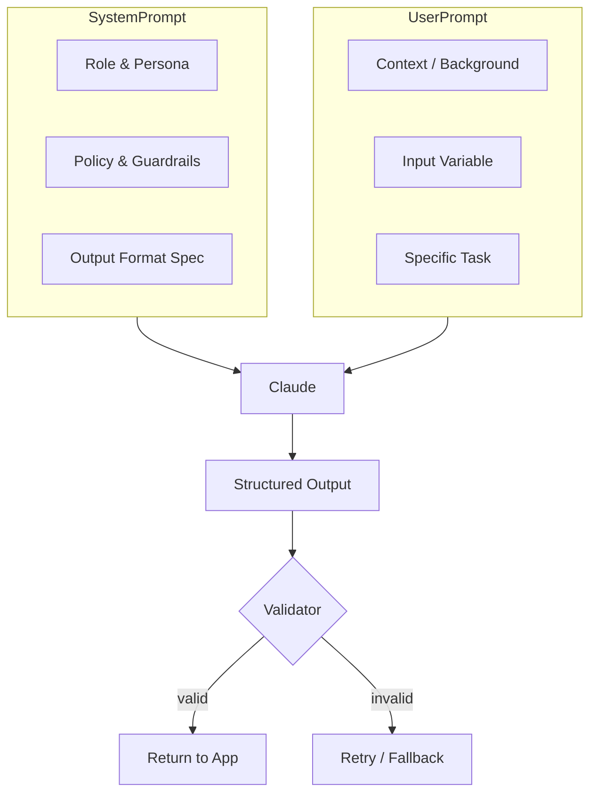

# Module 5 — Prompt for Business Use Cases

**Durasi:** 90 menit
**Posisi:** Day 2, sesi pertama setelah recap Day 1
**Modul prasyarat:** Day 1 (Prompt Engineering Fundamentals)

---

## Learning Outcomes

Setelah modul ini, peserta mampu:

1. Memetakan **kebutuhan bisnis** ke pola prompt yang tepat (klasifikasi, generasi, ekstraksi, summarization, Q&A).
2. Merancang prompt produksi untuk **5 use case kunci**: customer service, document automation, report generation, data analysis, internal knowledge assistant.
3. Menyusun **prompt template** yang reusable dengan variabel input (placeholder) dan output yang terstruktur (JSON / Markdown).
4. Menulis **test cases** untuk mengevaluasi kualitas prompt (akurasi, konsistensi, hallucination check).
5. Mengidentifikasi *guardrails* dan *fallback* untuk prompt yang dipakai pengguna akhir.

---

## Konsep Inti

### 1. Dari "Prompt Iseng" ke "Prompt Produksi"

Prompt produksi harus memiliki lima elemen:

| Elemen | Penjelasan | Contoh |
|---|---|---|
| **Role** | Persona / sudut pandang model | "You are a senior support agent for fintech XYZ." |
| **Context** | Latar masalah, kebijakan, batasan | SLA 24 jam, hanya bahasa Indonesia, tidak janjikan refund |
| **Task** | Instruksi spesifik | "Tulis balasan empati + langkah konkret" |
| **Input** | Data dinamis | Email customer, ticket body |
| **Output format** | Struktur deterministik | JSON dengan field `tone`, `reply`, `next_action` |

### 2. Lima Use Case Bisnis Inti

#### a. AI Customer Service
- **Pola**: empathy → acknowledge → action → next step.
- **Risk**: hallucinated policy, salah janji, leaking PII.
- **Output**: balasan email/chat + label *escalate? yes/no*.

#### b. Document Automation
- **Pola**: ekstrak field terstruktur dari dokumen (invoice, kontrak, KTP, formulir).
- **Risk**: format dokumen variatif, OCR noise.
- **Output**: JSON dengan field standar + confidence/flag.

#### c. Report Generation
- **Pola**: data numerik → narasi insight + rekomendasi.
- **Risk**: model "mengarang" angka. Solusi: kasih data eksplisit di prompt, larang invent number.
- **Output**: laporan markdown / slide bullet.

#### d. Data Analysis Assistant
- **Pola**: user tanya bahasa natural → AI interpretasi + summarize hasil query.
- **Risk**: salah interpretasi metrik. Solusi: sertakan kamus metrik (data dictionary) di system prompt.
- **Output**: narasi + tabel + caveat.

#### e. Internal Knowledge Assistant
- **Pola**: Q&A atas SOP, HR policy, technical wiki. (Biasanya pakai RAG; di modul ini fokus pada prompt-nya, bukan retrieval-nya.)
- **Risk**: jawab di luar KB (out-of-scope hallucination).
- **Output**: jawaban + sitasi sumber + `confidence`.

### 3. Anatomi Prompt Template



### 4. Output Format yang "Production-Friendly"

- **JSON** untuk konsumsi sistem hilir. Gunakan instruksi tegas: `Respond ONLY with valid JSON, no prose.` + contoh skema.
- **Markdown** untuk konsumsi manusia (laporan, email).
- **XML tags** untuk multi-section output, gampang di-parse: `<reply>...</reply><escalate>true</escalate>`.

### 5. Guardrails dasar

- **Refusal phrasing**: kalau di luar scope → tetap sopan, arahkan eskalasi.
- **PII handling**: instruksi *jangan ulang* data sensitif dalam respons.
- **No hallucinated numbers / policies**: instruksi "Jika tidak yakin, katakan 'tidak yakin' alih-alih menebak."

---

## Demo Live (15 menit)

Trainer mendemokan use case **Customer Service Reply Generator** dari nol:

1. **Tunjukkan email customer mentah** (komplain pengiriman terlambat).
2. **Iterasi v1**: prompt seadanya → "Reply this email." Hasil: generic, tanpa empati, kadang janji refund.
3. **Iterasi v2**: tambahkan role + policy (no refund promise) + output JSON `{tone, reply_id, body, escalate}`.
4. **Iterasi v3**: tambahkan few-shot 2 contoh tone "calm" vs "angry".
5. **Test edge case**: email kosong / sarkasme / bahasa campur → lihat apakah model graceful.

Trainer narasi: di setiap iterasi, jelaskan **kenapa** output membaik.

---

## Contoh Konkret

### Contoh 1 — Customer Service Reply (Python)

```python
import os
from anthropic import Anthropic

client = Anthropic(api_key=os.environ["ANTHROPIC_API_KEY"])  # JANGAN hardcode

SYSTEM = """Anda adalah Customer Service Senior untuk e-commerce "TokoKita".
Kebijakan:
- Tidak menjanjikan refund tanpa konfirmasi tim finance.
- Tidak menyebut info internal (gudang, vendor).
- Selalu empati di kalimat pertama.
Format output (JSON):
{"tone": "<calm|firm|empathetic>", "body": "<balasan>", "escalate": <bool>, "reason": "<alasan singkat>"}
Hanya keluarkan JSON, tanpa teks tambahan."""

USER_TEMPLATE = """Email customer:
\"\"\"{email}\"\"\"

Tugas: Tulis balasan profesional dalam Bahasa Indonesia."""

def reply(email_text: str) -> dict:
    msg = client.messages.create(
        model="claude-sonnet-4-5",
        max_tokens=600,
        system=SYSTEM,
        messages=[{"role": "user", "content": USER_TEMPLATE.format(email=email_text)}],
    )
    import json
    return json.loads(msg.content[0].text)

if __name__ == "__main__":
    print(reply("Pesanan saya sudah 5 hari belum sampai. Saya kecewa."))
```

> **Paralel JS**: Pakai `@anthropic-ai/sdk`. Pola identik: `client.messages.create({ model, system, messages })`.

### Contoh 2 — Meeting Notes → Action Items (Python)

```python
SYSTEM_MEETING = """Anda asisten yang mengekstrak action items dari notulen meeting.
Output XML:
<summary>...3 kalimat ringkas...</summary>
<actions>
  <item owner="..." due="YYYY-MM-DD">Aksi konkret</item>
</actions>
Jika tanggal tidak disebut, isi due="TBD". Jika owner tidak jelas, isi owner="TBD"."""

def extract_actions(notes: str) -> str:
    r = client.messages.create(
        model="claude-sonnet-4-5",
        max_tokens=800,
        system=SYSTEM_MEETING,
        messages=[{"role": "user", "content": f"<notes>{notes}</notes>"}],
    )
    return r.content[0].text
```

### Contoh 3 — Klasifikasi Tiket Helpdesk (prompt-only, no code)

```
System: Anda klasifikator tiket IT. Kategori valid:
[ACCESS, HARDWARE, SOFTWARE, NETWORK, OTHER].
Priority: [P1, P2, P3].

User: <ticket>{{ticket_text}}</ticket>

Jawab JSON: {"category": "...", "priority": "...", "confidence": 0.0-1.0, "rationale": "..."}.
Jika confidence < 0.6, set category="OTHER".
```

---

## Hands-on Lab

Lanjut ke: [`lab-04-use-case-prompt-pack/`](./lab-04-use-case-prompt-pack/)

Peserta menyusun **prompt pack** (3 use case) lengkap dengan test cases. Belum perlu coding, tapi boleh divalidasi via web Console Anthropic atau script kecil.

---

## Wrap-up & Q&A

Pertanyaan refleksi untuk peserta:

1. Di organisasi Anda, use case mana yang **paling ROI tinggi** untuk dimulai? Kenapa?
2. Bedanya output JSON vs Markdown untuk customer service — kapan pilih yang mana?
3. Bagaimana Anda *mengetahui* prompt Anda sudah cukup baik untuk produksi? (jawaban kunci: test set + metrics + human review)
4. Bagaimana menangani prompt yang kadang menghasilkan JSON invalid?
5. Apa risiko terbesar memasang prompt customer service ke production tanpa guardrails?

---

## Bacaan Lanjutan

- Anthropic Docs — Prompt Engineering: <https://docs.anthropic.com/en/docs/build-with-claude/prompt-engineering/overview>
- Anthropic Cookbook — Classification & Summarization recipes: <https://github.com/anthropics/anthropic-cookbook>
- Anthropic — Use Case Guides: <https://docs.anthropic.com/en/docs/about-claude/use-case-guides>
- "Structured Output with Claude" — docs.anthropic.com/en/docs/test-and-evaluate/strengthen-guardrails/increase-consistency
