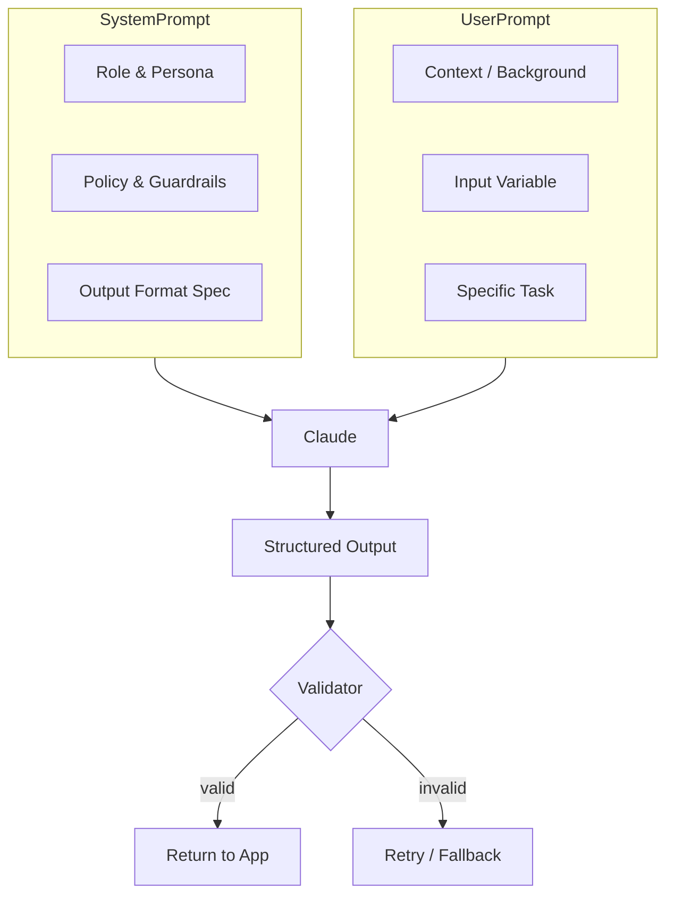

# Module 5 — Prompt for Business Use Cases

**Durasi belajar:** ±90 menit
**Posisi:** Day 2, modul pertama setelah recap Day 1
**Modul prasyarat:** Day 1 (Prompt Engineering Fundamentals)
**Format:** Baca konsep → praktik mandiri → lab terintegrasi

---

## Apa yang Akan Anda Bisa Setelah Modul Ini

Setelah selesai membaca dan mempraktikkan modul ini, Anda akan mampu:

1. **Memetakan** kebutuhan bisnis ke pola prompt yang tepat — klasifikasi, generasi, ekstraksi, summarization, atau Q&A.
2. **Merancang** prompt produksi untuk **lima use case kunci**: customer service, document automation, report generation, data analysis, dan internal knowledge assistant.
3. **Menyusun** *prompt template* yang dapat dipakai ulang, lengkap dengan variabel input (placeholder) dan output terstruktur (JSON atau Markdown).
4. **Menulis** *test cases* untuk mengevaluasi kualitas prompt dari sisi akurasi, konsistensi, dan ketahanan terhadap halusinasi.
5. **Mengidentifikasi** *guardrails* dan *fallback* yang diperlukan ketika prompt Anda dipakai pengguna akhir.

---

## Konsep Inti

### 1. Dari "Prompt Iseng" ke "Prompt Produksi"

Prompt yang dipakai untuk eksplorasi sehari-hari boleh saja seadanya. Namun jika prompt akan dipakai dalam sistem produksi yang melayani pelanggan atau pengguna internal, ada **lima elemen** yang sebaiknya selalu hadir:

| Elemen | Penjelasan | Contoh |
|---|---|---|
| **Role** | Persona atau sudut pandang yang Anda berikan kepada model | "Anda adalah senior support agent untuk fintech XYZ." |
| **Context** | Latar masalah, kebijakan, dan batasan yang berlaku | SLA 24 jam, hanya Bahasa Indonesia, tidak boleh menjanjikan refund |
| **Task** | Instruksi spesifik yang harus dijalankan | "Tulis balasan empati ditambah langkah konkret." |
| **Input** | Data dinamis yang menjadi bahan pengerjaan | Email customer, isi tiket |
| **Output format** | Struktur output yang deterministik | JSON dengan field `tone`, `reply`, `next_action` |

Kelima elemen ini ibarat fondasi rumah. Bisa saja Anda membangun rumah tanpa fondasi yang lengkap, namun risikonya menjadi jauh lebih tinggi.

### 2. Lima Use Case Bisnis Inti

Bagian ini merangkum pola, risiko, dan output untuk lima skenario yang paling sering muncul di organisasi.

#### a. AI Customer Service
- **Pola**: empati → akui masalah → tindakan → langkah berikutnya.
- **Risiko**: model mengarang kebijakan, salah berjanji, atau membocorkan PII (Personally Identifiable Information).
- **Output**: balasan email/chat ditambah label *escalate? yes/no*.

#### b. Document Automation
- **Pola**: ekstraksi field terstruktur dari dokumen seperti invoice, kontrak, KTP, atau formulir.
- **Risiko**: format dokumen yang sangat variatif, ditambah noise dari hasil OCR.
- **Output**: JSON berisi field standar, dilengkapi confidence atau flag.

#### c. Report Generation
- **Pola**: dari data numerik menjadi narasi insight ditambah rekomendasi.
- **Risiko**: model "mengarang" angka. Solusinya: berikan data secara eksplisit di dalam prompt, lalu larang model menciptakan angka baru.
- **Output**: laporan dalam format markdown atau bullet untuk slide presentasi.

#### d. Data Analysis Assistant
- **Pola**: pengguna bertanya dengan bahasa natural → AI menginterpretasi dan meringkas hasil query.
- **Risiko**: salah menginterpretasi metrik. Solusinya: sertakan kamus metrik (data dictionary) di dalam system prompt.
- **Output**: narasi, tabel, dan catatan asumsi *(caveat)*.

#### e. Internal Knowledge Assistant
- **Pola**: Q&A atas SOP, kebijakan HR, atau technical wiki. Biasanya menggunakan RAG (Retrieval-Augmented Generation, teknik menggabungkan pencarian dokumen dengan LLM); pada modul ini fokus Anda adalah pada *prompt*-nya, bukan pada mekanisme retrieval.
- **Risiko**: model menjawab di luar cakupan knowledge base *(out-of-scope hallucination)*.
- **Output**: jawaban + sitasi sumber + nilai `confidence`.

### 3. Anatomi Prompt Template



Perhatikan bahwa **system prompt** dan **user prompt** memiliki peran berbeda. System prompt menetapkan aturan main yang relatif stabil; user prompt membawa konteks dan input yang berubah-ubah tiap permintaan.

### 4. Output Format yang "Production-Friendly"

Bentuk output yang Anda pilih sebaiknya disesuaikan dengan siapa yang akan mengonsumsinya:

- **JSON** — untuk konsumsi sistem hilir. Gunakan instruksi tegas seperti: *"Respond ONLY with valid JSON, no prose."* dan sertakan contoh skema.
- **Markdown** — untuk konsumsi manusia, misalnya laporan atau email.
- **XML tags** — untuk output multi-bagian yang mudah di-parse, contohnya: `<reply>...</reply><escalate>true</escalate>`.

### 5. Guardrails Dasar

*Guardrails* adalah aturan pengaman yang mencegah model melakukan hal yang tidak Anda inginkan. Tiga guardrail dasar yang wajib dipertimbangkan:

- **Refusal phrasing** — jika permintaan berada di luar cakupan, model tetap merespons dengan sopan dan mengarahkan ke jalur eskalasi.
- **PII handling** — instruksikan model agar tidak mengulang data sensitif dalam respons.
- **No hallucinated numbers or policies** — instruksi seperti *"Jika tidak yakin, katakan 'tidak yakin' alih-alih menebak."*

---

## Praktik Mandiri (15 menit)

Sebelum lanjut ke contoh kode, mari Anda rasakan sendiri evolusi sebuah prompt customer service dari yang seadanya hingga yang siap produksi. Skenarionya: **Customer Service Reply Generator**.

### Langkah-Langkahnya

1. **Siapkan email customer mentah**, misalnya komplain mengenai pengiriman yang terlambat.
2. **Iterasi v1**: tulis prompt seadanya — *"Reply this email."* Amati hasilnya. Kemungkinan besar generik, tanpa empati, dan kadang menjanjikan refund.
3. **Iterasi v2**: tambahkan role + policy (tidak menjanjikan refund) + format output JSON `{tone, reply_id, body, escalate}`. Amati perbedaannya.
4. **Iterasi v3**: tambahkan dua contoh *few-shot* untuk membedakan tone "calm" dan "angry". Amati apakah konsistensi tone membaik.
5. **Uji edge case**: kirim email kosong, sarkasme, atau bahasa campur. Apakah model tetap *graceful*?

Pada setiap iterasi, tanyakan kepada diri Anda: **mengapa** output membaik? Hipotesis apa yang Anda uji?

---

## Contoh Konkret

### Contoh 1 — Customer Service Reply (Python)

```python
import os
from anthropic import Anthropic

client = Anthropic(api_key=os.environ["ANTHROPIC_API_KEY"])  # JANGAN hardcode

SYSTEM = """Anda adalah Customer Service Senior untuk e-commerce "TokoKita".
Kebijakan:
- Tidak menjanjikan refund tanpa konfirmasi tim finance.
- Tidak menyebut info internal (gudang, vendor).
- Selalu empati di kalimat pertama.
Format output (JSON):
{"tone": "<calm|firm|empathetic>", "body": "<balasan>", "escalate": <bool>, "reason": "<alasan singkat>"}
Hanya keluarkan JSON, tanpa teks tambahan."""

USER_TEMPLATE = """Email customer:
\"\"\"{email}\"\"\"

Tugas: Tulis balasan profesional dalam Bahasa Indonesia."""

def reply(email_text: str) -> dict:
    msg = client.messages.create(
        model="claude-sonnet-4-5",
        max_tokens=600,
        system=SYSTEM,
        messages=[{"role": "user", "content": USER_TEMPLATE.format(email=email_text)}],
    )
    import json
    return json.loads(msg.content[0].text)

if __name__ == "__main__":
    print(reply("Pesanan saya sudah 5 hari belum sampai. Saya kecewa."))
```

> **Paralel JS**: gunakan `@anthropic-ai/sdk`. Polanya identik: `client.messages.create({ model, system, messages })`.

### Contoh 2 — Meeting Notes → Action Items (Python)

```python
SYSTEM_MEETING = """Anda asisten yang mengekstrak action items dari notulen meeting.
Output XML:
<summary>...3 kalimat ringkas...</summary>
<actions>
  <item owner="..." due="YYYY-MM-DD">Aksi konkret</item>
</actions>
Jika tanggal tidak disebut, isi due="TBD". Jika owner tidak jelas, isi owner="TBD"."""

def extract_actions(notes: str) -> str:
    r = client.messages.create(
        model="claude-sonnet-4-5",
        max_tokens=800,
        system=SYSTEM_MEETING,
        messages=[{"role": "user", "content": f"<notes>{notes}</notes>"}],
    )
    return r.content[0].text
```

### Contoh 3 — Klasifikasi Tiket Helpdesk (prompt-only, tanpa kode)

```
System: Anda klasifikator tiket IT. Kategori valid:
[ACCESS, HARDWARE, SOFTWARE, NETWORK, OTHER].
Priority: [P1, P2, P3].

User: <ticket>{{ticket_text}}</ticket>

Jawab JSON: {"category": "...", "priority": "...", "confidence": 0.0-1.0, "rationale": "..."}.
Jika confidence < 0.6, set category="OTHER".
```

---

## Hands-on Lab

Lanjut ke: [`lab-04-use-case-prompt-pack/`](./lab-04-use-case-prompt-pack/)

Pada lab ini Anda akan menyusun sebuah **prompt pack** berisi tiga use case lengkap dengan *test cases*. Anda belum perlu menulis kode; validasi dapat dilakukan melalui Anthropic Console di browser atau script kecil di terminal.

---

## Latihan & Refleksi

Sebelum melanjutkan ke Module 6, pastikan Anda mampu menjawab kelima pertanyaan berikut. Anda dapat menuliskan jawabannya di buku catatan atau mendiskusikannya dengan rekan:

1. Di organisasi Anda, use case mana yang paling tinggi ROI-nya untuk dimulai? Mengapa?
2. Apa bedanya output JSON dan Markdown untuk customer service — kapan Anda akan memilih yang mana?
3. Bagaimana cara Anda *mengetahui* sebuah prompt sudah cukup baik untuk masuk produksi? (Petunjuk: test set + metrik + human review.)
4. Bagaimana strategi Anda menangani prompt yang sesekali menghasilkan JSON invalid?
5. Apa risiko terbesar memasang prompt customer service ke production tanpa guardrails?

---

## Bacaan Lanjutan

- Anthropic Docs — Prompt Engineering: <https://docs.anthropic.com/en/docs/build-with-claude/prompt-engineering/overview>
- Anthropic Cookbook — Classification & Summarization recipes: <https://github.com/anthropics/anthropic-cookbook>
- Anthropic — Use Case Guides: <https://docs.anthropic.com/en/docs/about-claude/use-case-guides>
- "Structured Output with Claude" — docs.anthropic.com/en/docs/test-and-evaluate/strengthen-guardrails/increase-consistency
