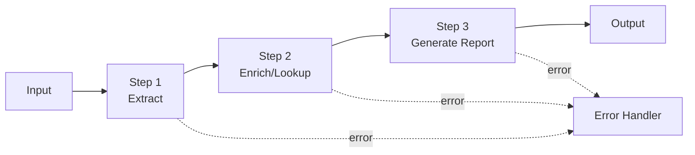

# Module 6 — AI Workflow Automation

**Durasi:** 90 menit
**Posisi:** Day 2, sesi kedua setelah Modul 5
**Prasyarat:** Modul 5 (peserta sudah bisa menulis prompt produksi single-step)

---

## Learning Outcomes

Setelah modul ini, peserta mampu:

1. Mendefinisikan **AI Workflow** dan membedakannya dengan single-call prompt maupun agent.
2. Mendesain **multi-step pipeline** dengan teknik *prompt chaining* dan *task decomposition*.
3. Mengintegrasikan **tool eksternal** (API call, DB query, file I/O) sebagai langkah dalam pipeline.
4. Menangani **error per step** (validasi output, retry, fallback) sehingga pipeline production-grade.
5. Memutuskan kapan workflow cukup, kapan butuh agent.

---

## Konsep Inti

### 1. Definisi: Workflow vs Single Prompt vs Agent

| Aspek | Single Prompt | AI Workflow | AI Agent |
|---|---|---|---|
| Jumlah call ke LLM | 1 | N (deterministik) | N (model decides) |
| Urutan step | — | Ditentukan developer | Ditentukan model |
| Tool usage | Tidak | Ya, di step tertentu | Ya, model pilih tool |
| Cocok untuk | Task atomic | Proses bisnis terstruktur | Task open-ended |
| Predictability | Tinggi | Tinggi | Sedang |
| Cost control | Mudah | Mudah | Lebih sulit |

**Rule of thumb:** mulai dari **workflow**. Naikkan ke **agent** hanya jika urutan step tidak bisa diprediksi.

### 2. Prompt Chaining

Output prompt A → input prompt B. Setiap step punya satu *concern*:



Keuntungan:
- **Akurasi naik**: tiap step fokus, model tidak overload.
- **Debug mudah**: bisa inspeksi output per step.
- **Cost optimization**: step ringan pakai Haiku, step berat pakai Sonnet.

### 3. Pola Workflow Umum

| Pola | Deskripsi | Contoh |
|---|---|---|
| **Sequential chain** | Linear A→B→C | Extract → Enrich → Report |
| **Parallel fan-out** | 1 input → N step paralel | 1 dokumen → ringkasan + sentimen + topik (paralel) |
| **Router / Branch** | Klasifikasi dulu, lalu pilih cabang | Tiket masuk → klasifikasi → handler kategori |
| **Loop / Iterate** | Step diulang sampai kondisi terpenuhi | Refine draft sampai panjang < 500 kata |
| **Map-reduce** | Apply per chunk, lalu gabungkan | Ringkas 100-halaman: ringkas per bab → ringkas global |

### 4. Tool Integration di Workflow

Workflow bukan cuma rangkaian prompt — biasanya disisipi *non-LLM steps*:

- API call (cuaca, kurs, CRM lookup).
- DB query (lookup customer, lookup SKU).
- File I/O (baca PDF, simpan PDF).
- Validator / regex / schema check.

Di **workflow**, *developer* yang memutuskan kapan call tool ini. Di **agent** (Modul 8), model yang memutuskan.

### 5. Error Handling per Step

Untuk tiap step, sediakan minimal:

1. **Validasi output** (JSON parseable? field lengkap?).
2. **Retry policy** (max 2 retry, exponential backoff).
3. **Fallback** (model lebih murah / default response / human handover).
4. **Logging**: simpan input, output, latency, token usage per step.

### 6. Cost & Latency Optimization

- **Model mixing**: step klasifikasi → Haiku; step generasi panjang → Sonnet.
- **Caching**: system prompt panjang yang berulang → manfaatkan prompt caching.
- **Parallelize** jika step independen.
- **Streaming** untuk step akhir yang user-facing.

---

## Demo Live (15 menit)

Trainer mendemokan **pipeline 3-step** end-to-end:

1. **Input**: paragraf customer feedback campuran.
2. **Step 1 (Extract)**: ambil daftar produk yang disebut + sentimen per produk → JSON.
3. **Step 2 (Enrich)**: untuk tiap produk, mock-lookup ke "DB" (dictionary) → dapat SKU + kategori.
4. **Step 3 (Generate)**: hasilkan ringkasan eksekutif markdown + rekomendasi tindak lanjut.
5. **Tunjukkan error injection**: rusak output JSON step 1 secara sengaja → tunjukkan retry & fallback.

---

## Contoh Konkret

### Contoh 1 — Sequential Pipeline (Python)

```python
import os, json
from anthropic import Anthropic

client = Anthropic(api_key=os.environ["ANTHROPIC_API_KEY"])
MODEL_LIGHT = "claude-haiku-4-5"
MODEL_HEAVY = "claude-sonnet-4-5"

def call_claude(model: str, system: str, user: str, max_tokens=600) -> str:
    r = client.messages.create(
        model=model, max_tokens=max_tokens, system=system,
        messages=[{"role": "user", "content": user}],
    )
    return r.content[0].text

# --- Step 1: Extract ---
def step_extract(text: str) -> dict:
    sys = "Ekstrak entitas: produk + sentimen. Output JSON: {\"items\":[{\"product\":\"...\",\"sentiment\":\"pos|neg|neu\"}]}. Hanya JSON."
    raw = call_claude(MODEL_LIGHT, sys, text, max_tokens=400)
    return json.loads(raw)

# --- Step 2: Enrich (non-LLM) ---
MOCK_DB = {"Galaxy A14": {"sku": "SM-A145", "cat": "smartphone"}}
def step_enrich(extracted: dict) -> dict:
    for item in extracted["items"]:
        meta = MOCK_DB.get(item["product"], {"sku": "UNKNOWN", "cat": "UNKNOWN"})
        item.update(meta)
    return extracted

# --- Step 3: Generate report ---
def step_report(enriched: dict) -> str:
    sys = "Anda analis. Tulis ringkasan eksekutif markdown + rekomendasi 3 bullet."
    return call_claude(MODEL_HEAVY, sys, json.dumps(enriched, ensure_ascii=False), max_tokens=800)

# --- Orchestrator ---
def pipeline(text: str) -> str:
    for attempt in range(2):
        try:
            extracted = step_extract(text)
            enriched = step_enrich(extracted)
            return step_report(enriched)
        except json.JSONDecodeError:
            if attempt == 1:
                return "[FALLBACK] Tidak dapat memproses input."
            continue

if __name__ == "__main__":
    feedback = "Galaxy A14 saya cepat panas dan baterai boros, tapi kameranya lumayan."
    print(pipeline(feedback))
```

### Contoh 2 — Router Workflow (pseudocode)

```python
def classify(ticket: str) -> str:
    # Step 0: router pakai Haiku, output label
    sys = "Klasifikasi tiket: ACCESS|HARDWARE|SOFTWARE|NETWORK|OTHER. Output 1 kata."
    return call_claude(MODEL_LIGHT, sys, ticket, max_tokens=10).strip()

HANDLERS = {
    "ACCESS":   handle_access,    # masing-masing punya prompt khusus
    "HARDWARE": handle_hardware,
    "SOFTWARE": handle_software,
    "NETWORK":  handle_network,
    "OTHER":    handle_generic,
}

def route_and_handle(ticket: str):
    label = classify(ticket)
    return HANDLERS.get(label, HANDLERS["OTHER"])(ticket)
```

> **Paralel JS**: sama persis, `Promise.all` untuk parallel fan-out, `try/catch` untuk retry.

---

## Hands-on Lab

Lanjut ke: [`lab-05-multi-step-pipeline/`](./lab-05-multi-step-pipeline/)

Peserta membangun pipeline 3-step (extract → enrich → report) dengan error handling per step.

---

## Wrap-up & Q&A

1. Kapan Anda pilih **single prompt** dibanding multi-step workflow? (jawab: ketika task atomic, input pendek, akurasi cukup)
2. Apa risiko terbesar dari chain panjang? (cascading failure, latency tinggi, cost membengkak)
3. Bagaimana strategi pilih model per step? (klasifikasi/extract ringan → Haiku; generasi & reasoning → Sonnet)
4. Apa bedanya **workflow** vs **agent** dari sudut pandang predictability?
5. Sebutkan 2 cara handle JSON invalid di tengah pipeline.

---

## Bacaan Lanjutan

- Anthropic — Building effective agents (taksonomi workflow vs agent): <https://www.anthropic.com/research/building-effective-agents>
- Anthropic Docs — Prompt chaining: <https://docs.anthropic.com/en/docs/build-with-claude/prompt-engineering/chain-prompts>
- Anthropic Cookbook — Workflows folder: <https://github.com/anthropics/anthropic-cookbook>
- Prompt caching: <https://docs.anthropic.com/en/docs/build-with-claude/prompt-caching>
