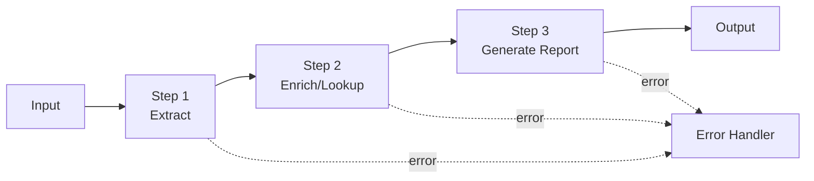

# Module 6 — AI Workflow Automation

**Durasi belajar:** ±90 menit
**Posisi:** Day 2, modul kedua setelah Module 5
**Prasyarat:** Module 5 (Anda sudah mampu menulis prompt produksi single-step)
**Format:** Baca konsep → praktik mandiri → lab terintegrasi

---

## Apa yang Akan Anda Bisa Setelah Modul Ini

Setelah selesai membaca dan mempraktikkan modul ini, Anda akan mampu:

1. **Mendefinisikan** apa itu *AI Workflow* dan membedakannya dengan single-call prompt maupun agent.
2. **Mendesain** *multi-step pipeline* menggunakan teknik *prompt chaining* dan *task decomposition* (pemecahan tugas).
3. **Mengintegrasikan** tool eksternal (API call, query database, file I/O) sebagai langkah di dalam pipeline.
4. **Menangani** kesalahan per langkah (validasi output, retry, fallback) sehingga pipeline Anda layak produksi.
5. **Memutuskan** kapan workflow sudah cukup, dan kapan Anda benar-benar memerlukan sebuah agent.

---

## Konsep Inti

### 1. Definisi: Workflow vs Single Prompt vs Agent

Sebelum membangun apa pun, ada baiknya Anda paham letak workflow di antara dua kerabatnya:

| Aspek | Single Prompt | AI Workflow | AI Agent |
|---|---|---|---|
| Jumlah call ke LLM | 1 | N (deterministik) | N (ditentukan model) |
| Urutan langkah | — | Ditentukan developer | Ditentukan model |
| Penggunaan tool | Tidak | Ya, di langkah tertentu | Ya, model memilih tool |
| Cocok untuk | Tugas atomic | Proses bisnis terstruktur | Tugas open-ended |
| Predictability | Tinggi | Tinggi | Sedang |
| Cost control | Mudah | Mudah | Lebih sulit |

**Rule of thumb:** mulai dari **workflow** terlebih dahulu. Naikkan ke **agent** hanya jika urutan langkah memang tidak mungkin diprediksi di awal.

### 2. Prompt Chaining

Konsepnya sederhana: output prompt A menjadi input prompt B. Setiap langkah hanya mengurus satu *concern*:



Tiga keuntungan utama yang akan Anda rasakan:

- **Akurasi naik** — setiap langkah fokus pada satu hal, sehingga model tidak kewalahan.
- **Debugging mudah** — Anda dapat memeriksa output di setiap langkah secara terpisah.
- **Cost optimization** — langkah ringan dapat menggunakan Haiku, sedangkan langkah berat menggunakan Sonnet.

### 3. Pola Workflow Umum

Ada beberapa pola yang akan sering Anda temui dan pakai ulang:

| Pola | Deskripsi | Contoh |
|---|---|---|
| **Sequential chain** | Linear A→B→C | Extract → Enrich → Report |
| **Parallel fan-out** | 1 input → N langkah paralel | 1 dokumen → ringkasan + sentimen + topik (paralel) |
| **Router / Branch** | Klasifikasi terlebih dahulu, lalu memilih cabang | Tiket masuk → klasifikasi → handler kategori |
| **Loop / Iterate** | Langkah diulang hingga kondisi terpenuhi | Memperbaiki draft sampai panjangnya di bawah 500 kata |
| **Map-reduce** | Memproses per potongan, lalu menggabungkan | Meringkas dokumen 100 halaman: ringkas per bab → ringkas global |

### 4. Integrasi Tool di dalam Workflow

Workflow bukan hanya sekadar rangkaian prompt — biasanya juga disisipi langkah-langkah *non-LLM*:

- Panggilan API (cuaca, kurs, CRM lookup).
- Query database (lookup customer, lookup SKU).
- File I/O (membaca PDF, menyimpan PDF).
- Validator, regex, atau pengecekan schema.

Pada **workflow**, *Anda* sebagai developer yang menentukan kapan tool dipanggil. Pada **agent** (yang akan dibahas di Module 8), model yang menentukan.

### 5. Error Handling per Langkah

Untuk setiap langkah, siapkan minimal empat hal berikut:

1. **Validasi output** — apakah JSON bisa di-parse? Apakah field lengkap?
2. **Kebijakan retry** — maksimal 2 retry dengan *exponential backoff*.
3. **Fallback** — gunakan model yang lebih ekonomis, respons default, atau eskalasi ke manusia.
4. **Logging** — simpan input, output, latensi, dan penggunaan token di setiap langkah.

### 6. Optimasi Biaya dan Latensi

Beberapa teknik praktis yang dapat Anda terapkan:

- **Model mixing** — langkah klasifikasi menggunakan Haiku; langkah generasi panjang menggunakan Sonnet.
- **Caching** — system prompt panjang yang berulang dapat memanfaatkan *prompt caching*.
- **Parallelize** langkah-langkah yang saling independen.
- **Streaming** pada langkah akhir yang menampilkan hasil ke pengguna.

---

## Praktik Mandiri (15 menit)

Mari Anda jalankan sendiri sebuah pipeline 3-langkah dari awal hingga akhir. Skenarionya: dari paragraf customer feedback hingga ringkasan eksekutif.

### Langkah-Langkahnya

1. **Input**: siapkan satu paragraf customer feedback yang menyebut beberapa produk dengan sentimen yang bercampur.
2. **Step 1 (Extract)**: prompt yang mengambil daftar produk + sentimen per produk, output JSON.
3. **Step 2 (Enrich)**: untuk setiap produk, lakukan mock-lookup ke "database" (cukup gunakan Python dictionary) untuk mendapatkan SKU dan kategori.
4. **Step 3 (Generate)**: hasilkan ringkasan eksekutif markdown + rekomendasi tindak lanjut.
5. **Eksperimen error**: rusak output JSON di Step 1 secara sengaja, lalu amati bagaimana retry dan fallback berfungsi.

Refleksi: di langkah mana pipeline Anda paling rapuh? Apa yang dapat Anda perbaiki?

---

## Contoh Konkret

### Contoh 1 — Sequential Pipeline (Python)

```python
import os, json
from anthropic import Anthropic

client = Anthropic(api_key=os.environ["ANTHROPIC_API_KEY"])
MODEL_LIGHT = "claude-haiku-4-5"
MODEL_HEAVY = "claude-sonnet-4-5"

def call_claude(model: str, system: str, user: str, max_tokens=600) -> str:
    r = client.messages.create(
        model=model, max_tokens=max_tokens, system=system,
        messages=[{"role": "user", "content": user}],
    )
    return r.content[0].text

# --- Step 1: Extract ---
def step_extract(text: str) -> dict:
    sys = "Ekstrak entitas: produk + sentimen. Output JSON: {\"items\":[{\"product\":\"...\",\"sentiment\":\"pos|neg|neu\"}]}. Hanya JSON."
    raw = call_claude(MODEL_LIGHT, sys, text, max_tokens=400)
    return json.loads(raw)

# --- Step 2: Enrich (non-LLM) ---
MOCK_DB = {"Galaxy A14": {"sku": "SM-A145", "cat": "smartphone"}}
def step_enrich(extracted: dict) -> dict:
    for item in extracted["items"]:
        meta = MOCK_DB.get(item["product"], {"sku": "UNKNOWN", "cat": "UNKNOWN"})
        item.update(meta)
    return extracted

# --- Step 3: Generate report ---
def step_report(enriched: dict) -> str:
    sys = "Anda analis. Tulis ringkasan eksekutif markdown + rekomendasi 3 bullet."
    return call_claude(MODEL_HEAVY, sys, json.dumps(enriched, ensure_ascii=False), max_tokens=800)

# --- Orchestrator ---
def pipeline(text: str) -> str:
    for attempt in range(2):
        try:
            extracted = step_extract(text)
            enriched = step_enrich(extracted)
            return step_report(enriched)
        except json.JSONDecodeError:
            if attempt == 1:
                return "[FALLBACK] Tidak dapat memproses input."
            continue

if __name__ == "__main__":
    feedback = "Galaxy A14 saya cepat panas dan baterai boros, tapi kameranya lumayan."
    print(pipeline(feedback))
```

### Contoh 2 — Router Workflow (pseudocode)

```python
def classify(ticket: str) -> str:
    # Step 0: router pakai Haiku, output label
    sys = "Klasifikasi tiket: ACCESS|HARDWARE|SOFTWARE|NETWORK|OTHER. Output 1 kata."
    return call_claude(MODEL_LIGHT, sys, ticket, max_tokens=10).strip()

HANDLERS = {
    "ACCESS":   handle_access,    # masing-masing memiliki prompt khusus
    "HARDWARE": handle_hardware,
    "SOFTWARE": handle_software,
    "NETWORK":  handle_network,
    "OTHER":    handle_generic,
}

def route_and_handle(ticket: str):
    label = classify(ticket)
    return HANDLERS.get(label, HANDLERS["OTHER"])(ticket)
```

> **Paralel JS**: pola yang sama persis. Gunakan `Promise.all` untuk parallel fan-out dan `try/catch` untuk mekanisme retry.

---

## Hands-on Lab

Lanjut ke: [`lab-05-multi-step-pipeline/`](./lab-05-multi-step-pipeline/)

Pada lab ini Anda akan membangun pipeline 3-langkah (extract → enrich → report) dengan *error handling* di setiap langkah.

---

## Latihan & Refleksi

Sebelum melanjutkan ke Module 7, pastikan Anda mampu menjawab kelima pertanyaan berikut:

1. Kapan Anda akan memilih **single prompt** dibandingkan multi-step workflow? (Petunjuk: ketika tugas atomic, input pendek, dan akurasinya sudah cukup.)
2. Apa risiko terbesar dari sebuah chain yang panjang? (Petunjuk: cascading failure, latensi tinggi, biaya membengkak.)
3. Bagaimana strategi Anda memilih model untuk setiap langkah? (Petunjuk: klasifikasi/ekstraksi ringan → Haiku; generasi dan reasoning → Sonnet.)
4. Apa bedanya **workflow** dan **agent** jika dilihat dari sudut pandang *predictability*?
5. Sebutkan dua cara untuk menangani JSON invalid di tengah pipeline.

---

## Bacaan Lanjutan

- Anthropic — Building effective agents (taksonomi workflow vs agent): <https://www.anthropic.com/research/building-effective-agents>
- Anthropic Docs — Prompt chaining: <https://docs.anthropic.com/en/docs/build-with-claude/prompt-engineering/chain-prompts>
- Anthropic Cookbook — Workflows folder: <https://github.com/anthropics/anthropic-cookbook>
- Prompt caching: <https://docs.anthropic.com/en/docs/build-with-claude/prompt-caching>
