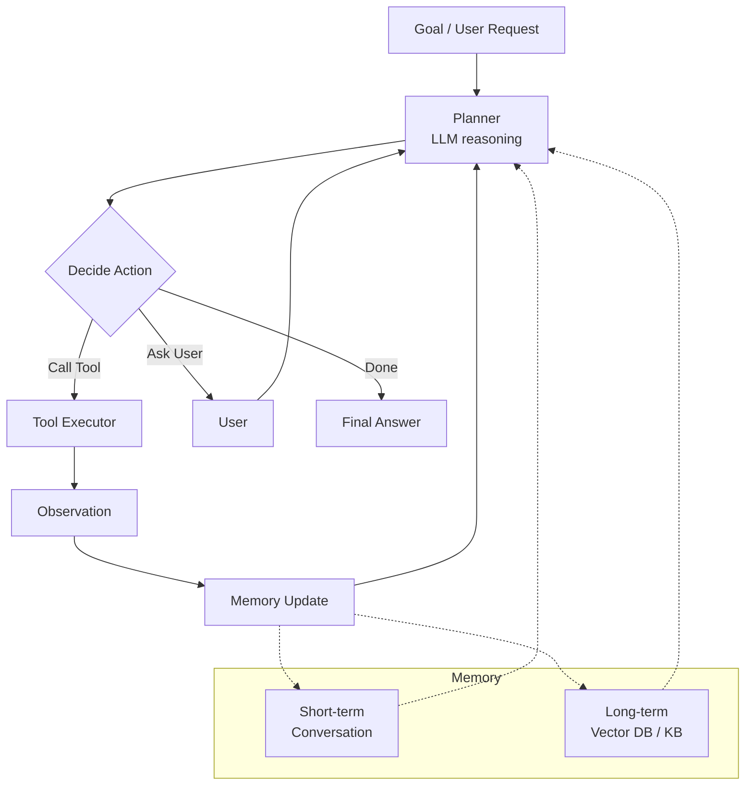

# Module 7 — Introduction to AI Agent

**Durasi belajar:** ±90 menit
**Posisi:** Day 2, sesi siang setelah istirahat
**Prasyarat:** Module 6 (Anda sudah memahami workflow dan prompt chaining)
**Format:** Baca konsep → diskusi & sketsa arsitektur → refleksi

---

## Apa yang Akan Anda Bisa Setelah Modul Ini

Setelah selesai membaca dan mempraktikkan modul ini, Anda akan mampu:

1. **Mendefinisikan** apa itu *AI Agent* dan membedakannya secara tegas dari chatbot maupun workflow.
2. **Menjelaskan** arsitektur dasar agent: *planner*, *executor*, *tools*, *memory*, dan *observation loop*.
3. **Menerapkan** konsep *goal-oriented* vs *reactive* pada problem nyata di tempat kerja Anda.
4. **Mendesain** alur *planning & reasoning* sederhana bergaya ReAct: *Thought → Action → Observation*.
5. **Menjelaskan** konsep *AI memory* (short-term, long-term, semantic) beserta trade-off-nya.

---

## Konsep Inti

### 1. Definisi: Apa Itu AI Agent?

**AI Agent** adalah sistem berbasis LLM yang memiliki tiga karakter berikut:

1. Menerima sebuah **goal** (bukan sekadar prompt task).
2. **Memilih action** secara otonom — memanggil tool, menjawab pengguna, atau meminta klarifikasi.
3. Mengamati hasil *(observation)* dan **beriterasi** sampai goal tercapai (atau berhenti dengan alasan yang jelas).

> Singkatnya: *Agent = sebuah loop di mana model memutuskan langkah berikutnya berdasarkan state saat ini.*

### 2. Chatbot vs Workflow vs Agent

Agar Anda tidak salah memilih arsitektur, perhatikan perbedaan ketiganya:

| Aspek | Chatbot | Workflow | Agent |
|---|---|---|---|
| Input | Pesan pengguna | Trigger + data | Goal |
| Kontrol alur | Dipandu pengguna | Dipandu developer | Dipandu model |
| Loop iterasi | Tidak (1 balasan per giliran) | Tidak (linear) | Ya (sampai goal/limit) |
| Penggunaan tool | Jarang | Developer yang memilih | Model yang memilih |
| Memory | Sebatas context window | Stateless antar run | Eksplisit (short + long term) |
| Predictability | Tinggi | Tinggi | Sedang – rendah |
| Use case | FAQ, info | Proses bisnis | Tugas open-ended |

### 3. Arsitektur Agent



Komponen-komponen kunci yang akan Anda kenal sepanjang Day 2:

- **Planner** — LLM yang membaca state lalu memutuskan aksi berikutnya.
- **Tools** — fungsi-fungsi konkret seperti API call, query database, atau operasi file.
- **Executor** — kode yang menjalankan tool dan mengembalikan *observation* ke LLM.
- **Memory**:
  - *Short-term*: riwayat percakapan yang masih berada di dalam context window.
  - *Long-term*: ringkasan, vector database, atau structured knowledge base — disimpan di luar context window dan di-*retrieve* saat diperlukan.
- **Termination policy** — batas iterasi maksimum, budget, atau pengecekan goal-reached.

### 4. Goal-Oriented vs Reactive

Perbedaan keduanya dapat Anda bayangkan seperti berikut:

| Reactive | Goal-Oriented |
|---|---|
| Menjawab apa yang ditanyakan saja | Bekerja menuju sebuah target |
| Stateless di setiap pesan | Mempertahankan state goal |
| Cocok untuk Q&A | Cocok untuk "Susun jadwal meeting tim minggu depan" |

Agent yang baik biasanya bersifat **goal-oriented sekaligus reactive** — responsif terhadap input baru, namun tetap mengejar goal utama.

### 5. Planning & Reasoning (ReAct-style Loop)

Salah satu pola berpikir agent yang populer adalah **ReAct** *(Reasoning + Acting)*. Polanya: **Thought → Action → Observation**:

```
Thought: Saya perlu tahu cuaca Jakarta dulu.
Action:  get_weather(city="Jakarta")
Observation: {"temp": 32, "condition":"sunny"}
Thought: Cuaca panas. Saya rekomendasikan jadwal indoor.
Action:  send_recommendation(...)
Observation: {"status":"ok"}
Thought: Goal tercapai. Jawab ke user.
Final:   "Saya sudah kirim rekomendasi jadwal indoor."
```

Di Claude API, pola ini direpresentasikan melalui blok **tool_use** dan **tool_result**. Anda tidak perlu menulis format "Thought:/Action:" secara eksplisit — model sudah menghasilkan struktur tersebut secara otomatis melalui blok tool_use.

### 6. AI Memory

Memory adalah bagian yang sering luput diperhatikan, padahal kritis untuk agent yang bekerja lintas sesi:

| Tipe | Lokasi | Lifetime | Cara akses |
|---|---|---|---|
| Short-term | Context window | 1 sesi | Otomatis (history) |
| Working scratchpad | Context window | Sesi atau sub-task | Model menulis catatan |
| Long-term episodic | DB / file | Lintas sesi | Retrieval (RAG) |
| Semantic / KB | Vector DB | Permanen | Embedding search |
| Procedural | Code/tools | Permanen | Tool definitions |

Trade-off yang perlu Anda pertimbangkan:
- Context window yang penuh → biaya naik dan latensi membengkak.
- Long-term memory → butuh mekanisme retrieval dan berisiko data basi.
- *Best practice*: simpan ringkasan + ID; konten lengkapnya di-fetch hanya saat dibutuhkan.

### 7. Termination & Safety

Agent **wajib** memiliki pengaman berikut sebelum Anda lepas ke produksi:

- **Max iterations** (misalnya 10) untuk menghindari infinite loop.
- **Budget cap** (token atau dolar) per tugas.
- **Tool whitelist** — model tidak boleh "membayangkan" tool yang tidak terdaftar.
- **Human-in-the-loop** untuk aksi yang tidak bisa dibatalkan, misalnya mengirim email ke pelanggan atau melakukan transfer dana.

---

## Praktik Mandiri (15 menit)

Pada modul ini Anda **tidak menulis kode penuh** — kode penuh akan dibahas di Module 8 dan 9. Sebagai gantinya, lakukan latihan whiteboard berikut:

1. **Pilih satu goal** dari pekerjaan Anda yang cukup kompleks, misalnya: *"Pesankan saya tiket kereta Jakarta–Bandung besok pagi."*
2. **Gambar loop ReAct** untuk goal tersebut. Tuliskan kemungkinan *Thought → Action → Observation* di setiap iterasi.
3. **Identifikasi failure mode**: di titik mana agent ini paling mungkin gagal? Tool error? Goal ambigu? Infinite loop?
4. **Bandingkan dengan workflow**: jika tugas yang sama diselesaikan sebagai workflow, apa yang berbeda? Siapa yang menentukan urutan?
5. **Sketsa memory**: data apa saja yang perlu Anda ingat lintas interaksi? Pendek atau panjang?

Hasil sketsa ini dapat Anda diskusikan dengan rekan sebelah untuk mendapat satu butir umpan balik.

---

## Contoh Konkret

### Contoh 1 — Pseudocode Agent Loop

```python
def agent_loop(goal: str, tools: list, max_iter=10):
    state = {"goal": goal, "history": [], "scratchpad": []}
    for step in range(max_iter):
        decision = llm_decide(state, tools)   # Claude memutuskan
        if decision["type"] == "final":
            return decision["answer"]
        if decision["type"] == "tool":
            obs = execute_tool(decision["tool"], decision["args"])
            state["history"].append({"action": decision, "observation": obs})
        elif decision["type"] == "ask_user":
            user_input = input(decision["question"])
            state["history"].append({"clarification": user_input})
    return "[STOP] Max iterations reached."
```

Catatan: di Module 8, fungsi `llm_decide` direpresentasikan sebagai `client.messages.create(..., tools=[...])` dan keputusan model muncul sebagai content block `tool_use`.

### Contoh 2 — Memory Sketch (Python)

```python
class SimpleMemory:
    def __init__(self):
        self.short = []         # last N messages
        self.long = {}          # key-value, e.g., user prefs
        self.summaries = []     # rolling summaries

    def add_message(self, role, content):
        self.short.append({"role": role, "content": content})
        if len(self.short) > 20:
            # ringkas batch terlama, simpan summary
            old = self.short[:10]
            self.short = self.short[10:]
            self.summaries.append(summarize_with_claude(old))

    def remember(self, key, value):
        self.long[key] = value

    def recall(self, key):
        return self.long.get(key)
```

> **Paralel JS**: struktur kelasnya sama. Gunakan `class SimpleMemory { ... }`. Konsep memory tidak terikat pada bahasa pemrograman tertentu.

---

## Hands-on Lab

Modul ini **tidak memiliki lab tersendiri** — Anda akan mempraktikkan konsep agent loop pada Lab 06 (tool calling) dan Lab 07 (build agent end-to-end).

Sebagai gantinya, lakukan aktivitas tertulis singkat (10 menit):
- Gambar arsitektur agent untuk **satu use case** di pekerjaan Anda.
- Identifikasi: goal, tools yang dibutuhkan, jenis memory, dan termination policy.
- Bagikan ke rekan sebelah dan berikan satu butir umpan balik.

---

## Latihan & Refleksi

Sebelum melanjutkan ke Module 8, pastikan Anda mampu menjawab kelima pertanyaan berikut:

1. Apa **satu kalimat** definisi AI Agent yang akan Anda pakai untuk menjelaskan kepada atasan non-teknis?
2. Use case mana di organisasi Anda yang **benar-benar membutuhkan agent**, bukan sekadar workflow?
3. Apa risiko terbesar membiarkan model memilih urutan aksi sendiri? Bagaimana mitigasinya?
4. Mengapa termination policy itu wajib?
5. Sebutkan dua contoh kapan long-term memory diperlukan, dan dua contoh kapan short-term saja sudah cukup.

---

## Bacaan Lanjutan

- Anthropic — Building effective agents: <https://www.anthropic.com/research/building-effective-agents>
- Anthropic Docs — Tool use overview: <https://docs.anthropic.com/en/docs/build-with-claude/tool-use>
- ReAct paper (Yao et al., 2022): <https://arxiv.org/abs/2210.03629>
- "Agents" (Lilian Weng blog): <https://lilianweng.github.io/posts/2023-06-23-agent/>
- Anthropic Cookbook — Agents folder
