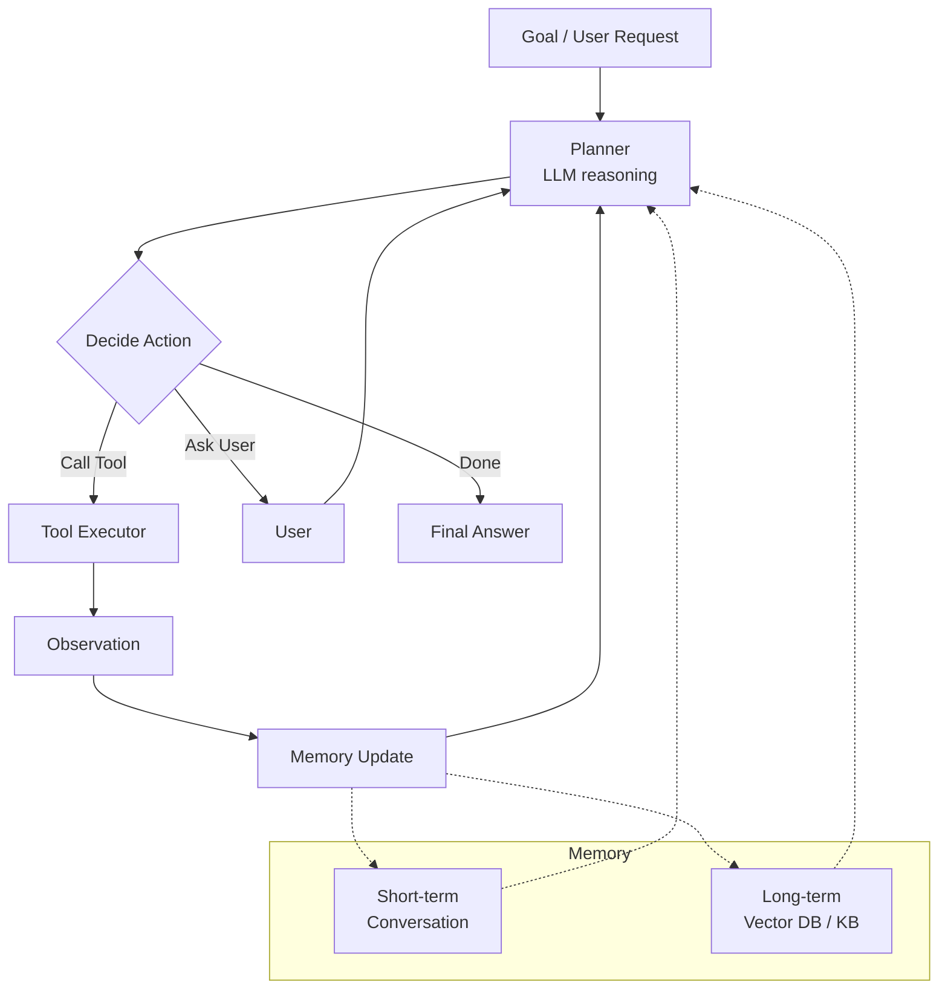

# Module 7 — Introduction to AI Agent

**Durasi:** 90 menit
**Posisi:** Day 2, sesi siang setelah istirahat
**Prasyarat:** Modul 6 (peserta paham workflow & prompt chaining)

---

## Learning Outcomes

Setelah modul ini, peserta mampu:

1. Mendefinisikan **AI Agent** dan membedakannya secara tegas dari chatbot dan workflow.
2. Menjelaskan **arsitektur dasar agent**: planner, executor, tools, memory, observation loop.
3. Menerapkan konsep **goal-oriented** vs **reactive** systems pada problem nyata.
4. Mendesain alur **planning & reasoning** sederhana (ReAct-style: Thought → Action → Observation).
5. Menjelaskan konsep **AI memory** (short-term, long-term, semantic) dan trade-off-nya.

---

## Konsep Inti

### 1. Definisi: Apa itu AI Agent?

**AI Agent** = sistem berbasis LLM yang:
1. Menerima **goal** (bukan sekadar prompt task).
2. **Memilih action** secara otonom (call tool, jawab user, klarifikasi).
3. Mengamati hasil (**observation**) dan **iterasi** sampai goal tercapai (atau berhenti dengan alasan).

> Singkat: *Agent = loop di mana model memutuskan langkah berikutnya berdasarkan state saat ini.*

### 2. Chatbot vs Workflow vs Agent

| Aspek | Chatbot | Workflow | Agent |
|---|---|---|---|
| Input | Pesan user | Trigger + data | Goal |
| Kontrol alur | User-driven | Developer-driven | Model-driven |
| Loop iterasi | Tidak (1 reply/turn) | Tidak (linear) | Ya (sampai goal/limit) |
| Tool use | Jarang | Developer pilih | Model pilih |
| Memory | Context window | Stateless antar run | Eksplisit (short + long term) |
| Predictability | Tinggi | Tinggi | Sedang–rendah |
| Use case | FAQ, info | Proses bisnis | Task open-ended |

### 3. Arsitektur Agent



Komponen kunci:

- **Planner**: LLM yang membaca state, memutuskan next action.
- **Tools**: fungsi-fungsi konkret (API call, DB query, file ops).
- **Executor**: kode yang menjalankan tool, kembalikan observation ke LLM.
- **Memory**:
  - *Short-term*: history percakapan dalam context window.
  - *Long-term*: ringkasan, vector DB, structured KB — di luar context window, di-retrieve bila perlu.
- **Termination policy**: max iterations, budget, atau goal-reached check.

### 4. Goal-Oriented vs Reactive

| Reactive | Goal-Oriented |
|---|---|
| Jawab apa yang ditanya | Bekerja menuju target |
| Stateless tiap pesan | Mempertahankan state goal |
| Cocok: Q&A | Cocok: "Susun jadwal meeting tim minggu depan" |

Agent biasanya **goal-oriented + reactive** (responsif ke input baru tapi tetap mengejar goal).

### 5. Planning & Reasoning (ReAct-style loop)

Pola **Thought → Action → Observation** (ReAct):

```
Thought: Saya perlu tahu cuaca Jakarta dulu.
Action:  get_weather(city="Jakarta")
Observation: {"temp": 32, "condition":"sunny"}
Thought: Cuaca panas. Saya rekomendasikan jadwal indoor.
Action:  send_recommendation(...)
Observation: {"status":"ok"}
Thought: Goal tercapai. Jawab ke user.
Final:   "Saya sudah kirim rekomendasi jadwal indoor."
```

Di Claude API, pola ini direpresentasikan dengan **tool_use** + **tool_result** blocks. Tidak perlu format "Thought:/Action:" eksplisit — model sudah menghasilkan struktur ini lewat tool_use blocks.

### 6. AI Memory

| Tipe | Lokasi | Lifetime | Cara akses |
|---|---|---|---|
| Short-term | Context window | 1 sesi | Otomatis (history) |
| Working scratchpad | Context window | Sesi / sub-task | Model menulis catatan |
| Long-term episodic | DB / file | Lintas sesi | Retrieval (RAG) |
| Semantic / KB | Vector DB | Permanen | Embedding search |
| Procedural | Code/tools | Permanen | Tool definitions |

Trade-off:
- Context window penuh → mahal & latency naik.
- Long-term memory → butuh retrieval & risk stale data.
- *Best practice*: simpan ringkasan + ID; full content di-fetch on demand.

### 7. Termination & Safety

Agent **harus** punya:

- **Max iterations** (mis. 10) untuk hindari infinite loop.
- **Budget cap** (token / dollar) per task.
- **Tool whitelist** — model tidak boleh "imajinasikan" tool.
- **Human-in-the-loop** untuk action irreversible (kirim email ke customer, transfer dana).

---

## Demo Live (15 menit)

Trainer **tidak menulis kode penuh** di modul ini (kode penuh di Modul 8-9). Sebagai gantinya:

1. **Whiteboard exercise**: minta 1 peserta sebutkan goal ("Pesankan saya tiket kereta Jakarta–Bandung besok pagi"). Trainer gambar loop ReAct di whiteboard, isi bersama peserta.
2. **Tunjukkan trace agent** (cetak dari log agent sederhana yang trainer siapkan offline) — peserta lihat sequence Thought/Action/Observation nyata.
3. **Diskusi "Where would this break?"**: minta peserta identifikasi 3 failure mode (tool error, goal ambigu, infinite loop).
4. **Compare**: tunjukkan code workflow Lab-05 → tunjukkan kalau yang sama dipakai sebagai agent: bedanya di siapa yang memutuskan urutan.
5. **Memory demo singkat**: tampilkan agent yang ingat preferensi user dari interaksi sebelumnya (mock dengan dict).

---

## Contoh Konkret

### Contoh 1 — Pseudocode Agent Loop

```python
def agent_loop(goal: str, tools: list, max_iter=10):
    state = {"goal": goal, "history": [], "scratchpad": []}
    for step in range(max_iter):
        decision = llm_decide(state, tools)   # Claude memutuskan
        if decision["type"] == "final":
            return decision["answer"]
        if decision["type"] == "tool":
            obs = execute_tool(decision["tool"], decision["args"])
            state["history"].append({"action": decision, "observation": obs})
        elif decision["type"] == "ask_user":
            user_input = input(decision["question"])
            state["history"].append({"clarification": user_input})
    return "[STOP] Max iterations reached."
```

Catatan: di Modul 8, fungsi `llm_decide` direpresentasikan sebagai `client.messages.create(..., tools=[...])` dan keputusan model muncul sebagai `tool_use` content block.

### Contoh 2 — Memory Sketch (Python)

```python
class SimpleMemory:
    def __init__(self):
        self.short = []         # last N messages
        self.long = {}          # key-value, e.g., user prefs
        self.summaries = []     # rolling summaries

    def add_message(self, role, content):
        self.short.append({"role": role, "content": content})
        if len(self.short) > 20:
            # ringkas batch terlama, simpan summary
            old = self.short[:10]
            self.short = self.short[10:]
            self.summaries.append(summarize_with_claude(old))

    def remember(self, key, value):
        self.long[key] = value

    def recall(self, key):
        return self.long.get(key)
```

> **Paralel JS**: kelas sama; pakai `class SimpleMemory { ... }`. Konsep memory tidak language-specific.

---

## Hands-on Lab

Modul ini **tidak memiliki lab tersendiri** — peserta mempraktikkan agent loop pada Lab 06 (tool calling) dan Lab 07 (build agent end-to-end).

Aktivitas tertulis singkat (10 menit, di kelas):
- Setiap peserta gambar arsitektur agent untuk *satu use case di pekerjaannya*.
- Identifikasi: goal, tools yang dibutuhkan, jenis memory, termination policy.
- Share dengan teman sebelah, beri 1 feedback.

---

## Wrap-up & Q&A

1. Apa **satu kalimat** definisi AI Agent yang Anda pakai untuk menjelaskan ke atasan non-teknis?
2. Use case mana di organisasi Anda yang **memang butuh agent**, bukan workflow?
3. Apa risiko terbesar membiarkan model memilih urutan action sendiri? Bagaimana mitigasinya?
4. Kenapa termination policy itu wajib?
5. Sebutkan 2 contoh kapan long-term memory perlu, dan 2 contoh kapan short-term saja cukup.

---

## Bacaan Lanjutan

- Anthropic — Building effective agents: <https://www.anthropic.com/research/building-effective-agents>
- Anthropic Docs — Tool use overview: <https://docs.anthropic.com/en/docs/build-with-claude/tool-use>
- ReAct paper (Yao et al., 2022): <https://arxiv.org/abs/2210.03629>
- "Agents" (Lilian Weng blog): <https://lilianweng.github.io/posts/2023-06-23-agent/>
- Anthropic Cookbook — Agents folder
