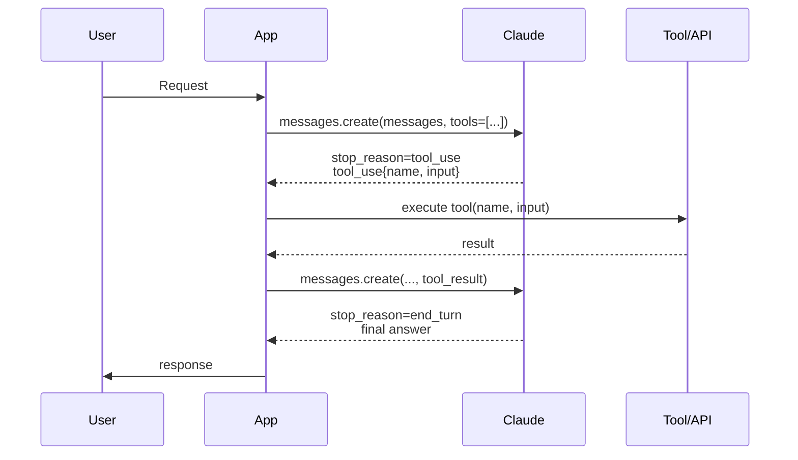
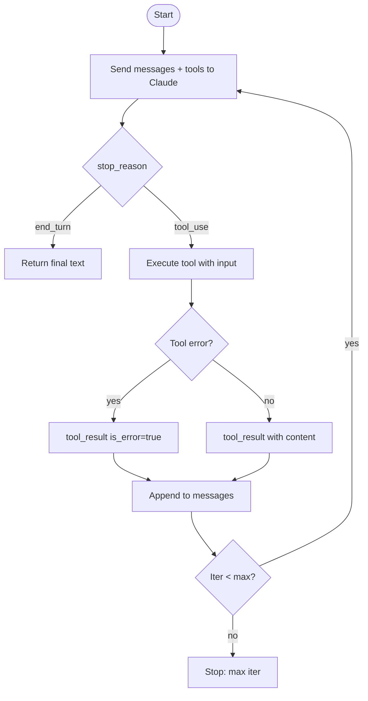
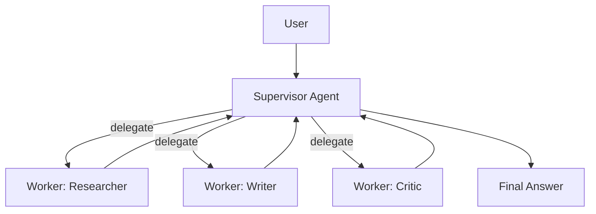

# Module 8 — AI Agent Orchestration

**Durasi belajar:** ±90 menit
**Posisi:** Day 2, sesi sore setelah Module 7
**Prasyarat:** Module 7 (konsep agent)
**Format:** Baca konsep → praktik mandiri → lab terintegrasi

---

## Apa yang Akan Anda Bisa Setelah Modul Ini

Setelah selesai membaca dan mempraktikkan modul ini, Anda akan mampu:

1. **Membedakan** *single-agent* dan *multi-agent*, serta tahu kapan harus memilih yang mana.
2. **Menjelaskan** mekanisme *tool calling / function calling* pada Claude API (siklus request/response).
3. **Menggambar** *agent execution flow* lengkap dengan loop tool_use dan tool_result.
4. **Mendesain** *decision making* dan *action planning*, termasuk fallback ketika tool gagal.
5. **Mengimplementasi** *task delegation* antar sub-agent (supervisor → worker).

---

## Konsep Inti

### 1. Single-Agent vs Multi-Agent

Sebelum buru-buru membangun "tim agent", pahami terlebih dahulu trade-off-nya:

| Aspek | Single-Agent | Multi-Agent |
|---|---|---|
| Jumlah "role" LLM | 1 | 2 atau lebih (supervisor, workers, critic, dsb.) |
| Manajemen state | 1 conversation | Komunikasi antar-agent |
| Cocok untuk | Tugas moderat, 5–10 tool | Tugas kompleks, ekosistem tool besar, perlu spesialisasi |
| Complexity | Rendah – sedang | Tinggi |
| Cost | Lebih rendah | Bisa berlipat |
| Debugging | Mudah | Sulit (memerlukan observability) |

**Heuristik praktis**: mulailah dari single-agent dengan tool. Naik ke multi-agent hanya ketika:
- Jumlah tool melebihi 15 sehingga LLM kebingungan memilih.
- Sub-task membutuhkan keahlian yang berbeda (misalnya coding vs research).
- Paralelisasi memberikan speedup yang signifikan.

### 2. Tool Calling di Claude API

**Tool calling** adalah fitur di mana Anda sebagai developer mendaftarkan daftar tool (dalam bentuk schema JSON) ke Claude. Model kemudian dapat memutuskan untuk *meminta* eksekusi tool tertentu dengan argumen yang valid.

Siklusnya:



Beberapa hal penting yang sering luput diperhatikan:

- **Model tidak mengeksekusi tool** — model hanya menghasilkan permintaan. Aplikasi Anda yang melakukan eksekusi.
- Aplikasi wajib **menambahkan** tool_result ke history sebelum melakukan call berikutnya.
- Loop berlanjut hingga `stop_reason != "tool_use"` (biasanya menjadi `end_turn`).
- Model dapat meminta **beberapa tool call paralel** dalam satu giliran.

### 3. Tool Schema

```python
tools = [{
    "name": "get_weather",
    "description": "Get current weather for a city. Use only when user asks about weather.",
    "input_schema": {
        "type": "object",
        "properties": {
            "city": {"type": "string", "description": "City name in English"},
            "unit": {"type": "string", "enum": ["celsius","fahrenheit"], "default": "celsius"}
        },
        "required": ["city"]
    }
}]
```

Praktik terbaik yang sebaiknya Anda ikuti:
- **Description yang tajam** — jelaskan kapan tool ini dipakai dan kapan tidak dipakai.
- **Schema yang ketat** — gunakan enum, required, dan format.
- **Penamaan** — pakai snake_case berupa kata kerja (`get_weather`, `search_database`, `send_email`).
- **Idempotency** — untuk tool yang memiliki side effect, sertakan `idempotency_key` di schema.

### 4. Agent Execution Flow



### 5. Decision Making & Action Planning

Model mengambil keputusan berdasarkan beberapa sumber informasi:
- **System prompt** (persona + policy).
- **Conversation history**.
- **Tool descriptions**.
- **Tool results** dari iterasi sebelumnya.

Beberapa pola yang membantu kualitas keputusan model:
- Tambahkan instruksi seperti: *"Plan first in 2–3 bullets, then call tools."* — sering disebut **chain-of-thought scaffolding** (pola yang memaksa model menuliskan rencana terlebih dahulu). Untuk model Claude yang mendukungnya, Anda juga dapat memanfaatkan *extended thinking*.
- Sediakan tool seperti `give_up` atau `ask_clarification` agar model tidak berhalusinasi ketika menemui jalan buntu.

### 6. Task Delegation (Multi-Agent)

Pola dasar yang paling umum adalah **Supervisor → Workers**:



Implementasinya: supervisor memiliki tool `delegate(worker_name, sub_task)`. Setiap worker merupakan panggilan `messages.create` tersendiri dengan system prompt yang khusus. Hasil dari worker dikembalikan ke supervisor untuk disintesa.

Risiko yang perlu Anda antisipasi pada multi-agent:
- **Cost berlipat** — setiap agent adalah satu call tersendiri.
- **Loss in translation** antar agent — output supervisor sebaiknya selalu terstruktur.
- **Loop antar-agent** jika tidak ada mekanisme termination.

### 7. Error Handling untuk Tool Calls

| Skenario | Strategi |
|---|---|
| Tool melempar exception | Kembalikan `tool_result` dengan `is_error=true` dan pesan singkat |
| Tool mengembalikan data besar | Lakukan truncate + summary; simpan konten penuh di memory eksternal |
| Tool butuh konfirmasi pengguna | Hentikan sementara, kirim ke UI human-in-the-loop |
| Tool tidak ada di whitelist | Aplikasi menolak, kirimkan pesan error ke model |
| Argumen invalid | Tolak, beritahu skema yang benar |

### 8. Observability

Tracing menjadi krusial: catat setiap turn beserta `input_messages`, `tool_used`, `tool_input`, `tool_output`, `latency`, `tokens`, dan `cost`. Tooling yang dapat Anda gunakan: OpenTelemetry, LangSmith, atau custom JSON log.

---

## Praktik Mandiri (15 menit)

Mari Anda eksplorasi tool calling dengan tiga tool dummy berikut. Tujuannya agar Anda merasakan langsung bagaimana model memilih tool secara mandiri.

### Langkah-Langkahnya

1. **Definisikan 3 tool**: `get_weather`, `search_database` (mock customer DB), dan `send_email`.
2. **Query 1**: "Cek cuaca Jakarta hari ini." Harapan: model memanggil `get_weather`.
3. **Query 2**: "Cari email customer bernama Budi." Harapan: model memanggil `search_database`.
4. **Query 3**: "Cek cuaca Surabaya dan kirim email ringkasan ke admin@toko.id." Harapan: dua tool call berurutan atau paralel.
5. **Eksperimen error**: buat `search_database` melempar exception, lalu amati bagaimana model pulih dengan meminta klarifikasi.

Refleksi: pada query mana model paling rentan salah memilih tool? Apakah deskripsi tool Anda sudah cukup tajam?

---

## Contoh Konkret

### Contoh 1 — Tool Calling Loop (Python)

```python
import os, json
from anthropic import Anthropic

client = Anthropic(api_key=os.environ["ANTHROPIC_API_KEY"])

TOOLS = [
    {
        "name": "get_weather",
        "description": "Get current weather for a given city.",
        "input_schema": {
            "type": "object",
            "properties": {"city": {"type": "string"}},
            "required": ["city"],
        },
    },
    {
        "name": "search_database",
        "description": "Search mock customer DB by name.",
        "input_schema": {
            "type": "object",
            "properties": {"query": {"type": "string"}},
            "required": ["query"],
        },
    },
]

def execute_tool(name, args):
    if name == "get_weather":
        return {"city": args["city"], "temp_c": 31, "condition": "sunny"}
    if name == "search_database":
        db = {"budi": {"email":"budi@toko.id","tier":"gold"}}
        return db.get(args["query"].lower(), {"error":"not found"})
    raise ValueError(f"Unknown tool: {name}")

def run_agent(user_msg: str, max_iter=6):
    messages = [{"role":"user","content":user_msg}]
    for _ in range(max_iter):
        resp = client.messages.create(
            model="claude-sonnet-4-5",
            max_tokens=1024,
            tools=TOOLS,
            messages=messages,
        )
        if resp.stop_reason == "end_turn":
            return next((b.text for b in resp.content if b.type=="text"), "")
        if resp.stop_reason == "tool_use":
            messages.append({"role":"assistant","content":resp.content})
            tool_results = []
            for block in resp.content:
                if block.type == "tool_use":
                    try:
                        out = execute_tool(block.name, block.input)
                        tool_results.append({
                            "type":"tool_result",
                            "tool_use_id": block.id,
                            "content": json.dumps(out),
                        })
                    except Exception as e:
                        tool_results.append({
                            "type":"tool_result",
                            "tool_use_id": block.id,
                            "content": str(e),
                            "is_error": True,
                        })
            messages.append({"role":"user","content":tool_results})
    return "[STOP] Max iterations reached."

if __name__ == "__main__":
    print(run_agent("Cek cuaca Jakarta dan cari customer bernama Budi."))
```

### Contoh 2 — Supervisor Delegation (sketch)

```python
def supervisor(goal: str):
    plan = call_claude("planner", system="You are a planner. Break goal into steps.", user=goal)
    results = []
    for step in plan["steps"]:
        if step["worker"] == "researcher":
            results.append(call_claude("researcher", system="...", user=step["task"]))
        elif step["worker"] == "writer":
            results.append(call_claude("writer", system="...", user=step["task"] + " ".join(results)))
    return call_claude("supervisor", system="Synthesize final answer.", user=str(results))
```

> **Paralel JS**: gunakan `client.messages.create({ model, tools, messages })` dengan struktur tool_use / tool_result yang identik. Iterasi dapat dibuat menggunakan while-loop.

---

## Hands-on Lab

Lanjut ke: [`lab-06-tool-calling/`](./lab-06-tool-calling/)

Pada lab ini Anda akan mengimplementasikan tool calling end-to-end dengan tiga tool dummy dan minimal empat query pengguna yang menguji kemampuan *decision making* model.

---

## Latihan & Refleksi

Sebelum melanjutkan ke Module 9, pastikan Anda mampu menjawab kelima pertanyaan berikut:

1. Apakah model "menjalankan" tool atau hanya "meminta"? (Petunjuk: model hanya meminta — aplikasi Anda yang mengeksekusi.)
2. Apa yang terjadi jika Anda lupa menambahkan `tool_result` ke history? (Petunjuk: error atau model tidak dapat melanjutkan.)
3. Sebutkan dua alasan memilih single-agent dibandingkan multi-agent.
4. Bagaimana cara mencegah agent terjebak memanggil tool yang sama berulang-ulang? (Petunjuk: max iter, deteksi pengulangan, dan deskripsi tool yang lebih jelas.)
5. Kapan paralelisasi tool call membantu, dan kapan justru merepotkan?

---

## Bacaan Lanjutan

- Anthropic Docs — Tool use (full): <https://docs.anthropic.com/en/docs/build-with-claude/tool-use>
- Anthropic Docs — How to implement tool use: <https://docs.anthropic.com/en/docs/build-with-claude/tool-use/implement-tool-use>
- Anthropic Cookbook — tool_use folder
- Multi-agent patterns: <https://www.anthropic.com/research/building-effective-agents>
