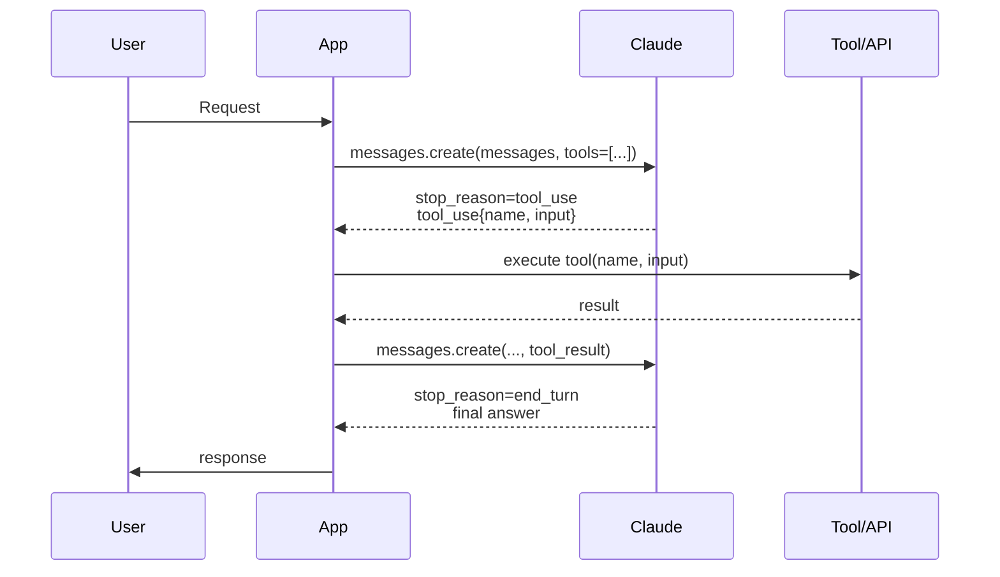
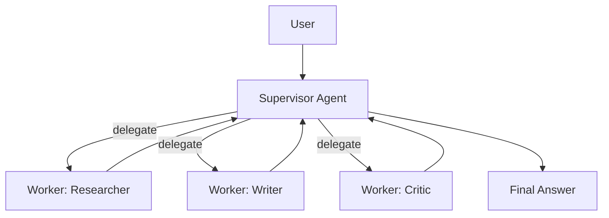

# Module 8 — AI Agent Orchestration

**Durasi:** 90 menit
**Posisi:** Day 2, sesi sore setelah Modul 7
**Prasyarat:** Modul 7 (konsep agent)

---

## Learning Outcomes

Setelah modul ini, peserta mampu:

1. Membedakan **single-agent** vs **multi-agent** dan kapan pakai yang mana.
2. Menjelaskan mekanisme **tool calling / function calling** di Claude API (request/response cycle).
3. Menggambar **agent execution flow** lengkap dengan tool_use + tool_result loop.
4. Mendesain **decision making & action planning** termasuk fallback ketika tool gagal.
5. Mengimplementasi **task delegation** antar sub-agent (supervisor → worker).

---

## Konsep Inti

### 1. Single-Agent vs Multi-Agent

| Aspek | Single-Agent | Multi-Agent |
|---|---|---|
| Jumlah LLM "role" | 1 | 2+ (supervisor, workers, critic, dsb.) |
| State management | 1 conversation | Antar-agent communication |
| Cocok untuk | Task moderat, 5–10 tool | Task kompleks, ekosistem tool besar, spesialisasi |
| Complexity | Rendah–sedang | Tinggi |
| Cost | Lebih rendah | Bisa berlipat |
| Debugging | Mudah | Sulit (perlu observability) |

**Heuristik**: mulai dari single-agent dengan tool. Naik ke multi-agent hanya ketika:
- Tool > 15 sehingga LLM kebingungan memilih.
- Sub-tasks butuh expertise berbeda (mis. coding vs research).
- Paralelisasi memberi speedup signifikan.

### 2. Tool Calling di Claude API

**Tool calling** = fitur di Claude di mana developer mendaftarkan daftar tools (schema JSON), lalu model bisa memutuskan untuk *meminta* eksekusi tool tertentu dengan argumen yang valid.

Siklus:



Poin penting:

- **Model tidak eksekusi tool** — hanya menghasilkan permintaan. *App* yang eksekusi.
- App harus **append** tool_result ke history sebelum call lagi.
- Loop sampai `stop_reason != "tool_use"` (biasanya `end_turn`).
- Model bisa minta **multiple tool calls in parallel** dalam satu turn.

### 3. Tool Schema

```python
tools = [{
    "name": "get_weather",
    "description": "Get current weather for a city. Use only when user asks about weather.",
    "input_schema": {
        "type": "object",
        "properties": {
            "city": {"type": "string", "description": "City name in English"},
            "unit": {"type": "string", "enum": ["celsius","fahrenheit"], "default": "celsius"}
        },
        "required": ["city"]
    }
}]
```

Best practice:
- **Description tajam**: kapan dipakai, kapan TIDAK dipakai.
- **Schema ketat**: enum, required, format.
- **Naming**: snake_case kata kerja (get_weather, search_database, send_email).
- **Idempotency**: untuk tool yang punya side effect, sertakan idempotency_key di schema.

### 4. Agent Execution Flow


### 5. Decision Making & Action Planning

Model mengambil keputusan berdasarkan:
- **System prompt** (persona + policy).
- **Conversation history**.
- **Tool descriptions**.
- **Tool results** sebelumnya.

Pola yang membantu:
- Tambahkan instruksi: *"Plan first in 2–3 bullets, then call tools."* — sering disebut **chain-of-thought scaffolding**. Untuk Claude juga bisa pakai extended thinking pada model yang mendukung.
- Sediakan tool `give_up` / `ask_clarification` agar model tidak halusinasi saat buntu.

### 6. Task Delegation (Multi-Agent)

Pola dasar **Supervisor → Workers**:



Implementasi: supervisor punya tool `delegate(worker_name, sub_task)`. Setiap worker adalah `messages.create` terpisah dengan system prompt khusus. Hasil dikembalikan ke supervisor.

Risiko multi-agent:
- **Cost berlipat** (setiap agent = call sendiri).
- **Loss in translation** antar agent → output supervisor harus structured.
- **Loop antar-agent** jika tidak ada termination.

### 7. Error Handling untuk Tool Calls

| Skenario | Strategi |
|---|---|
| Tool throw exception | Return `tool_result` dengan `is_error=true` + pesan singkat |
| Tool return data besar | Truncate + summary, simpan full di memory eksternal |
| Tool butuh confirm user | Pause, kirim ke human-in-loop UI |
| Tool tidak ada di whitelist | App tolak, kirim error ke model |
| Argument invalid | Tolak, beri tahu skema yang benar |

### 8. Observability

Tracing penting: log per turn → `input_messages`, `tool_used`, `tool_input`, `tool_output`, `latency`, `tokens`, `cost`. Tools: OpenTelemetry, LangSmith, custom JSON log.

---

## Demo Live (15 menit)

Trainer mendemokan tool calling dengan 3 tool dummy:

1. **Definisikan 3 tools**: `get_weather`, `search_database` (mock customer DB), `send_email`.
2. **User query 1**: "Cek cuaca Jakarta hari ini" → expect: model panggil `get_weather`.
3. **User query 2**: "Cari email customer bernama Budi" → expect: `search_database`.
4. **User query 3**: "Cek cuaca Surabaya dan kirim email ringkasan ke admin@toko.id" → expect: 2 tool call berurutan / paralel.
5. **Error injection**: bikin `search_database` raise → tunjukkan model recover dengan klarifikasi.

---

## Contoh Konkret

### Contoh 1 — Tool Calling Loop (Python)

```python
import os, json
from anthropic import Anthropic

client = Anthropic(api_key=os.environ["ANTHROPIC_API_KEY"])

TOOLS = [
    {
        "name": "get_weather",
        "description": "Get current weather for a given city.",
        "input_schema": {
            "type": "object",
            "properties": {"city": {"type": "string"}},
            "required": ["city"],
        },
    },
    {
        "name": "search_database",
        "description": "Search mock customer DB by name.",
        "input_schema": {
            "type": "object",
            "properties": {"query": {"type": "string"}},
            "required": ["query"],
        },
    },
]

def execute_tool(name, args):
    if name == "get_weather":
        return {"city": args["city"], "temp_c": 31, "condition": "sunny"}
    if name == "search_database":
        db = {"budi": {"email":"budi@toko.id","tier":"gold"}}
        return db.get(args["query"].lower(), {"error":"not found"})
    raise ValueError(f"Unknown tool: {name}")

def run_agent(user_msg: str, max_iter=6):
    messages = [{"role":"user","content":user_msg}]
    for _ in range(max_iter):
        resp = client.messages.create(
            model="claude-sonnet-4-5",
            max_tokens=1024,
            tools=TOOLS,
            messages=messages,
        )
        if resp.stop_reason == "end_turn":
            return next((b.text for b in resp.content if b.type=="text"), "")
        if resp.stop_reason == "tool_use":
            messages.append({"role":"assistant","content":resp.content})
            tool_results = []
            for block in resp.content:
                if block.type == "tool_use":
                    try:
                        out = execute_tool(block.name, block.input)
                        tool_results.append({
                            "type":"tool_result",
                            "tool_use_id": block.id,
                            "content": json.dumps(out),
                        })
                    except Exception as e:
                        tool_results.append({
                            "type":"tool_result",
                            "tool_use_id": block.id,
                            "content": str(e),
                            "is_error": True,
                        })
            messages.append({"role":"user","content":tool_results})
    return "[STOP] Max iterations reached."

if __name__ == "__main__":
    print(run_agent("Cek cuaca Jakarta dan cari customer bernama Budi."))
```

### Contoh 2 — Supervisor Delegation (sketch)

```python
def supervisor(goal: str):
    plan = call_claude("planner", system="You are a planner. Break goal into steps.", user=goal)
    results = []
    for step in plan["steps"]:
        if step["worker"] == "researcher":
            results.append(call_claude("researcher", system="...", user=step["task"]))
        elif step["worker"] == "writer":
            results.append(call_claude("writer", system="...", user=step["task"] + " ".join(results)))
    return call_claude("supervisor", system="Synthesize final answer.", user=str(results))
```

> **Paralel JS**: `client.messages.create({ model, tools, messages })` dengan struktur tool_use / tool_result yang identik. Iterasi pakai while-loop.

---

## Hands-on Lab

Lanjut ke: [`lab-06-tool-calling/`](./lab-06-tool-calling/)

Peserta mengimplementasikan tool calling end-to-end dengan 3 tool dummy dan minimum 4 user query yang menguji decision making model.

---

## Wrap-up & Q&A

1. Apakah model "menjalankan" tool atau hanya "meminta"? (jawab: meminta — app yang eksekusi)
2. Apa yang terjadi kalau Anda lupa append `tool_result` ke history? (jawab: error / model tidak bisa lanjut)
3. Sebutkan 2 alasan memilih single-agent dibanding multi-agent.
4. Bagaimana mencegah agent stuck di tool yang sama berulang? (jawab: max iter, deteksi pengulangan, tool description lebih jelas)
5. Kapan paralelisasi tool call membantu, kapan justru merepotkan?

---

## Bacaan Lanjutan

- Anthropic Docs — Tool use (full): <https://docs.anthropic.com/en/docs/build-with-claude/tool-use>
- Anthropic Docs — How to implement tool use: <https://docs.anthropic.com/en/docs/build-with-claude/tool-use/implement-tool-use>
- Anthropic Cookbook — tool_use folder
- Multi-agent patterns: <https://www.anthropic.com/research/building-effective-agents>
