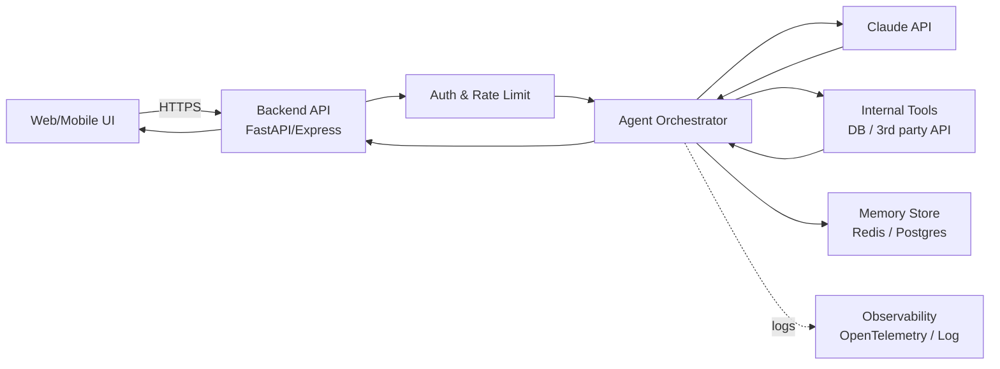
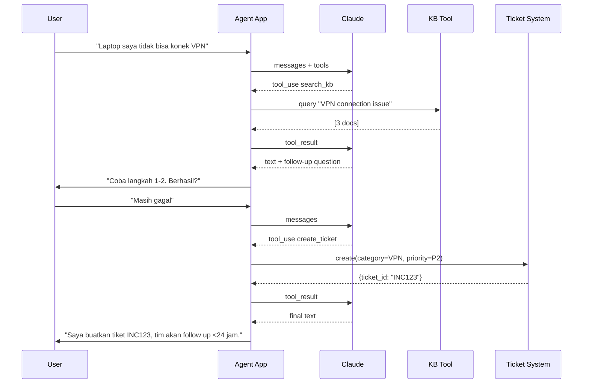

# Module 9 — Building AI Agent with Claude API

**Durasi belajar:** ±120 menit (capstone Day 2)
**Posisi:** Day 2, modul penutup
**Prasyarat:** Module 5–8 (prompt, workflow, konsep agent, dan tool calling)
**Format:** Baca konsep → praktik mandiri → lab capstone

---

## Apa yang Akan Anda Bisa Setelah Modul Ini

Setelah selesai membaca dan mempraktikkan modul ini, Anda akan mampu:

1. **Mengintegrasikan** Claude API secara aman: autentikasi, environment variable, retry, timeout, dan rate limit handling.
2. **Mengelola** *conversation loop* dengan state yang bersih (messages, memory, dan tool use).
3. **Membangun** *input/output handling* yang robust: validasi input pengguna, parsing output, dan streaming.
4. **Mendesain** *agent interaction flow* yang lengkap (system prompt + tools + memory + termination).
5. **Memahami** dasar-dasar deployment untuk agent: secrets, observability, cost guard, dan pola scaling.

---

## Konsep Inti

### 1. Esensi Claude API

Endpoint utama yang akan Anda pakai: `client.messages.create(...)`.

| Parameter | Penjelasan |
|---|---|
| `model` | `claude-sonnet-4-5`, `claude-haiku-4-5`, dan seterusnya |
| `max_tokens` | Batas atas output. Wajib diisi. |
| `system` | System prompt (berupa string atau list of blocks) |
| `messages` | List of `{role, content}`. Role berupa user/assistant. |
| `tools` | List schema tool (opsional) |
| `tool_choice` | `auto`, `any`, atau `{type:"tool", name}` |
| `temperature` | 0–1. Semakin rendah, semakin deterministik. |
| `stream` | bool, untuk streaming SSE |
| `metadata` | `{user_id: "..."}` untuk keperluan audit |

### 2. Autentikasi dan Manajemen API Key

Beberapa aturan yang wajib Anda patuhi sejak hari pertama:

- **Jangan pernah hardcode** `sk-ant-...` di dalam source code.
- Gunakan environment variable: `os.environ["ANTHROPIC_API_KEY"]` atau file `.env` dengan `python-dotenv`.
- Di production, gunakan secret manager (AWS Secrets Manager, GCP Secret Manager, atau Vault).
- Rotasi key secara berkala. Gunakan key terpisah per service dan per environment (dev/stg/prod).
- Untuk aplikasi multi-pengguna, gunakan `metadata.user_id` per pengguna untuk melacak penyalahgunaan.

```python
# .env
ANTHROPIC_API_KEY=sk-ant-xxxxx
```
```python
# code
from dotenv import load_dotenv
load_dotenv()
client = Anthropic()  # otomatis membaca dari env
```

### 3. Pola Integrasi Backend



Komponen yang wajib hadir di arsitektur ini:
- **Auth layer** — jangan pernah mengekspos Anthropic key ke frontend.
- **Rate limit** per pengguna (token bucket).
- **Memory store** untuk percakapan multi-turn lintas request.
- **Observability** — catat request, penggunaan token, latensi, dan error rate.

### 4. Conversation Loop dengan State

State minimum yang perlu Anda kelola:
- `messages: list[dict]`
- `session_id: str`
- `user_id: str`
- `iter_count: int`
- `budget_tokens: int` (sisa budget)

Polanya:

```python
def turn(session_id, user_input):
    state = load_state(session_id)        # dari Redis/Postgres
    state["messages"].append({"role":"user","content":user_input})
    reply = run_agent_loop(state)
    state["messages"].append({"role":"assistant","content":reply})
    save_state(session_id, state)
    return reply
```

### 5. Input/Output Handling

**Validasi input** yang sebaiknya Anda lakukan:
- Panjang maksimum (untuk mencegah *token bomb*).
- Strip atau sanitize karakter yang tidak diinginkan.
- Deteksi prompt injection sederhana (misalnya dengan regex keyword).

**Penanganan output**:
- Parse JSON dengan blok try-except.
- Validasi schema (Pydantic untuk Python, Zod untuk TypeScript).
- Streaming: gunakan `client.messages.stream(...)` untuk pengalaman pengguna yang lebih responsif.

### 6. Agent Interaction Flow (contoh: Helpdesk IT)



### 7. Dasar-Dasar Deployment

| Aspek | Praktik |
|---|---|
| **Hosting** | Docker container di Cloud Run, ECS, atau VM |
| **Secrets** | Secret manager, bukan file env di disk |
| **Observability** | Structured log dalam JSON; trace per session_id |
| **Cost guard** | Budget cap per pengguna per hari; alert melebihi threshold |
| **Reliability** | Retry dengan backoff (429/5xx); circuit breaker untuk tool |
| **Safety** | Content filter, audit log untuk aksi yang tidak bisa dibatalkan |
| **Versioning** | Pin model version; perlakukan perubahan prompt sebagai kode |

### 8. Pola Production yang Sering Terlewat

- **Idempotency key** untuk aksi eksternal seperti kirim email atau create ticket.
- **Timeout** di setiap tool call (jangan biarkan menggantung).
- **Graceful degradation** — jika Claude tidak tersedia, berikan respons fallback.
- **PII redaction** di dalam log.
- **Compliance** — perhatikan regional data residency dan retention policy.

---

## Praktik Mandiri (20 menit)

Mari Anda bangun sebuah agent **IT Helpdesk** sederhana dari awal hingga akhir. Tujuannya: merasakan integrasi system prompt, tool, conversation loop, hingga observasi log.

### Langkah-Langkahnya

1. **Bootstrap proyek**: siapkan struktur folder berisi `agent.py`, `tools.py`, `memory.py`, dan `.env`.
2. **Definisikan 3 tool**: `search_kb`, `create_ticket`, dan `escalate_to_human`.
3. **Tulis system prompt agent**: tentukan role IT helpdesk, policy yang berlaku, dan format respons.
4. **Jalankan conversation loop di CLI**: input pengguna di terminal → balasan agent → loop kembali.
5. **Uji tiga skenario**:
   - Pengguna: *"Password saya lupa."* → agent mencari KB → menjawab dengan langkah reset.
   - Pengguna: *"Laptop tidak menyala."* → agent mencari KB → jika buntu, agent membuat tiket.
   - Pengguna: *"Saya butuh akses admin."* → agent melakukan escalate (policy: tidak boleh self-serve).
6. **Tinjau log**: penggunaan token per turn, latensi, dan tool yang dipakai di setiap langkah.

Refleksi: di skenario mana agent paling rentan keliru? Apakah karena prompt, tool description, atau policy?

---

## Contoh Konkret

### Contoh 1 — Minimal Agent App (Python)

```python
# agent.py
import os, json, time
from dotenv import load_dotenv
from anthropic import Anthropic

load_dotenv()
client = Anthropic()
MODEL = "claude-sonnet-4-5"

SYSTEM = """Anda adalah Asisten IT Helpdesk Internal "Multimatics IT".
Kebijakan:
- Selalu cek KB dulu sebelum buat tiket.
- Untuk request akses admin/finance: langsung escalate, jangan self-serve.
- Bahasa: Indonesia, sopan, ringkas.
"""

TOOLS = [
    {"name":"search_kb","description":"Cari di knowledge base IT. Gunakan untuk pertanyaan how-to & troubleshoot umum.",
     "input_schema":{"type":"object","properties":{"query":{"type":"string"}},"required":["query"]}},
    {"name":"create_ticket","description":"Buat tiket helpdesk. Gunakan kalau KB tidak menyelesaikan masalah.",
     "input_schema":{"type":"object","properties":{
         "title":{"type":"string"},"description":{"type":"string"},
         "category":{"type":"string","enum":["ACCESS","HARDWARE","SOFTWARE","NETWORK","OTHER"]},
         "priority":{"type":"string","enum":["P1","P2","P3"]}},
       "required":["title","description","category","priority"]}},
    {"name":"escalate_to_human","description":"Eskalasi ke human agent. Gunakan untuk akses admin/finance atau permintaan sensitif.",
     "input_schema":{"type":"object","properties":{"reason":{"type":"string"}},"required":["reason"]}},
]

# Mock implementations
KB = {
    "vpn": "1) Reconnect VPN. 2) Restart adapter. 3) Cek credential di portal.",
    "password": "Reset di https://reset.multimatics.local",
}
def search_kb(query):
    q = query.lower()
    for k,v in KB.items():
        if k in q: return {"hits":[{"title":k,"content":v}]}
    return {"hits":[]}
def create_ticket(**kw):
    tid = f"INC-{int(time.time())%100000}"
    return {"ticket_id":tid, **kw}
def escalate_to_human(reason):
    return {"status":"escalated","queue":"L2","reason":reason}

def execute_tool(name, args):
    if name=="search_kb": return search_kb(**args)
    if name=="create_ticket": return create_ticket(**args)
    if name=="escalate_to_human": return escalate_to_human(**args)
    raise ValueError(name)

def agent_turn(messages, max_iter=8):
    for _ in range(max_iter):
        r = client.messages.create(
            model=MODEL, max_tokens=1024, system=SYSTEM, tools=TOOLS, messages=messages
        )
        if r.stop_reason == "end_turn":
            text = "".join(b.text for b in r.content if b.type=="text")
            messages.append({"role":"assistant","content":r.content})
            return text, messages
        if r.stop_reason == "tool_use":
            messages.append({"role":"assistant","content":r.content})
            results = []
            for b in r.content:
                if b.type=="tool_use":
                    try: out = execute_tool(b.name, b.input)
                    except Exception as e:
                        results.append({"type":"tool_result","tool_use_id":b.id,
                                        "content":str(e),"is_error":True}); continue
                    results.append({"type":"tool_result","tool_use_id":b.id,
                                    "content":json.dumps(out)})
            messages.append({"role":"user","content":results})
    return "[STOP] Max iter", messages

def main():
    messages = []
    print("IT Helpdesk Agent — ketik 'exit' untuk keluar.\n")
    while True:
        user = input("You: ").strip()
        if user.lower() in ("exit","quit"): break
        messages.append({"role":"user","content":user})
        reply, messages = agent_turn(messages)
        print(f"Agent: {reply}\n")

if __name__ == "__main__":
    main()
```

### Contoh 2 — Wrapper dengan Retry & Budget Guard

```python
import time
from anthropic import APIError, RateLimitError

def safe_create(messages, system, tools, max_retries=3, budget_left=10000):
    if budget_left < 500:
        return {"text":"[Budget exhausted]","stop_reason":"end_turn"}
    for attempt in range(max_retries):
        try:
            return client.messages.create(
                model=MODEL, max_tokens=min(1024, budget_left),
                system=system, tools=tools, messages=messages,
                metadata={"user_id":"u_123"},
            )
        except RateLimitError:
            time.sleep(2 ** attempt)
        except APIError as e:
            if attempt == max_retries-1: raise
            time.sleep(1)
```

> **Paralel JS**: gunakan `@anthropic-ai/sdk` dengan struktur yang identik. Anda dapat memakai Express atau Fastify untuk backend; simpan state di Redis (misalnya dengan `ioredis`).

---

## Hands-on Lab

Lanjut ke: [`lab-07-build-agent/`](./lab-07-build-agent/)

Inilah capstone Day 2: Anda akan membangun mini AI Agent IT Helpdesk dengan tiga tool (`search_kb`, `create_ticket`, `escalate`) dan conversation loop berbasis CLI.

---

## Latihan & Refleksi

Sebelum menutup Day 2, pastikan Anda mampu menjawab kelima pertanyaan berikut:

1. Sebutkan tiga hal yang **tidak boleh** terjadi di kode agent Anda terkait API key.
2. Apa bedanya menyimpan state di context window dibandingkan di Redis untuk percakapan multi-turn?
3. Mengapa idempotency key penting untuk tool `create_ticket`?
4. Apa indikator observability minimum yang harus Anda catat per turn?
5. Bagaimana strategi *cost-guard* sederhana yang dapat Anda terapkan mulai besok?

---

## Bacaan Lanjutan

- Anthropic API Docs: <https://docs.anthropic.com/en/api/messages>
- Anthropic — Streaming: <https://docs.anthropic.com/en/docs/build-with-claude/streaming>
- Anthropic — Errors & rate limits: <https://docs.anthropic.com/en/api/errors>
- Anthropic — Prompt caching: <https://docs.anthropic.com/en/docs/build-with-claude/prompt-caching>
- Anthropic Cookbook — Customer Support Agent example
- Anthropic — Building effective agents: <https://www.anthropic.com/research/building-effective-agents>
