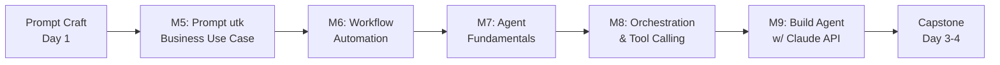

# Day 2 — AI Workflow + AI Agent Full

Pelatihan: **Prompt Engineering, AI Agent & AI App Development with Claude**
Penyelenggara: Multimatics
Durasi total program: 4 hari (40 jam)
Hari ini: **Day 2 (8 jam efektif, 480 menit + break)**

## Ringkasan Day 2

Day 2 menjembatani perjalanan Anda dari **prompt craft** (Day 1) menuju **sistem otomatis** dan **AI Agent berbasis Claude API**. Di sini Anda akan belajar bagaimana prompt yang baik dirangkai menjadi *workflow*, lalu di-upgrade menjadi *agent* yang mampu mengambil keputusan dan memanggil tool eksternal. Sebagai puncaknya, Anda akan mengimplementasikan sebuah mini-agent helpdesk IT secara end-to-end.

## Untuk Siapa Materi Ini?

Materi ini ditujukan bagi Software Developer, AI/ML Engineer, Data Analyst, Product Manager, Innovation Team, dan IT Architect. Materi disusun dengan dua jalur: jalur konsep (cocok untuk PM/IT Architect) dan jalur implementasi (cocok untuk Developer/ML Engineer). Anda dapat memilih kedalaman sesuai peran Anda.

## Apa yang Akan Anda Bisa Setelah Day 2

Setelah menyelesaikan Day 2, Anda akan mampu:

1. Menerjemahkan kebutuhan bisnis (customer service, dokumen, laporan, analisis, internal knowledge base) menjadi *prompt pack* siap pakai.
2. Merancang **multi-step AI workflow** dengan teknik *prompt chaining*, *task delegation*, dan *error handling* di setiap langkah.
3. Membedakan **Chatbot vs Workflow vs Agent**, serta memahami arsitektur agent (planner, executor, memory, tools).
4. Mengimplementasikan **tool calling / function calling** pada Claude API agar agent Anda mampu mengambil aksi terhadap sistem eksternal.
5. Membangun **AI Agent end-to-end** menggunakan Claude API: autentikasi, conversation loop, eksekusi tool, hingga deployment posture dasar.

## Alur Modul

| Module | Topik | Durasi | Lab |
|---|---|---|---|
| 5 | Prompt for Business Use Cases | 90 menit | Lab 04 — Use Case Prompt Pack |
| 6 | AI Workflow Automation | 90 menit | Lab 05 — Multi-Step Pipeline |
| 7 | Introduction to AI Agent | 90 menit | — (konseptual) |
| 8 | AI Agent Orchestration | 90 menit | Lab 06 — Tool Calling |
| 9 | Building AI Agent with Claude API | 120 menit | Lab 07 — Build Agent |

Total konten: **480 menit** (8 jam) + 60 menit break/QA fleksibel.

## Contoh Jadwal Sehari

| Waktu | Aktivitas |
|---|---|
| 08.30 – 09.00 | Recap Day 1 + pemanasan |
| 09.00 – 10.30 | Module 5 + Lab 04 (paralel) |
| 10.30 – 10.45 | Coffee break |
| 10.45 – 12.15 | Module 6 + Lab 05 |
| 12.15 – 13.15 | Istirahat siang |
| 13.15 – 14.45 | Module 7 (banyak diskusi & sesi whiteboard) |
| 14.45 – 15.00 | Coffee break |
| 15.00 – 16.30 | Module 8 + Lab 06 |
| 16.30 – 18.30 | Module 9 + Lab 07 (capstone) |
| 18.30 – 18.45 | Penutup Day 2 + pratinjau Day 3 |

## Diagram Alur Day 2



## Prasyarat Teknis

- Python 3.10+ sudah terpasang, beserta `pip install anthropic python-dotenv`.
- Anthropic API key (milik Anda pribadi atau shared trainer key). **Selalu** simpan API key di `.env`, jangan pernah ditanam langsung di kode.
- Editor: VS Code atau Cursor.
- Akses internet yang stabil.

## Catatan untuk Fasilitator

- Mock data (FAQ helpdesk, sampel tiket, mock response cuaca/DB) sudah disiapkan trainer di folder `assets/` pada setiap lab.
- Model default: `claude-sonnet-4-5`. Untuk tugas ringan dan demo cepat, gunakan `claude-haiku-4-5` agar lebih hemat token.
- Selalu awali sesi lab dengan pengingat: **API key disimpan di environment variable, tidak boleh ter-commit ke git.**

## Struktur Folder

```
Day-2-AI-Workflow-Agent/
├── README.md
├── Module-05-Prompt-for-Business-Use-Cases/
│   ├── materi.md
│   ├── speaker-notes.md
│   └── lab-04-use-case-prompt-pack/
├── Module-06-AI-Workflow-Automation/
│   ├── materi.md
│   ├── speaker-notes.md
│   └── lab-05-multi-step-pipeline/
├── Module-07-Introduction-AI-Agent/
│   ├── materi.md
│   └── speaker-notes.md
├── Module-08-AI-Agent-Orchestration/
│   ├── materi.md
│   ├── speaker-notes.md
│   └── lab-06-tool-calling/
└── Module-09-Building-AI-Agent-Claude-API/
    ├── materi.md
    ├── speaker-notes.md
    └── lab-07-build-agent/
```
