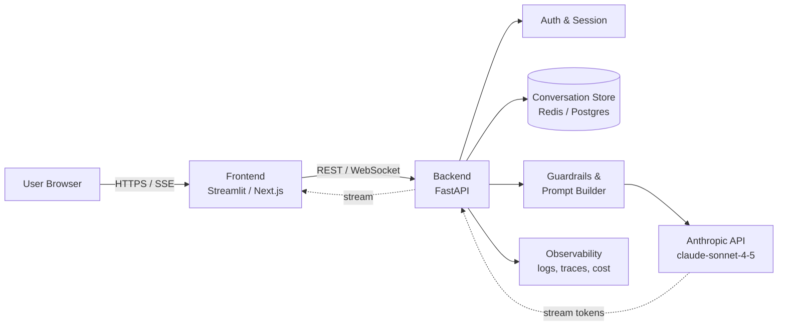

# Module 10 — Build AI Application

**Durasi**: 120 menit (60' materi + 60' lab walkthrough)
**Bagian dari**: Day 3 — AI App Development + RAG
**Lab terkait**: [lab-08-chat-app](./lab-08-chat-app/README.md)

---

## Learning Outcomes

Pada akhir module ini peserta akan mampu:

1. Menjelaskan **arsitektur referensi AI application** berbasis Claude (frontend, backend, state store, observability).
2. Mengimplementasikan **chat interface** dengan streaming dan pengelolaan conversation history.
3. Mengelola **session & context window** secara efisien (trimming, summarization, system prompt).
4. Memilih pola **frontend integration** yang sesuai (Streamlit untuk PoC, React/Next.js untuk produksi).
5. Menulis **backend AI integration** yang aman: secret handling, error handling, retry, timeout.

---

## 1. Konsep Inti

### 1.1 Mengapa "AI Application" bukan sekadar "wrap API"?

Banyak tim memulai dari "panggil endpoint Claude lalu tampilkan teks". Ini bekerja untuk demo, tapi tidak untuk produksi. AI application yang matang harus menjawab:

| Pertanyaan | Komponen |
|------------|----------|
| Siapa user, dan apa konteks percakapannya? | Session & auth |
| Bagaimana history disimpan dan dibatasi? | Context management |
| Apa yang terjadi saat API gagal/timeout/rate-limited? | Resilience layer |
| Bagaimana memantau quality, cost, dan latency? | Observability |
| Bagaimana respon model di-render incremental? | Streaming layer |

### 1.2 Arsitektur Referensi



Catatan penting:
- **Streaming** terjadi dua arah: dari Anthropic ke backend (SSE), lalu backend ke frontend (SSE/WebSocket).
- **History store** memisahkan state dari proses backend — penting saat scaling horizontal.
- **Prompt builder** adalah titik tunggal injeksi system prompt, tool definitions, dan (nanti) context RAG.

### 1.3 Lapisan State

| Lapisan | Isi | Lifetime | Contoh storage |
|---------|-----|----------|----------------|
| Ephemeral | Streaming buffer, partial token | per-request | RAM |
| Session | Conversation history, user prefs | jam — hari | Redis, Postgres |
| Long-term memory | Fact tentang user, ringkasan | minggu — selamanya | Vector DB + Postgres |
| Knowledge base | Dokumen perusahaan | bulan — selamanya | Vector DB (RAG) |

Pada module ini fokus pada **session** dan **long-term memory ringan**. Knowledge base dibahas di Module 11.

### 1.4 Context Window Management

Claude Sonnet 4.5 mendukung context window besar (≥ 200K token, varian 1M tersedia), tapi mengisi context dengan history mentah itu mahal dan lambat. Strategi yang umum:

1. **Sliding window** — simpan N pesan terakhir.
2. **Summarization** — ringkas history lama menjadi 1 system note.
3. **Hybrid** — N pesan terakhir + summary pesan sebelumnya.
4. **Retrieval over history** — embed history, retrieve yang relevan (lihat Module 11).

Aturan praktis: untuk chat assistant umum, sliding window 10–20 turn + summary cukup baik. Aktifkan **prompt caching** di system prompt agar bagian statis tidak dihitung ulang.

### 1.5 Frontend Integration: Pilihan

| Pilihan | Cocok untuk | Catatan |
|---------|-------------|---------|
| Streamlit | Internal tool, PoC, data team | Cepat, Python only, streaming OK |
| Gradio | Demo ML, research | Mudah share via space |
| Next.js + React | Produk customer-facing | Butuh state management, SSE/WebSocket |
| Slack/Teams bot | Internal assistant | Channel-level session, async |

Pola SSE (Server-Sent Events) lebih sederhana dari WebSocket untuk one-way streaming dari server ke client.

### 1.6 Backend AI Integration: Checklist

- Simpan API key di **environment variable** (`ANTHROPIC_API_KEY`), bukan di repo.
- Bungkus call dengan **timeout** (mis. 60s) dan **exponential backoff** untuk error 429/5xx.
- Log setiap request dengan: `request_id`, `model`, `input_tokens`, `output_tokens`, `latency_ms`, `cost_usd`.
- Pisahkan **system prompt** ke file (mis. `prompts/system.md`) agar reviewable.
- Gunakan **prompt caching** untuk system prompt statis & dokumen besar (TTL 5 menit).

---

## 2. Demo Live

Skenario: bangun chat app minimal dengan FastAPI + HTML, fitur streaming dan history.

**Langkah:**

1. **Setup proyek** — buat folder, virtualenv, install `anthropic`, `fastapi`, `uvicorn`.
2. **Backend `main.py`** — endpoint `POST /chat` menerima `{session_id, message}`, simpan history in-memory, kirim ke Claude dengan `stream=True`, kembalikan SSE.
3. **Frontend `index.html`** — input box, fetch ke `/chat`, render token streaming via `EventSource`.
4. **Tambah session reset** — endpoint `POST /reset/{session_id}` untuk demo "lupa percakapan".
5. **Tambah summarization** — saat history > 20 turn, panggil Haiku untuk ringkas 10 turn lama.

Fasilitator mendemokan langkah 1–3 live, lalu peserta replikasi di Lab 08 dan menambahkan langkah 4–5.

---

## 3. Contoh Konkret

### 3.1 Backend FastAPI dengan streaming

```python
# backend/main.py
import os
from collections import defaultdict
from fastapi import FastAPI
from fastapi.responses import StreamingResponse
from pydantic import BaseModel
from anthropic import Anthropic

client = Anthropic(api_key=os.environ["ANTHROPIC_API_KEY"])
app = FastAPI()

# In-memory store. Ganti dengan Redis untuk produksi.
SESSIONS: dict[str, list[dict]] = defaultdict(list)

SYSTEM_PROMPT = (
    "Anda adalah asisten internal Multimatics. "
    "Jawab singkat, terstruktur, dan dalam Bahasa Indonesia formal."
)

class ChatRequest(BaseModel):
    session_id: str
    message: str

@app.post("/chat")
def chat(req: ChatRequest):
    history = SESSIONS[req.session_id]
    history.append({"role": "user", "content": req.message})

    def event_stream():
        assistant_text = ""
        with client.messages.stream(
            model="claude-sonnet-4-5",
            max_tokens=1024,
            system=SYSTEM_PROMPT,
            messages=history,
        ) as stream:
            for text in stream.text_stream:
                assistant_text += text
                yield f"data: {text}\n\n"
        history.append({"role": "assistant", "content": assistant_text})
        yield "event: done\ndata: [END]\n\n"

    return StreamingResponse(event_stream(), media_type="text/event-stream")
```

### 3.2 Frontend HTML + JS (paralel)

```html
<!-- frontend/index.html -->
<input id="msg" placeholder="Tanya sesuatu..." />
<button onclick="send()">Kirim</button>
<pre id="out"></pre>
<script>
const sessionId = crypto.randomUUID();
async function send() {
  const msg = document.getElementById("msg").value;
  const res = await fetch("/chat", {
    method: "POST",
    headers: {"Content-Type": "application/json"},
    body: JSON.stringify({session_id: sessionId, message: msg}),
  });
  const reader = res.body.getReader();
  const dec = new TextDecoder();
  while (true) {
    const {value, done} = await reader.read();
    if (done) break;
    document.getElementById("out").textContent += dec.decode(value)
      .replace(/^data: /gm, "").replace(/\n\n/g, "");
  }
}
</script>
```

### 3.3 Summarization sliding-window

```python
def maybe_summarize(history: list[dict]) -> list[dict]:
    if len(history) <= 20:
        return history
    head, tail = history[:-10], history[-10:]
    convo = "\n".join(f"{m['role']}: {m['content']}" for m in head)
    summary = client.messages.create(
        model="claude-haiku-4-5",
        max_tokens=300,
        messages=[{"role": "user",
                   "content": f"Ringkas percakapan berikut <=150 kata:\n{convo}"}],
    ).content[0].text
    return [{"role": "user", "content": f"[Ringkasan sebelumnya]: {summary}"}] + tail
```

### 3.4 Error handling & retry

```python
from anthropic import APIError, RateLimitError
import time, random

def call_with_retry(**kwargs):
    for attempt in range(5):
        try:
            return client.messages.create(**kwargs)
        except RateLimitError:
            time.sleep((2 ** attempt) + random.random())
        except APIError as e:
            if e.status_code and 500 <= e.status_code < 600:
                time.sleep(2 ** attempt)
            else:
                raise
    raise RuntimeError("Gagal setelah 5 percobaan")
```

---

## 4. Hands-on Lab

[Lab 08 — Chat App](./lab-08-chat-app/README.md)

Peserta akan menyelesaikan: backend FastAPI + frontend, streaming, session reset, optional summarization. Estimasi 90 menit.

---

## 5. Wrap-up & Q&A

Pertanyaan refleksi:

1. Apa perbedaan kapasitas dan biaya antara menyimpan history 50 turn mentah vs sliding window + summary?
2. Kapan memilih Streamlit dibanding Next.js untuk frontend AI app?
3. Bagaimana Anda mendesain session store agar tahan terhadap restart backend?
4. Risiko apa yang muncul jika API key dipakai langsung di frontend? Bagaimana mitigasinya?
5. Bagaimana mengukur "kualitas" chat assistant, di luar latency dan biaya?

---

## 6. Bacaan Lanjutan

- Anthropic Docs — Messages API: <https://docs.anthropic.com/en/api/messages>
- Anthropic Docs — Streaming: <https://docs.anthropic.com/en/api/messages-streaming>
- Anthropic Docs — Prompt Caching: <https://docs.anthropic.com/en/docs/build-with-claude/prompt-caching>
- FastAPI Streaming Responses: <https://fastapi.tiangolo.com/advanced/custom-response/#streamingresponse>
- Streamlit Chat elements: <https://docs.streamlit.io/develop/api-reference/chat>
