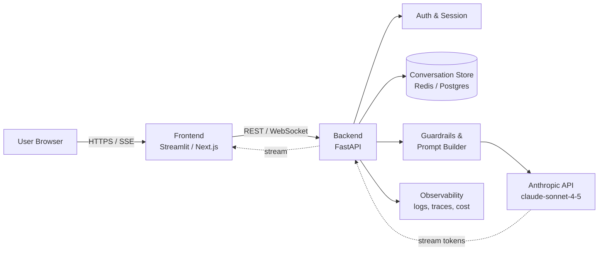

# Module 10 — Build AI Application

**Durasi belajar**: 120 menit (60' materi + 60' praktik lab)
**Bagian dari**: Day 3 — AI App Development + RAG
**Lab terkait**: [lab-08-chat-app](./lab-08-chat-app/README.md)

---

## Apa yang Akan Anda Bisa Setelah Modul Ini

Setelah selesai membaca dan mempraktikkan modul ini, Anda akan mampu:

1. Menjelaskan **arsitektur referensi AI application** berbasis Claude (frontend, backend, state store, observability).
2. Mengimplementasikan **chat interface** dengan streaming dan pengelolaan riwayat percakapan.
3. Mengelola **session & context window** secara efisien (trimming, summarization, system prompt).
4. Memilih pola **integrasi frontend** yang paling sesuai (Streamlit untuk PoC, React/Next.js untuk produksi).
5. Menulis **integrasi backend AI** yang aman: secret handling, error handling, retry, dan timeout.

---

## 1. Konsep Inti

### 1.1 Mengapa "AI Application" Bukan Sekadar "Wrap API"?

Banyak tim memulai perjalanan AI dengan pola sederhana: "panggil endpoint Claude lalu tampilkan teksnya". Pola ini cukup untuk demo, namun belum cukup untuk produksi. AI application yang matang perlu menjawab pertanyaan-pertanyaan berikut:

| Pertanyaan | Komponen |
|------------|----------|
| Siapa pengguna, dan apa konteks percakapannya? | Session & auth |
| Bagaimana riwayat percakapan disimpan dan dibatasi? | Context management |
| Apa yang terjadi ketika API gagal, timeout, atau terkena rate limit? | Resilience layer |
| Bagaimana memantau kualitas, biaya, dan latensi? | Observability |
| Bagaimana respons model ditampilkan secara bertahap (incremental)? | Streaming layer |

### 1.2 Arsitektur Referensi



Beberapa catatan penting yang perlu Anda perhatikan:

- **Streaming** terjadi dua arah: dari Anthropic ke backend (SSE), kemudian dari backend ke frontend (SSE/WebSocket).
- **History store** memisahkan state dari proses backend — hal ini menjadi penting saat Anda melakukan scaling horizontal.
- **Prompt builder** berperan sebagai titik tunggal untuk menyisipkan system prompt, definisi tool, dan (nanti) konteks RAG.

### 1.3 Lapisan State

| Lapisan | Isi | Lifetime | Contoh storage |
|---------|-----|----------|----------------|
| Ephemeral | Buffer streaming, partial token | per-request | RAM |
| Session | Riwayat percakapan, preferensi pengguna | jam — hari | Redis, Postgres |
| Long-term memory | Fakta tentang pengguna, ringkasan | minggu — selamanya | Vector DB + Postgres |
| Knowledge base | Dokumen perusahaan | bulan — selamanya | Vector DB (RAG) |

Pada modul ini, Anda akan fokus pada **session** dan **long-term memory ringan**. Knowledge base akan dibahas terpisah di Module 11.

### 1.4 Manajemen Context Window

Claude Sonnet 4.5 mendukung context window yang besar (≥ 200K token, dengan varian 1M token tersedia). Namun mengisi context dengan riwayat mentah secara membabi buta akan menjadi mahal dan lambat. Beberapa strategi umum yang dapat Anda terapkan:

1. **Sliding window** — menyimpan N pesan terakhir.
2. **Summarization** — meringkas riwayat lama menjadi satu catatan sistem.
3. **Hybrid** — N pesan terakhir digabung dengan ringkasan pesan sebelumnya.
4. **Retrieval over history** — embed riwayat, lalu retrieve bagian yang relevan saja (akan dibahas di Module 11).

Aturan praktis: untuk chat assistant umum, kombinasi sliding window 10–20 turn + summary biasanya sudah cukup baik. Aktifkan juga **prompt caching** pada system prompt agar bagian statis tidak dihitung ulang setiap kali.

### 1.5 Pilihan Integrasi Frontend

| Pilihan | Cocok untuk | Catatan |
|---------|-------------|---------|
| Streamlit | Internal tool, PoC, tim data | Cepat, Python saja, streaming didukung |
| Gradio | Demo ML, riset | Mudah dibagikan via Hugging Face Space |
| Next.js + React | Produk customer-facing | Memerlukan state management, SSE/WebSocket |
| Bot Slack/Teams | Asisten internal | Session per channel, asinkron |

Pola SSE (Server-Sent Events) cenderung lebih sederhana dibandingkan WebSocket untuk kebutuhan streaming satu arah dari server ke client.

### 1.6 Checklist Integrasi Backend AI

- Simpan API key di **environment variable** (`ANTHROPIC_API_KEY`), jangan disimpan di repo.
- Bungkus pemanggilan API dengan **timeout** (misalnya 60 detik) dan **exponential backoff** untuk error 429/5xx.
- Catat setiap request dengan informasi: `request_id`, `model`, `input_tokens`, `output_tokens`, `latency_ms`, `cost_usd`.
- Pisahkan **system prompt** ke dalam file tersendiri (misalnya `prompts/system.md`) agar mudah ditinjau.
- Manfaatkan **prompt caching** untuk system prompt yang statis serta dokumen besar (TTL 5 menit).

---

## 2. Praktik Mandiri

Skenario: Anda akan membangun chat app minimal dengan FastAPI + HTML, lengkap dengan fitur streaming dan history.

**Langkah-langkah:**

1. **Siapkan proyek** — buat folder, virtualenv, lalu pasang `anthropic`, `fastapi`, dan `uvicorn`.
2. **Backend `main.py`** — buat endpoint `POST /chat` yang menerima `{session_id, message}`, menyimpan riwayat di memori, mengirim ke Claude dengan `stream=True`, lalu mengembalikan respons SSE.
3. **Frontend `index.html`** — buat input box, lakukan fetch ke `/chat`, dan render token streaming melalui `EventSource`.
4. **Tambahkan session reset** — endpoint `POST /reset/{session_id}` untuk mendemonstrasikan fitur "lupa percakapan".
5. **Tambahkan summarization** — ketika riwayat melebihi 20 turn, panggil Haiku untuk meringkas 10 turn lama.

Anda dapat melakukan langkah 1–3 terlebih dahulu sebagai latihan dasar, kemudian mengembangkannya di Lab 08 dengan menambahkan langkah 4–5.

---

## 3. Contoh Konkret

### 3.1 Backend FastAPI dengan Streaming

```python
# backend/main.py
import os
from collections import defaultdict
from fastapi import FastAPI
from fastapi.responses import StreamingResponse
from pydantic import BaseModel
from anthropic import Anthropic

client = Anthropic(api_key=os.environ["ANTHROPIC_API_KEY"])
app = FastAPI()

# In-memory store. Ganti dengan Redis untuk produksi.
SESSIONS: dict[str, list[dict]] = defaultdict(list)

SYSTEM_PROMPT = (
    "Anda adalah asisten internal Multimatics. "
    "Jawab singkat, terstruktur, dan dalam Bahasa Indonesia formal."
)

class ChatRequest(BaseModel):
    session_id: str
    message: str

@app.post("/chat")
def chat(req: ChatRequest):
    history = SESSIONS[req.session_id]
    history.append({"role": "user", "content": req.message})

    def event_stream():
        assistant_text = ""
        with client.messages.stream(
            model="claude-sonnet-4-5",
            max_tokens=1024,
            system=SYSTEM_PROMPT,
            messages=history,
        ) as stream:
            for text in stream.text_stream:
                assistant_text += text
                yield f"data: {text}\n\n"
        history.append({"role": "assistant", "content": assistant_text})
        yield "event: done\ndata: [END]\n\n"

    return StreamingResponse(event_stream(), media_type="text/event-stream")
```

### 3.2 Frontend HTML + JS (paralel)

```html
<!-- frontend/index.html -->
<input id="msg" placeholder="Tanya sesuatu..." />
<button onclick="send()">Kirim</button>
<pre id="out"></pre>
<script>
const sessionId = crypto.randomUUID();
async function send() {
  const msg = document.getElementById("msg").value;
  const res = await fetch("/chat", {
    method: "POST",
    headers: {"Content-Type": "application/json"},
    body: JSON.stringify({session_id: sessionId, message: msg}),
  });
  const reader = res.body.getReader();
  const dec = new TextDecoder();
  while (true) {
    const {value, done} = await reader.read();
    if (done) break;
    document.getElementById("out").textContent += dec.decode(value)
      .replace(/^data: /gm, "").replace(/\n\n/g, "");
  }
}
</script>
```

### 3.3 Summarization Sliding-Window

```python
def maybe_summarize(history: list[dict]) -> list[dict]:
    if len(history) <= 20:
        return history
    head, tail = history[:-10], history[-10:]
    convo = "\n".join(f"{m['role']}: {m['content']}" for m in head)
    summary = client.messages.create(
        model="claude-haiku-4-5",
        max_tokens=300,
        messages=[{"role": "user",
                   "content": f"Ringkas percakapan berikut <=150 kata:\n{convo}"}],
    ).content[0].text
    return [{"role": "user", "content": f"[Ringkasan sebelumnya]: {summary}"}] + tail
```

### 3.4 Error Handling & Retry

```python
from anthropic import APIError, RateLimitError
import time, random

def call_with_retry(**kwargs):
    for attempt in range(5):
        try:
            return client.messages.create(**kwargs)
        except RateLimitError:
            time.sleep((2 ** attempt) + random.random())
        except APIError as e:
            if e.status_code and 500 <= e.status_code < 600:
                time.sleep(2 ** attempt)
            else:
                raise
    raise RuntimeError("Gagal setelah 5 percobaan")
```

---

## 4. Hands-on Lab

[Lab 08 — Chat App](./lab-08-chat-app/README.md)

Di lab ini, Anda akan menyelesaikan: backend FastAPI + frontend, streaming, session reset, serta summarization (opsional). Estimasi waktu pengerjaan sekitar 90 menit.

---

## 5. Latihan & Refleksi

Sebelum melanjutkan ke Module 11, sempatkan diri Anda untuk merenungkan pertanyaan-pertanyaan berikut:

1. Apa perbedaan kapasitas dan biaya antara menyimpan riwayat 50 turn mentah dibandingkan menggunakan sliding window + summary?
2. Kapan sebaiknya Anda memilih Streamlit dibandingkan Next.js untuk frontend AI app?
3. Bagaimana Anda akan mendesain session store agar tetap andal saat backend di-restart?
4. Risiko apa yang muncul jika API key digunakan langsung di sisi frontend? Bagaimana cara Anda memitigasinya?
5. Bagaimana cara mengukur "kualitas" sebuah chat assistant, di luar metrik latensi dan biaya?

---

## 6. Bacaan Lanjutan

- Anthropic Docs — Messages API: <https://docs.anthropic.com/en/api/messages>
- Anthropic Docs — Streaming: <https://docs.anthropic.com/en/api/messages-streaming>
- Anthropic Docs — Prompt Caching: <https://docs.anthropic.com/en/docs/build-with-claude/prompt-caching>
- FastAPI Streaming Responses: <https://fastapi.tiangolo.com/advanced/custom-response/#streamingresponse>
- Streamlit Chat elements: <https://docs.streamlit.io/develop/api-reference/chat>
