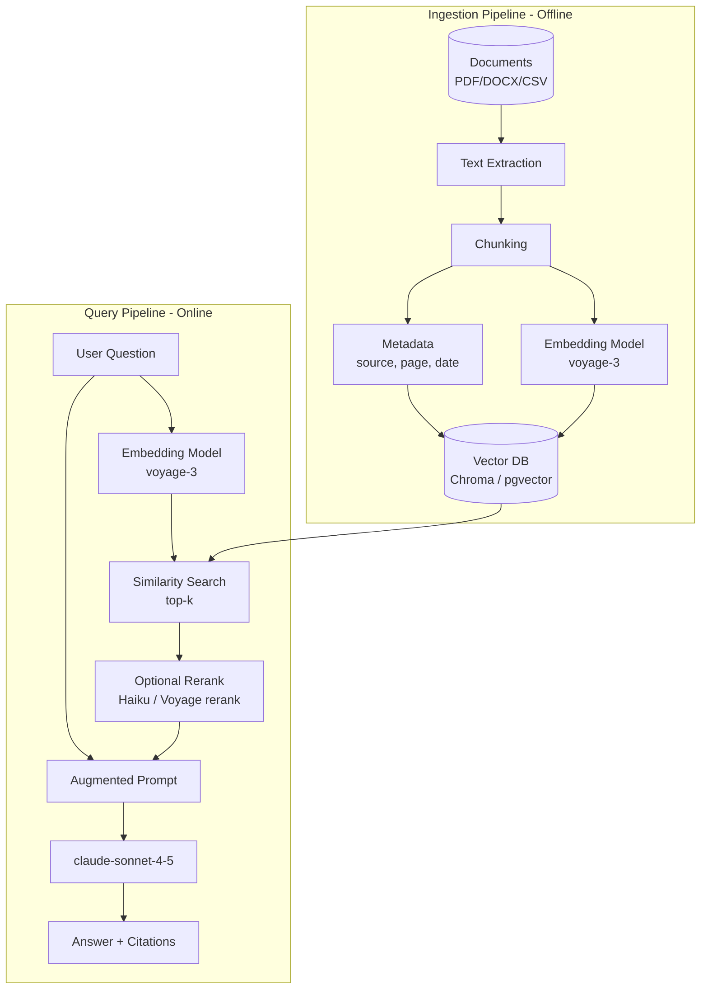

# Module 11 — Retrieval Augmented Generation (RAG)

**Durasi**: 120 menit (60' materi + 60' lab 09 & 10)
**Bagian dari**: Day 3 — AI App Development + RAG
**Lab terkait**: [lab-09-rag-pipeline](./lab-09-rag-pipeline/README.md), [lab-10-document-ingestion](./lab-10-document-ingestion/README.md)

---

## Learning Outcomes

Pada akhir module ini peserta akan mampu:

1. Menjelaskan **arsitektur RAG** end-to-end dan kapan RAG lebih tepat daripada fine-tuning atau long-context.
2. Memilih **embedding model** dan **vector database** sesuai use case (lokal, cloud, skala).
3. Mengimplementasikan **chunking strategy** dan **metadata enrichment** yang baik.
4. Membangun **semantic search** dan menggabungkan hasilnya menjadi **augmented prompt** untuk Claude.
5. Mendiagnosis masalah umum RAG: irrelevant retrieval, hallucination, stale data.

---

## 1. Konsep Inti

### 1.1 Mengapa RAG?

Claude memiliki pengetahuan luas dari pre-training, tapi:

- Tidak tahu **data privat perusahaan** (kebijakan HR, kontrak, riwayat tiket).
- Tidak tahu **informasi terbaru** setelah cutoff.
- Tidak bisa **mengutip sumber** dengan presisi.

Tiga pendekatan untuk mengatasi:

| Pendekatan | Kapan dipakai | Kelemahan |
|------------|---------------|-----------|
| **Long context** (stuff semua dokumen ke prompt) | Dokumen kecil (<200K token), 1–2 dokumen | Mahal, lambat, tidak skalabel |
| **Fine-tuning** | Style/tone khusus, schema output | Mahal, butuh data berlabel, sulit update |
| **RAG** | Knowledge base besar, sering update, butuh sitasi | Butuh infra vector DB, retrieval quality penting |

RAG menjadi **default** untuk knowledge grounding di enterprise.

### 1.2 Arsitektur RAG



Dua pipeline berbeda: **ingestion** (offline, batch) dan **query** (online, latency-sensitive). Embedding model harus **konsisten** di kedua sisi.

### 1.3 Embeddings: Fundamental

Embedding = representasi vektor (mis. 1024 dimensi) yang menempatkan teks bermakna mirip berdekatan dalam ruang vektor.

| Model | Dimensi | Catatan |
|-------|---------|---------|
| **voyage-3** | 1024 | Mitra resmi Anthropic, kualitas tinggi, multilingual |
| **voyage-3-lite** | 512 | Lebih murah, cocok skala besar |
| **OpenAI text-embedding-3-small** | 1536 | Mainstream, dokumentasi banyak |
| **sentence-transformers/all-MiniLM-L6-v2** | 384 | Open-source, gratis, offline |
| **intfloat/multilingual-e5-large** | 1024 | Open-source, multilingual termasuk Indonesia |

> **Penting**: Anthropic tidak menyediakan model embedding sendiri. Voyage AI adalah rekomendasi resmi.

Aturan:
- Embedding model di ingestion **harus sama** dengan di query.
- Ganti model = re-embed seluruh corpus.
- Untuk Bahasa Indonesia, hindari model English-only.

### 1.4 Vector Database

| Pilihan | Mode | Kelebihan | Kekurangan |
|---------|------|-----------|------------|
| **Chroma** | Lokal/embedded | Setup 1 baris, cocok PoC | Tidak production-scale tanpa server mode |
| **pgvector** | Postgres extension | Sudah ada Postgres? Reuse | Setup index HNSW butuh tuning |
| **Pinecone** | Cloud managed | Skalabel, no-ops | Vendor lock-in, biaya |
| **Weaviate** | Self-host / cloud | Hybrid search built-in | Operasional kompleks |
| **Qdrant** | Self-host / cloud | Cepat, filtering kuat | Komunitas lebih kecil dari Pinecone |

Default Day 3: **Chroma** untuk lab cepat, **pgvector** sebagai jalur produksi.

### 1.5 Chunking Strategy

Kunci kualitas RAG. Buruk chunking = buruk retrieval.

| Strategi | Cara | Cocok untuk |
|----------|------|-------------|
| **Fixed-size** | N karakter/token + overlap | Dokumen seragam (laporan, manual) |
| **Recursive** | Pecah by separator hierarkis (`\n\n`, `\n`, `. `) | Dokumen prose campuran |
| **Semantic** | Pecah saat similarity antar kalimat turun | Dokumen panjang dengan section beragam |
| **By structure** | Pecah by heading/halaman | PDF terstruktur, dokumen legal |

Rule of thumb:
- Ukuran chunk: 300–800 token.
- Overlap: 10–20% dari ukuran chunk.
- Sertakan **konteks header** di awal chunk (nama dokumen, section).

### 1.6 Metadata Enrichment

Setiap chunk simpan metadata: `source`, `page`, `section`, `date`, `author`, `doc_type`, `confidentiality`. Manfaat:

- **Filter** retrieval (mis. hanya dokumen HR yang masih berlaku).
- **Sitasi** di output ("Sumber: Kebijakan Cuti 2025, hal. 3").
- **Audit** dan **access control**.

### 1.7 Semantic Search & Augmented Prompt

Flow:

1. User question → embed → query vector DB → top-k chunks (k = 3–8).
2. (Opsional) Rerank top-k dengan model yang lebih kuat (mis. Voyage rerank atau Claude Haiku).
3. Susun prompt: system instruction + context chunks (dengan label sumber) + user question.
4. Instruksi eksplisit: "Jawab hanya berdasar context. Jika tidak ada, katakan tidak tahu. Sertakan sitasi."

### 1.8 Anti-pola dan Mitigasi

| Anti-pola | Gejala | Mitigasi |
|-----------|--------|----------|
| Chunk terlalu kecil | Konteks pecah, jawaban incomplete | Naikkan ukuran + overlap |
| Chunk terlalu besar | Retrieval tidak presisi, mahal | Turunkan ukuran |
| Tidak ada metadata | Sulit audit & filter | Tambah saat ingestion |
| Top-k terlalu besar | Token mahal, noise | k=4–6 + rerank |
| Tidak ada eval | "Jawaban kelihatan oke" | Buat golden set 30–50 Q&A |

---

## 2. Demo Live

Skenario: ingest 3 dokumen HR (PDF, DOCX, CSV) ke Chroma, lalu tanya via Claude.

**Langkah:**

1. **Ingestion** — load dokumen dengan `pypdf` / `python-docx` / `pandas`, ekstrak teks per halaman/baris.
2. **Chunking** — recursive splitter 500 token + 50 overlap, sertakan metadata source & page.
3. **Embed & store** — embed dengan `voyage-3`, simpan ke Chroma collection `hr_docs`.
4. **Query** — pertanyaan: "Berapa hari cuti tahunan karyawan tetap?". Tampilkan top-5 chunks dengan skor.
5. **Augmented answer** — kirim ke `claude-sonnet-4-5` dengan instruksi sitasi.

---

## 3. Contoh Konkret

### 3.1 Embedding dengan Voyage

```python
import voyageai
vo = voyageai.Client()  # pakai VOYAGE_API_KEY

def embed(texts: list[str], input_type: str = "document") -> list[list[float]]:
    # input_type: "document" untuk ingestion, "query" untuk pencarian
    result = vo.embed(texts, model="voyage-3", input_type=input_type)
    return result.embeddings
```

Alternatif offline:

```python
from sentence_transformers import SentenceTransformer
model = SentenceTransformer("intfloat/multilingual-e5-large")
def embed(texts): return model.encode(texts).tolist()
```

### 3.2 Chunking recursive

```python
from typing import Iterable

def recursive_chunk(text: str, max_chars: int = 1500, overlap: int = 200) -> list[str]:
    seps = ["\n\n", "\n", ". ", " "]
    def _split(t, depth=0):
        if len(t) <= max_chars or depth == len(seps):
            return [t]
        parts = t.split(seps[depth])
        buf, out = "", []
        for p in parts:
            cand = (buf + seps[depth] + p) if buf else p
            if len(cand) > max_chars and buf:
                out.append(buf); buf = p
            else:
                buf = cand
        if buf: out.append(buf)
        return [c for piece in out for c in _split(piece, depth+1)]
    raw = _split(text)
    # tambah overlap
    out = []
    for i, c in enumerate(raw):
        prefix = raw[i-1][-overlap:] if i > 0 else ""
        out.append((prefix + c).strip())
    return out
```

### 3.3 Simpan ke Chroma

```python
import chromadb
client_db = chromadb.PersistentClient(path="./chroma_db")
col = client_db.get_or_create_collection("hr_docs", metadata={"hnsw:space": "cosine"})

def upsert(chunks: list[str], metadatas: list[dict], ids: list[str]):
    embs = embed(chunks, input_type="document")
    col.upsert(ids=ids, embeddings=embs, documents=chunks, metadatas=metadatas)
```

### 3.4 Retrieve & augment Claude

```python
from anthropic import Anthropic
client = Anthropic()

def rag_answer(question: str, k: int = 5) -> str:
    q_emb = embed([question], input_type="query")[0]
    res = col.query(query_embeddings=[q_emb], n_results=k)
    chunks = res["documents"][0]
    metas = res["metadatas"][0]
    context = "\n\n".join(
        f"[Sumber: {m['source']} hal.{m.get('page','-')}]\n{c}"
        for c, m in zip(chunks, metas)
    )
    msg = client.messages.create(
        model="claude-sonnet-4-5",
        max_tokens=800,
        system=(
            "Anda asisten HR. Jawab HANYA berdasarkan KONTEKS. "
            "Jika tidak ada di konteks, katakan 'Saya tidak menemukan informasi tersebut'. "
            "Sertakan sitasi dalam format [Sumber: ...]."
        ),
        messages=[{"role": "user",
                   "content": f"KONTEKS:\n{context}\n\nPERTANYAAN: {question}"}],
    )
    return msg.content[0].text
```

### 3.5 Rerank ringan dengan Haiku (opsional)

```python
def rerank(question, candidates: list[str]) -> list[int]:
    listing = "\n".join(f"[{i}] {c[:300]}" for i, c in enumerate(candidates))
    prompt = (f"Urutkan kandidat dari paling relevan untuk pertanyaan.\n"
              f"Pertanyaan: {question}\nKandidat:\n{listing}\n"
              "Balas hanya daftar index dipisah koma.")
    out = client.messages.create(
        model="claude-haiku-4-5", max_tokens=100,
        messages=[{"role":"user","content":prompt}]
    ).content[0].text
    return [int(x) for x in out.replace(" ", "").split(",") if x.isdigit()]
```

---

## 4. Hands-on Lab

- [Lab 09 — RAG Pipeline](./lab-09-rag-pipeline/README.md): full pipeline chunk → embed → store → retrieve → answer.
- [Lab 10 — Document Ingestion](./lab-10-document-ingestion/README.md): fokus ekstraksi multi-format (PDF/DOCX/CSV) + chunking strategi.

---

## 5. Wrap-up & Q&A

1. Kapan Anda akan memilih long-context dibanding RAG?
2. Apa risiko mengganti embedding model di tengah jalan?
3. Bagaimana mengevaluasi kualitas RAG secara obyektif?
4. Apa peran metadata dalam access control RAG?
5. Bagaimana menangani user query yang tidak ada jawabannya di knowledge base?

---

## 6. Bacaan Lanjutan

- Anthropic — Contextual Retrieval: <https://www.anthropic.com/news/contextual-retrieval>
- Voyage AI Docs: <https://docs.voyageai.com/>
- Chroma Docs: <https://docs.trychroma.com/>
- pgvector: <https://github.com/pgvector/pgvector>
- Pinecone Learning Center: <https://www.pinecone.io/learn/>
- Anthropic Cookbook — RAG: <https://github.com/anthropics/anthropic-cookbook>
