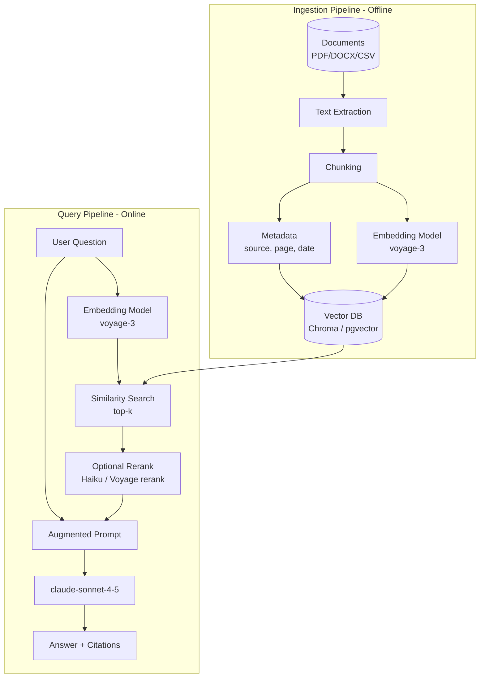

# Module 11 — Retrieval Augmented Generation (RAG)

**Durasi belajar**: 120 menit (60' materi + 60' praktik lab 09 & 10)
**Bagian dari**: Day 3 — AI App Development + RAG
**Lab terkait**: [lab-09-rag-pipeline](./lab-09-rag-pipeline/README.md), [lab-10-document-ingestion](./lab-10-document-ingestion/README.md)

---

## Apa yang Akan Anda Bisa Setelah Modul Ini

Setelah selesai membaca dan mempraktikkan modul ini, Anda akan mampu:

1. Menjelaskan **arsitektur RAG** *(Retrieval-Augmented Generation — teknik menggabungkan pencarian dokumen dengan generasi jawaban)* end-to-end, sekaligus mengetahui kapan RAG lebih tepat dipilih dibandingkan fine-tuning atau long-context.
2. Memilih **embedding model** *(model yang mengubah teks menjadi vektor angka)* dan **vector database** *(basis data yang menyimpan vektor)* yang sesuai untuk use case Anda (lokal, cloud, atau skala besar).
3. Mengimplementasikan **chunking strategy** *(strategi memecah dokumen menjadi potongan-potongan kecil)* dan **metadata enrichment** yang baik.
4. Membangun **semantic search** dan menggabungkan hasilnya menjadi **augmented prompt** untuk Claude.
5. Mendiagnosis masalah-masalah umum pada RAG: retrieval yang tidak relevan, halusinasi, dan data yang sudah usang.

---

## 1. Konsep Inti

### 1.1 Mengapa RAG?

Claude memiliki pengetahuan yang luas dari pre-training, namun:

- Claude tidak mengetahui **data privat perusahaan Anda** (kebijakan HR, kontrak, riwayat tiket).
- Claude tidak mengetahui **informasi terbaru** setelah tanggal cutoff pelatihannya.
- Claude tidak dapat **mengutip sumber** dengan presisi tinggi.

Untuk mengatasi ketiga keterbatasan ini, terdapat tiga pendekatan utama yang dapat Anda pilih:

| Pendekatan | Kapan dipakai | Kelemahan |
|------------|---------------|-----------|
| **Long context** (memasukkan seluruh dokumen ke dalam prompt) | Dokumen kecil (<200K token), hanya 1–2 dokumen | Mahal, lambat, dan tidak skalabel |
| **Fine-tuning** | Style/tone khusus, schema output | Mahal, butuh data berlabel, sulit di-update |
| **RAG** | Knowledge base besar, sering ter-update, butuh sitasi | Memerlukan infrastruktur vector DB; kualitas retrieval menjadi krusial |

Untuk kebutuhan knowledge grounding di lingkungan enterprise, RAG umumnya menjadi pilihan **default**.

### 1.2 Arsitektur RAG



Terdapat dua pipeline yang terpisah: **ingestion** (berjalan offline, secara batch) dan **query** (berjalan online, sensitif terhadap latensi). Embedding model yang Anda gunakan harus **konsisten** di kedua sisi.

### 1.3 Embeddings: Fundamental

Embedding adalah representasi vektor (misalnya berukuran 1024 dimensi) yang menempatkan teks-teks bermakna serupa pada posisi yang berdekatan dalam ruang vektor.

| Model | Dimensi | Catatan |
|-------|---------|---------|
| **voyage-3** | 1024 | Mitra resmi Anthropic, kualitas tinggi, multibahasa |
| **voyage-3-lite** | 512 | Lebih ekonomis, cocok untuk skala besar |
| **OpenAI text-embedding-3-small** | 1536 | Mainstream, dokumentasinya banyak |
| **sentence-transformers/all-MiniLM-L6-v2** | 384 | Open-source, gratis, dapat dijalankan offline |
| **intfloat/multilingual-e5-large** | 1024 | Open-source, multibahasa termasuk Bahasa Indonesia |

> **Penting**: Anthropic tidak menyediakan model embedding sendiri. Voyage AI adalah rekomendasi resmi mereka.

Aturan yang perlu Anda pegang:

- Embedding model pada tahap ingestion **harus sama** dengan yang Anda gunakan pada tahap query.
- Jika Anda mengganti model, Anda perlu melakukan re-embed pada seluruh corpus.
- Untuk Bahasa Indonesia, hindari model yang hanya mendukung bahasa Inggris.

### 1.4 Vector Database

| Pilihan | Mode | Kelebihan | Kekurangan |
|---------|------|-----------|------------|
| **Chroma** | Lokal/embedded | Setup hanya 1 baris, cocok untuk PoC | Belum siap untuk skala produksi tanpa mode server |
| **pgvector** | Ekstensi Postgres | Cocok jika Anda sudah menggunakan Postgres | Setup index HNSW memerlukan tuning |
| **Pinecone** | Cloud terkelola | Skalabel, tanpa beban operasional | Vendor lock-in, biaya berjalan |
| **Weaviate** | Self-host / cloud | Hybrid search bawaan | Operasional cukup kompleks |
| **Qdrant** | Self-host / cloud | Cepat, kemampuan filtering kuat | Komunitas lebih kecil dibanding Pinecone |

Pilihan default pada Day 3: **Chroma** untuk lab cepat, dan **pgvector** sebagai jalur menuju produksi.

### 1.5 Strategi Chunking

Chunking merupakan kunci kualitas RAG. Chunking yang buruk akan menghasilkan retrieval yang buruk pula.

| Strategi | Cara kerja | Cocok untuk |
|----------|-----------|-------------|
| **Fixed-size** | N karakter/token dengan overlap | Dokumen seragam (laporan, manual) |
| **Recursive** | Pecah berdasarkan separator hierarkis (`\n\n`, `\n`, `. `) | Dokumen prosa campuran |
| **Semantic** | Pecah saat kemiripan antar kalimat menurun | Dokumen panjang dengan section beragam |
| **By structure** | Pecah berdasarkan heading/halaman | PDF terstruktur, dokumen legal |

Aturan praktis yang dapat Anda jadikan acuan:

- Ukuran chunk: 300–800 token.
- Overlap: 10–20% dari ukuran chunk.
- Sertakan **konteks header** di awal setiap chunk (nama dokumen, section).

### 1.6 Metadata Enrichment

Untuk setiap chunk, simpan metadata seperti: `source`, `page`, `section`, `date`, `author`, `doc_type`, dan `confidentiality`. Manfaatnya antara lain:

- Memudahkan **filter** retrieval (misalnya hanya dokumen HR yang masih berlaku).
- Mendukung **sitasi** pada output ("Sumber: Kebijakan Cuti 2025, hal. 3").
- Mempermudah **audit** dan **access control**.

### 1.7 Semantic Search & Augmented Prompt

Alur kerjanya sebagai berikut:

1. Pertanyaan pengguna → embed → query ke vector DB → ambil top-k chunks (k = 3–8).
2. (Opsional) Rerank top-k menggunakan model yang lebih kuat (misalnya Voyage rerank atau Claude Haiku).
3. Susun prompt yang berisi: instruksi sistem + chunk konteks (dengan label sumber) + pertanyaan pengguna.
4. Sampaikan instruksi yang eksplisit: "Jawab hanya berdasarkan context. Jika tidak ada, katakan tidak tahu. Sertakan sitasi."

### 1.8 Anti-pola dan Mitigasinya

| Anti-pola | Gejala | Mitigasi |
|-----------|--------|----------|
| Chunk terlalu kecil | Konteks terpecah, jawaban tidak lengkap | Perbesar ukuran + overlap |
| Chunk terlalu besar | Retrieval kurang presisi, biaya naik | Perkecil ukuran chunk |
| Tidak ada metadata | Sulit diaudit dan difilter | Tambahkan metadata pada saat ingestion |
| Top-k terlalu besar | Token boros, banyak noise | Gunakan k=4–6 + rerank |
| Tidak ada evaluasi | "Jawabannya kelihatan baik-baik saja" | Buat golden set berisi 30–50 Q&A |

---

## 2. Praktik Mandiri

Skenario: Anda akan melakukan ingest terhadap 3 dokumen HR (PDF, DOCX, CSV) ke Chroma, kemudian mengajukan pertanyaan melalui Claude.

**Langkah-langkah:**

1. **Ingestion** — muat dokumen menggunakan `pypdf` / `python-docx` / `pandas`, lalu ekstrak teks per halaman atau per baris.
2. **Chunking** — gunakan recursive splitter dengan ukuran 500 token + overlap 50, sertakan metadata sumber dan halaman.
3. **Embed & store** — lakukan embedding dengan `voyage-3`, kemudian simpan ke collection Chroma bernama `hr_docs`.
4. **Query** — ajukan pertanyaan: "Berapa hari cuti tahunan karyawan tetap?". Tampilkan top-5 chunks beserta skornya.
5. **Augmented answer** — kirim hasil retrieval ke `claude-sonnet-4-5` disertai instruksi untuk memberikan sitasi.

---

## 3. Contoh Konkret

### 3.1 Embedding dengan Voyage

```python
import voyageai
vo = voyageai.Client()  # menggunakan VOYAGE_API_KEY

def embed(texts: list[str], input_type: str = "document") -> list[list[float]]:
    # input_type: "document" untuk ingestion, "query" untuk pencarian
    result = vo.embed(texts, model="voyage-3", input_type=input_type)
    return result.embeddings
```

Alternatif offline:

```python
from sentence_transformers import SentenceTransformer
model = SentenceTransformer("intfloat/multilingual-e5-large")
def embed(texts): return model.encode(texts).tolist()
```

### 3.2 Chunking Recursive

```python
from typing import Iterable

def recursive_chunk(text: str, max_chars: int = 1500, overlap: int = 200) -> list[str]:
    seps = ["\n\n", "\n", ". ", " "]
    def _split(t, depth=0):
        if len(t) <= max_chars or depth == len(seps):
            return [t]
        parts = t.split(seps[depth])
        buf, out = "", []
        for p in parts:
            cand = (buf + seps[depth] + p) if buf else p
            if len(cand) > max_chars and buf:
                out.append(buf); buf = p
            else:
                buf = cand
        if buf: out.append(buf)
        return [c for piece in out for c in _split(piece, depth+1)]
    raw = _split(text)
    # tambahkan overlap
    out = []
    for i, c in enumerate(raw):
        prefix = raw[i-1][-overlap:] if i > 0 else ""
        out.append((prefix + c).strip())
    return out
```

### 3.3 Menyimpan ke Chroma

```python
import chromadb
client_db = chromadb.PersistentClient(path="./chroma_db")
col = client_db.get_or_create_collection("hr_docs", metadata={"hnsw:space": "cosine"})

def upsert(chunks: list[str], metadatas: list[dict], ids: list[str]):
    embs = embed(chunks, input_type="document")
    col.upsert(ids=ids, embeddings=embs, documents=chunks, metadatas=metadatas)
```

### 3.4 Retrieve & Augment Claude

```python
from anthropic import Anthropic
client = Anthropic()

def rag_answer(question: str, k: int = 5) -> str:
    q_emb = embed([question], input_type="query")[0]
    res = col.query(query_embeddings=[q_emb], n_results=k)
    chunks = res["documents"][0]
    metas = res["metadatas"][0]
    context = "\n\n".join(
        f"[Sumber: {m['source']} hal.{m.get('page','-')}]\n{c}"
        for c, m in zip(chunks, metas)
    )
    msg = client.messages.create(
        model="claude-sonnet-4-5",
        max_tokens=800,
        system=(
            "Anda asisten HR. Jawab HANYA berdasarkan KONTEKS. "
            "Jika tidak ada di konteks, katakan 'Saya tidak menemukan informasi tersebut'. "
            "Sertakan sitasi dalam format [Sumber: ...]."
        ),
        messages=[{"role": "user",
                   "content": f"KONTEKS:\n{context}\n\nPERTANYAAN: {question}"}],
    )
    return msg.content[0].text
```

### 3.5 Rerank Ringan dengan Haiku (opsional)

```python
def rerank(question, candidates: list[str]) -> list[int]:
    listing = "\n".join(f"[{i}] {c[:300]}" for i, c in enumerate(candidates))
    prompt = (f"Urutkan kandidat dari paling relevan untuk pertanyaan.\n"
              f"Pertanyaan: {question}\nKandidat:\n{listing}\n"
              "Balas hanya daftar index dipisah koma.")
    out = client.messages.create(
        model="claude-haiku-4-5", max_tokens=100,
        messages=[{"role":"user","content":prompt}]
    ).content[0].text
    return [int(x) for x in out.replace(" ", "").split(",") if x.isdigit()]
```

---

## 4. Hands-on Lab

- [Lab 09 — RAG Pipeline](./lab-09-rag-pipeline/README.md): Anda akan membangun pipeline lengkap chunk → embed → store → retrieve → answer.
- [Lab 10 — Document Ingestion](./lab-10-document-ingestion/README.md): Anda akan berfokus pada ekstraksi multi-format (PDF/DOCX/CSV) dan strategi chunking.

---

## 5. Latihan & Refleksi

Setelah menyelesaikan modul ini, coba renungkan pertanyaan-pertanyaan berikut:

1. Kapan Anda akan memilih long-context dibandingkan RAG?
2. Apa saja risiko yang muncul jika Anda mengganti embedding model di tengah jalan?
3. Bagaimana cara mengevaluasi kualitas RAG secara obyektif?
4. Apa peran metadata dalam access control pada RAG?
5. Bagaimana Anda akan menangani query pengguna yang jawabannya tidak tersedia di knowledge base?

---

## 6. Bacaan Lanjutan

- Anthropic — Contextual Retrieval: <https://www.anthropic.com/news/contextual-retrieval>
- Voyage AI Docs: <https://docs.voyageai.com/>
- Chroma Docs: <https://docs.trychroma.com/>
- pgvector: <https://github.com/pgvector/pgvector>
- Pinecone Learning Center: <https://www.pinecone.io/learn/>
- Anthropic Cookbook — RAG: <https://github.com/anthropics/anthropic-cookbook>
