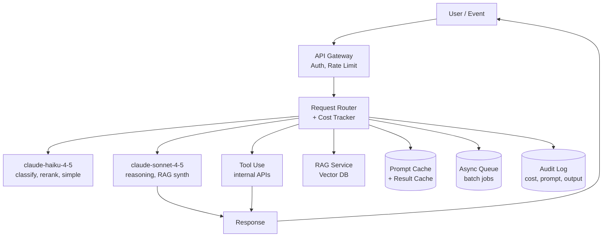
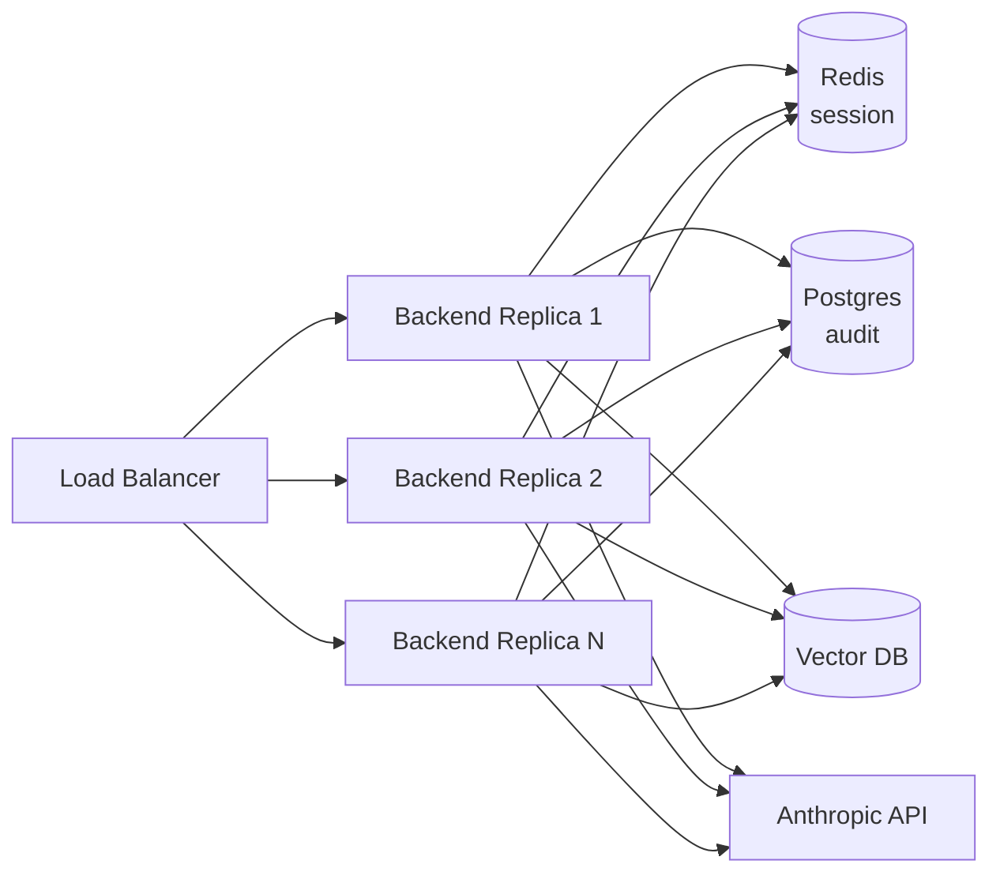

# Module 12 — Advanced AI Applications

**Durasi**: 90 menit (45' materi + 45' lab walkthrough)
**Bagian dari**: Day 3 — AI App Development + RAG
**Lab terkait**: [lab-11-enterprise-ai-assistant](./lab-11-enterprise-ai-assistant/README.md)

---

## Learning Outcomes

Pada akhir module ini peserta akan mampu:

1. Mendesain **Enterprise AI Assistant** yang menggabungkan chat, RAG, dan tool use.
2. Mengidentifikasi pola **AI internal assistant, knowledge management, dan automation system**.
3. Menerapkan **performance optimization** (caching, batching, parallelisasi, streaming).
4. Menerapkan **cost optimization** (model routing, prompt caching, message batches, output budget).
5. Mendesain strategi **scaling** AI application: stateless backend, queue, autoscaling, observability.

---

## 1. Konsep Inti

### 1.1 Tiga Pola Enterprise

| Pola | Definisi | Contoh |
|------|----------|--------|
| **Internal Assistant** | Chat AI untuk karyawan internal | HR Q&A bot, IT helpdesk bot |
| **Knowledge Management** | Search + summarization atas korpus dokumen | Legal contract assistant, R&D paper finder |
| **Automation System** | Multi-step workflow yang dipicu event | Auto-triage tiket, auto-generate laporan, lead enrichment |

Ketiganya dapat dibangun di atas fondasi: **chat app + RAG + tool use + orchestration**.

### 1.2 Arsitektur Enterprise



Komponen kunci:
- **Router** memilih model berdasarkan kompleksitas task → cost optimization.
- **Cache**: dua level — prompt caching (Anthropic native, TTL 5 menit) dan result caching (Redis) untuk pertanyaan identik.
- **Queue**: untuk job non-realtime (mis. ingestion dokumen, generate laporan) → pakai **Message Batches API** Anthropic (diskon 50%).
- **Audit**: setiap call disimpan untuk compliance dan debugging.

### 1.3 Performance Optimization

| Teknik | Penghematan | Cara |
|--------|-------------|------|
| **Streaming** | Latency persepsi -70% | `stream=True` |
| **Prompt caching** | Latency -50%, cost input -90% | `cache_control` block |
| **Parallel tool calls** | Waktu wall-clock -40% | Multiple tool_use parallel |
| **Smaller model triage** | Sonnet calls -60% | Haiku untuk classify dulu |
| **Compression context** | Token -40% | Summarize history & retrieved chunks |

### 1.4 Cost Optimization

Cost model Anthropic (per MTok, perkiraan publik 2026):

| Model | Input | Output | Cached input |
|-------|-------|--------|--------------|
| Sonnet 4.5 | $3 | $15 | $0.30 |
| Haiku 4.5 | $1 | $5 | $0.10 |

Strategi:

1. **Model routing** — Haiku untuk classification, intent detection, simple QA; Sonnet untuk reasoning kompleks.
2. **Prompt caching** — system prompt + RAG context yang dipakai berulang (5 menit TTL).
3. **Message Batches API** — non-realtime, diskon 50%, ideal untuk ingestion enrichment.
4. **Output budget** — `max_tokens` realistis. Default 4096 sering boros.
5. **Result cache** — Redis dengan key = hash(question + context). TTL 1 jam.
6. **Truncate retrieval** — top-k yang lebih kecil + rerank.

Contoh perhitungan: HR Bot 1000 query/hari, prompt 8K token sistem.
- Tanpa optimasi: 1000 × 8K × $3/MTok = **$24/hari** hanya input system.
- Dengan caching: 1000 × 8K × $0.30/MTok = **$2.40/hari**. Hemat 90%.

### 1.5 Scaling AI Application



Prinsip:
- **Stateless backend** — semua state di Redis/Postgres.
- **Horizontal autoscale** by CPU/concurrency.
- **Rate limit per user** di gateway, bukan di Anthropic level.
- **Circuit breaker** — saat Anthropic 5xx > 10%, return graceful fallback.
- **Observability triad**: logs (per-request), metrics (RPS, latency p95, cost/hr), traces (OpenTelemetry).

### 1.6 Reliability Patterns

- **Retry with exponential backoff** untuk 429/5xx.
- **Timeout** request 60 detik default, 5 menit untuk batch.
- **Idempotency key** untuk job batch agar tidak double-charge.
- **Graceful degradation** — jika RAG down, fallback ke "saya butuh info lebih lanjut".

### 1.7 Audit, Compliance, Safety

- Log: `request_id, user_id, model, prompt, response, tokens, cost, latency, retrieved_ids`.
- PII redaction sebelum log (terutama untuk EU GDPR / UU PDP Indonesia).
- Output filter: deteksi konten sensitif sebelum return ke user.
- **Human-in-the-loop** untuk aksi destruktif (mis. tool yang mengirim email).

---

## 2. Demo Live

Skenario: Enterprise HR Assistant menggabungkan chat + RAG + 1 tool.

**Langkah:**

1. **Router intent** — Haiku klasifikasi: `faq | leave_balance | other`.
2. **Branch faq** — jalankan RAG (Module 11), respon dengan Sonnet.
3. **Branch leave_balance** — panggil tool `get_leave_balance(employee_id)` (mock).
4. **Cost tracking** — wrapper yang menjumlahkan token & dolar, tampilkan running total.
5. **Audit log** — append row ke `audit.jsonl`.

---

## 3. Contoh Konkret

### 3.1 Model routing

```python
from anthropic import Anthropic
client = Anthropic()

INTENT_PROMPT = (
    "Klasifikasikan pertanyaan ke salah satu: faq, leave_balance, other.\n"
    "Balas hanya satu kata. Pertanyaan: {q}"
)

def classify(q: str) -> str:
    out = client.messages.create(
        model="claude-haiku-4-5", max_tokens=10,
        messages=[{"role":"user","content":INTENT_PROMPT.format(q=q)}],
    ).content[0].text.strip().lower()
    return out if out in {"faq","leave_balance","other"} else "other"
```

### 3.2 Prompt caching untuk system prompt panjang

```python
SYSTEM_BLOCK = [{
    "type": "text",
    "text": open("prompts/enterprise_system.md").read(),
    "cache_control": {"type": "ephemeral"},
}]

msg = client.messages.create(
    model="claude-sonnet-4-5",
    max_tokens=800,
    system=SYSTEM_BLOCK,
    messages=[{"role":"user","content": user_msg}],
)
# Lihat msg.usage.cache_creation_input_tokens & cache_read_input_tokens
```

### 3.3 Message Batches (diskon 50%)

```python
batch = client.messages.batches.create(requests=[
    {"custom_id": f"doc-{i}",
     "params": {"model":"claude-haiku-4-5","max_tokens":500,
                "messages":[{"role":"user","content":f"Ringkas: {doc}"}]}}
    for i, doc in enumerate(docs)
])
# Polling
status = client.messages.batches.retrieve(batch.id)
```

### 3.4 Cost tracker wrapper

```python
PRICES = {
    "claude-sonnet-4-5": {"in":3.0, "out":15.0, "cache_in":0.30},
    "claude-haiku-4-5":  {"in":1.0, "out":5.0,  "cache_in":0.10},
}

def cost_of(usage, model: str) -> float:
    p = PRICES[model]
    cached = getattr(usage, "cache_read_input_tokens", 0) or 0
    fresh_in = usage.input_tokens - cached
    return (fresh_in*p["in"] + cached*p["cache_in"] + usage.output_tokens*p["out"]) / 1_000_000
```

### 3.5 Audit log

```python
import json, time, uuid
def audit(record: dict, path="audit.jsonl"):
    record = {"ts": time.time(), "id": str(uuid.uuid4()), **record}
    with open(path, "a") as f:
        f.write(json.dumps(record, ensure_ascii=False) + "\n")
```

### 3.6 Result cache (Redis sketch)

```python
import hashlib, redis, json
r = redis.Redis()

def cache_key(question: str, context_hash: str) -> str:
    h = hashlib.sha256(f"{question}|{context_hash}".encode()).hexdigest()
    return f"rag:answer:{h}"

def cached_answer(question, context_hash, compute):
    k = cache_key(question, context_hash)
    if (hit := r.get(k)):
        return json.loads(hit)
    ans = compute()
    r.setex(k, 3600, json.dumps(ans))
    return ans
```

---

## 4. Hands-on Lab

[Lab 11 — Enterprise AI Assistant](./lab-11-enterprise-ai-assistant/README.md). Gabungkan chat (Lab 08) + RAG (Lab 09) + tool use untuk use case HR Q&A. Tambahkan caching, rate limit, cost tracking, audit log.

---

## 5. Wrap-up & Q&A

1. Bagaimana memilih antara Haiku dan Sonnet untuk task tertentu?
2. Kapan sebaiknya pakai Message Batches API daripada Messages API?
3. Apa metrik utama yang harus dimonitor untuk AI app di produksi?
4. Bagaimana mendesain graceful degradation saat Anthropic API down?
5. Apa risiko menyimpan prompt lengkap di audit log? Bagaimana mitigasinya?

---

## 6. Bacaan Lanjutan

- Anthropic Docs — Prompt Caching: <https://docs.anthropic.com/en/docs/build-with-claude/prompt-caching>
- Anthropic Docs — Message Batches: <https://docs.anthropic.com/en/docs/build-with-claude/batch-processing>
- Anthropic — Building Effective Agents: <https://www.anthropic.com/research/building-effective-agents>
- OpenTelemetry GenAI semantics: <https://opentelemetry.io/docs/specs/semconv/gen-ai/>
- Anthropic Cookbook — Patterns: <https://github.com/anthropics/anthropic-cookbook>
