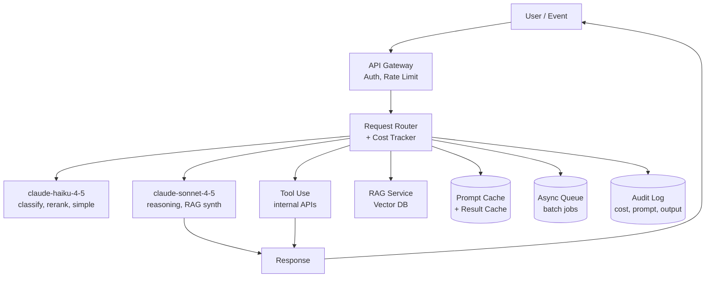
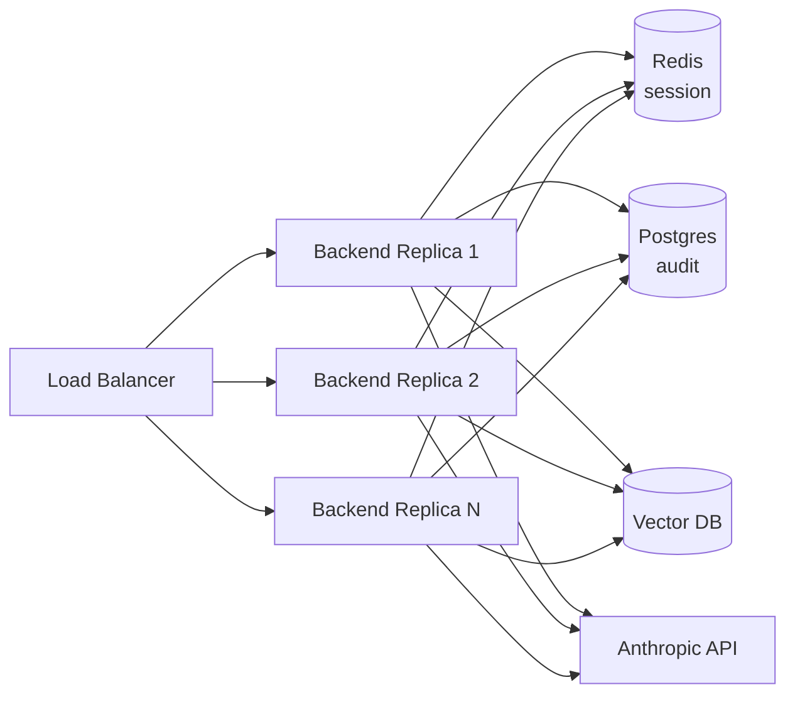

# Module 12 — Advanced AI Applications

**Durasi belajar**: 90 menit (45' materi + 45' praktik lab)
**Bagian dari**: Day 3 — AI App Development + RAG
**Lab terkait**: [lab-11-enterprise-ai-assistant](./lab-11-enterprise-ai-assistant/README.md)

---

## Apa yang Akan Anda Bisa Setelah Modul Ini

Setelah selesai membaca dan mempraktikkan modul ini, Anda akan mampu:

1. Mendesain **Enterprise AI Assistant** yang menggabungkan chat, RAG, dan tool use dalam satu kesatuan.
2. Mengidentifikasi pola **AI internal assistant, knowledge management, dan automation system**.
3. Menerapkan **optimasi performa** (caching, batching, paralelisasi, streaming).
4. Menerapkan **optimasi biaya** (model routing, prompt caching, message batches, output budget).
5. Mendesain strategi **scaling** untuk AI application: stateless backend, queue, autoscaling, dan observability.

---

## 1. Konsep Inti

### 1.1 Tiga Pola Enterprise

| Pola | Definisi | Contoh |
|------|----------|--------|
| **Internal Assistant** | Chat AI untuk karyawan internal | Bot Q&A HR, bot IT helpdesk |
| **Knowledge Management** | Pencarian + summarization atas korpus dokumen | Asisten kontrak legal, pencari paper R&D |
| **Automation System** | Workflow multi-langkah yang dipicu event | Auto-triage tiket, auto-generate laporan, pengayaan lead |

Ketiga pola ini dapat Anda bangun di atas fondasi yang sama: **chat app + RAG + tool use + orchestration**.

### 1.2 Arsitektur Enterprise



Komponen-komponen kunci yang perlu Anda perhatikan:

- **Router** memilih model berdasarkan kompleksitas tugas — bagian penting dalam optimasi biaya.
- **Cache** terdiri dari dua level: prompt caching (bawaan Anthropic, TTL 5 menit) dan result caching (Redis) untuk pertanyaan yang identik.
- **Queue** digunakan untuk job non-realtime (misalnya ingestion dokumen, generasi laporan) — Anda dapat memanfaatkan **Message Batches API** Anthropic yang menawarkan diskon 50%.
- **Audit** menyimpan setiap pemanggilan untuk kebutuhan compliance dan debugging.

### 1.3 Optimasi Performa

| Teknik | Penghematan | Cara |
|--------|-------------|------|
| **Streaming** | Latensi persepsi -70% | `stream=True` |
| **Prompt caching** | Latensi -50%, biaya input -90% | Blok `cache_control` |
| **Parallel tool calls** | Wall-clock time -40% | Beberapa tool_use paralel |
| **Triage dengan model lebih kecil** | Pemanggilan Sonnet -60% | Haiku untuk klasifikasi awal |
| **Kompresi konteks** | Token -40% | Ringkas history & chunk yang ter-retrieve |

### 1.4 Optimasi Biaya

Model biaya Anthropic (per MTok, perkiraan publik 2026):

| Model | Input | Output | Cached input |
|-------|-------|--------|--------------|
| Sonnet 4.5 | $3 | $15 | $0.30 |
| Haiku 4.5 | $1 | $5 | $0.10 |

Strategi yang dapat Anda terapkan:

1. **Model routing** — gunakan Haiku untuk klasifikasi, intent detection, dan QA sederhana; gunakan Sonnet untuk reasoning yang kompleks.
2. **Prompt caching** — manfaatkan untuk system prompt + konteks RAG yang dipakai berulang (TTL 5 menit).
3. **Message Batches API** — untuk kebutuhan non-realtime, dengan diskon 50%, ideal untuk pengayaan ingestion.
4. **Output budget** — tetapkan `max_tokens` yang realistis. Nilai default 4096 sering kali boros.
5. **Result cache** — gunakan Redis dengan key = hash(question + context). TTL 1 jam.
6. **Truncate retrieval** — gunakan top-k yang lebih kecil dan kombinasikan dengan rerank.

Contoh perhitungan: bayangkan Anda memiliki HR Bot dengan 1000 query per hari dan system prompt sepanjang 8K token.

- Tanpa optimasi: 1000 × 8K × $3/MTok = **$24/hari** hanya untuk input sistem.
- Dengan caching: 1000 × 8K × $0.30/MTok = **$2.40/hari**. Penghematan 90%.

### 1.5 Scaling AI Application



Prinsip-prinsip yang perlu Anda pegang:

- **Stateless backend** — seluruh state disimpan di Redis/Postgres.
- **Horizontal autoscale** berdasarkan CPU atau concurrency.
- **Rate limit per pengguna** dilakukan di gateway, bukan di level Anthropic.
- **Circuit breaker** — apabila tingkat error 5xx dari Anthropic melampaui 10%, kembalikan respons fallback yang baik.
- **Observability triad**: logs (per-request), metrics (RPS, latensi p95, cost/jam), traces (OpenTelemetry).

### 1.6 Pola Reliability

- **Retry dengan exponential backoff** untuk error 429/5xx.
- **Timeout** request 60 detik secara default, dan 5 menit untuk job batch.
- **Idempotency key** pada job batch agar tidak terjadi double-charge.
- **Graceful degradation** — jika RAG sedang down, kembalikan respons seperti "saya butuh informasi lebih lanjut".

### 1.7 Audit, Compliance, dan Safety

- Catat informasi: `request_id, user_id, model, prompt, response, tokens, cost, latency, retrieved_ids`.
- Lakukan redaksi PII sebelum disimpan ke log (penting untuk kepatuhan GDPR Uni Eropa maupun UU PDP Indonesia).
- Pasang output filter: deteksi konten sensitif sebelum dikembalikan ke pengguna.
- **Human-in-the-loop** untuk aksi yang bersifat destruktif (misalnya tool yang mengirim email).

---

## 2. Praktik Mandiri

Skenario: Anda akan membangun Enterprise HR Assistant yang menggabungkan chat + RAG + 1 tool.

**Langkah-langkah:**

1. **Router intent** — gunakan Haiku untuk klasifikasi: `faq | leave_balance | other`.
2. **Branch faq** — jalankan RAG (Module 11), berikan respons dengan Sonnet.
3. **Branch leave_balance** — panggil tool `get_leave_balance(employee_id)` (mock).
4. **Cost tracking** — siapkan wrapper yang menjumlahkan token dan biaya, kemudian tampilkan running total.
5. **Audit log** — append baris ke file `audit.jsonl`.

---

## 3. Contoh Konkret

### 3.1 Model Routing

```python
from anthropic import Anthropic
client = Anthropic()

INTENT_PROMPT = (
    "Klasifikasikan pertanyaan ke salah satu: faq, leave_balance, other.\n"
    "Balas hanya satu kata. Pertanyaan: {q}"
)

def classify(q: str) -> str:
    out = client.messages.create(
        model="claude-haiku-4-5", max_tokens=10,
        messages=[{"role":"user","content":INTENT_PROMPT.format(q=q)}],
    ).content[0].text.strip().lower()
    return out if out in {"faq","leave_balance","other"} else "other"
```

### 3.2 Prompt Caching untuk System Prompt Panjang

```python
SYSTEM_BLOCK = [{
    "type": "text",
    "text": open("prompts/enterprise_system.md").read(),
    "cache_control": {"type": "ephemeral"},
}]

msg = client.messages.create(
    model="claude-sonnet-4-5",
    max_tokens=800,
    system=SYSTEM_BLOCK,
    messages=[{"role":"user","content": user_msg}],
)
# Periksa msg.usage.cache_creation_input_tokens & cache_read_input_tokens
```

### 3.3 Message Batches (diskon 50%)

```python
batch = client.messages.batches.create(requests=[
    {"custom_id": f"doc-{i}",
     "params": {"model":"claude-haiku-4-5","max_tokens":500,
                "messages":[{"role":"user","content":f"Ringkas: {doc}"}]}}
    for i, doc in enumerate(docs)
])
# Polling
status = client.messages.batches.retrieve(batch.id)
```

### 3.4 Wrapper Cost Tracker

```python
PRICES = {
    "claude-sonnet-4-5": {"in":3.0, "out":15.0, "cache_in":0.30},
    "claude-haiku-4-5":  {"in":1.0, "out":5.0,  "cache_in":0.10},
}

def cost_of(usage, model: str) -> float:
    p = PRICES[model]
    cached = getattr(usage, "cache_read_input_tokens", 0) or 0
    fresh_in = usage.input_tokens - cached
    return (fresh_in*p["in"] + cached*p["cache_in"] + usage.output_tokens*p["out"]) / 1_000_000
```

### 3.5 Audit Log

```python
import json, time, uuid
def audit(record: dict, path="audit.jsonl"):
    record = {"ts": time.time(), "id": str(uuid.uuid4()), **record}
    with open(path, "a") as f:
        f.write(json.dumps(record, ensure_ascii=False) + "\n")
```

### 3.6 Result Cache (sketsa Redis)

```python
import hashlib, redis, json
r = redis.Redis()

def cache_key(question: str, context_hash: str) -> str:
    h = hashlib.sha256(f"{question}|{context_hash}".encode()).hexdigest()
    return f"rag:answer:{h}"

def cached_answer(question, context_hash, compute):
    k = cache_key(question, context_hash)
    if (hit := r.get(k)):
        return json.loads(hit)
    ans = compute()
    r.setex(k, 3600, json.dumps(ans))
    return ans
```

---

## 4. Hands-on Lab

[Lab 11 — Enterprise AI Assistant](./lab-11-enterprise-ai-assistant/README.md). Di lab ini, Anda akan menggabungkan chat (Lab 08) + RAG (Lab 09) + tool use untuk use case HR Q&A. Anda juga akan menambahkan caching, rate limit, cost tracking, dan audit log.

---

## 5. Latihan & Refleksi

Sebelum mengakhiri Day 3, sempatkan diri Anda untuk merenungkan pertanyaan-pertanyaan berikut:

1. Bagaimana Anda memilih antara Haiku dan Sonnet untuk sebuah tugas tertentu?
2. Kapan sebaiknya Anda menggunakan Message Batches API dibandingkan Messages API biasa?
3. Apa saja metrik utama yang harus Anda monitor untuk AI app di lingkungan produksi?
4. Bagaimana Anda mendesain graceful degradation ketika Anthropic API sedang down?
5. Apa risiko menyimpan prompt lengkap di audit log, dan bagaimana cara memitigasinya?

---

## 6. Bacaan Lanjutan

- Anthropic Docs — Prompt Caching: <https://docs.anthropic.com/en/docs/build-with-claude/prompt-caching>
- Anthropic Docs — Message Batches: <https://docs.anthropic.com/en/docs/build-with-claude/batch-processing>
- Anthropic — Building Effective Agents: <https://www.anthropic.com/research/building-effective-agents>
- OpenTelemetry GenAI semantics: <https://opentelemetry.io/docs/specs/semconv/gen-ai/>
- Anthropic Cookbook — Patterns: <https://github.com/anthropics/anthropic-cookbook>
