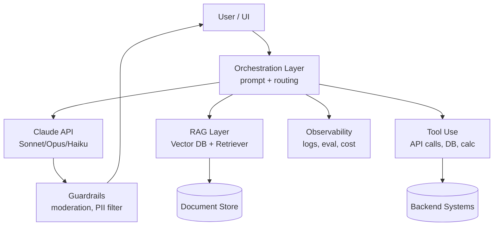

# Module 13 — AI Product Design

**Durasi**: 120 menit
**Format**: Lecture interaktif (50 menit) + Lab 12 (60 menit) + Wrap-up (10 menit)
**Prasyarat**: Module 1–12 (foundation LLM, Claude API, agent, RAG)

---

## Learning Outcomes

Setelah modul ini, peserta mampu:

1. **Menyaring ide AI** menggunakan kerangka *value vs feasibility* sehingga hanya use case bernilai tinggi yang dilanjutkan ke prototyping.
2. **Mengisi AI Use Case Canvas** untuk satu permasalahan nyata di organisasinya, lengkap dengan success metric dan risk.
3. **Mendesain arsitektur solusi AI** yang menjelaskan komponen: model, prompt layer, memory/RAG, tool, UI, observability.
4. **Menyusun AI product roadmap 3 tahap** (Pilot → Scale → Optimize) yang realistis terhadap kapasitas tim.
5. **Mengevaluasi UX khusus AI** (latency, hallucination disclosure, fallback) yang berbeda dari aplikasi deterministik.

---

## Konsep Inti

### 1. AI Use Case Selection: Bukan Semua Masalah Cocok untuk AI

Salah satu kesalahan umum organisasi adalah memaksakan AI ke setiap proses. Filter awal yang efektif:

| Kriteria | Pertanyaan Kunci | Indikator "Lanjutkan" |
|---|---|---|
| **Value** | Apakah penghematan/peningkatan ≥ 10× biaya pengembangan + ops? | ROI clear, ada baseline manual |
| **Frequency** | Apakah task dijalankan ratusan kali/hari? | Volume tinggi, repetitif |
| **Tolerance** | Apakah output 90–95% akurat cukup? | Bukan zero-error domain (mis. bukan dosis obat) |
| **Data** | Apakah ada data berkualitas untuk grounding/eval? | Min. 50–200 sampel evaluasi tersedia |
| **Human-in-loop** | Bisakah manusia review keputusan kritis? | Workflow review feasible |

**Anti-pattern**: "Kita mau pakai GPT/Claude untuk apa ya?" — solusi mencari masalah. **Benar**: "Tim CS kita kewalahan menjawab 800 tiket/hari yang 60% pertanyaan berulang" → kandidat use case.

### 2. Business Value Identification

Tiga lensa untuk artikulasi value:

- **Cost reduction**: hours saved × hourly rate × frequency
- **Revenue uplift**: conversion lift, upsell otomatis, retention via personalization
- **Risk reduction**: deteksi fraud lebih cepat, compliance scanning otomatis

Selalu ekspresikan dalam **satuan finansial atau metrik bisnis** (NPS, time-to-resolution, throughput) — bukan "AI-powered" sebagai value sendiri.

### 3. AI Solution Architecture

**Komponen wajib pada arsitektur AI production-grade**:

1. **Orchestration**: yang memutuskan prompt, model, dan tool mana yang dipanggil.
2. **Model layer**: pilih variant (Haiku untuk klasifikasi cepat, Sonnet untuk reasoning umum, Opus untuk reasoning kompleks).
3. **Retrieval / Memory**: agar jawaban grounded pada data internal.
4. **Tools**: untuk aksi nyata (cek stok, kirim email, query DB).
5. **Guardrails**: input filter (prompt injection), output filter (PII, toxic content).
6. **Observability**: log prompt, response, latency, cost, dan user feedback.

### 4. AI Product Roadmap: Tahap Crawl–Walk–Run

| Tahap | Fokus | Durasi tipikal | Risiko utama |
|---|---|---|---|
| **Pilot** | 1 use case sempit, internal user, manual eval | 4–8 minggu | Over-scoping |
| **Scale** | Multi-tenant, monitoring, integrasi sistem | 2–4 bulan | Cost blow-up |
| **Optimize** | Fine-tune prompt, model selection cerdas, automation eval | Continuous | Stagnasi (tidak ada owner) |

Roadmap yang baik selalu menyertakan **kriteria graduasi antar tahap** (mis. "Pilot lolos ke Scale jika CSAT ≥ 4.2/5 dan biaya ≤ Rp X per request").

### 5. UX untuk AI System

UX AI berbeda dari aplikasi deterministik:

- **Latency tolerance**: tampilkan streaming/progress, jangan biarkan user "menunggu kotak putih".
- **Hallucination disclosure**: tampilkan source/citation (terutama untuk RAG).
- **Confidence cue**: tunjukkan ketika model tidak yakin ("Saya tidak menemukan dokumen yang relevan, mohon konfirmasi").
- **Graceful fallback**: tombol "eskalasi ke manusia" harus selalu ada.
- **Reversibility**: aksi destruktif (kirim email, hapus data) wajib konfirmasi.
- **Feedback loop**: thumbs up/down terintegrasi ke pipeline eval.

---

## Demo Live: Use Case Canvas Walkthrough

**Skenario**: "Tim HR menghabiskan 4 jam/hari menjawab pertanyaan karyawan tentang kebijakan cuti, BPJS, dan klaim reimbursement."

### Langkah 1 — Tulis Problem Statement (5 menit)

Fasilitator menulis di flipchart:
> "Karyawan kesulitan menemukan jawaban kebijakan internal, sehingga HR ops kewalahan dan response time rata-rata 18 jam."

### Langkah 2 — Identifikasi User & Business Value (5 menit)

- Primary user: 1.200 karyawan
- Secondary user: 4 staf HR ops
- Value: hemat ~20 jam/minggu × Rp 80rb = Rp 1.6jt/minggu = ~Rp 80jt/tahun + NPS karyawan naik.

### Langkah 3 — Petakan AI Capability (5 menit)

- **Capability**: Q&A grounded → RAG + Claude Sonnet.
- **Data source**: SK direksi, buku saku karyawan, FAQ existing (PDF, ~300 halaman).
- **Bukan AI**: jangan generate jawaban tanpa source.

### Langkah 4 — Definisikan Success Metric (5 menit)

- Deflection rate ≥ 50% pertanyaan tier-1
- Citation accuracy ≥ 95%
- CSAT ≥ 4/5
- Cost per query ≤ Rp 200

### Langkah 5 — Risk Identification (5 menit)

- Risiko: bocor data gaji jika RAG tidak ber-permission.
- Mitigasi: filter dokumen confidential, audit log per query.

Fasilitator menutup demo dengan menampilkan canvas final di slide, lalu transisi ke Lab 12 di mana peserta mengisi canvas untuk konteks organisasinya sendiri.

---

## Contoh Konkret: AI Product Roadmap

### Contoh 1 — Bank Retail: AI Loan Assistant

| Tahap | Cakupan | Metrik graduasi |
|---|---|---|
| Pilot (8 minggu) | 1 cabang Jakarta, KTA only, 3 RM internal user, Claude Sonnet + RAG dari product sheet | Approval cycle turun 30%, RM CSAT ≥ 4 |
| Scale (4 bulan) | 25 cabang, tambah KPR + Kartu Kredit, integrasi SLIK API tools | Volume 5.000 sesi/bulan, cost ≤ Rp 500/sesi |
| Optimize (6+ bulan) | Auto-routing Haiku untuk FAQ + Sonnet untuk simulasi, eval otomatis 200 prompt/minggu | Cost turun 40%, hallucination rate < 1% |

### Contoh 2 — E-commerce: AI Customer Service Agent

| Tahap | Cakupan | Metrik graduasi |
|---|---|---|
| Pilot (6 minggu) | Tracking + return policy, channel web chat saja, fallback ke human 100% | Deflection 30%, NPS netral |
| Scale (3 bulan) | + Refund tool use, WhatsApp + Instagram DM, multi-bahasa ID/EN | Deflection 55%, AHT turun 40% |
| Optimize (ongoing) | + Recommendation upsell, A/B prompt tuning, eval otomatis transcript | Upsell revenue +8%, cost per chat ≤ Rp 300 |

---

## Hands-on Lab

**Lab 12 — AI Use Case Canvas**
Folder: `./lab-12-use-case-canvas/`

Peserta mengisi canvas 7-kolom untuk use case dari organisasinya, lalu melakukan **pitching 5 menit** kepada peer reviewer (round-robin antar 2 peserta). Output canvas dibawa ke sesi Capstone sebagai kandidat project.

---

## Wrap-up & Q&A

Pertanyaan diskusi:

1. Mengapa "AI-powered" bukan value proposition yang valid di mata CFO?
2. Apa perbedaan kunci antara fase Pilot dan Scale yang sering disepelekan?
3. Mengapa Haiku, Sonnet, dan Opus tidak saling menggantikan — kapan masing-masing dipakai?
4. Bagaimana cara mendeteksi bahwa sebuah use case **tidak cocok** untuk LLM dan lebih baik pakai rule-based?
5. UX cue apa yang akan Anda tambahkan pada chatbot RAG agar user tidak salah anggap output sebagai fakta absolut?

---

## Bacaan Lanjutan

- Anthropic — *Building Effective Agents* (engineering.anthropic.com)
- Andrew Ng — *AI Transformation Playbook*
- Google — *People + AI Guidebook* (pair.withgoogle.com)
- HBR — *How to Choose Your First AI Project* (2019, masih sangat relevan)
- Anthropic *Claude model card* untuk panduan pemilihan variant
- OWASP LLM Top 10 (untuk konteks risiko, akan dibahas Module 14)
- EU AI Act overview — bagian Annex III (high-risk system) untuk peta regulasi
