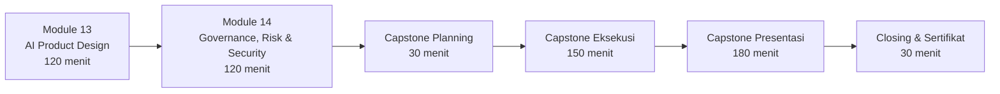

# DAY 4 — AI Product Design, Governance & CAPSTONE

**Program**: Prompt Engineering, AI Agent & AI App Development with Claude
**Penyelenggara**: Multimatics
**Durasi Hari**: 8 jam efektif (480 menit) — bagian dari total 40 jam (4 hari)
**Target Audiens**: Software Developer, AI/ML Engineer, Data Analyst, Product Manager, Innovation Team, IT Architect

---

## Ringkasan Day 4

Hari keempat menutup rangkaian pelatihan dengan menggeser fokus dari "bagaimana membangun" menjadi "apa yang dibangun, untuk siapa, dan dengan risiko apa". Dua modul pertama (Module 13 & 14) memberi Anda lensa **product** dan **governance** untuk menavigasi keputusan strategis seputar adopsi AI di organisasi Anda. Sesi Capstone menjadi puncak: Anda akan merangkai seluruh pembelajaran 3 hari sebelumnya (prompt engineering, Claude API, tool use, RAG, agentic workflow) menjadi sebuah **prototype yang siap dipresentasikan ke stakeholder internal pasca-pelatihan**.

Day 4 bukan sekadar "wrap-up". Capstone dirancang sebagai **portfolio piece**: Anda akan meninggalkan ruangan dengan satu use case canvas yang tervalidasi, satu working demo, dan satu deck pitching yang siap digunakan untuk memperjuangkan inisiatif AI di unit kerja Anda.

---

## Apa yang Akan Anda Bisa Setelah Day 4

Setelah selesai mengikuti Day 4, Anda akan mampu:

1. **Memilih use case AI yang tepat** berdasarkan business value, feasibility, dan kesiapan data — bukan sekadar mengikuti tren.
2. **Merancang arsitektur solusi AI end-to-end** yang mempertimbangkan UX, integrasi sistem, dan biaya operasional model.
3. **Mengidentifikasi risiko governance, bias, security, dan privacy** pada sistem berbasis LLM, serta menerapkan mitigasi konkret.
4. **Mengenali dan menanggulangi prompt injection** (direct, indirect, jailbreak, data exfiltration) dengan pola defense yang teruji.
5. **Mengintegrasikan prompt engineering, Claude API, dan RAG/Agent** menjadi satu prototype fungsional dalam satu sesi capstone.
6. **Mempresentasikan solusi AI** dengan struktur yang persuasif kepada decision-maker non-teknis.

---

## Alur Module + Capstone



| Sesi | Materi | Durasi | Output |
|---|---|---|---|
| 1 | Module 13 — AI Product Design | 120 menit | Use Case Canvas setiap peserta (Lab 12) |
| Break | Coffee break | 15 menit | — |
| 2 | Module 14 — Governance, Risk & Security | 120 menit | Responsible-AI checklist terisi |
| Break | Ishoma | 60 menit | — |
| 3 | Capstone Planning + pembagian tim | 30 menit | Tim 3–4 orang, opsi project dipilih |
| 4 | Capstone Eksekusi | 150 menit | Prototype + deck draft |
| Break | Coffee break | 15 menit | — |
| 5 | Capstone Presentasi (6 tim × ~30 menit) | 180 menit | Demo + Q&A juri |
| 6 | Closing, feedback, sertifikat | 30 menit | — |

> **Total slot**: 480 menit + break. Fasilitator dapat menggeser breakdown 5–10 menit per sesi sesuai dinamika kelas.

---

## Jadwal Indikatif (Dapat Disesuaikan)

| Waktu | Aktivitas |
|---|---|
| 08.30–08.45 | Registrasi & ice-breaker |
| 08.45–10.45 | Module 13: AI Product Design |
| 10.45–11.00 | Coffee break |
| 11.00–13.00 | Module 14: Governance, Risk & Security |
| 13.00–14.00 | Ishoma |
| 14.00–14.30 | Capstone briefing & pembentukan tim |
| 14.30–17.00 | Capstone eksekusi (dengan coffee break 15 menit fleksibel) |
| 17.00–17.30 | Persiapan demo akhir |
| 17.30–20.30 | Capstone presentasi (per tim ~25–30 menit termasuk Q&A) |
| 20.30–21.00 | Closing & penyerahan sertifikat |

> Untuk batch siang/sore, fasilitator dapat memadatkan presentasi menjadi 20 menit per tim dengan disiplin time-keeping.

---

## Struktur Folder

```
Day-4-Product-Governance-Capstone/
├── README.md                                  (file ini)
├── Module-13-AI-Product-Design/
│   ├── materi.md
│   ├── speaker-notes.md
│   └── lab-12-use-case-canvas/
│       └── README.md
├── Module-14-AI-Governance-Risk-Security/
│   ├── materi.md
│   ├── speaker-notes.md
│   ├── studi-kasus-prompt-injection.md
│   └── checklist-responsible-AI.md
└── Capstone/
    ├── panduan-capstone.md
    ├── opsi-project.md
    ├── template-presentasi.md
    └── rubrik-penilaian.md
```

---

## Prasyarat Day 4

Anda diasumsikan telah menyelesaikan:
- **Day 1**: Foundation LLM + prompt engineering dasar
- **Day 2**: Claude API, tool use, structured output
- **Day 3**: AI Agent pattern, implementasi RAG, dan evaluasi

Pastikan Anda sudah memiliki:
- API key Claude yang aktif (anthropic.com)
- Laptop dengan Python 3.10+, virtualenv, dan editor
- Repo template starter dari Day 3 (jika ada)
- Akses GitHub (opsional untuk push repo capstone)

---

## Persiapan Fasilitator

- [ ] Konfirmasi 1–2 juri tamu untuk sesi presentasi capstone (idealnya: Head of Data/AI dari klien, atau alumni Multimatics)
- [ ] Siapkan environment cadangan (Claude Console / API key backup, dataset dummy CSV, dokumen SOP fiktif untuk RAG)
- [ ] Cetak Use Case Canvas A3 (1 lembar per peserta)
- [ ] Siapkan flipchart / sticky notes untuk Module 13
- [ ] Setup proyektor + HDMI + adapter USB-C
- [ ] Form rubrik penilaian (digital via Google Form atau cetak)
- [ ] Sertifikat siap pre-print (nama peserta dari registrasi)

---

## Catatan Pedagogis

Day 4 sengaja disusun **deduktif kemudian induktif**: Anda menerima kerangka berpikir terlebih dahulu (Module 13–14), lalu segera memproduksi artefak nyata (Capstone). Hindari menyerap teori baru di sesi capstone — fungsinya adalah konsolidasi, bukan akuisisi.
